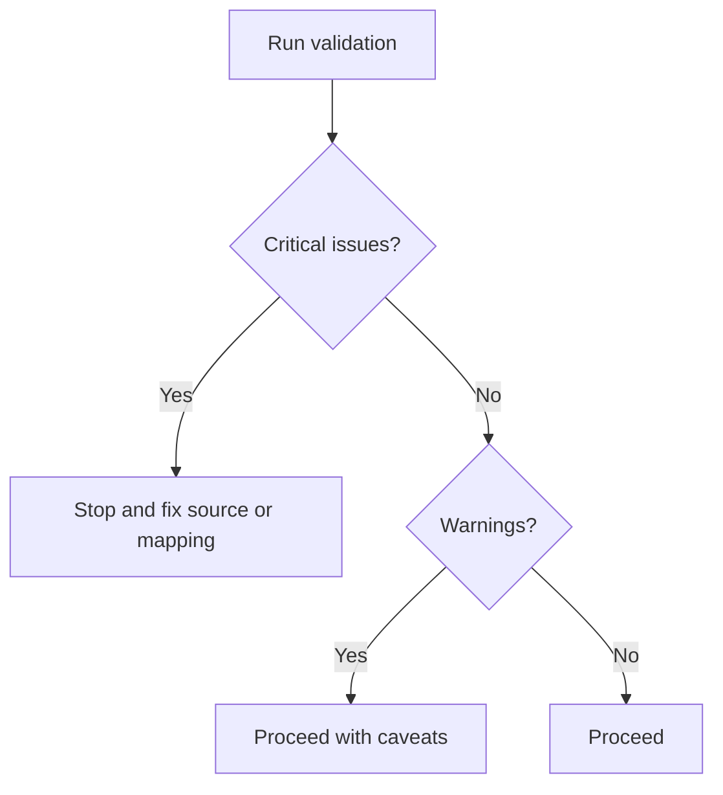

# Workflow Guide

## Workflow 1: Consumer compares two funds

Goal: Provide an information-only comparison of two fund IDs.

Steps:
1. Retrieve official data from Data.gov.il or a Pensia Net export.
2. Normalize records.
3. Validate required fields.
4. Filter to requested fund IDs.
5. Select latest record for each fund.
6. Confirm matching report dates.
7. Confirm comparable track population and fund type.
8. Build a table of returns and fees.
9. Add source, assumptions, caveats, and information-only notice.

Commands:

```bash
python scripts/pension-fund-tracker-cli.py normalize pensia-net.csv --output normalized.json
python scripts/pension-fund-tracker-cli.py validate normalized.json
python scripts/pension-fund-tracker-cli.py compare normalized.json 12345 67890
```

## Workflow 2: Freelancer fee impact

Goal: Estimate fee impact under explicit assumptions.

Inputs:
- Monthly contribution, e.g. ₪2,000.
- Starting balance, e.g. ₪0.
- Annual gross return assumption or sensitivity table.
- Deposit fee and asset fee.
- Horizon in years.

Command:

```bash
python scripts/pension-fund-tracker-cli.py fee-impact \
  --monthly-contribution 2000 \
  --starting-balance 0 \
  --years 20 \
  --annual-return 5 \
  --deposit-fee 1.5 \
  --asset-fee 0.2
```

Report:
- Gross no-fee balance.
- Net balance with fees.
- Estimated fee drag.
- Total contributions.
- Limitations.

## Workflow 3: Small-business payroll overview

Goal: Summarize public metrics for funds used by employees without personal recommendations.

Steps:
1. Gather fund IDs used by the business.
2. Fetch or import official data.
3. Group by provider and track.
4. Show latest report date, returns, deposit fee, and asset fee.
5. If employee counts are used, show aggregate counts only.
6. Avoid personal conclusions.

## Workflow 4: Data-quality audit

Goal: Decide whether a file supports a reliable report.



Critical:
- Missing fund ID.
- Missing fund name.
- Missing report date.
- No official source.
- Different reporting periods in a direct ranking.

Warnings:
- Missing 36M/60M returns.
- Missing one fee field.
- Negative but plausible returns.
- Short history.

## Workflow 5: API refresh job

Steps:
1. Run `package_search` for the current official dataset.
2. Select machine-readable resource.
3. Fetch pages using `datastore_search`.
4. Normalize records.
5. Validate records.
6. Export dated normalized JSON.
7. Compare fields with previous run.
8. Log source metadata.

Command:

```bash
python scripts/pension-fund-tracker-cli.py fetch-ckan DISCOVERED_RESOURCE_ID --output normalized-2026-06-02.json
python scripts/pension-fund-tracker-cli.py validate normalized-2026-06-02.json
```

## Workflow 6: Hebrew consumer report

Formatting:
- Dates: `DD-MM-YYYY`.
- Currency: `₪2,000`.
- Percentages: `0.20%`.
- Terms: "דמי ניהול מהפקדה", "דמי ניהול מצבירה", "תשואה מדווחת", "קרן פנסיה", "מסלול השקעה", "גוף מנהל".
- Tone: formal, practical, neutral.

Sections:
1. מקור ותקופת דיווח
2. איכות הנתונים
3. טבלת השוואה
4. השפעת דמי ניהול לפי הנחות
5. מגבלות
6. מידע בלבד

## Workflow 7: Spreadsheet migration

Steps:
1. Export spreadsheet to CSV.
2. Map columns to canonical fields.
3. Normalize CSV.
4. Compare row counts and key metrics with old spreadsheet.
5. Document differences.
6. Add regression tests for representative rows.
7. Move production reports to CLI output.
