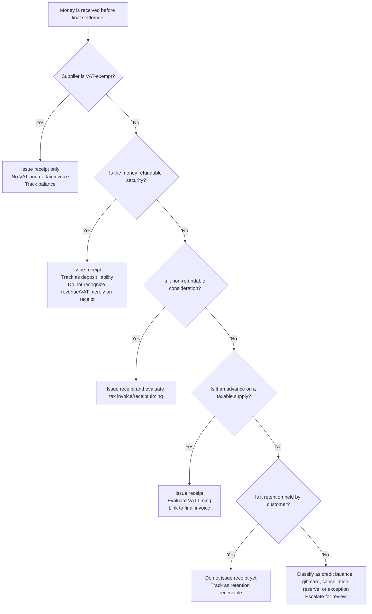
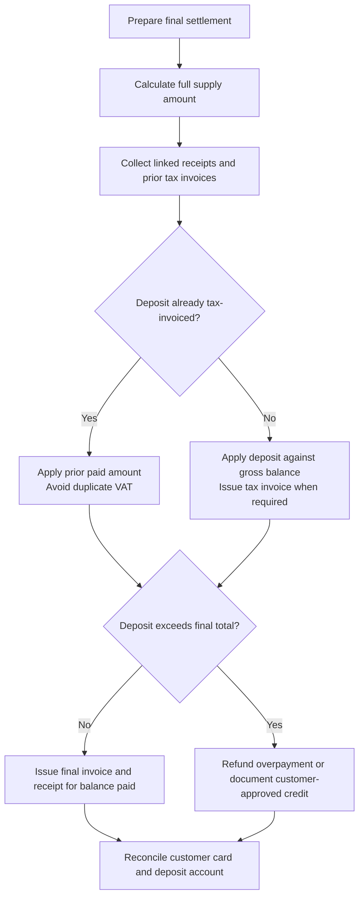

# Prepayment & Deposit Handler

## Purpose

Handle deposits, prepayments, advances, refundable security deposits, non-refundable booking fees, retentions, credit balances, refunds, and final invoice settlement for Israeli small businesses, freelancers, and consumers.

Use the guidance to decide what the payment represents, which bookkeeping document to issue, how to track the balance, how to avoid double VAT, and how to settle the final invoice.

This is operational guidance. Verify current Israeli law, VAT rate, invoice-allocation thresholds, bookkeeping rules, consumer-protection rules, and sector-specific requirements before production use.

## Primary outcomes

- Classify the money before issuing documents.
- Issue a receipt for money actually received.
- Determine whether a tax invoice, tax invoice/receipt, credit invoice, refund record, or final invoice is needed.
- Track unapplied amounts as customer advances, refundable deposits, retentions, or credit balances.
- Apply deposits once, and only once, to final settlement.
- Preserve an audit trail with quote, order, receipt, payment reference, invoice, refund proof, and customer approval.

## Israeli terminology

| English | Hebrew | Practical use |
|---|---|---|
| Deposit / advance | מקדמה | Money paid before final settlement. It may be part of the price or only a temporary balance. |
| Security deposit | פיקדון / ערבון | Refundable money held against damage, cancellation, or failure to perform. |
| Receipt | קבלה | Document proving money was received. |
| Tax invoice | חשבונית מס | VAT document issued by VAT-registered suppliers when required or allowed. |
| Tax invoice/receipt | חשבונית מס/קבלה | Combined document for a taxable transaction and payment received together. |
| Credit invoice | חשבונית זיכוי | Correction or reduction of a prior tax invoice. |
| VAT-exempt dealer | עוסק פטור | Issues receipts, does not charge VAT, does not issue tax invoices. |
| VAT-registered dealer | עוסק מורשה | Issues receipts and tax invoices under applicable timing rules. |
| Israel Invoice allocation | מספר הקצאה / חשבונית ישראל | Official allocation workflow for qualifying tax invoices; verify current threshold and process. |
| Retention | עיכבון | Amount withheld by the customer until acceptance, warranty, or defect correction. |

## Decision tree: receipt event

## Decision tree: final settlement

## Classification rules

### 1. Advance for a taxable supply

Use when the customer pays part of the agreed price before delivery, milestone completion, or final invoice.

Actions:

1. Issue a receipt on the actual receipt date.
2. Determine whether a tax invoice is required at receipt, delivery, milestone, or final settlement.
3. Record the amount as customer advance or deposit liability until earned or applied.
4. Link the receipt to the final invoice.
5. On final settlement, show total price, VAT, deposit applied, and balance due.

Example:

- Quote: ₪12,000 + 18% VAT.
- Deposit: ₪3,000 received on 15/03/2026.
- Final invoice:
  - Net: ₪12,000.00
  - VAT: ₪2,160.00
  - Gross: ₪14,160.00
  - Deposit applied: ₪3,000.00
  - Balance due: ₪11,160.00

### 2. Refundable security deposit

Use when the customer expects the money back unless damage, cancellation, or another defined event occurs.

Actions:

1. Issue a receipt.
2. Track as refundable deposit liability.
3. Avoid revenue and VAT recognition merely because money was received.
4. At release, refund the money and store proof.
5. If retained, classify the retained amount and issue tax/correction/refund documents as needed.

Example:

- Equipment rental deposit: ₪1,500.
- Equipment returned undamaged.
- Refund ₪1,500 and store bank reference.
- Keep the original receipt and refund proof together.

### 3. Non-refundable booking fee

Use when the customer pays for reserved capacity, date, appointment, or availability.

Actions:

1. Ensure cancellation terms are written before payment.
2. Issue a receipt.
3. For VAT-registered suppliers, evaluate tax invoice/receipt timing.
4. Apply the fee to final invoice if it is part of the total package.
5. If cancelled, verify consumer rules and issue correction/refund documents only when required.

Example:

- Photographer booking fee: ₪750.
- Final package: ₪5,000 + VAT = ₪5,900.
- Deposit applied: ₪750.
- Balance due: ₪5,150.

### 4. Retention withheld by customer

Use when the customer keeps part of the amount until acceptance, defect period, or warranty release.

Actions:

1. Do not issue receipt until the money is actually received.
2. Track as retention receivable or open customer balance.
3. Follow invoice timing for the supply itself.
4. Issue receipt when retention is released.
5. If reduced due to defects, issue correction or credit documentation where required.

### 5. VAT-exempt supplier

Use when the supplier is עוסק פטור at the relevant date.

Actions:

1. Issue receipt only.
2. Do not charge VAT.
3. Do not issue a tax invoice.
4. Separate documents before and after any status change to VAT-registered.
5. Explain to business customers that input VAT cannot be deducted because no VAT was charged.

## Document matrix

| Situation | Receipt | Tax invoice | Tax invoice/receipt | Credit invoice | Refund proof |
|---|---:|---:|---:|---:|---:|
| VAT-exempt advance | Required | No | No | No | If refunded |
| VAT-registered refundable security deposit | Required | Usually no at receipt | Usually no | Only if correcting prior tax invoice | If refunded |
| VAT-registered advance | Required | Depends on VAT timing | Possible | If reduced/cancelled | If overpaid |
| Non-refundable booking fee | Required | Often required/possible | Common | If taxable amount changes | If refunded |
| Retention held by customer | No until cash received | Depends on supply timing | No at withholding stage | If price reduced | Not applicable unless refunded |
| Gift card / stored credit | Required at payment | Usually at redemption/supply | Possible | If corrected | If refunded |

## Edge cases

### Partial delivery

Split the obligation into supplied and unsupplied parts. Apply the deposit only to the amount settled. Keep the remaining unapplied balance tracked.

### Mixed VAT treatment

Calculate VAT per line. Separate taxable, zero-rated, exempt, and out-of-scope items. Avoid using one blended VAT rate without documented support.

### Customer demands tax invoice before payment

Do not issue a tax invoice merely because the customer wants input VAT. Apply the legal timing rule and the supplier’s VAT status.

### Deposit already tax-invoiced

When a tax invoice was already issued for the advance, prevent duplicate VAT in the final invoice. Show prior payment and prior document reference.

### Overpayment

If the deposit is higher than the final invoice, apply only up to the final total. Refund the surplus or store a customer-approved credit balance.

### Foreign currency

Store currency, exchange rate source, NIS value, payment reference, and exchange differences policy. Avoid mixing currencies without documented conversion.

### Cash deposits

Check current cash restrictions, document payer identity, and prefer traceable payment methods for large amounts.

### Change from VAT-exempt to VAT-registered

Separate activity by date. Review deposits received before the change and supplies performed after the change with a qualified professional.

### Israel Invoice allocation

For qualifying tax invoices, use the official allocation process through approved software, portal, or integration. Store request ID, allocation number, response date, and error evidence. Do not invent allocation numbers.

## Troubleshooting table

| Symptom | Likely cause | Corrective action |
|---|---|---|
| Customer card shows unexplained credit | Deposit exceeds final invoice, duplicate receipt, or duplicate application | Trace deposit ID, reverse duplicate, refund or document credit |
| VAT output too high | Deposit and final invoice both taxed on same consideration | Reconcile prior tax invoices and issue correction if needed |
| Receipt not linked to invoice | Missing contract/order reference | Add cross-reference and update settlement note |
| VAT-exempt supplier issued tax invoice wording | Wrong document template | Stop template, issue corrected receipt/correction through accounting system |
| Refund lacks evidence | Cash refund or missing bank reference | Obtain signed confirmation or traceable payment proof |
| Retention shown as deposit received | Wrong classification | Reclassify as retention receivable |
| Old deposits remain open | No monthly review owner | Create aged deposit report and assign action |

## Anti-patterns

- Treating every deposit as revenue immediately.
- Issuing a tax invoice for a refundable security deposit without a taxable event.
- Applying the same deposit to more than one invoice.
- Forgetting to apply the deposit on the final invoice.
- Using credit invoice when no tax invoice exists.
- Mixing refundable deposits and ordinary revenue in one account.
- Deleting documents instead of correcting them through the bookkeeping system.
- Ignoring cash transaction limits.
- Keeping overpayments indefinitely without customer approval.
- Calling a deposit “non-refundable” while offering verbal refunds.

## Verified 2026 parameters

Use these values only after confirming that the transaction date is within the same rule period:

- Standard VAT rate: 18%, effective from 01/01/2025 and still treated as current in 2026 sources reviewed for this release.
- Israel Invoice allocation threshold:
  - 2025: tax invoices above ₪20,000 before VAT.
  - 01/01/2026 through 31/05/2026: tax invoices above ₪10,000 before VAT.
  - From 01/06/2026: tax invoices above ₪5,000 before VAT.
- VAT-exempt dealer annual turnover ceiling for 2026: ₪122,833.
- Consumer cancellation fee, where the statutory cancellation framework applies: 5% of the transaction value or ₪100, whichever is lower.
- Cash law operational caution: business transactions above ₪6,000 require special cash-limit review; use the official simulator before accepting cash.

Do not hard-code these values in production without a current-year configuration table.

## Production checklist

### Before payment

- Written quote/order exists.
- Price, VAT treatment, cancellation terms, refund terms, and delivery terms are clear.
- Customer identity and tax ID are stored where needed.
- Deposit nature is selected.
- Document type is selected.
- Payment method is allowed and traceable.
- Ledger account is selected.

### At receipt

- Receipt number is issued.
- Receipt date equals actual payment receipt date.
- Payment reference is stored.
- Tax invoice timing is evaluated.
- Deposit ID is created.
- Refundable flag is set accurately.

### At final settlement

- Final invoice includes all supplied goods/services.
- Prior receipts and tax invoices are linked.
- Deposit application amount is calculated.
- Balance due or refund due is shown.
- Credit invoice is issued only to correct a prior tax invoice.
- Customer card reconciles.

### Month end

- Open deposits agree to general ledger.
- Deposits older than 90 days are reviewed.
- Refundable deposits are not in revenue.
- Overpayments have owner and action date.
- VAT report ties to tax invoices and credit invoices.
- Exceptions are reviewed before filing.

## Recommended response format

When using the skill, answer in this order:

1. Classification.
2. Documents to issue now.
3. Documents to issue at settlement.
4. VAT and revenue caution.
5. Ledger tracking.
6. Customer-facing note.
7. Records to retain.
8. Open questions requiring professional review.
