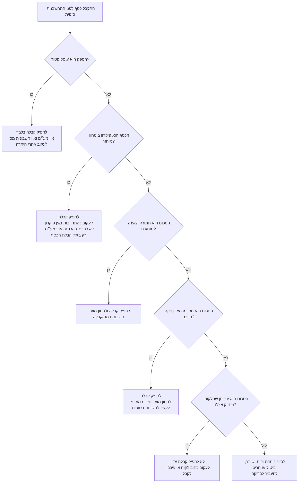
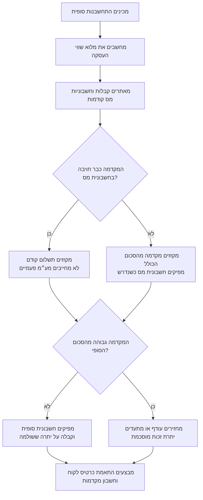

# טיפול במקדמות ופיקדונות

## מטרה

לטפל במקדמות, פיקדונות, ערובות, דמי שריון, עיכבונות, יתרות זכות, החזרים והתחשבנות סופית עבור עסקים קטנים, עצמאים, נותני שירותים עצמאיים ולקוחות בישראל.

השתמש בהנחיות כדי לסווג את הכסף, לבחור מסמך נכון, לעקוב אחרי יתרה פתוחה, למנוע חיוב מע״מ כפול, ולסגור את העסקה מול הלקוח בצורה מסודרת.

המסמך הוא כלי עבודה תפעולי. לפני שימוש בייצור יש לבדוק דין עדכני בישראל, שיעור מע״מ, ספי מספר הקצאה, הוראות ניהול ספרים, הוראות הגנת הצרכן וכללים ענפיים.

## תוצאות רצויות

- לסווג את הכסף לפני הפקת מסמך.
- להפיק קבלה על כסף שהתקבל בפועל.
- להחליט אם נדרשת חשבונית מס, חשבונית מס/קבלה, חשבונית זיכוי, אסמכתת החזר או חשבונית סופית.
- לעקוב אחרי סכומים שטרם נסגרו כמקדמות מלקוחות, פיקדונות מוחזרים, עיכבונות או יתרות זכות.
- לקזז מקדמה פעם אחת בלבד.
- לשמור מסלול ביקורת: הצעת מחיר, הזמנה, קבלה, אסמכתת תשלום, חשבונית, אסמכתת החזר ואישור לקוח.

## מונחים ישראליים

| מונח | שימוש מעשי |
|---|---|
| מקדמה | כסף ששולם לפני התחשבנות סופית. ייתכן שזה חלק מהמחיר או יתרה זמנית בלבד. |
| פיקדון / ערבון | סכום מוחזר שמוחזק כנגד נזק, ביטול או איעמידה בתנאים. |
| קבלה | מסמך המעיד שהתקבל כסף. |
| חשבונית מס | מסמך מע״מ שמפיק עוסק מורשה או חברה כאשר קיימת חובה או אפשרות לפי הכללים. |
| חשבונית מס/קבלה | מסמך משולב לעסקה חייבת ולתשלום שהתקבל יחד. |
| חשבונית זיכוי | תיקון או הפחתה של חשבונית מס קודמת. |
| עוסק פטור | מפיק קבלות, אינו גובה מע״מ ואינו מפיק חשבונית מס. |
| עוסק מורשה | מפיק קבלות וחשבוניות מס בהתאם לכללי המועד והחיוב. |
| מספר הקצאה / חשבונית ישראל | מנגנון רשמי להקצאת מספר לחשבוניות מס מסוימות; יש לבדוק סף ותהליך עדכניים. |
| עיכבון | סכום שהלקוח מחזיק אצלו עד אישור עבודה, תקופת בדק או תיקון ליקויים. |

## עץ החלטה: קבלת כסף

## עץ החלטה: התחשבנות סופית

## כללי סיווג

### 1. מקדמה על עסקה חייבת

השתמש כאשר הלקוח משלם חלק מהמחיר לפני מסירה, אבן דרך או חשבונית סופית.

פעולות:

1. להפיק קבלה ביום קבלת הכסף בפועל.
2. לבדוק אם חשבונית מס נדרשת ביום הקבלה, במסירה, באבן דרך או בסגירה.
3. לרשום את הסכום כמקדמות מלקוחות או כהתחייבות עד לקיזוז.
4. לקשר את הקבלה לחשבונית הסופית.
5. בסגירה להציג מחיר מלא, מע״מ, מקדמה שקוזזה ויתרה לתשלום.

דוגמה:

- הצעת מחיר: ₪12,000 + 18% מע״מ.
- מקדמה: ₪3,000 התקבלה ביום 15/03/2026.
- חשבונית סופית:
  - סכום לפני מע״מ: ₪12,000.00
  - מע״מ: ₪2,160.00
  - סה״כ כולל מע״מ: ₪14,160.00
  - מקדמה שקוזזה: ₪3,000.00
  - יתרה לתשלום: ₪11,160.00

### 2. פיקדון ביטחון מוחזר

השתמש כאשר הלקוח אמור לקבל את הכסף בחזרה אלא אם נגרם נזק, בוצע ביטול או התקיים תנאי מוגדר אחר.

פעולות:

1. להפיק קבלה.
2. לעקוב כהתחייבות בגין פיקדון.
3. לא להכיר בהכנסה או במע״מ רק מפני שהכסף התקבל.
4. בעת שחרור, להחזיר את הכסף ולשמור אסמכתה.
5. אם הסכום חולט, לסווג את הסכום שחולט ולהפיק מסמכי מס, תיקון או החזר לפי הצורך.

דוגמה:

- פיקדון השכרת ציוד: ₪1,500.
- הציוד הוחזר תקין.
- מחזירים ₪1,500 ושומרים אסמכתת העברה.
- שומרים יחד את הקבלה המקורית ואת אסמכתת ההחזר.

### 3. דמי שריון שאינם מוחזרים

השתמש כאשר הלקוח משלם עבור שמירת תאריך, מקום, תור, קיבולת או זמינות.

פעולות:

1. לוודא שתנאי ביטול והחזר כתובים לפני התשלום.
2. להפיק קבלה.
3. אצל עוסק מורשה, לבחון מועד חשבונית מס/קבלה.
4. לקזז את דמי השריון מהחשבונית הסופית אם הם חלק מהמחיר הכולל.
5. במקרה ביטול, לבדוק הוראות צרכניות ולהפיק תיקון או החזר רק כאשר נדרש.

דוגמה:

- דמי שריון לצלם: ₪750.
- חבילה סופית: ₪5,000 + מע״מ = ₪5,900.
- דמי שריון שקוזזו: ₪750.
- יתרה לתשלום: ₪5,150.

### 4. עיכבון שהלקוח מחזיק אצלו

השתמש כאשר הלקוח מעכב חלק מהסכום עד אישור עבודה, תקופת בדק או שחרור אחר.

פעולות:

1. לא להפיק קבלה עד שהכסף התקבל בפועל.
2. לעקוב כחוב לקוח או עיכבון לקבל.
3. להפיק חשבונית לפי כללי העסקה עצמה.
4. להפיק קבלה כאשר העיכבון משתחרר.
5. אם הסכום הופחת בגלל ליקויים, להפיק תיקון או זיכוי כאשר נדרש.

### 5. עוסק פטור

השתמש כאשר הספק הוא עוסק פטור במועד הרלוונטי.

פעולות:

1. להפיק קבלה בלבד.
2. לא לגבות מע״מ.
3. לא להפיק חשבונית מס.
4. להפריד מסמכים לפני ואחרי שינוי מעמד לעוסק מורשה.
5. להסביר ללקוחות עסקיים שאין מע״מ תשומות לקיזוז מפני שלא נגבה מע״מ.

## מטריצת מסמכים

| מצב | קבלה | חשבונית מס | חשבונית מס/קבלה | חשבונית זיכוי | אסמכתת החזר |
|---|---:|---:|---:|---:|---:|
| מקדמה אצל עוסק פטור | חובה | לא | לא | לא | אם הוחזר כסף |
| פיקדון ביטחון אצל עוסק מורשה | חובה | לרוב לא בעת קבלה | לרוב לא | רק לתיקון חשבונית מס קודמת | אם הוחזר |
| מקדמה אצל עוסק מורשה | חובה | תלוי מועד חיוב | אפשרי | אם בוטל או הופחת | אם נוצר עודף |
| דמי שריון שאינם מוחזרים | חובה | לרוב נדרש או אפשרי | נפוץ | אם הסכום החייב השתנה | אם הוחזר |
| עיכבון אצל לקוח | לא עד קבלת כסף | תלוי מועד אספקה | לא בשלב העיכבון | אם המחיר הופחת | לא רלוונטי אלא אם הוחזר |
| שובר / יתרת זכות | חובה בעת תשלום | לרוב בעת מימוש | אפשרי | אם נדרש תיקון | אם הוחזר |

## מצבי קצה

### אספקה חלקית

הפרד בין חלק שסופק לחלק שלא סופק. קזזו מקדמה רק כנגד הסכום שסגור בהתחשבנות. השאירו יתרה לא מנוצלת במעקב.

### רכיבים עם טיפול מע״מ שונה

חשבו מע״מ לפי שורה. הפרד רכיבים חייבים, בשיעור אפס, פטורים או מחוץ לתחולה. אל תשתמש בשיעור מע״מ ממוצע ללא בסיס מתועד.

### לקוח דורש חשבונית מס לפני תשלום

אין להפיק חשבונית מס רק מפני שהלקוח רוצה לקזז מע״מ תשומות. יש לפעול לפי מועד החיוב ומעמד הספק.

### מקדמה שכבר הופקה עליה חשבונית מס

אם כבר הופקה חשבונית מס על המקדמה, מנע חיוב מע״מ כפול בחשבונית הסופית. ציינו מסמך קודם ותשלום קודם.

### תשלום ביתר

אם המקדמה גבוהה מהחשבון הסופי, קזזו רק עד גובה החשבון. החזר את העודף או שמרו יתרת זכות בהסכמת הלקוח.

### מטבע חוץ

שמרו מטבע, מקור שער, שווי בשקלים, אסמכתת תשלום ומדיניות הפרשי שער. אין לערבב מטבעות ללא המרה מתועדת.

### מזומן

בדקו מגבלות שימוש במזומן, תעד זהות משלם והעדיפו אמצעי תשלום עקיב בסכומים גבוהים.

### מעבר מעוסק פטור לעוסק מורשה

הפרד פעילות לפי תאריכים. בדקו מקצועית מקדמות שהתקבלו לפני שינוי המעמד ושירות שסופק לאחריו.

### חשבונית ישראל

בחשבוניות מס מתאימות יש להשתמש בתהליך הקצאה רשמי דרך תוכנה מאושרת, פורטל או ממשק מתאים. שמרו מזהה בקשה, מספר הקצאה, תאריך תגובה ותיעוד שגיאות. אין להמציא מספר הקצאה.

## טבלת פתרון תקלות

| סימפטום | סיבה אפשרית | פעולה מתקנת |
|---|---|---|
| כרטיס לקוח ביתרת זכות לא מוסברת | מקדמה גבוהה מהחשבון, קבלה כפולה או קיזוז כפול | לאתר מזהה מקדמה, לבטל כפילות, להחזיר או לתעד יתרת זכות |
| מע״מ עסקאות גבוה מדי | המקדמה והחשבונית הסופית חויבו על אותה תמורה | להתאים חשבוניות קודמות ולהפיק תיקון אם נדרש |
| קבלה לא מקושרת לחשבונית | חסר מספר הזמנה או חוזה | להוסיף קישור והערת התחשבנות |
| עוסק פטור השתמש בנוסח חשבונית מס | תבנית מסמך שגויה | לעצור שימוש בתבנית ולהפיק תיקון דרך המערכת |
| אין אסמכתה להחזר | החזר במזומן או חסרה אסמכתת בנק | להשיג אישור חתום או אסמכתה עקיבה |
| עיכבון נרשם כמקדמה שהתקבלה | סיווג שגוי | לסווג מחדש כחוב לקוח או עיכבון לקבל |
| מקדמות ישנות נשארות פתוחות | אין אחראי לסקירה חודשית | להפיק דוח גיל מקדמות ולהקצות פעולה |

## טעויות נפוצות

- לרשום כל מקדמה כהכנסה מיד.
- להפיק חשבונית מס על פיקדון מוחזר ללא אירוע חייב.
- לקזז אותה מקדמה ביותר מחשבונית אחת.
- לשכוח לקזז מקדמה בחשבונית הסופית.
- להפיק חשבונית זיכוי כאשר לא קיימת חשבונית מס לתיקון.
- לערבב פיקדונות מוחזרים והכנסות באותו חשבון.
- למחוק מסמכים במקום לתקן לפי כללי המערכת.
- להתעלם ממגבלות מזומן.
- להשאיר תשלום ביתר ללא אישור לקוח.
- לקרוא לסכום “לא מוחזר” כאשר בפועל מבטיחים החזר בעל פה.

## פרמטרים מאומתים לשנת 2026

השתמש בערכים אלה רק לאחר בדיקה שתאריך העסקה נמצא בתוך תקופת הכלל הרלוונטית:

- שיעור מע״מ רגיל: 18%, החל מיום 01/01/2025 ועדיין מופיע כמעמד עדכני במקורות שנבדקו לשחרור זה בשנת 2026.
- סף מספר הקצאה בחשבוניות ישראל:
  - בשנת 2025: חשבוניות מס מעל ₪20,000 לפני מע״מ.
  - מיום 01/01/2026 עד 31/05/2026: חשבוניות מס מעל ₪10,000 לפני מע״מ.
  - מיום 01/06/2026: חשבוניות מס מעל ₪5,000 לפני מע״מ.
- תקרת מחזור שנתית לעוסק פטור בשנת 2026: ₪122,833.
- דמי ביטול צרכניים, כאשר מסגרת הביטול הסטטוטורית חלה: 5% משווי העסקה או ₪100, לפי הנמוך.
- זהירות בחוק המזומן: עסקה עסקית מעל ₪6,000 מחייבת בדיקת מגבלות מזומן; השתמש בסימולטור הרשמי לפני קבלת מזומן.

אין לקבע ערכים אלה במערכת ייצור ללא טבלת תצורה עדכנית לפי שנת מס ותאריך עסקה.

## רשימת בקרה ייצור

### לפני תשלום

- קיימת הצעת מחיר או הזמנה כתובה.
- מחיר, מע״מ, תנאי ביטול, תנאי החזר ומועד אספקה ברורים.
- זהות לקוח ומספר מזהה נשמרים כאשר נדרש.
- סוג המקדמה נבחר.
- סוג המסמך נבחר.
- אמצעי התשלום מותר ומתועד.
- נבחר חשבון הנהלת חשבונות מתאים.

### בעת קבלת הכסף

- מופקת קבלה עם מספר רץ.
- תאריך הקבלה הוא תאריך קבלת הכסף בפועל.
- נשמרת אסמכתת תשלום.
- נבדק מועד חשבונית מס.
- נוצר מזהה מקדמה.
- מסומן אם הסכום מוחזר או לא.

### בהתחשבנות סופית

- החשבונית הסופית כוללת את כל השירותים או המוצרים שסופקו.
- קבלות וחשבוניות מס קודמות מקושרות.
- סכום הקיזוז מחושב.
- יתרה לתשלום או החזר ללקוח מוצגים.
- חשבונית זיכוי מופקת רק לתיקון חשבונית מס קיימת.
- כרטיס הלקוח מאוזן.

### סוף חודש

- מקדמות פתוחות מתאימות לכרטסת.
- מקדמות מעל 90 יום נבדקות.
- פיקדונות מוחזרים אינם בהכנסות.
- תשלומי יתר מקבלים אחראי ותאריך פעולה.
- דוח מע״מ תואם חשבוניות מס וזיכויים.
- חריגים נבדקים לפני דיווח.

## מבנה תשובה מומלץ

בכל שימוש במיומנות יש לענות לפי הסדר:

1. סיווג הכסף.
2. מסמכים להפקה עכשיו.
3. מסמכים להפקה בסגירה.
4. אזהרת מע״מ והכנסה.
5. מעקב בכרטסת.
6. ניסוח קצר ללקוח.
7. מסמכים לשמירה.
8. שאלות פתוחות לבדיקה מקצועית.
