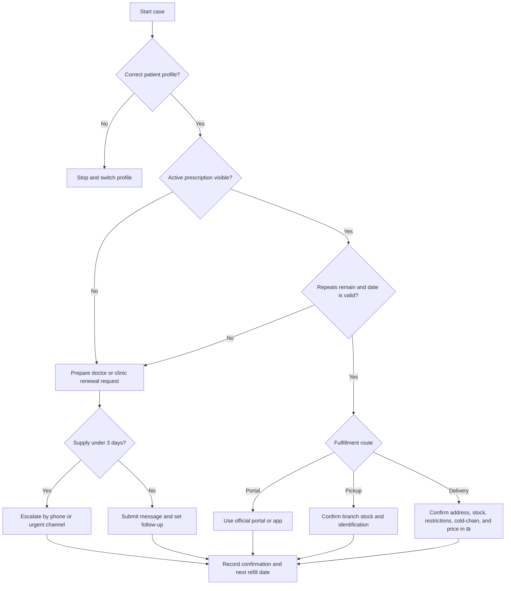
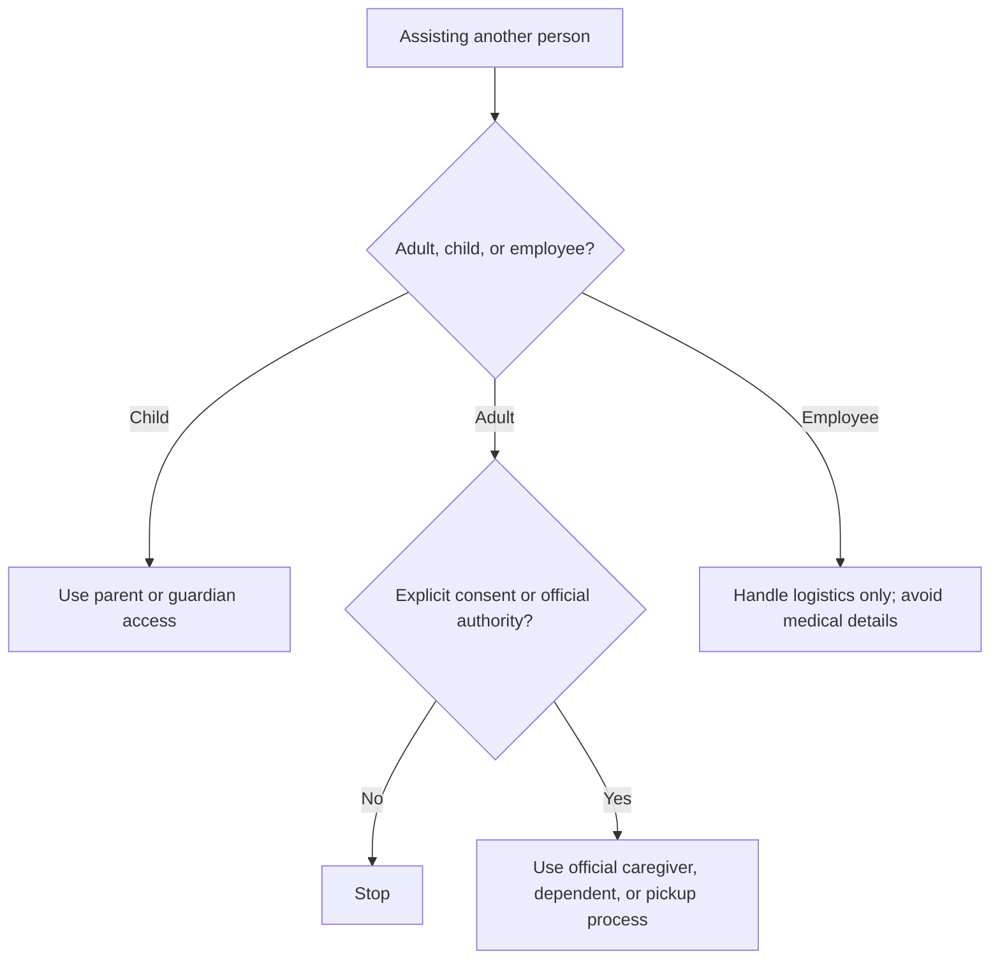

# Prescription Renewal Assistant

## Purpose

Assist Israeli consumers, freelancers, caregivers, and small businesses with safe prescription-renewal and refill logistics. Use official Kupat Cholim portals, apps, clinic channels, and licensed pharmacies. Super-Pharm prescription-order support was web-validated; Be and Newpharm must be verified in the current app, branch, or provider channel before assuming prescription delivery.

This skill organizes workflow steps only. It does not diagnose, prescribe, change dosage, select substitutes, bypass clinical review, or guarantee renewal approval.

## Core rules

1. Collect the minimum necessary information.
2. Handle medication names, HMO membership, addresses, phone numbers, prescription status, and delivery data as sensitive health information.
3. Confirm explicit consent before assisting another adult.
4. Use official portal, app, clinic, pharmacy, or phone channels.
5. Never request portal passwords, one-time codes, full ID numbers, or payment card details.
6. Keep each medication in a separate case.
7. Record dates in `DD-MM-YYYY`.
8. Record amounts in ₪.
9. Escalate clinically urgent cases to a clinic, HMO hotline, pharmacist, urgent-care channel, or emergency service.
10. Delete temporary files and screenshots when no longer needed.

## Minimum data checklist

Collect only the fields needed for the immediate action:

| Field | Required when | Example |
|---|---|---|
| Kupat Cholim | Every case | Maccabi |
| Medication name | Every case | As shown in portal |
| Strength/form | When visible | 10 mg tablets |
| Supply remaining | Every case | 5 days |
| Repeat count | When visible | 0 |
| Validity date | When visible | 22-06-2026 |
| Last dispensing date | Doctor message | 01-06-2026 |
| Fulfillment preference | Pharmacy step | pickup or delivery |
| Current provider verification | Be/Newpharm or branch-dependent services | verified today |
| Consent status | Another adult | confirmed |

Avoid collecting diagnosis, full ID number, portal credentials, full prescription PDFs, and payment-card data unless a lawful and necessary process requires it.

## Urgency model

| Level | Trigger | Action |
|---|---|---|
| Routine | 7+ days remain and prescription appears active | Use normal official refill or pharmacy process |
| Soon | 3-6 days remain, holiday risk, or status unclear | Submit request today and follow up next business day |
| Urgent | 0-2 days remain or renewal is blocked | Call clinic, HMO support, pharmacist, or urgent channel |
| Emergency | Severe symptoms, distress, or dangerous interruption risk | Seek immediate clinical or emergency care |

## Renewal decision tree



## Consent decision tree



## Standard workflow

### 1. Open a case

Create a private case record:

```yaml
case_id: RX-20260604-001
created_at: 04-06-2026
patient_alias: self
kupat_cholim: Clalit
medication_name: as shown in portal
strength_form: 10 mg tablets
supply_days: 5
repeats_left: 0
valid_until: 22-06-2026
preferred_fulfillment: delivery
pharmacy: Super-Pharm
consent_confirmed: true
```

### 2. Verify status

Check the official portal or app directly:
- Select the correct patient profile.
- Verify the medication name and strength.
- Check whether the prescription is active.
- Check repeat count and validity date.
- Check whether renewal requires doctor review, lab tests, specialist input, or special authorization.
- Check whether pharmacy fulfillment is visible.

### 3. Choose a route

| Situation | Route |
|---|---|
| Active prescription with repeats | Pharmacy verification, pickup, delivery, or portal order |
| No repeats | Doctor or clinic renewal request |
| Expired validity date | Doctor or clinic renewal request |
| Medication appears only in history | Doctor or clinic renewal request |
| Supply under 3 days | Renewal request plus urgent phone escalation |
| Cold-chain medication | Confirm refrigerated delivery or prefer pickup |
| Controlled or restricted medication | Follow official HMO and pharmacy requirements only |
| Travel soon | Request early handling and verify pharmacy stock |

### 4. Send a doctor or clinic message

Use this English template:

```text
Subject: Prescription renewal request

Hello,

Please review a prescription renewal request for:
Medication: [name exactly as shown]
Strength/form: [if known]
Current supply remaining: [number of days]
Last dispensing date: [DD-MM-YYYY if known]
Reason for request: [no repeats left / expired / travel / pharmacy cannot dispense]

Please advise whether renewal can be completed digitally or whether an appointment, lab test, document, or additional review is required.

Thank you.
```

### 5. Verify pharmacy fulfillment

Ask the pharmacy:
- Can the pharmacy see the active digital prescription?
- Is the medication in stock?
- Can it be delivered to the requested address?
- Is pharmacist consultation required?
- Is refrigerated handling required?
- Is direct handoff required?
- What identification or authorization is needed?
- What is the total price in ₪, including delivery?
- Was the Kupat Cholim discount applied?
- Is generic substitution available and allowed by the pharmacist and prescription rules?

### 6. Close the case

Record:
- Channel used
- Submission date
- Confirmation number
- Staff member or support ticket when available
- Expected pickup or delivery date
- Amount paid in ₪
- Follow-up date
- Next refill planning date
- Privacy cleanup completion

## Edge cases

### Expired prescription with repeats

Treat the case as a renewal case. Repeats do not guarantee dispensing after the validity date.

### Active prescription but pharmacy cannot see it

Check the correct profile, wait briefly for synchronization, then contact HMO support or the clinic. Avoid sending screenshots unless the provider requests them through a secure channel.

### Medication in history only

Do not treat portal history as an active prescription. Request renewal or reissue.

### Lab-test requirement

Ask which test is missing and whether the clinician can provide safe interim guidance. Do not suggest bypassing the requirement.

### Controlled or restricted medication

Use official HMO and pharmacy instructions. Confirm identification, pickup rules, and whether delivery is permitted. Do not provide shortcuts.

### Cold-chain medication

Confirm packaging, handoff, maximum time out of refrigeration, failed-delivery policy, and whether pickup is safer.

### Travel

Submit renewal planning at least 7 days before travel. Include travel and return dates, supply count, and a request for early dispensing guidance.

### Holiday, weekend, or closure risk

Check clinic hours, pharmacy hours, cutoff times, and delivery capacity. Escalate earlier when fewer than 6 days remain.

### Caregiver pickup

Confirm consent, official authority, pharmacy identification requirements, and pickup rules. Do not store ID images.

### Minor child

Use parent or guardian access and verify the correct child profile before proceeding.

### Employee support

Provide only logistics support, such as scheduling, pickup time, or time-off coordination. Do not collect diagnosis or prescription documents through workplace channels.

## Anti-patterns

Avoid:
- Asking for passwords or one-time codes.
- Saving prescription PDFs in a shared drive.
- Sending medication details in group chat.
- Suggesting dose changes to stretch supply.
- Assuming delivery is available for every medicine.
- Treating old screenshots as proof of active status.
- Mixing multiple family members in one request.
- Submitting duplicate requests without referencing prior confirmation.
- Handling employee medical details when logistics are enough.
- Continuing after consent is missing.

## Production checklist

- [ ] Remove branding, badges, logos, banners, and personal credits.
- [ ] Keep a privacy notice for the workflow.
- [ ] Store only minimum required data.
- [ ] Protect health-related trackers with access controls.
- [ ] Never store passwords, OTP codes, or payment cards.
- [ ] Require manual review before sending messages.
- [ ] Add urgent escalation instructions.
- [ ] Test caregiver, child, travel, holiday, cold-chain, controlled-medication, and stock-out cases.
- [ ] Use `DD-MM-YYYY` dates in English records.
- [ ] Use ₪ for currency.
- [ ] Separate accounting records from medical details.
- [ ] Delete temporary screenshots and files.
- [ ] Review official provider instructions before production use.

## Safety note

Use this text when needed:

```text
This workflow organizes renewal and fulfillment steps only. It does not diagnose, prescribe, change dosage, or replace advice from a doctor or pharmacist.
```


## Web-validated provider caveats

Use these corrections after the final verification pass:

- Super-Pharm: digital-prescription ordering is supported for listed Kupot Cholim under current Super-Pharm eligibility and delivery terms. Verify the HMO, address, standing-order/payment terms, and restricted-medicine exclusions before ordering.
- Be: current official public content confirms app-based pharmacy retail and delivery/pickup, but did not confirm current prescription-delivery support. Use only after checking the Be app, branch, or pharmacist.
- Newpharm: current Israeli prescription-delivery support could not be confirmed from an official current source. Treat the name as legacy/local and verify the actual licensed pharmacy before use.
- VAT: the current general Israeli VAT rate was verified as 18% in 2026. Do not calculate VAT automatically for pharmacy records; store the receipt amount paid in ₪.
- Public APIs and webhooks: no public prescription-renewal API endpoints or webhook names were confirmed. Keep human review and official-channel submission.
