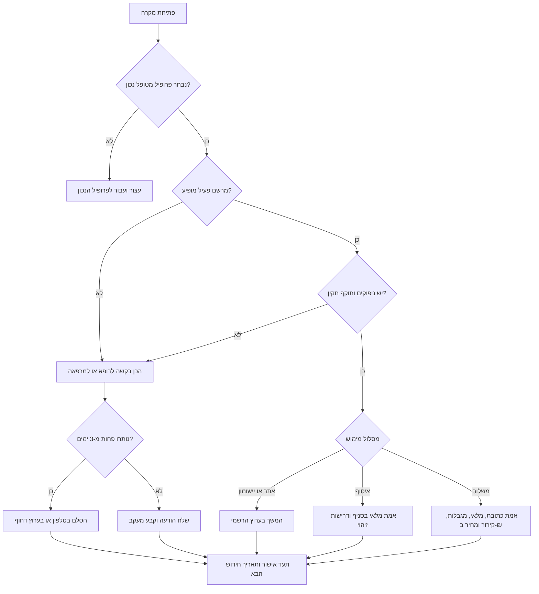
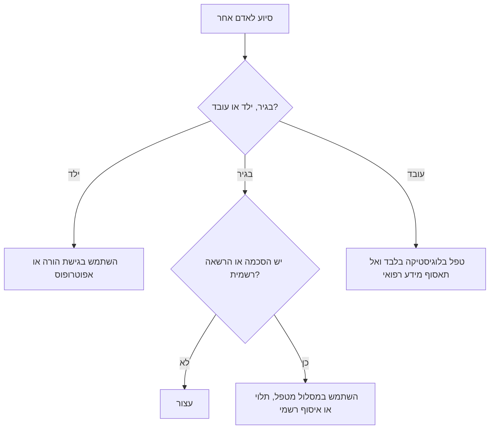

# עוזר לחידוש מרשמים

## מטרה

סייע לצרכנים בישראל, לעצמאים, למטפלים ולבעלי עסקים קטנים לנהל חידוש מרשם והזמנת תרופות בצורה מסודרת ובטוחה. השתמש בערוצים רשמיים של קופות החולים, מרפאות ובתי מרקחת מורשים. תמיכת סופר-פארם בהזמנת מרשם דיגיטלי אומתה; לגבי Be וניו-פארם יש לאמת באפליקציה, בסניף או מול רוקח לפני הנחה שניתן לבצע משלוח תרופות מרשם.

המיומנות מארגנת תהליך עבודה בלבד. היא אינה אבחון, אינה מרשם, אינה שינוי מינון, אינה בחירת תחליף תרופתי ואינה התחייבות לאישור חידוש.

## כללי יסוד

1. אסוף רק את המידע הדרוש לפעולה הנוכחית.
2. התייחס לשם תרופה, חברות בקופה, כתובת, טלפון, סטטוס מרשם ופרטי משלוח כאל מידע רפואי רגיש.
3. ודא הסכמה מפורשת לפני סיוע לבגיר אחר.
4. השתמש באתר, באפליקציה, במרפאה, בבית מרקחת או במוקד רשמי.
5. אל תבקש סיסמה, קוד חד-פעמי, מספר זהות מלא או פרטי כרטיס אשראי.
6. נהל כל תרופה כמקרה נפרד.
7. רשום תאריכים בפורמט `DD/MM/YYYY`.
8. רשום סכומים ב-₪.
9. במקרה דחוף פנה למרפאה, מוקד קופה, רוקח, מוקד רפואי דחוף או שירות חירום.
10. מחק קבצים זמניים וצילומי מסך כאשר אין בהם עוד צורך.

## רשימת מידע מינימלית

| שדה | מתי נדרש | דוגמה |
|---|---|---|
| קופת חולים | בכל מקרה | מכבי |
| שם התרופה | בכל מקרה | כפי שמופיע במערכת |
| חוזק וצורת מתן | כאשר מופיע | 10 מ״ג טבליות |
| ימי מלאי שנותרו | בכל מקרה | 5 ימים |
| מספר ניפוקים שנותרו | כאשר מופיע | 0 |
| תוקף מרשם | כאשר מופיע | 22/06/2026 |
| תאריך ניפוק אחרון | בפנייה לרופא | 01/06/2026 |
| מסלול מועדף | בשלב בית מרקחת | איסוף או משלוח |
| אימות ספק נוכחי | Be, ניו-פארם או שירות תלוי סניף | אומת היום |
| סטטוס הסכמה | כאשר מסייעים לבגיר אחר | אושרה |

הימנע מאיסוף אבחנה, מספר זהות מלא, סיסמאות, קובץ מרשם מלא ופרטי תשלום, אלא אם קיים צורך חוקי ומעשי מובהק.

## סיווג דחיפות

| רמה | סימן | פעולה |
|---|---|---|
| שגרתי | נותרו 7 ימים ומעלה והמרשם נראה פעיל | פעל במסלול הרשמי הרגיל |
| בקרוב | נותרו 3-6 ימים, חג מתקרב או הסטטוס לא ברור | הגש בקשה היום ובצע מעקב ביום העבודה הבא |
| דחוף | נותרו 0-2 ימים או החידוש חסום | התקשר למרפאה, למוקד קופה, לרוקח או לערוץ דחוף |
| חירום | תסמינים חמורים, מצוקה או סיכון עקב הפסקת טיפול | פנה מיד לטיפול רפואי דחוף או לחירום |

## עץ החלטה לחידוש



## עץ החלטה להסכמה



## תהליך עבודה

### 1. פתח מקרה

```yaml
case_id: RX-20260604-001
created_at: 04/06/2026
patient_alias: self
kupat_cholim: כללית
medication_name: כפי שמופיע במערכת
strength_form: 10 מ״ג טבליות
supply_days: 5
repeats_left: 0
valid_until: 22/06/2026
preferred_fulfillment: משלוח
pharmacy: סופר-פארם
consent_confirmed: true
```

### 2. אמת סטטוס

בדוק בערוץ הרשמי:
- בחר פרופיל מטופל נכון.
- אמת שם תרופה וחוזק.
- בדוק אם המרשם פעיל.
- בדוק מספר ניפוקים ותוקף.
- בדוק האם נדרשת בדיקת רופא, בדיקת מעבדה, מומחה או אישור מיוחד.
- בדוק האם קיימת אפשרות מימוש בבית מרקחת.

### 3. בחר מסלול

| מצב | מסלול |
|---|---|
| מרשם פעיל עם ניפוקים | אימות בית מרקחת, איסוף, משלוח או הזמנה בערוץ הקופה |
| אין ניפוקים | בקשת חידוש לרופא או למרפאה |
| התוקף פג | בקשת חידוש לרופא או למרפאה |
| התרופה מופיעה רק בהיסטוריה | בקשת חידוש או הנפקה מחדש |
| נותרו פחות מ-3 ימים | בקשה בכתב והסלמה טלפונית |
| תרופה בקירור | אימות שרשרת קירור או העדפת איסוף |
| תרופה מפוקחת או מוגבלת | פעולה לפי דרישות רשמיות בלבד |
| נסיעה קרובה | בקשת טיפול מוקדם ואימות מלאי |

### 4. נסח פנייה לרופא או למרפאה

```text
נושא: בקשה לחידוש מרשם

שלום,

אבקש לבדוק חידוש מרשם עבור:
תרופה: [שם כפי שמופיע במערכת]
חוזק/צורת מתן: [אם ידוע]
ימי מלאי שנותרו: [מספר ימים]
תאריך ניפוק אחרון: [DD/MM/YYYY אם ידוע]
סיבת הפנייה: [אין ניפוקים / פג תוקף / נסיעה / בית המרקחת אינו יכול לנפק]

נא לעדכן האם ניתן לחדש את המרשם באופן דיגיטלי, או שנדרש תור, בדיקה, מסמך או בירור נוסף.

תודה.
```

### 5. אמת מימוש בבית מרקחת

שאל:
- האם בית המרקחת רואה מרשם דיגיטלי פעיל?
- האם התרופה במלאי?
- האם ניתן לבצע משלוח לכתובת המבוקשת?
- האם נדרש ייעוץ רוקחי?
- האם נדרשת שמירה בקירור?
- האם נדרשת מסירה ישירה?
- איזה זיהוי או אישור נדרש?
- מה המחיר הכולל ב-₪, כולל דמי משלוח?
- האם הופעלה הנחת קופת חולים?
- האם קיימת חלופה גנרית והאם היא מותרת לפי הרוקח וכללי המרשם?

### 6. סגור מקרה

תעד:
- ערוץ פעולה
- תאריך הגשה
- מספר אישור
- גורם מטפל או מספר פנייה
- תאריך איסוף או מסירה צפוי
- סכום ששולם ב-₪
- תאריך מעקב
- תאריך תכנון לחידוש הבא
- השלמת ניקוי מידע רגיש

## מקרי קצה

### תוקף פג אך נותרו ניפוקים

התייחס למקרה כאל צורך בחידוש. ניפוקים שנותרו אינם מבטיחים ניפוק לאחר תום התוקף.

### מרשם פעיל אך בית המרקחת אינו רואה אותו

בדוק פרופיל מטופל, המתן זמן קצר לסנכרון ופנה לתמיכת הקופה או למרפאה. אל תשלח צילום מסך אלא אם הספק ביקש זאת בערוץ מאובטח.

### התרופה מופיעה רק בהיסטוריה

אל תתייחס להיסטוריה כאל מרשם פעיל. בקש חידוש או הנפקה מחדש.

### נדרשת בדיקת מעבדה

שאל איזו בדיקה חסרה והאם הרופא יכול לתת הנחיה זמנית בטוחה. אל תעקוף דרישה רפואית.

### תרופה מפוקחת או מוגבלת

פעל לפי הוראות הקופה ובית המרקחת. אמת דרישות זיהוי, כללי איסוף והאם משלוח מותר. אל תציע קיצורי דרך.

### תרופה בקירור

אמת אריזה, מסירה, משך שהייה מחוץ לקירור, מדיניות כשל מסירה והאם איסוף עדיף.

### נסיעה

התחל טיפול לפחות 7 ימים לפני הנסיעה. ציין תאריך נסיעה וחזרה, מספר ימי מלאי ובקשה להנחיות לגבי ניפוק מוקדם.

### חג, סוף שבוע או סגירה

בדוק שעות מרפאה, שעות בית מרקחת, מועדי סגירה וקיבולת משלוחים. כאשר נותרו פחות מ-6 ימים, פעל מוקדם יותר.

### איסוף על ידי מטפל

אמת הסכמה, הרשאה רשמית, דרישות זיהוי וכללי איסוף. אל תשמור צילום תעודת זהות.

### ילד קטין

השתמש בגישת הורה או אפוטרופוס ובדוק שנבחר פרופיל הילד הנכון.

### תמיכה לעובד

ספק סיוע לוגיסטי בלבד, כגון תיאום זמן, איסוף או היעדרות. אל תאסוף אבחנה או מסמכי מרשם בערוצי עבודה.

## דפוסים שיש להימנע מהם

הימנע מ:
- בקשת סיסמאות או קודים חד-פעמיים.
- שמירת קובצי מרשם בכונן משותף.
- שליחת פרטי תרופה בצאט קבוצתי.
- הצעת שינוי מינון כדי למשוך זמן.
- הנחה שכל תרופה זמינה למשלוח.
- הסתמכות על צילום מסך ישן כהוכחה למרשם פעיל.
- ערבוב כמה בני משפחה בבקשה אחת.
- שליחת בקשות כפולות בלי לציין אישור קודם.
- טיפול בפרטים רפואיים של עובד כאשר נדרש רק תיאום לוגיסטי.
- המשך תהליך כאשר חסרה הסכמה.

## רשימת בדיקה להפעלה

- [ ] הסר מיתוג, תגיות, סמלים, באנרים וקרדיטים אישיים.
- [ ] פרסם הודעת פרטיות לתהליך.
- [ ] שמור רק מידע מינימלי.
- [ ] הגן על טבלאות עם מידע רפואי בהרשאות מתאימות.
- [ ] אל תשמור סיסמאות, קודים חד-פעמיים או פרטי כרטיס אשראי.
- [ ] בצע בדיקה ידנית לפני שליחת הודעות.
- [ ] הוסף הוראות הסלמה דחופה.
- [ ] בדוק תרחישי מטפל, ילד, נסיעה, חג, קירור, תרופה מפוקחת וחוסר מלאי.
- [ ] השתמש בתאריכים בפורמט `DD/MM/YYYY` במסמכים בעברית.
- [ ] השתמש ב-₪ לסכומים.
- [ ] הפרד תיעוד חשבונאי ממידע רפואי.
- [ ] מחק קבצים זמניים וצילומי מסך.
- [ ] בדוק הוראות ספק רשמיות לפני שימוש תפעולי.

## הבהרת בטיחות

```text
תהליך זה מארגן חידוש מרשם ומימוש בבית מרקחת בלבד. הוא אינו אבחון, אינו מרשם, אינו שינוי מינון ואינו מחליף ייעוץ של רופא או רוקח.
```


## דגשים שאומתו ברשת

פעל לפי התיקונים הבאים לאחר בדיקת המקורות:

- סופר-פארם: קיימת תמיכה בהזמנת תרופות מרשם דיגיטלי עבור קופות חולים מסוימות, בכפוף לתנאי זכאות, אזור משלוח, אמצעי תשלום והחרגות לתרופות מוגבלות.
- Be: נמצא מקור רשמי עדכני לאפליקציית בי פארם ולמשלוח או איסוף של מוצרי פארם, אך לא אומתה תמיכה רשמית עדכנית במשלוח תרופות מרשם. בדוק באפליקציה, בסניף או מול רוקח.
- ניו-פארם: לא אומתה תמיכה ישראלית עדכנית במשלוח תרופות מרשם. התייחס לשם כאל שם היסטורי או מקומי ובדוק את בית המרקחת המורשה בפועל.
- מע״מ: שיעור המע״מ הכללי בישראל אומת כ-18% בשנת 2026. אין לחשב מע״מ אוטומטית ברישומי בית מרקחת; שמור את סכום הקבלה ששולם ב-₪.
- ממשקי תכנות והתראות: לא אומתו נתיבי API ציבוריים או שמות אירועי webhook לחידוש מרשם. שמור תהליך אנושי עם שליחה בערוץ רשמי.
