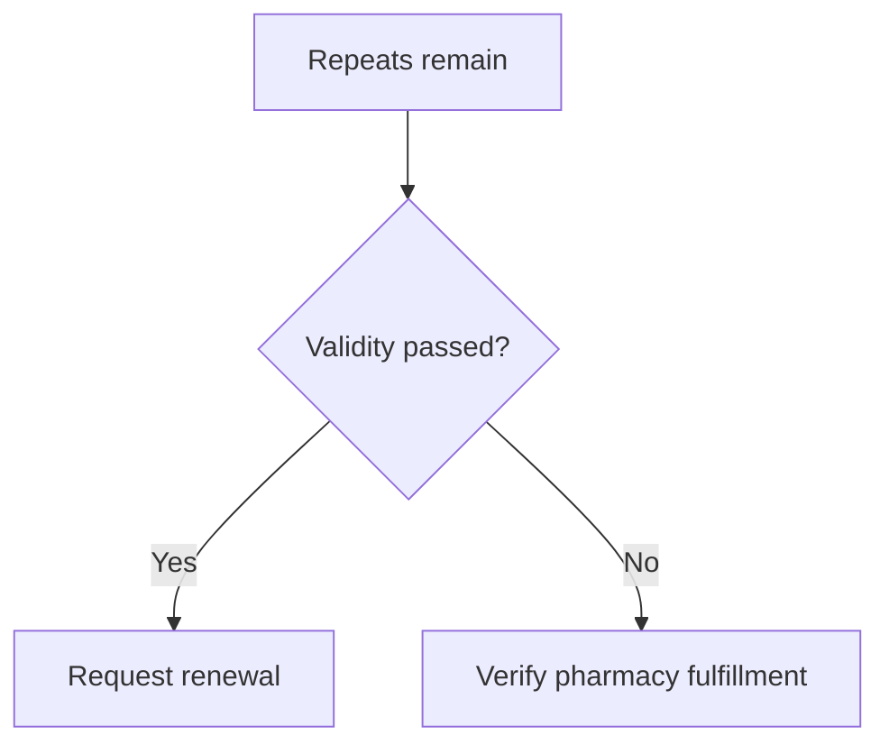

# Workflow Guide

## Workflow 1: Routine active refill

Use when 7 or more days remain, the prescription is active, and repeats remain.

1. Open the official portal or app.
2. Select the correct patient profile.
3. Verify medication name, strength, repeat count, and validity date.
4. Choose pickup, delivery, or portal order.
5. Confirm pharmacy stock.
6. Confirm price in ₪ and HMO discount.
7. Complete the order directly with the provider.
8. Record confirmation and next refill date.

## Workflow 2: No repeats

Use when repeat count is zero or hidden.

1. Confirm supply remaining.
2. Draft a doctor or clinic renewal request.
3. Include medication name, strength/form, supply remaining, last dispensing date, and reason.
4. Ask whether appointment, lab test, document, or review is required.
5. Submit through official messaging.
6. If 0-2 days remain, call the clinic or urgent channel.
7. Record follow-up for the next business day.

## Workflow 3: Expired validity with repeats

1. Treat the case as doctor renewal.
2. Do not pressure a pharmacy to dispense based on old repeats.
3. Ask for reissue or renewal.
4. Escalate if supply is low.

## Workflow 4: Pharmacy delivery

1. Confirm pharmacy provider and branch. For Be or Newpharm references, verify current prescription support before proceeding.
2. Confirm address service area.
3. Confirm stock.
4. Confirm whether prescription medicine can be delivered.
5. Confirm pharmacist consultation requirements.
6. Confirm total price in ₪.
7. For cold-chain medicine, confirm refrigeration and failed-delivery process.
8. Record delivery window.

## Workflow 5: Caregiver pickup

1. Confirm explicit consent.
2. Ask the pharmacy what identification or authorization is required.
3. Use official caregiver or dependent access where available.
4. Avoid storing ID images.
5. Record pickup completion with minimal detail.

## Workflow 6: Minor child

1. Use parent or guardian access.
2. Select the correct child profile.
3. Verify medication identity.
4. Submit renewal request through the official channel.
5. Confirm pickup or delivery rules for a minor.

## Workflow 7: Travel

1. Record travel dates in `DD-MM-YYYY`.
2. Check supply through return date plus buffer.
3. Submit renewal request at least 7 days before departure.
4. Ask whether early dispensing is permitted.
5. Confirm pharmacy stock before travel.

## Workflow 8: Holiday or weekend

1. Check clinic and pharmacy hours.
2. Submit request immediately if supply is under 7 days.
3. Call if supply is under 3 days.
4. Prefer pickup over uncertain delivery when cutoff risk is high.

## Workflow 9: Cold-chain delivery

1. Confirm prescription status.
2. Ask how refrigeration is maintained.
3. Ask whether direct handoff is required.
4. Ask what happens after failed delivery.
5. Prefer pickup if handoff is uncertain.

## Workflow 10: Employee logistics

1. Ask only what scheduling or delivery help is needed.
2. Do not request diagnosis or prescription files.
3. Keep health details out of workplace chat.
4. Record only business-relevant facts, such as approved time off.

## Workflow 11: Expense record

1. Store date, vendor, amount in ₪, and category.
2. Keep prescription details separate from accounting records.
3. Ask a qualified accountant about deductibility when needed.

## Workflow 12: Portal and pharmacy mismatch

1. Verify correct profile.
2. Verify active prescription status.
3. Ask pharmacy to recheck after a short synchronization window.
4. Contact HMO support or clinic if the mismatch remains.
5. Avoid duplicate renewal submissions.

## Workflow 13: Be or Newpharm verification

Use when the user asks about Be, Newpharm, or a branch whose current prescription-delivery support is unclear.

1. Check the current app or official branch page.
2. Call the branch or pharmacist before sending medical details.
3. Ask whether prescription medications, not only general pharmacy products, can be delivered or reserved.
4. Ask which Kupat Cholim prescriptions are supported.
5. Ask whether the medication requires pickup, original documentation, pharmacist consultation, or special handling.
6. Use another verified licensed pharmacy if support cannot be confirmed.
