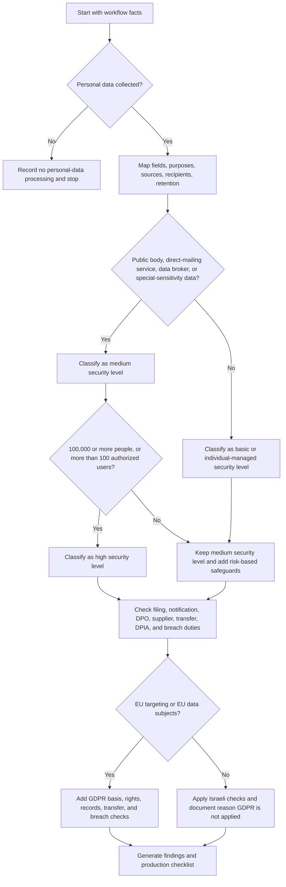
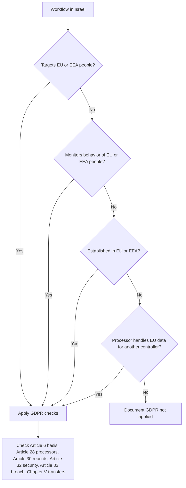

# Privacy-Compliance Checker

## Purpose

Use this skill to review workflows that collect, use, store, share, transfer, or delete personal data in Israel. Focus on practical decisions for small businesses, freelancers, consumer-facing sites, clinics, associations, and lightweight cloud services.

Return operational guidance, not legal advice. Escalate to qualified privacy counsel for medical data, minors, biometric data, credit data, employee monitoring, public bodies, major incidents, automated decisions with significant effects, complex international transfers, litigation, regulatory inquiry, or a database that may require current filing with the Israeli Privacy Protection Authority.

## Core answer structure

Use this order:

1. State facts and assumptions.
2. Classify the security level: basic, medium, or high.
3. Identify Israeli privacy obligations.
4. Identify GDPR applicability.
5. List findings with severity.
6. Assign concrete remediation tasks, evidence, and due dates.
7. Call out anti-patterns.
8. Finish with a production checklist.

Use imperative language. Replace vague advice such as "improve privacy" with concrete tasks such as "block optional analytics tags until consent is stored".

## Minimum input fields

| Field | Why it matters | Examples |
|---|---|---|
| Activity type | Determines practical risk | Online shop, freelancer CRM, clinic, newsletter, cloud service |
| Record count | Affects security level and authority filing checks | 350 leads, 18,000 customers, 120,000 patients |
| Data categories | Identifies sensitive information | Health, ID number, financial data, children, precise location |
| Data subjects | Determines notices and rights | Customers, employees, suppliers, minors, EU users |
| Purposes | Prevents incompatible reuse | Billing, delivery, support, fraud prevention, marketing |
| Lawful basis | Justifies collection and use | Consent, contract, legal duty, legitimate interests |
| Processors | Triggers supplier controls | Hosting, payroll, payment provider, email system |
| Transfers | Triggers international-transfer review | EU, United Kingdom, United States, overseas support |
| Marketing | Triggers direct-mailing and unsubscribe controls | Newsletter, SMS, targeted offers, remarketing |
| Tracking | Triggers consent and transparency controls | Analytics, pixels, session replay, conversion tags |
| Incident status | Triggers breach triage | Ransomware, lost laptop, wrong-recipient export |

VAT is not calculated by this skill. When a privacy workflow contains billing examples, use the current tax source only as business context and do not treat VAT as a privacy-law rule.

## Decision tree: first assessment



## Israeli-law checks

### 1. Database specification

Create a written database specification for every meaningful workflow. Include:

- Database name and business owner.
- Controller or database owner.
- Purpose of processing.
- Categories of data.
- Sources of data.
- Recipients and processors.
- Retention period and deletion method.
- Security level and controls.
- Cross-border transfer destinations.
- Rights-request channel.

### 2. Security level

Use the Protection of Privacy Regulations (Data Security), 5777-2017 as the operating anchor.

| Level | Practical trigger | Minimum controls |
|---|---|---|
| Basic | Database that does not meet medium or high triggers | Database specification, access restrictions, backup, staff instruction, incident intake |
| Medium | Public-body database, direct-mailing service or data-broker database, or data with special sensitivity | Access logs, periodic permission review, incident procedure, supplier review, restore test, documented security procedure |
| High | Medium-level database with information on 100,000 or more people, or with more than 100 authorized users | Formal risk assessment, stronger logging, training, strict access review, management approval, tested incident response |

Do not treat 10,000 people or 10 authorized users as generic medium-security triggers. The 10,000-person threshold matters for specific Amendment 13 registration and DPO checks involving data-broker or direct-mailing-service activity. Verify current statutory categories before final reliance.

### 2A. Amendment 13 filing, notification, and DPO checks

Check the current Privacy Protection Authority filing position before submission. As a working screen:

- Review database registration for a public-body database, except a public-body database containing only that body's employees.
- Review database registration for a database whose main purpose is collecting personal data for transfer to others as a business or for consideration, including direct-mailing services, when it contains information on more than 10,000 people.
- Review notice to the Privacy Protection Authority for a database containing information with special sensitivity about more than 100,000 people when it is not already subject to registration.
- Assess appointment of a data protection officer for public bodies, holders of public-body databases, data-broker or direct-mailing-service databases with more than 10,000 people, and large-scale systematic monitoring or large-scale special-sensitivity processing where the activity is core to the organization.
- Assess appointment of an information security officer when the controller or holder has five databases that require registration or notice.

Keep regulator-facing filings outside automated submission. Prepare evidence, review with a responsible manager, and submit through the official form or service only after legal and factual confirmation.

### 3. Notice and consent

Before collecting data, disclose:

- Identity and contact details of the controller.
- Whether providing data is mandatory or voluntary.
- Purposes of collection.
- Recipients and categories of recipients.
- Retention and deletion logic.
- Cross-border transfers.
- Rights of access, correction, deletion, objection, and marketing opt-out.
- Material automated decisioning or profiling.

Use consent when the workflow requires genuine choice. Do not rely on consent when service denial makes choice meaningless unless the data is necessary for the service.

### 4. Direct marketing

For newsletters, coupons, loyalty clubs, lead nurturing, and remarketing:

- Store the source of each recipient.
- Separate service messages from marketing messages.
- Add a simple unsubscribe method.
- Maintain a suppression list.
- Avoid adding customers to unrelated marketing lists by default.
- Review anti-spam obligations separately.

### 5. Processors

Before sending data to a supplier, document:

- Processing instructions.
- Confidentiality duties.
- Security controls.
- Subprocessor approval.
- Cross-border locations.
- Incident notice deadline.
- Deletion or return at termination.
- Audit or evidence rights.

### 6. Transfers outside Israel

For each transfer, identify the country, recipient, purpose, access route, onward transfers, and safeguard. If GDPR applies, add Chapter V review such as adequacy, standard contractual clauses, or another permitted mechanism.

### 7. Breach triage

When an event occurs:

1. Contain access.
2. Preserve logs and evidence.
3. Identify affected data and people.
4. Assess risk.
5. Decide whether notification is required under Israeli rules.
6. If GDPR applies, assess supervisory-authority reporting within 72 hours.
7. Track remediation and lessons learned.

## GDPR decision tree



## Concrete examples

### Example 1: small freelancer CRM

Facts: 350 prospects and clients, invoices, email history, cloud spreadsheet, no sensitive data, no EU targeting.

Likely result:

- Security level: basic.
- Lawful basis: contract for clients, legitimate interests or consent for prospects.
- Required fixes: privacy notice, retention period, access restriction, backup, deletion process.
- Main anti-pattern: keeping old leads indefinitely.

### Example 2: neighborhood customer club

Facts: 18,000 customers, purchases, birthday month, coupons, email provider in the United States, analytics tags.

Likely result:

- Security level: medium.
- Direct marketing controls required.
- Cross-border transfer review required.
- Optional tracking must be blocked until consent when consent is the chosen basis.
- Suppression list must remain active even after marketing deletion.

### Example 3: private clinic

Facts: 12,000 patients, health data, ID numbers, appointment reminders, billing provider.

Likely result:

- Statutory data-security level: medium unless the database reaches the high-level thresholds of 100,000 or more people, more than 100 authorized users, or another high-level trigger.
- Practical severity: high because health and ID data require tight operational controls.
- Sensitive-data notice required.
- Processor contracts and access logs required.
- Incident response must be tested.
- Marketing reuse of patient data requires special review and is usually high risk.

### Example 4: breach in a retail export

Facts: customer export sent to wrong recipient, 4,200 records, order totals, phone numbers.

Likely result:

- Open incident log immediately.
- Request deletion confirmation from wrong recipient.
- Determine whether data was accessed or copied.
- Assess authority and affected-person notification duties.
- Rotate shared links and review export permissions.

### Example 5: cloud service with EU users

Facts: Israeli cloud service, EU customers, support system in the United States, product analytics, employee data.

Likely result:

- GDPR likely applies.
- Maintain processing records.
- Complete processor and transfer review.
- Review profiling and analytics.
- Add DPIA screening and rights-request workflow.

## Edge cases

| Edge case | Decision |
|---|---|
| One-person business using a global email platform | Still document processor and transfer facts. Do not ignore supplier duties because the business is small. |
| Consumer asks for deletion but invoices must be retained | Delete marketing and support data where possible. Retain statutory accounting records under legal-hold logic. |
| Consent was collected years ago | Verify scope, proof, and withdrawal mechanism. Repermission if scope is unclear. |
| Public social-media data is scraped | Treat as personal data. Assess purpose, notice feasibility, rights, and platform terms. |
| Employee location tracking | Require necessity, proportionality, notice, access restriction, and retention limit. |
| Supplier says data stays in the cloud without country details | Do not approve the supplier until locations and subprocessors are documented. |
| Analytics tool claims data is anonymous | Verify whether identifiers, IP addresses, device IDs, or event data can re-identify a person. |
| Customer support records contain health details unexpectedly | Reclassify the workflow as sensitive and add redaction or routing controls. |
| Database below thresholds but contains biometric data | Treat as special-sensitivity data, classify at least medium, and escalate for risk-based safeguards. |
| Overseas contractor can view production records | Treat as a cross-border transfer and processor access. |

## Anti-patterns

- Copying privacy notices from another site.
- Treating payment, hosting, analytics, and email vendors as outside the privacy workflow.
- Loading advertising pixels before consent.
- Keeping leads forever because storage is cheap.
- Using one shared admin account.
- Exporting customer lists to personal devices.
- Treating consent as valid when withdrawal is impossible.
- Sending breach details over unsecured channels.
- Reusing service data for marketing without a separate basis.
- Assuming GDPR never applies because the business is Israeli.

## Troubleshooting

| Symptom | Likely cause | Fix |
|---|---|---|
| Cannot classify security level | Missing record count, data category, or user count | Use conservative classification and document assumptions |
| GDPR applicability unclear | EU targeting, monitoring, or processor role not mapped | Ask whether goods, services, behavior tracking, or EU clients are involved |
| Supplier will not sign terms | Commodity supplier or missing procurement leverage | Record risk, choose alternative supplier, or reduce data access |
| Retention period disputed | Legal, tax, service, and marketing needs mixed together | Split retention by purpose and data category |
| Data subject asks for all data | Data is scattered across systems | Use inventory to locate systems and track response evidence |
| Incident severity unclear | Affected fields or access evidence missing | Preserve logs, sample records, and access paths before cleanup |

## Production checklist

Before launch, confirm:

- Processing inventory approved.
- Privacy notice published in Hebrew and any other relevant language.
- Lawful basis recorded per purpose.
- Database filing or notification check completed when relevant.
- Security level approved.
- Access matrix implemented.
- Multi-factor authentication enabled for administrative systems.
- Backups tested.
- Supplier contracts signed.
- Transfer assessment completed.
- Marketing opt-out tested.
- Optional trackers blocked until allowed.
- Retention and deletion jobs documented.
- Rights-request workflow tested.
- Incident procedure tested.
- Evidence folder created with dates, owner, and review schedule.

## CLI usage

Install locally:

```bash
pip install -e .
pip install -r requirements-dev.txt
```

Create and save an assessment, extract the ID, then read the same assessment:

```bash
ID=$(privacy-compliance-checker --env sandbox create --scenario customer-club --format json | python -c 'import json,sys; print(json.load(sys.stdin)["id"])')
privacy-compliance-checker --env sandbox get "$ID" --format markdown
```

Generate a file template:

```bash
privacy-compliance-checker template --scenario clinic > clinic.json
privacy-compliance-checker assess --file clinic.json --format json
```

Run tests:

```bash
pytest
python -m compileall scripts/ -q
```
