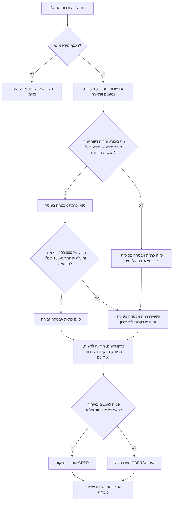
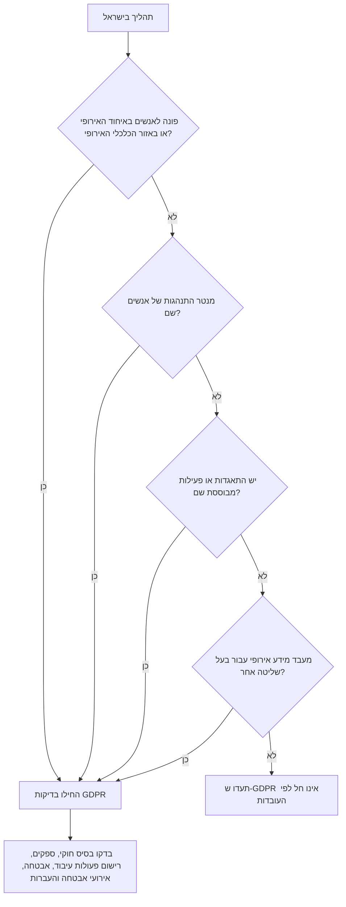

# בודק ציות פרטיות

## מטרה

השתמשו בסקיל לבדיקת תהליכים שבהם נאסף, נשמר, מועבר, משותף, נמחק או נעשה שימוש במידע אישי בישראל. התאימו את הבדיקה לעסק קטן, עצמאי, אתר צרכני, קליניקה פרטית, עמותה קטנה או שירות תוכנה בענן.

הציגו המלצות תפעוליות בלבד. אל תציגו את התוצאה כייעוץ משפטי. הפנו לבדיקת עורך דין המתמחה בפרטיות במקרים של מידע רפואי, קטינים, מידע ביומטרי, נתוני אשראי, ניטור עובדים, גוף ציבורי, אירוע אבטחה משמעותי, החלטות אוטומטיות בעלות השפעה מהותית, העברה מורכבת לחוץ לארץ, הליך משפטי או פנייה של רגולטור.

## מבנה תשובה מומלץ

ענו לפי הסדר הבא:

1. ציינו עובדות והנחות.
2. סווגו רמת אבטחה: בסיסית, בינונית או גבוהה.
3. פרטו חובות לפי הדין הישראלי.
4. בדקו אם GDPR חל.
5. הציגו ממצאים לפי חומרה.
6. הגדירו פעולות תיקון, ראיות ותאריכי יעד.
7. ציינו דפוסי פעולה שגויים.
8. סיימו ברשימת בדיקה לפני עלייה לסביבת ייצור.

השתמשו בלשון ציווי מקצועית. במקום לכתוב "לשפר פרטיות", כתבו "לחסום תגיות מדידה שאינן חיוניות עד לשמירת הסכמה".

## נתוני קלט נדרשים

| שדה | למה הוא חשוב | דוגמאות |
|---|---|---|
| סוג פעילות | קובע סיכון מעשי | חנות מקוונת, מערכת ניהול קשרי לקוחות לעצמאי, קליניקה, מועדון לקוחות |
| מספר רשומות | משפיע על רמת אבטחה ועל בדיקות מול הרשות | 350 לידים, 18,000 לקוחות, 120,000 מטופלים |
| סוגי מידע | מזהה מידע רגיש | בריאות, מספר תעודת זהות, מידע פיננסי, קטינים, מיקום מדויק |
| נושאי מידע | קובע הודעות וזכויות | לקוחות, עובדים, ספקים, קטינים, משתמשים מהאיחוד האירופי |
| מטרות | מונע שימוש לא תואם | חיוב, משלוח, תמיכה, מניעת הונאה, שיווק |
| בסיס חוקי | מצדיק איסוף ושימוש | הסכמה, חוזה, חובה חוקית, אינטרס לגיטימי |
| ספקים | מחייב הסכמי עיבוד ובקרה | אחסון, שכר, סליקה, מערכת דיוור, שירות לקוחות |
| העברות לחוץ לארץ | מחייב בדיקת העברה | האיחוד האירופי, בריטניה, ארצות הברית, מוקד תמיכה בחוץ לארץ |
| שיווק | מפעיל בקרות דיוור והסרה | ניוזלטר, מסרונים, הצעות ממוקדות, שיווק מחדש |
| מעקב ומדידה | מחייב שקיפות והסכמה במקרים רבים | כלי מדידה, תגיות פרסום, הקלטת שימוש, תגיות המרה |
| אירוע אבטחה | מפעיל תיעוד ודיווח | כופרה, מחשב שאבד, קובץ שנשלח לנמען שגוי |

הכלי אינו מחשב מע"מ. אם תהליך פרטיות כולל דוגמאות חיוב, השתמשו במקור מס עדכני כהקשר עסקי בלבד ואל תציגו מע"מ ככלל פרטיות.

## עץ החלטה לבדיקה ראשונית



## בדיקות לפי הדין הישראלי

### 1. מסמך הגדרות מאגר

הכינו מסמך לכל תהליך מהותי. כללו:

- שם המאגר.
- בעל השליטה או בעל המאגר.
- מטרות העיבוד.
- סוגי המידע.
- מקורות המידע.
- נמענים וספקי עיבוד.
- תקופת שמירה ושיטת מחיקה.
- רמת אבטחה ובקרות.
- יעדי העברה לחוץ לארץ.
- ערוץ למימוש זכויות.

### 2. רמת אבטחה

השתמשו בתקנות הגנת הפרטיות (אבטחת מידע), 2017 כעוגן תפעולי.

| רמה | טריגר מעשי | בקרות מינימום |
|---|---|---|
| בסיסית | מאגר שאינו עומד בתנאי רמה בינונית או גבוהה | מסמך מאגר, הגבלת הרשאות, גיבוי, הנחיות לעובדים, קליטת אירועים |
| בינונית | מאגר של גוף ציבורי, מאגר של שירות דיוור ישיר או סוחר מידע, או מאגר עם מידע בעל רגישות מיוחדת | תיעוד גישה, סקירת הרשאות, נוהל אירוע, בדיקת ספקים, בדיקת שחזור, נוהל אבטחה מתועד |
| גבוהה | מאגר ברמה בינונית הכולל מידע על 100,000 בני אדם ומעלה, או שיש לו יותר מ-100 בעלי הרשאה | סקר סיכונים, תיעוד גישה מחוזק, הדרכה, אישור הנהלה, סקירת הרשאות קפדנית ותרגול אירוע |

אל תשתמשו ב-10,000 בני אדם או ב-10 בעלי הרשאה כטריגר כללי לרמת אבטחה בינונית. סף 10,000 בני אדם רלוונטי לבדיקות מסוימות של רישום וממונה לפי תיקון 13 כאשר מדובר בסוחר מידע או בשירות דיוור ישיר. אמתו את הסיווג והחריגים לפני הסתמכות סופית.

### 2א. בדיקות רישום, הודעה לרשות וממונה לפי תיקון 13

בדקו את עמדת הרשות להגנת הפרטיות לפני כל הגשה. כמסך עבודה ראשוני:

- בדקו חובת רישום למאגר של גוף ציבורי, למעט מאגר הכולל רק מידע על עובדי אותו גוף.
- בדקו חובת רישום למאגר שמטרתו העיקרית איסוף מידע אישי לשם מסירתו לאחר כדרך עיסוק או בתמורה, לרבות שירותי דיוור ישיר, כאשר הוא כולל מידע על יותר מ-10,000 בני אדם.
- בדקו חובת הודעה לרשות לגבי מאגר שאינו חייב ברישום וכולל מידע בעל רגישות מיוחדת על יותר מ-100,000 בני אדם.
- בדקו מינוי ממונה על הגנת הפרטיות בגוף ציבורי, במחזיק מאגר של גוף ציבורי, בסוחר מידע או בשירות דיוור ישיר עם יותר מ-10,000 בני אדם, ובפעילות ליבה הכוללת ניטור שיטתי נרחב או עיבוד נרחב של מידע בעל רגישות מיוחדת.
- בדקו מינוי ממונה על אבטחת מידע כאשר בעל השליטה או המחזיק מנהל חמישה מאגרים החייבים ברישום או בהודעה.

השאירו הגשות לרשות מחוץ לאוטומציה. הכינו ראיות, אשרו עם גורם אחראי, והגישו רק דרך השירות או הטופס הרשמי לאחר בדיקה משפטית ועובדתית.

### 3. הודעה והסכמה

לפני איסוף מידע, מסרו הודעה ברורה על:

- זהות ופרטי קשר של בעל השליטה.
- האם מסירת המידע חובה או רשות.
- מטרות האיסוף.
- נמענים וסוגי נמענים.
- שמירה ומחיקה.
- העברה לחוץ לארץ.
- זכויות עיון, תיקון, מחיקה, התנגדות והסרה מדיוור.
- החלטה אוטומטית או אפיון מהותי.

הסתמכו על הסכמה רק כאשר קיימת בחירה אמיתית. אל תשתמשו בהסכמה כבסיס כאשר סירוב חוסם שירות שאינו מחייב את המידע.

### 4. דיוור ישיר ושיווק

למועדוני לקוחות, קופונים, רשימות תפוצה ושיווק מחדש:

- שמרו מקור הרשאה לכל נמען.
- הפרידו הודעות שירות מהודעות שיווק.
- הוסיפו דרך הסרה פשוטה.
- נהלו רשימת חסימה.
- אל תצרפו לקוחות לשיווק שאינו קשור לשירות ללא בסיס מתאים.
- בדקו בנפרד גם חובות לפי דיני הספאם.

### 5. ספקי עיבוד

לפני העברת מידע לספק, תעדו:

- הוראות עיבוד.
- חובת סודיות.
- אמצעי אבטחה.
- אישור ספקי משנה.
- מדינות שבהן המידע נשמר או נגיש.
- מועד הודעה על אירוע אבטחה.
- מחיקה או החזרה בסיום התקשרות.
- זכות לקבל ראיות או לבצע בדיקה.

### 6. העברה לחוץ לארץ

לכל העברה ציינו מדינה, נמען, מטרה, גישת משתמשים, העברות המשך ואמצעי הגנה. אם GDPR חל, הוסיפו בדיקת פרק V, כגון מדינת יעד מוכרת, סעיפים חוזיים סטנדרטיים או מנגנון מותר אחר.

### 7. אירוע אבטחה

כאשר מתרחש אירוע:

1. חסמו גישה.
2. שמרו תיעוד וראיות.
3. זהו מידע ואנשים מושפעים.
4. העריכו סיכון.
5. החליטו אם נדרש דיווח לפי הדין הישראלי.
6. אם GDPR חל, בדקו דיווח לרשות פיקוח בתוך 72 שעות.
7. תעדו תיקון והפקת לקחים.

## עץ החלטה לתחולת GDPR



## דוגמאות מעשיות

### דוגמה 1: עצמאי עם מערכת ניהול קשרי לקוחות

עובדות: 350 לקוחות ולידים, חשבוניות, היסטוריית דואר אלקטרוני, גיליון בענן, ללא מידע רגיש וללא פנייה לאיחוד האירופי.

תוצאה סבירה:

- רמת אבטחה בסיסית.
- בסיס חוקי: חוזה ללקוחות; אינטרס לגיטימי או הסכמה ללידים.
- פעולות נדרשות: הודעת פרטיות, תקופת שמירה, הגבלת גישה, גיבוי, מחיקה.
- דפוס שגוי מרכזי: שמירת לידים ללא מגבלת זמן.

### דוגמה 2: מועדון לקוחות שכונתי

עובדות: 18,000 לקוחות, רכישות, חודש לידה, קופונים, ספק דיוור בארצות הברית, תגיות מדידה.

תוצאה סבירה:

- רמת אבטחה בינונית.
- נדרשות בקרות דיוור ישיר.
- נדרשת בדיקת העברה לחוץ לארץ.
- יש לחסום מדידה שאינה חיונית עד לקבלת הסכמה כאשר ההסכמה היא הבסיס.
- יש לשמור רשימת חסימה גם לאחר מחיקת משתמש מרשימת השיווק.

### דוגמה 3: קליניקה פרטית

עובדות: 12,000 מטופלים, מידע רפואי, מספרי תעודת זהות, תזכורות תורים, ספק חיוב.

תוצאה סבירה:

- רמת אבטחה לפי התקנות: בינונית, אלא אם המאגר מגיע לסף רמה גבוהה של 100,000 בני אדם ומעלה, יותר מ-100 בעלי הרשאה, או טריגר גבוה אחר.
- חומרה מעשית: גבוהה, משום שמידע רפואי ומספרי זהות מחייבים בקרות מחמירות.
- נדרשת הודעה מפורטת על מידע בעל רגישות מיוחדת.
- נדרשים הסכמי ספקים ותיעוד גישה.
- יש לתרגל תגובה לאירוע אבטחה.
- שימוש שיווקי במידע מטופלים מחייב בדיקה קפדנית ובדרך כלל מסוכן.

### דוגמה 4: קובץ לקוחות שנשלח בטעות

עובדות: קובץ לקוחות נשלח לנמען שגוי, 4,200 רשומות, סכומי הזמנה ומספרי טלפון.

תוצאה סבירה:

- לפתוח יומן אירוע מיד.
- לבקש אישור מחיקה מהנמען השגוי.
- לבדוק אם המידע נפתח או הועתק.
- להעריך חובת דיווח לרשות ולנושאי המידע.
- להחליף קישורים ולבדוק הרשאות ייצוא.

### דוגמה 5: שירות תוכנה בענן עם משתמשים מאירופה

עובדות: שירות ישראלי, לקוחות באיחוד האירופי, מערכת תמיכה בארצות הברית, מדידת שימוש, מידע עובדים.

תוצאה סבירה:

- GDPR כנראה חל.
- יש לנהל רישום פעולות עיבוד.
- יש להשלים בדיקת ספקים והעברות.
- יש לבדוק אפיון ומדידה.
- יש להוסיף סינון לצורך תסקיר השפעה על הגנת מידע.

## מקרי קצה

| מקרה | החלטה |
|---|---|
| עסק של אדם אחד משתמש בספק דואר עולמי | עדיין תעדו ספק והעברה. גודל העסק אינו מבטל חובת בקרה. |
| צרכן מבקש מחיקה אך קיימות חשבוניות | מחקו שיווק ותמיכה כשאפשר. שמרו מסמכי מס לפי צורך חוקי נפרד. |
| הסכמה נאספה לפני שנים | בדקו היקף, ראיה ודרך ביטול. חדשו הסכמה כאשר ההיקף לא ברור. |
| נאסף מידע פומבי מרשתות חברתיות | התייחסו אליו כמידע אישי. בדקו מטרה, שקיפות, זכויות ותנאי שימוש. |
| ניטור מיקום עובדים | דרשו נחיצות, מידתיות, הודעה, הגבלת גישה ותקופת שמירה. |
| ספק אינו מפרט מדינות אחסון | אל תאשרו שימוש עד לתיעוד מיקומים וספקי משנה. |
| כלי מדידה טוען שהמידע אנונימי | בדקו מזהים, כתובות רשת, מזהי מכשיר ואירועים שעלולים לזהות אדם. |
| פניות תמיכה כוללות מידע רפואי בטעות | סווגו מחדש כמידע רגיש והוסיפו ניתוב או השחרה. |
| המאגר קטן אך כולל נתונים ביומטריים | התייחסו כמידע בעל רגישות מיוחדת, סווגו לפחות כרמה בינונית והסלימו לבקרות לפי סיכון. |
| קבלן בחוץ לארץ יכול לצפות ברשומות ייצור | התייחסו כהעברה לחוץ לארץ וכגישה של ספק עיבוד. |

## דפוסי פעולה שגויים

- להעתיק הודעת פרטיות מאתר אחר.
- להתעלם מספקי סליקה, אחסון, מדידה ודיוור.
- להפעיל תגיות פרסום לפני הסכמה.
- לשמור לידים ללא מגבלת זמן.
- להשתמש בחשבון מנהל משותף.
- לייצא רשימות לקוחות למכשירים אישיים.
- לראות בהסכמה תקפה כאשר אין דרך ביטול.
- לשלוח פרטי אירוע אבטחה בערוץ לא מאובטח.
- להשתמש במידע שירותי לצורך שיווק ללא בסיס נפרד.
- להניח ש-GDPR אינו חל רק מפני שהעסק ישראלי.

## פתרון תקלות

| תסמין | סיבה סבירה | תיקון |
|---|---|---|
| לא ניתן לסווג רמת אבטחה | חסרים מספר רשומות, סוג מידע או מספר משתמשים | סווגו בזהירות ותעדו הנחות |
| תחולת GDPR אינה ברורה | לא מופו פנייה לאיחוד, ניטור או תפקיד ספק | בדקו אם יש שירות, ניטור או לקוח מהאיחוד האירופי |
| ספק מסרב לחתום על תנאי עיבוד | ספק מדף או חוסר כוח מיקוח | תעדו סיכון, בחרו ספק חלופי או צמצמו גישה למידע |
| יש מחלוקת על תקופת שמירה | צרכי מס, שירות ושיווק מעורבבים | הפרידו שמירה לפי מטרה וסוג מידע |
| נושא מידע מבקש את כל המידע | המידע מפוזר במערכות | השתמשו במיפוי מערכות ותעדו מענה |
| חומרת אירוע אינה ברורה | חסרים שדות מושפעים או ראיות גישה | שמרו תיעוד, דגימות ונתיבי גישה לפני ניקוי |

## רשימת בדיקה לפני סביבת ייצור

לפני הפעלה, ודאו:

- מיפוי עיבוד אושר.
- הודעת פרטיות פורסמה בעברית ובכל שפה רלוונטית נוספת.
- בסיס חוקי נרשם לכל מטרה.
- בדיקת רישום, הודעה או פנייה לרשות הושלמה כשנדרש.
- רמת אבטחה אושרה.
- מטריצת הרשאות הוטמעה.
- אימות רב-שלבי הופעל במערכות ניהול.
- גיבויים נבדקו.
- הסכמי ספקים נחתמו.
- בדיקת העברה לחוץ לארץ הושלמה.
- הסרה משיווק נבדקה.
- תגיות לא חיוניות חסומות עד שמותר להפעילן.
- שמירה ומחיקה תועדו.
- תהליך זכויות נבדק.
- נוהל אירוע תורגל.
- תיק ראיות נוצר עם תאריכים, אחראים ומועד סקירה.

## דוגמאות מקומיות

השתמשו בפורמט תאריך DD/MM/YYYY. לדוגמה: יעד תיקון 30/06/2026.

השתמשו במטבע ₪. לדוגמה: מערכת דיוור בעלות ₪180 לחודש נחשבת ספק עיבוד אם היא מקבלת כתובות דואר אלקטרוני, שמות או היסטוריית פתיחה.

## שימוש בכלי שורת הפקודה

התקנה מקומית:

```bash
pip install -e .
pip install -r requirements-dev.txt
```

יצירת בדיקה שמורה, חילוץ מזהה וקריאה חוזרת:

```bash
ID=$(privacy-compliance-checker --env sandbox create --scenario customer-club --format json | python -c 'import json,sys; print(json.load(sys.stdin)["id"])')
privacy-compliance-checker --env sandbox get "$ID" --format markdown
```

יצירת תבנית קלט:

```bash
privacy-compliance-checker template --scenario clinic > clinic.json
privacy-compliance-checker assess --file clinic.json --format json
```

הרצת בדיקות:

```bash
pytest
python -m compileall scripts/ -q
```
