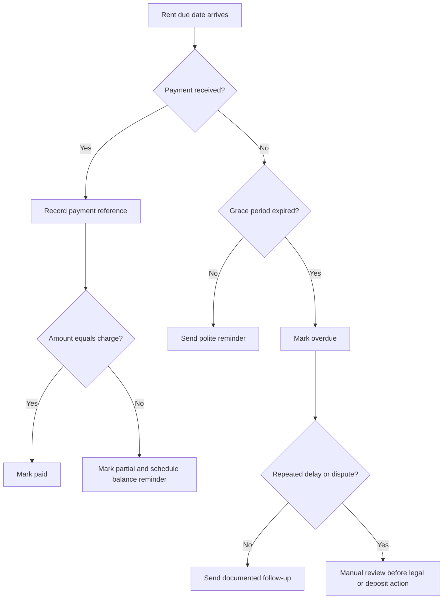
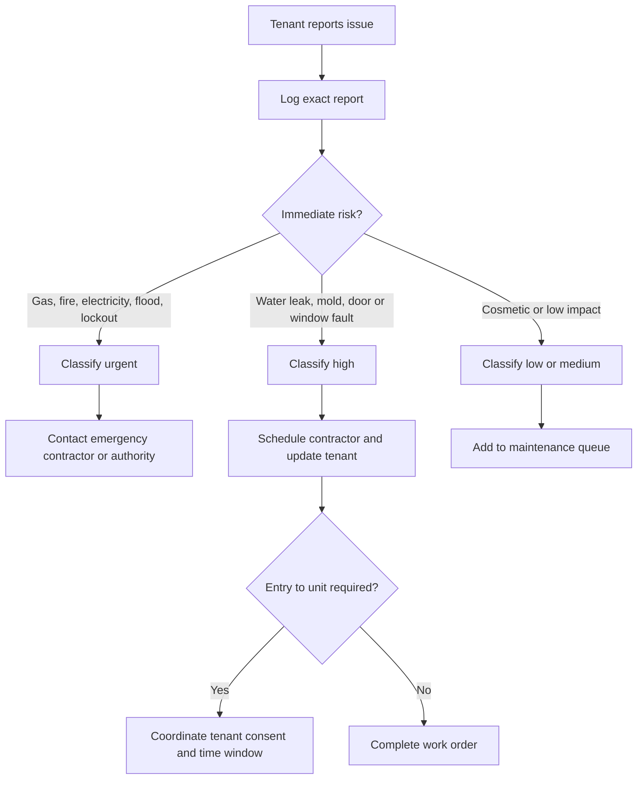
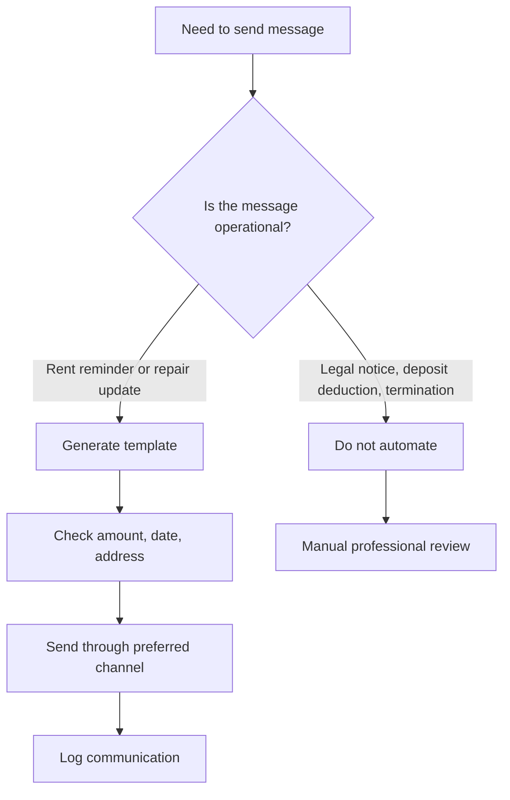

# Property-Management Scheduler

## Purpose

Coordinate recurring rent collection, maintenance triage, contractor follow-up, tenant communication, and accounting preparation for Israeli rental operations. Use the skill for a single apartment, a small portfolio, a coworking office, a family-owned property, or a freelancer who manages properties for others.

Use this package to:

1. Create a reliable operational calendar for rent, lease renewals, inspections, and repairs.
2. Convert tenant messages into prioritized maintenance tasks.
3. Generate tenant-facing reminders in clear Hebrew.
4. Prepare structured records for bookkeeping and tax review.
5. Keep a local JSON audit trail before connecting external systems.

This skill is not a substitute for legal, tax, insurance, or engineering advice. Escalate disputes, eviction matters, safety hazards, structural defects, and tax classification questions to qualified professionals.

## Inputs to collect

| Area | Required fields | Optional fields | Notes |
|---|---|---|---|
| Property | address, city | apartment, floor, arnona account, owner name | Keep the municipal account only if needed for internal reconciliation. |
| Tenant | full name, preferred channel | phone, email, last four digits of identity number | Store only partial identity information unless a lawful need exists. |
| Lease | start date, end date, monthly rent, due day | deposit, payment method, escalation note | Use DD/MM/YYYY in user-facing workflows. |
| Rent | due date, amount, payment status | transfer reference, partial payment, reminder count | Do not classify a deposit as rent. |
| Maintenance | title, description, property, severity, status | contractor, estimated cost, due date | Safety issues override normal scheduling. |
| Communication | channel, subject, body, scheduled date | related charge or task id | Keep neutral wording and preserve a record of notices. |


## Web-validated Israeli checkpoints

Use these as operational prompts, not as automatic tax or legal decisions. Validation date: 04/06/2026.

| Checkpoint | Current package reference | Required action |
|---|---|---|
| VAT | Standard VAT reference is 18% from 01/01/2025. | For commercial rent, keep the VAT flag and send records to approved accounting software. |
| Israel Invoices | Allocation-number review threshold is ₪10,000 before VAT from 01/01/2026 and ₪5,000 before VAT from 01/06/2026. | Flag relevant commercial B2B invoices for accountant review. |
| Residential rental income | 2026 exemption ceiling reference is ₪5,654 per month. | Export totals only; do not select the tax route. |
| Bank of Israel | Series API base uses `edge.boi.gov.il`. | Use representative rates only if the lease says to use them. |
| Privacy | Tenant contact and identity details can trigger privacy and data-security obligations. | Minimize data, restrict access, and check notice or database obligations before production. |
| Arnona | Arnona is a local-authority property tax. | Store account references only for internal matching. |

## Core operating principles

1. Record facts first. Avoid interpreting tenant intent before logging the message.
2. Separate money categories. Keep rent, deposits, reimbursements, repairs, and utilities apart.
3. Use a grace period only as an operational reminder rule. Do not treat it as legal advice.
4. Require manual review before legal notices, eviction-related messages, deposit deductions, or entry to a rented unit.
5. Use Hebrew for tenant communication unless the tenant requested another language.
6. Keep dates in DD/MM/YYYY for users and ISO dates inside JSON.
7. Keep the system local-first until privacy, consent, and access controls are approved.

## Quick workflow

```bash
pip install -e .
pip install -r requirements-dev.txt
property-management-scheduler property-add --address "הירקון 12" --city "תל אביב-יפו" --apartment "8" --store ./demo.json --env sandbox
```

```python
from property_management_scheduler import PropertyManagementScheduler

client = PropertyManagementScheduler("demo.json", environment="sandbox")
prop = client.create_property("הירקון 12", "תל אביב-יפו", "8")
tenant = client.add_tenant(prop["id"], "דנה כהן", email="dana@example.com")
lease = client.create_lease(prop["id"], tenant["id"], "01/01/2026", "31/12/2026", "5200", due_day=5)
charges = client.schedule_rent(lease["id"], "01/01/2026", months=12)
message = client.generate_tenant_message("rent_reminder", charge_id=charges[0]["id"])
```

## Decision tree: rent collection



## Decision tree: maintenance triage



## Decision tree: tenant communication



## Concrete scenarios

### New residential apartment

1. Create the property with address, city, apartment, and optional municipal account.
2. Add the tenant with preferred channel and validated contact details.
3. Create a lease with due day, monthly rent, deposit amount, and payment method.
4. Generate rent charges for 12 months.
5. Schedule a lease renewal check 60 days before end date.
6. Prepare a move-in inspection note outside the rent charge list.

### Late payment after partial transfer

1. Record the received amount as partial, not paid.
2. Keep the transfer reference.
3. Generate a balance reminder with the remaining amount manually calculated by bookkeeping if needed.
4. Avoid threats or penalty language unless the lease and applicable law allow it.
5. Escalate repeated delay to manual review.

### Urgent water leak

1. Create a maintenance task with the tenant report exactly as received.
2. Let the priority detector mark high or urgent.
3. Contact a contractor and record the status as scheduled.
4. Send the tenant an entry coordination message.
5. Store receipts and classify repair cost separately from rent.

### Commercial tenant with VAT considerations

1. Keep commercial rent separate from residential rent.
2. Flag whether the business is VAT-registered.
3. Prepare an accounting pack, but do not issue tax documents from the scheduler.
4. Check current bookkeeping and Israel Tax Authority requirements before issuing invoices or receipts.

## Edge cases

| Case | Correct handling |
|---|---|
| Due day is 31 | Reject or normalize before import; the client accepts 1 to 28 to avoid invalid months. |
| Tenant pays too much | Reject overpayment in the rent charge and log a separate reconciliation note. |
| Tenant pays part of the rent | Mark the charge as partial and keep the reference. |
| Lease ends mid-schedule | Stop generating charges after the lease end date. |
| Duplicate rent schedule | Skip existing charges unless overwrite is requested. |
| Tenant prefers phone | Log the call summary after the call. |
| Tenant reports danger | Treat safety as urgent even if the monthly calendar is full. |
| Contractor needs entry | Coordinate a time window and tenant consent. |
| Deposit deduction | Do not automate; require manual legal and accounting review. |
| Multiple owners | Use internal notes; avoid exposing owner disputes to tenants. |
| Tenant data request | Export only necessary records and verify identity before sharing. |

## Anti-patterns

Avoid these patterns:

1. Mixing deposits and rent in the same payment status.
2. Sending legal notices from an automated template.
3. Storing full identity numbers in a plain JSON file.
4. Using a single free-text note as the only operational record.
5. Calling a task completed before tenant confirmation or contractor evidence exists.
6. Treating a WhatsApp message as a bookkeeping document.
7. Scheduling entry to a rented apartment without coordination.
8. Sending payment reminders with incorrect dates or amounts.
9. Ignoring recurring small leaks because the tenant still pays on time.
10. Depending on local storage without backups.

## Troubleshooting summary

| Symptom | Likely cause | Fix |
|---|---|---|
| Import fails | Package not installed in editable mode | Run `pip install -e .` from package root. |
| CLI cannot find data | Wrong store path | Pass `--store ./demo.json` consistently. |
| Dates rejected | Wrong date format | Use DD/MM/YYYY, DD-MM-YYYY, or ISO in code. |
| Phone rejected | Non-Israeli format | Use 0501234567 or +972501234567. |
| Email tenant creation fails | Preferred channel is email and email is missing | Add email or change preferred channel. |
| Rent not generated | Lease ends before requested dates | Check lease end date. |
| Charge becomes overdue too early | Grace days too low | Configure `ClientConfig(payment_grace_days=...)`. |

## Production checklist

Before production use:

1. Install from a clean environment and run `pytest -q`.
2. Run `python -m compileall scripts/ -q`.
3. Define storage location, backup policy, and access permissions.
4. Document who may view tenant contact details.
5. Decide which messages require manual review.
6. Verify current Israeli tax and bookkeeping requirements.
7. Confirm the lawful basis for storing tenant personal data.
8. Confirm contractor approval flow and emergency contacts.
9. Test one full rent cycle in sandbox.
10. Export an accounting pack and review it with a professional.
11. Validate all templates in Hebrew before sending to tenants.
12. Keep a rollback copy before importing historical data.

## Output expectations

Produce structured JSON when running code examples. Keep tenant-facing messages neutral, specific, and free of threats. Include amount, due date, address or task title, and requested next action. Do not include hidden fees, legal conclusions, or unsupported claims.
