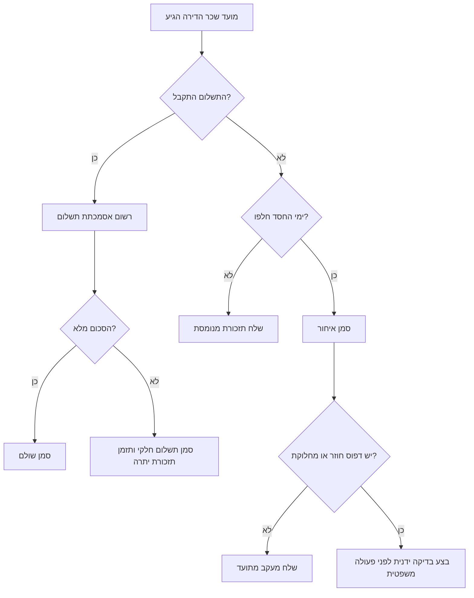
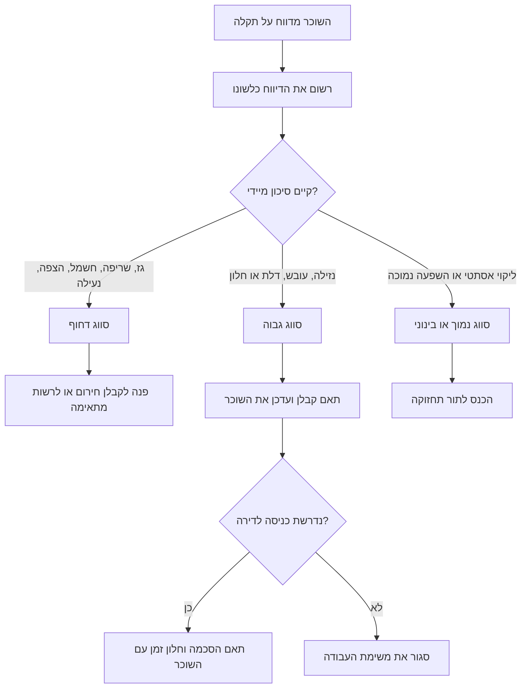

# מתזמן ניהול נכסים

## מטרה

תאם גביית שכר דירה, טיפול בתקלות, מעקב אחר קבלנים, תקשורת עם שוכרים והכנת חומר להנהלת חשבונות עבור משכירים ומנהלי נכסים בישראל. השתמש בכלי לדירה אחת, למספר דירות, למשרד קטן, לנכס משפחתי או לעוסק שמנהל נכסים עבור לקוחות.

השתמש בחבילה כדי:

1. להקים יומן תפעולי לשכר דירה, חידוש הסכם, בדיקות ותחזוקה.
2. להפוך פניות שוכרים למשימות תחזוקה עם עדיפות ברורה.
3. ליצור תזכורות בעברית לשוכרים.
4. להכין רשומות מסודרות לבדיקת הנהלת חשבונות ומיסוי.
5. לשמור נתוני תפעול בקובץ מקומי לפני חיבור למערכות חיצוניות.

הכלי אינו מחליף ייעוץ משפטי, ייעוץ מס, ייעוץ ביטוחי או בדיקת מהנדס. העבר מחלוקות, פינוי, סיכוני בטיחות, ליקויי מבנה ושאלות סיווג מס לבעל מקצוע מוסמך.

## נתונים לאיסוף

| תחום | חובה | רשות | הערות |
|---|---|---|---|
| נכס | כתובת, יישוב | מספר דירה, קומה, חשבון ארנונה, שם משכיר | שמור מספר חשבון עירוני רק לצורך התאמה פנימית. |
| שוכר | שם מלא, ערוץ מועדף | טלפון, דואר אלקטרוני, ארבע ספרות אחרונות של תעודת זהות | שמור מידע מזהה חלקי בלבד, אלא אם קיים צורך חוקי ברור. |
| הסכם שכירות | תאריך התחלה, תאריך סיום, שכר דירה חודשי, יום חיוב | פיקדון, אמצעי תשלום, הערת הצמדה | השתמש בפורמט 31/12/2026 במסכים ובהודעות. |
| גבייה | תאריך חיוב, סכום, סטטוס תשלום | אסמכתת העברה, תשלום חלקי, מספר תזכורות | אל תסווג פיקדון כשכר דירה. |
| תחזוקה | כותרת, תיאור, נכס, עדיפות, סטטוס | קבלן, עלות משוערת, תאריך יעד | תקלה מסוכנת קודמת ליומן הרגיל. |
| תקשורת | ערוץ, נושא, גוף הודעה, תאריך מתוזמן | מזהה חיוב או משימה | שמור ניסוח ענייני ותיעוד מלא. |


## נקודות בדיקה ישראליות שאומתו ברשת

השתמש בנקודות האלה כתזכורת תפעולית בלבד, ולא כהחלטת מס או ייעוץ משפטי. תאריך אימות: 04/06/2026.

| נושא | ערך עבודה נוכחי בחבילה | פעולה נדרשת |
|---|---|---|
| מע"מ | שיעור מע"מ רגיל הוא 18% החל מ-01/01/2025. | בשכירות מסחרית, שמור סימון מע"מ והעבר נתונים לתוכנת הנהלת חשבונות מאושרת. |
| חשבוניות ישראל | תקרת בדיקת מספר הקצאה היא ₪10,000 לפני מע"מ מ-01/01/2026 ו-₪5,000 לפני מע"מ מ-01/06/2026. | סמן חשבוניות מסחריות מתאימות לבדיקת מנהל חשבונות או רואה חשבון. |
| הכנסה משכירות למגורים | תקרת פטור חודשית לשנת 2026 היא ₪5,654. | יצא סכומים לבדיקה בלבד; אל תבחר מסלול מס עבור המשתמש. |
| בנק ישראל | בסיס ממשק מאגר הסדרות הוא `edge.boi.gov.il`. | השתמש בשער יציג רק אם ההסכם מפנה לכך במפורש. |
| פרטיות | פרטי קשר וזיהוי של שוכרים עלולים ליצור חובות פרטיות ואבטחת מידע. | צמצם מידע, הגבל הרשאות ובדוק חובת הודעה או רישום לפני שימוש ייצור. |
| ארנונה | ארנונה היא מס של הרשות המקומית. | שמור מספר חשבון רק לצורך התאמה פנימית. |

## עקרונות עבודה

1. רשום עובדות לפני פרשנות.
2. הפרד בין שכר דירה, פיקדון, החזר הוצאות, תיקונים ותשלומי שירותים.
3. השתמש בימי חסד ככלל תפעולי בלבד, לא כקביעה משפטית.
4. דרוש בדיקה ידנית לפני הודעה משפטית, פינוי, קיזוז פיקדון או כניסה לדירה מושכרת.
5. שלח הודעות בעברית, אלא אם השוכר ביקש שפה אחרת.
6. הצג תאריכים כ-31/12/2026 ושמור תאריכים פנימיים במבנה תקני.
7. שמור נתונים מקומית עד לאישור פרטיות, הרשאות וגיבוי.

## התחלה מהירה

```bash
pip install -e .
pip install -r requirements-dev.txt
property-management-scheduler property-add --address "הירקון 12" --city "תל אביב-יפו" --apartment "8" --store ./demo.json --env sandbox
```

```python
from property_management_scheduler import PropertyManagementScheduler

client = PropertyManagementScheduler("demo.json", environment="sandbox")
prop = client.create_property("הירקון 12", "תל אביב-יפו", "8")
tenant = client.add_tenant(prop["id"], "דנה כהן", email="dana@example.com")
lease = client.create_lease(prop["id"], tenant["id"], "01/01/2026", "31/12/2026", "5200", due_day=5)
charges = client.schedule_rent(lease["id"], "01/01/2026", months=12)
```

## עץ החלטה לגבייה



## עץ החלטה לתחזוקה



## תרחישים מעשיים

### דירה חדשה

1. צור נכס עם כתובת, יישוב, מספר דירה וחשבון ארנונה לפי צורך.
2. הוסף שוכר עם ערוץ מועדף ופרטי קשר תקינים.
3. צור הסכם עם יום חיוב, שכר דירה חודשי, פיקדון ואמצעי תשלום.
4. צור חיובי שכר דירה ל-12 חודשים.
5. תזמן בדיקת חידוש הסכם 60 יום לפני תאריך הסיום.
6. שמור פרוטוקול מסירה בנפרד מחיובי השכירות.

### תשלום חלקי

1. רשום את הסכום שהתקבל כתשלום חלקי.
2. שמור אסמכתת העברה.
3. שלח תזכורת יתרה לאחר בדיקת הסכום.
4. הימנע מלשון איום או קנס בלי בדיקה של ההסכם והדין.
5. העבר איחורים חוזרים לבדיקה ידנית.

### נזילה פעילה

1. פתח משימת תחזוקה עם תיאור השוכר.
2. סווג עדיפות גבוהה או דחופה לפי הסיכון.
3. פנה לקבלן ועדכן סטטוס לתואם.
4. שלח לשוכר בקשת תיאום כניסה לדירה.
5. שמור קבלה וסווג את העלות כתיקון, לא כהפחתת שכר דירה.

### נכס מסחרי

1. הפרד בין שכירות מסחרית לשכירות למגורים.
2. סמן האם העסק רשום למע"מ.
3. הכן קובץ נתונים להנהלת חשבונות.
4. בדוק דרישות עדכניות של רשות המסים לפני הפקת מסמכים.

## מקרי קצה

| מקרה | טיפול נכון |
|---|---|
| יום חיוב 31 | דחה את הערך או תקן לפני יבוא; הלקוח מקבל 1 עד 28. |
| תשלום יתר | דחה את התשלום בחיוב הקיים ורשום התאמה נפרדת. |
| תשלום חלקי | סמן חלקי ושמור אסמכתה. |
| ההסכם מסתיים באמצע התקופה | עצור יצירת חיובים אחרי תאריך הסיום. |
| יצירת חיובים כפולה | דלג על חיובים קיימים, אלא אם נבחרה דריסה. |
| השוכר מעדיף שיחה | רשום סיכום שיחה לאחר השיחה. |
| דיווח על סכנה | סווג דחוף גם אם היומן עמוס. |
| קבלן צריך להיכנס לדירה | תאם חלון זמן והסכמה עם השוכר. |
| קיזוז פיקדון | אל תאוטמט; דרוש בדיקה משפטית וחשבונאית. |
| כמה משכירים | שמור הערות פנימיות ואל תחשוף מחלוקת לשוכר. |
| בקשת מידע מצד שוכר | מסור רק מידע נדרש ולאחר אימות זהות. |

## דפוסים שיש להימנע מהם

1. ערבוב פיקדון ושכר דירה באותו סטטוס.
2. שליחת הודעה משפטית מתבנית אוטומטית.
3. שמירת מספר תעודת זהות מלא בקובץ מקומי לא מוגן.
4. ניהול כל הפעילות בהערה חופשית אחת.
5. סימון משימה כהושלמה ללא אישור או אסמכתה.
6. התייחסות להודעת מסרון כמסמך הנהלת חשבונות.
7. תיאום כניסה לדירה בלי הסכמת השוכר.
8. שליחת תזכורת עם תאריך או סכום שגויים.
9. התעלמות מנזילות קטנות וחוזרות.
10. עבודה ללא גיבוי לקובץ הנתונים.

## פתרון תקלות קצר

| תסמין | סיבה סבירה | תיקון |
|---|---|---|
| היבוא נכשל | החבילה לא הותקנה במצב עריכה | הרץ `pip install -e .` מתיקיית החבילה. |
| שורת הפקודה לא מוצאת נתונים | נתיב קובץ שגוי | השתמש באותו `--store` בכל פקודה. |
| תאריך נדחה | פורמט לא תקין | השתמש ב-31/12/2026 או 31-12-2026. |
| טלפון נדחה | מבנה ישראלי לא תקין | השתמש ב-0501234567 או +972501234567. |
| יצירת שוכר נכשלת | נבחר דואר אלקטרוני בלי כתובת | הוסף כתובת או שנה ערוץ. |
| חיובים לא נוצרים | תאריך סיום ההסכם מוקדם מדי | בדוק את תאריך הסיום. |
| חיוב מסומן באיחור מוקדם מדי | ימי החסד נמוכים | הגדר מספר ימי חסד מתאים. |

## רשימת בדיקה לפני שימוש שוטף

1. התקן בסביבה נקייה והריץ `pytest -q`.
2. הרץ `python -m compileall scripts/ -q`.
3. קבע נתיב אחסון, מדיניות גיבוי והרשאות גישה.
4. תעד מי רשאי לראות פרטי קשר של שוכרים.
5. קבע אילו הודעות דורשות בדיקה ידנית.
6. בדוק דרישות מס והנהלת חשבונות עדכניות בישראל.
7. ודא בסיס חוקי לשמירת מידע אישי של שוכרים.
8. אשר רשימת קבלנים ותהליך חירום.
9. בדוק מחזור גבייה מלא בסביבת ניסוי.
10. הפק חבילת נתונים להנהלת חשבונות ובדוק אותה עם בעל מקצוע.
11. בדוק את כל התבניות בעברית לפני שליחה.
12. שמור עותק חזרה לפני יבוא נתונים היסטוריים.

## ציפיות פלט

הפק פלט מובנה במבנה JSON בעת הרצת דוגמאות. שמור על הודעות ענייניות לשוכר, עם סכום, תאריך, כתובת או כותרת תקלה ופעולה נדרשת. אל תוסיף קנסות, מסקנות משפטיות או טענות שלא נבדקו.
