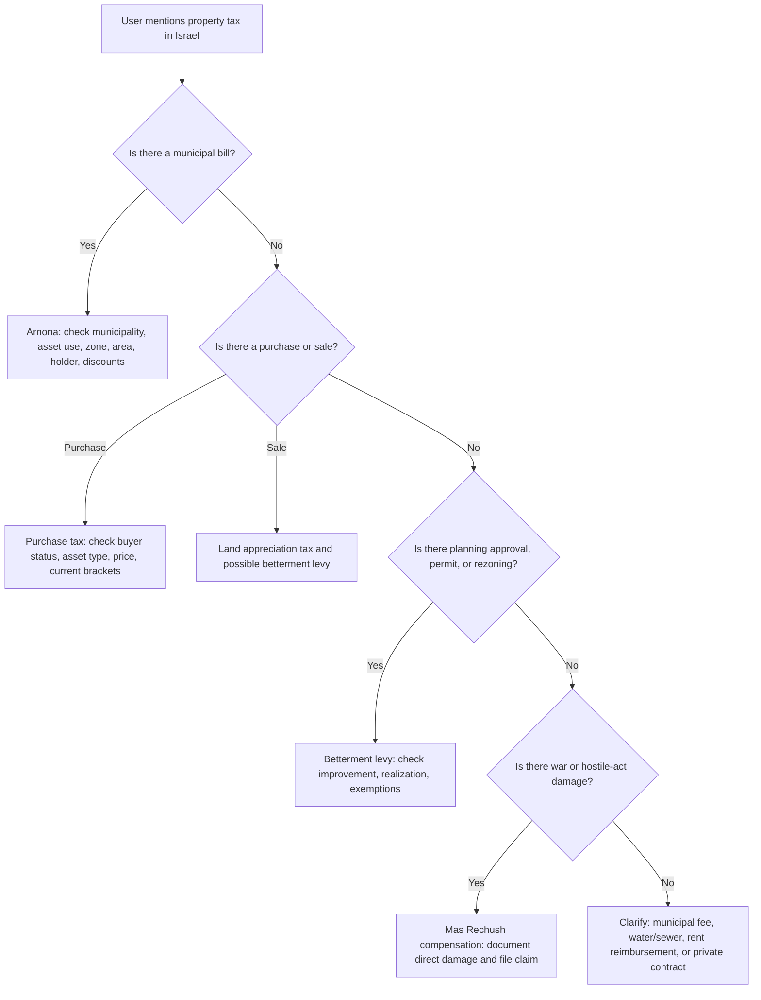
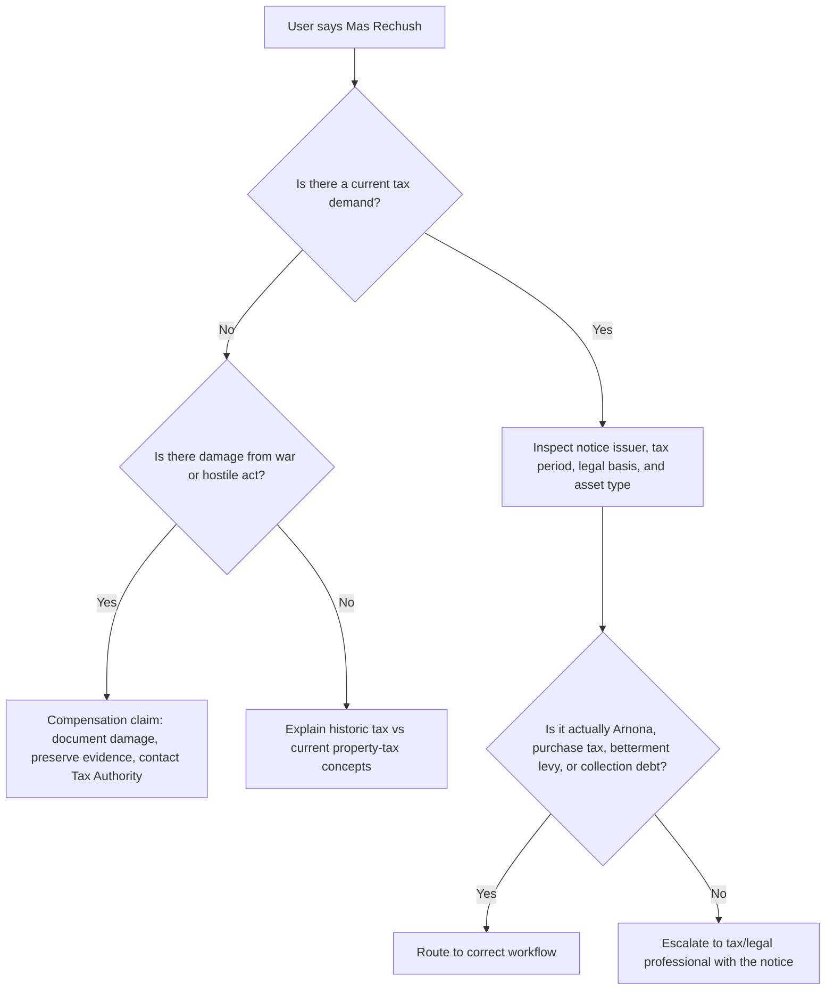
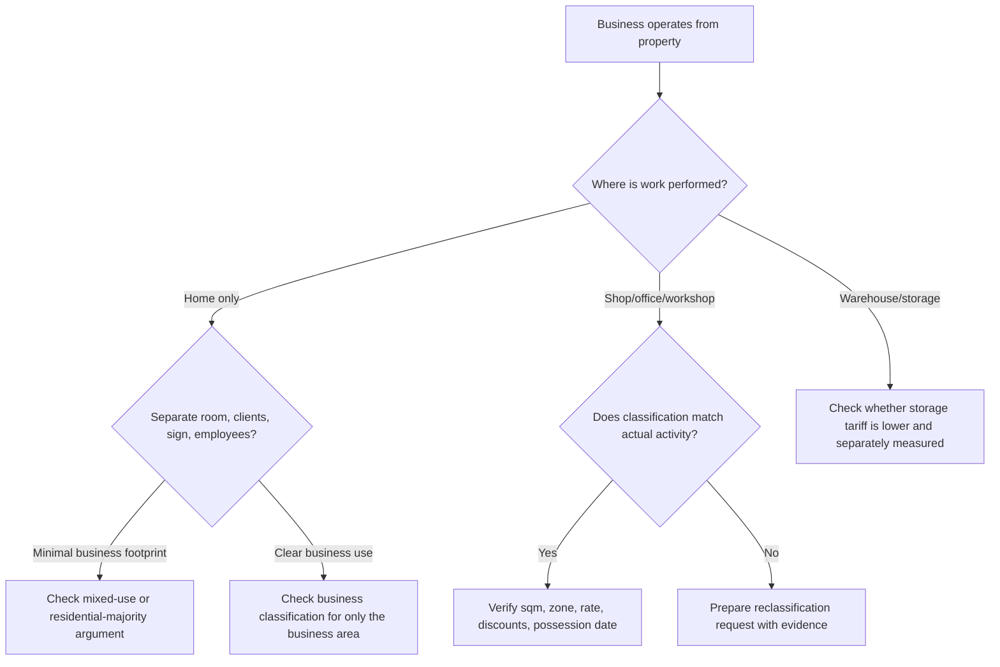

# Property Tax Advisor

## Purpose

Guide Israeli consumers, freelancers, and small businesses through recurring and transaction-based property taxes. Focus on practical next actions: estimate exposure, identify the authority in charge, gather evidence, prepare questions, and build an appeal or application packet.

Cover these subjects:

- **Arnona / ארנונה כללית**: annual municipal property tax, billed by the local authority, usually in two-month instalments.
- **Mas Rechush / מס רכוש**: distinguish the historic property tax from the still-relevant Property Tax and Compensation Fund framework, especially claims for direct damage caused by war or hostile acts.
- **Purchase tax / מס רכישה**: Israel Tax Authority tax paid by a buyer when purchasing real estate rights.
- **Land appreciation tax / מס שבח**: Israel Tax Authority capital-gains tax paid by a seller, subject to exemptions and computations.
- **Betterment levy / היטל השבחה**: local planning-committee levy, commonly 50% of planning betterment, triggered by sale, building permit, or realization.
- **Municipal fees and adjacent charges**: sign tax, business license fees, development levies, water/sewer fees, and municipal enforcement charges when they appear on the same payment workflow.

Use cautious language. Israeli property tax depends on annual municipal orders, current Tax Authority brackets, changing regulations, local bylaws, asset-specific measurement rules, and personal eligibility. Treat built-in rates and examples as training aids unless verified against the current official source.

## Fast triage

Ask for the minimum facts needed to route the user:

| Question | Why it matters | Example answer |
|---|---|---|
| Which authority issued the bill or notice? | Determines procedure and deadline | Tel Aviv-Yafo Municipality, Israel Tax Authority, Local Planning Committee |
| What is the asset? | Rates and exemptions depend on asset type | Apartment, office, store, warehouse, clinic, home office |
| What happened? | Different taxes are triggered by ownership, transaction, improvement, damage, or use | New Arnona bill, purchase contract, sale, building permit, war damage |
| What date appears on the notice? | Deadlines can be short | 15/03/2026 |
| What area/classification/zone is used? | Most Arnona disputes start here | 92 sqm gross, business classification, Zone A |
| What supporting documents exist? | Determines evidence strength | Lease, floor plan, municipal measurement, photos, business license, disability certificate |

## Authority map

| Topic | Main authority | Typical document | Typical action |
|---|---|---|---|
| Arnona | Municipality or local council | Arnona bill, annual municipal Arnona order | Verify classification, area, zone, holder, discount, vacancy status |
| Arnona appeal | Municipal Arnona manager, then Appeals Committee | Objection / השגה, appeal / ערר | File by statutory deadline with evidence |
| Purchase tax | Israel Tax Authority, Real Estate Taxation | Tax assessment, declaration, payment voucher | Validate buyer status, brackets, exemptions, deadlines |
| Mas Rechush compensation | Israel Tax Authority Property Tax and Compensation Fund | Damage claim, appraiser report | Document direct damage and submit claim |
| Betterment levy | Local Planning and Building Committee | Levy assessment, appraiser assessment | Check triggering event, valuation date, exemption, counter-appraisal |
| Sign tax/business license | Municipality | Business charge, license notice | Verify local bylaw, sign dimensions, business category |

## Core rule: identify the taxable event



## Arnona workflow

### Step 1: Extract fields from the bill

Capture these fields exactly:

- Local authority name.
- Account number and property number.
- Holder name and holding period.
- Address and floor.
- Asset classification, such as residential, office, commerce, industry, warehouse, workshop, clinic, parking, vacant property, or construction site.
- Zone or tariff area.
- Taxable area in sqm.
- Annual rate per sqm.
- Billing period and due date.
- Discounts, credits, arrears, interest, linkage, and collection fees.

### Step 2: Compare against the annual Arnona order

Every local authority publishes an annual **צו ארנונה**. Use the current order, not a prior-year copy. Check:

1. Asset-use definitions.
2. Zone map or street table.
3. Measurement method: gross area, net area, walls, shared areas, balconies, parking, storage, galleries, roofs, yards.
4. Minimum and maximum rates allowed by national arrangements regulations.
5. Special categories for banks, insurance companies, supermarkets, clinics, industry, workshops, software offices, warehouses, and nonprofits.
6. Discount rules and application deadlines.

### Step 3: Recompute the bill

```text
annual charge = taxable sqm × annual rate per sqm
period charge = annual charge × billed months ÷ 12
discounted charge = period charge - eligible discount
```

For capped discounts, apply the discount only to the eligible area and period.

**Example: consumer apartment**

- Municipality: Jerusalem.
- Area billed: 78 sqm.
- Residential Zone B sample rate: ₪82 per sqm per year.
- Annual estimate: 78 × 82 = ₪6,396.
- Two-month bill: 6,396 × 2 / 12 = ₪1,066.
- If a 30% senior discount applies to all 78 sqm for the period: ₪1,066 × 30% = ₪319.80 discount; estimated bill ₪746.20.

**Example: freelancer home office**

A graphic designer works from one room in a rented apartment. The municipality charges the entire 72 sqm apartment as office use at ₪320 per sqm. Check:

- Does the Arnona order classify a small internal professional room differently from a full office?
- Does the lease allow business use?
- Does signage, customer traffic, employees, separate entrance, or business license evidence support business classification?
- Is only a defined part of the apartment used for work?
- Has the municipality issued a measurement or inspection report?

A reasonable objection may request residential classification for most of the apartment and business classification only for the dedicated work area, depending on local law and facts.

**Example: small store**

A 45 sqm street-level store receives a bill as “restaurant” because the prior tenant operated a café. The new tenant sells phone accessories and has no food preparation. Evidence should include lease, photos, business license category, invoices, floor plan, and a dated possession handover. Ask for correction from the possession date and credit for overbilling.

### Step 4: Find likely defects

| Issue | Typical evidence | Typical remedy |
|---|---|---|
| Wrong holder | Lease, sale deed, handover protocol | Update holder and reverse post-handover charges |
| Wrong area | Floor plan, appraiser measurement, municipal survey | Correct sqm prospectively and sometimes retroactively |
| Wrong use | Photos, business license, invoices, lease | Reclassify from incorrect use category |
| Wrong zone | Street table, zoning map, municipal GIS | Apply correct tariff area |
| Double billing | Two accounts for same area | Cancel duplicate account |
| Vacancy | Photos, utility data, no furniture/equipment, possession documents | Apply vacant-property exemption if local criteria met |
| Discount missing | Eligibility certificate, income documents | Apply discount from permitted effective date |
| New construction not ready | Form 4, occupancy evidence, utility connection status | Challenge commencement date |

## Arnona objection and appeal path

Use the local authority procedure. In general:

1. File an **objection / השגה** to the Arnona manager within the statutory period shown in the law or notice.
2. Attach concise evidence and a table showing the disputed fields.
3. Request a written decision.
4. If rejected or unanswered within the relevant period, consider an **appeal / ערר** to the Arnona Appeals Committee.
5. For legal or constitutional issues outside the committee’s jurisdiction, consider legal advice on an administrative petition.

Do not frame every disagreement as “unfair.” Arnona committees decide defined grounds: identity of holder, asset type, area, classification, location, exemption/discount application, and similar statutory issues.

## Mas Rechush in modern practice

Do not describe Mas Rechush as a normal annual tax currently charged on every apartment. In common modern practice, the **Property Tax and Compensation Fund Law** is most relevant to claims for direct damage caused by war, hostile acts, or specified security events.

**2026 vacant-land caution:** Treat any claim that a 1.5% annual Mas Rechush on vacant land is already in force as requiring fresh official verification. Government and Knesset materials in early 2026 discussed a proposed vacant-land tax, but the package must not calculate it as current law unless the user has an enacted provision, an official assessment, or a Tax Authority notice.



### Direct-damage claim checklist

- Photograph damage before repair when safe.
- Keep emergency repair invoices.
- Record date, location, and incident details.
- Preserve police, Home Front Command, fire service, or municipal confirmations.
- Obtain ownership or tenancy documents.
- Avoid disposing of damaged items before inspection unless necessary for safety.
- Submit through the official Tax Authority claim route and track the claim number.

## Purchase tax workflow

Purchase tax depends on current statutory brackets and buyer status. Use official current brackets for production calculations.

Collect:

- Contract date.
- Asset type: residential apartment, land, commercial unit, right in real estate association.
- Purchase price and linked payments.
- Buyer status: Israeli resident, foreign resident, new immigrant, disabled person, additional apartment owner, replacement apartment.
- Family unit facts: spouse, minor children, existing property shares.
- Intended sale date of old apartment for replacement-home rules.
- Exemptions or reliefs.

### Example: additional apartment

A freelancer buys a second apartment for ₪2,400,000 while keeping an existing apartment. Treat as an additional residential apartment unless a replacement-home rule applies. Use current Israel Tax Authority brackets. Ask whether the existing apartment will be sold within the permitted period and whether the buyer owns only a partial share.

### Production rule

Never rely on bundled sample brackets for a final purchase-tax filing. Pull current brackets from the Israel Tax Authority and document the source date.

## Land appreciation tax and betterment levy

A property sale can trigger both:

- **Mas Shevach / מס שבח**: national real-estate capital gains tax handled by the Israel Tax Authority.
- **Hetel Hashbacha / היטל השבחה**: local planning levy handled by the local planning committee.

These are separate. A seller can owe one, both, or neither.

### Betterment levy quick estimate

```text
potential levy = planning-value uplift × 50%
```

Then check exemptions, previous payments, limitation issues, valuation date, partial rights, and whether a taxable “realization” occurred.

**Example: homeowner selling after a zoning improvement**

A homeowner sells a house after a plan added building rights. The local committee claims the plan increased value by ₪300,000. Rough levy exposure is ₪150,000 before exemptions, appraiser disputes, and linkage. A counter-appraisal may be justified if the uplift is inflated or rights are unusable.

## Decision tree for small businesses and freelancers



## Edge cases

### Property split between uses

A single asset may contain office, warehouse, production, showroom, parking, and yard. Request split classification only if the areas are physically and functionally distinct and the municipal order allows it. Provide a marked floor plan.

### Shared workspaces

Coworking operators may be billed as one commercial holder, while members pay contractually. A freelancer receiving a reimbursement request from the operator should check the contract rather than filing an Arnona objection directly, unless named as municipal holder.

### Short-term rental

Municipalities may classify intensive short-term rental differently from ordinary residential use. Check local policy, frequency, licensing, and actual use.

### Vacant or unusable property

Vacancy exemptions are usually limited and conditional. An unfurnished apartment may qualify; a property under renovation may need proof of unusability. A property merely not profitable usually does not qualify.

### Measurement disputes in towers

Gross measurement may include internal walls, external walls, balconies, storage, and a share of common areas if the local order allows it. Compare the municipal method to the order before claiming “Tabu area is lower.”

### Nonprofit or synagogue

Discounts or exemptions depend on registration, activity, public benefit, use of premises, and municipal approval. Do not assume automatic exemption.

### New immigrant, disability, senior, low-income discounts

Eligibility is usually personal, document-based, capped by area, and often limited to a primary residence. Check whether the benefit applies from application date, eligibility date, or start of the calendar year.

### Business sign charge

Signage can create a separate municipal charge. Measure the sign, verify whether temporary signs, window stickers, illuminated signs, or shared signs are covered by the bylaw.

## Anti-patterns

Avoid these mistakes:

- Using last year’s Arnona order for the current bill.
- Comparing Tel Aviv rates to Haifa rates without checking local classifications.
- Assuming Tabu area equals Arnona area.
- Treating every home-based freelance activity as full commercial use.
- Ignoring the statutory objection deadline.
- Filing emotional complaints without evidence.
- Asking for a discount without submitting the official form and required documents.
- Assuming Mas Rechush is an ordinary annual homeowner tax.
- Mixing betterment levy with purchase tax.
- Giving final legal advice on exemptions without current official rates and documents.
- Relying on sample rates embedded in helper scripts for payment.

## Troubleshooting prompts

Use targeted follow-up questions:

- “Upload or paste the bill fields: municipality, property type, area, zone, rate, period, and due date.”
- “State whether the property is owned, rented, vacant, under renovation, or used by a business.”
- “List the actual activities in the property and approximate sqm for each activity.”
- “Provide the contract date and buyer status for purchase tax.”
- “Provide the plan number, committee assessment, and triggering event for betterment levy.”
- “For damage claims, state the incident date, address, damage type, and whether an official inspection occurred.”

## Output templates

### Arnona estimate

```text
Estimated Arnona
Municipality:
Property use:
Zone:
Taxable area:
Annual rate used:
Billing period:
Estimated annual charge:
Estimated period charge:
Discount assumed:
Estimated payable:
Key assumptions:
Documents to verify:
Next action:
```

### Objection summary

```text
Subject: Objection to Arnona assessment for property [number/address]

Disputed field:
Current municipal position:
Requested correction:
Facts:
Evidence attached:
Calculation impact:
Requested effective date:
Contact details:
```

### Purchase-tax summary

```text
Purchase tax triage
Contract date:
Asset type:
Price:
Buyer status:
Existing property interests:
Potential relief:
Current bracket source required:
Estimated exposure:
Filing/payment deadline to verify:
```

### Mas Rechush compensation summary

```text
Damage claim triage
Incident date:
Address:
Damage type:
Safety status:
Evidence preserved:
Ownership/holding proof:
Insurer involved:
Official claim route:
Missing documents:
```

## Production checklist

Before presenting a final answer:

- Verify the official current source: municipal Arnona order, Tax Authority bracket page, local planning committee assessment, or formal notice.
- State the source date.
- Separate facts from assumptions.
- Show the calculation formula.
- Flag missing documents.
- Identify the responsible authority.
- Mention relevant deadline risk.
- Avoid guaranteeing eligibility.
- Recommend professional review for high-value transactions, litigation, exemptions, or unclear notices.
- Provide a practical next step: pay under protest, file objection, request measurement, submit discount form, request appraiser review, or contact the official claim route.

## Related files

- `references/api-reference.md`: regulatory and service reference.
- `references/workflow-guide.md`: end-to-end workflows.
- `references/troubleshooting.md`: issue diagnosis and fixes.
- `references/test-scenarios.md`: concrete scenarios.
- `references/migration-checklist.md`: migration from older Arnona-only skills.
- `property_tax_advisor/client.py`: typed calculation and workflow helper.
- `scripts/property-tax-advisor-cli.py`: command-line interface.

## Disclaimer / הבהרה

This skill is a preparation and automation aid only. It does not constitute tax, legal, financial, or other professional advice, and its output must be reviewed by a licensed professional (רו"ח / עו"ד / יועץ מס) before any filing, payment, or contractual use.

כלי זה מהווה שכבת הכנה ואוטומציה בלבד. אין בו ייעוץ מס, ייעוץ משפטי או ייעוץ מקצועי אחר, ויש לאמת כל פלט מול בעל מקצוע מורשה לפני הגשה, תשלום או שימוש חוזי.
