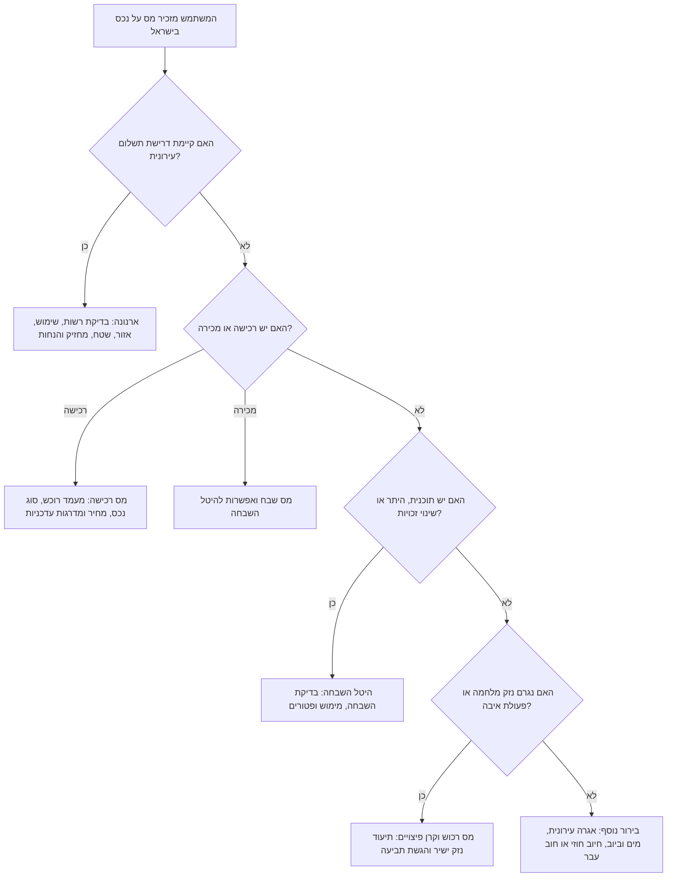
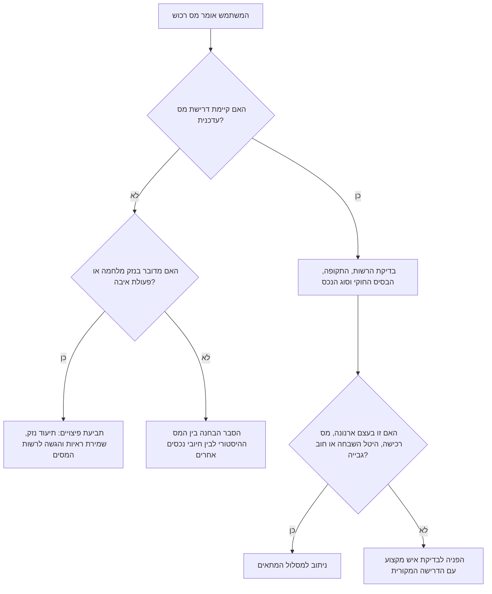
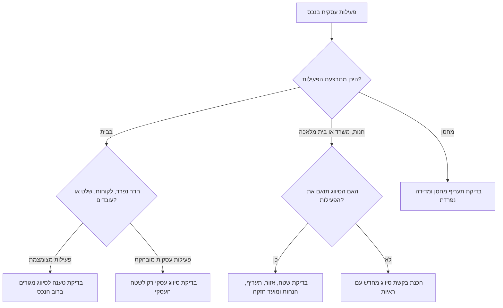

# יועץ מסי נכסים בישראל

## מטרה

להנחות צרכנים, עצמאים ועסקים קטנים בישראל בהתמודדות עם חיובי מסי נכסים וחיובים עירוניים. יש להתמקד בפעולות מעשיות: אומדן חשיפה, זיהוי הרשות המטפלת, איסוף ראיות, הכנת שאלות, ובניית תיק מסודר להגשה, השגה או ערר.

הכיסוי כולל:

- **ארנונה כללית**: מס מוניציפלי שנתי שמוטל על מחזיק בנכס, בדרך כלל בחיובים דו-חודשיים.
- **מס רכוש**: הבחנה בין המס ההיסטורי לבין המסגרת הפעילה של חוק מס רכוש וקרן פיצויים, בעיקר בתביעות נזק ישיר עקב מלחמה או פעולת איבה.
- **מס רכישה**: מס של רשות המסים החל על רוכש זכות במקרקעין.
- **מס שבח**: מס רווח הון במכירת זכות במקרקעין, בכפוף לחישוב, פטורים והקלות.
- **היטל השבחה**: היטל של הוועדה המקומית לתכנון ובנייה, בדרך כלל 50% מההשבחה התכנונית, בעת מימוש זכויות.
- **חיובים עירוניים נלווים**: אגרת שילוט, רישוי עסקים, היטלי פיתוח, מים וביוב, אכיפה וריבית פיגורים.

יש לנסח בזהירות. מסי נכסים בישראל תלויים בצווי ארנונה שנתיים, מדרגות מס עדכניות, תקנות משתנות, חוקי עזר מקומיים, שיטות מדידה מקומיות ונתונים אישיים. תעריפים ודוגמאות מובנים בכלי העזר מיועדים להמחשה בלבד אלא אם אומתו מול מקור רשמי עדכני.

## מיון מהיר

אסוף תחילה את הפרטים המינימליים:

| שאלה | למה זה חשוב | דוגמה |
|---|---|---|
| איזו רשות שלחה את הדרישה? | קובע את ההליך ואת המועד | עיריית תל אביב-יפו, רשות המסים, הוועדה המקומית |
| מה סוג הנכס? | שיעור המס והפטורים תלויים בסוג הנכס | דירה, משרד, חנות, מחסן, קליניקה, חדר עבודה בבית |
| מה קרה בפועל? | אירוע המס נקבע לפי החזקה, עסקה, השבחה, נזק או שימוש | חשבון ארנונה חדש, חוזה רכישה, מכירה, היתר בנייה, נזק מלחמה |
| מה התאריך שמופיע בדרישה? | מועדים עלולים להיות קצרים | 15/03/2026 |
| איזה שטח, סיווג ואזור מופיעים? | רוב מחלוקות הארנונה מתחילות כאן | 92 מ״ר ברוטו, סיווג עסק, אזור א׳ |
| אילו מסמכים קיימים? | קובע את חוזק הטענה | חוזה שכירות, תשריט, מדידת עירייה, תמונות, רישיון עסק, אישור נכות |

## מפת רשויות

| נושא | רשות מטפלת | מסמך אופייני | פעולה אופיינית |
|---|---|---|---|
| ארנונה | עירייה, מועצה מקומית או מועצה אזורית | חשבון ארנונה, צו ארנונה שנתי | בדיקת סיווג, שטח, אזור, מחזיק, הנחה ופטור נכס ריק |
| השגה וערר בארנונה | מנהל הארנונה ולאחר מכן ועדת ערר | השגה, החלטה, ערר | הגשה במועד עם ראיות |
| מס רכישה | רשות המסים, מיסוי מקרקעין | שומה, הצהרה, שובר תשלום | בדיקת מעמד רוכש, מדרגות, פטורים ומועדים |
| מס רכוש וקרן פיצויים | רשות המסים | תביעת נזק, דוח שמאי | תיעוד נזק ישיר והגשת תביעה |
| היטל השבחה | ועדה מקומית לתכנון ובנייה | שומת היטל, שומת שמאי מכריע או נגדית | בדיקת אירוע מימוש, מועד קובע ופטורים |
| אגרת שילוט ורישוי עסקים | רשות מקומית | דרישת תשלום, הודעת רישוי | בדיקת חוק עזר, שטח שילוט וסוג עסק |

## כלל יסוד: לזהות את אירוע המס



## תהליך עבודה בארנונה

### שלב 1: חילוץ שדות מהחשבון

רשום במדויק:

- שם הרשות המקומית.
- מספר חשבון ומספר נכס.
- שם המחזיק ותקופת ההחזקה.
- כתובת, קומה ותיאור הנכס.
- סיווג הנכס: מגורים, משרד, מסחר, תעשייה, מחסן, מלאכה, קליניקה, חניה, נכס ריק, קרקע תפוסה ועוד.
- אזור או אזור תעריף.
- שטח לחיוב במ״ר.
- תעריף שנתי למ״ר.
- תקופת החיוב ותאריך לתשלום.
- הנחות, זיכויים, יתרות חוב, ריבית, הצמדה והוצאות גבייה.

### שלב 2: השוואה לצו הארנונה השנתי

כל רשות מפרסמת **צו ארנונה**. יש להשתמש בצו של שנת החיוב. בדוק:

1. הגדרות שימוש בנכס.
2. מפת אזורים או טבלת רחובות.
3. שיטת מדידה: ברוטו, נטו, קירות, שטחים משותפים, מרפסות, מחסנים, גלריות, גגות, חצרות וחניות.
4. תעריפי מינימום ומקסימום לפי תקנות ההסדרים.
5. סיווגים מיוחדים לבנקים, חברות ביטוח, מרכולים, קליניקות, תעשייה, בתי מלאכה, משרדי תוכנה, מחסנים ועמותות.
6. כללי הנחות ומועדי הגשה.

### שלב 3: חישוב ביקורת

```text
חיוב שנתי = שטח לחיוב × תעריף שנתי למ״ר
חיוב לתקופה = חיוב שנתי × מספר חודשי החיוב ÷ 12
חיוב לאחר הנחה = חיוב לתקופה פחות ההנחה המוכרת
```

בהנחות המוגבלות בשטח או בזמן, יש להחיל את ההנחה רק על השטח והתקופה הזכאים.

**דוגמה: דירת מגורים**

- רשות: ירושלים.
- שטח לחיוב: 78 מ״ר.
- תעריף מגורים לדוגמה באזור ב׳: ₪82 למ״ר לשנה.
- אומדן שנתי: 78 × 82 = ₪6,396.
- חשבון דו-חודשי: 6,396 × 2 ÷ 12 = ₪1,066.
- אם קיימת הנחת אזרח ותיק בשיעור 30% לכל השטח: הנחה ₪319.80; אומדן לתשלום ₪746.20.

**דוגמה: עצמאי שעובד מהבית**

מעצבת גרפית עובדת מחדר אחד בדירה שכורה. העירייה מחייבת את כל הדירה, 72 מ״ר, כסיווג משרד בתעריף ₪320 למ״ר. בדוק:

- האם צו הארנונה מבחין בין חדר עבודה קטן בתוך דירת מגורים לבין משרד מלא?
- האם חוזה השכירות מאפשר שימוש עסקי?
- האם קיימים שלט, קבלת קהל, עובדים, כניסה נפרדת או רישיון עסק?
- האם רק חלק מוגדר מהדירה משמש לעבודה?
- האם העירייה ביצעה מדידה או ביקורת בפועל?

בנסיבות מתאימות אפשר לבקש סיווג מגורים לרוב הדירה וסיווג עסקי רק לחדר העבודה, בכפוף לצו המקומי ולעובדות.

**דוגמה: עסק קטן**

חנות אביזרי טלפון בשטח 45 מ״ר מחויבת כ״מסעדה״ משום שהשוכר הקודם הפעיל בית קפה. צרף חוזה שכירות, תמונות, רישיון עסק או בקשה לרישיון, חשבוניות, תשריט ופרוטוקול מסירה, ולבקש תיקון ממועד קבלת החזקה.

### שלב 4: איתור טעויות נפוצות

| תקלה | ראיות אופייניות | תיקון מבוקש |
|---|---|---|
| מחזיק שגוי | חוזה שכירות, הסכם מכר, פרוטוקול מסירה | עדכון מחזיק וביטול חיובים לאחר המסירה |
| שטח שגוי | תשריט, מדידת שמאי, מדידת עירייה | תיקון שטח ולעיתים זיכוי רטרואקטיבי |
| סיווג שגוי | תמונות, רישיון עסק, חשבוניות, חוזה | סיווג לפי שימוש אמיתי |
| אזור שגוי | טבלת רחובות, מפת אזורים, GIS עירוני | החלת אזור תעריף נכון |
| חיוב כפול | שני מספרי נכס לאותו שטח | ביטול חשבון כפול |
| נכס ריק | תמונות, צריכת חשמל ומים נמוכה, היעדר ציוד | פטור נכס ריק אם מתקיימים התנאים |
| הנחה חסרה | אישורי זכאות, מסמכי הכנסה | החלת הנחה מהמועד המותר |
| נכס חדש לא ראוי לשימוש | טופס 4, חיבורי תשתית, ראיות אכלוס | תיקון מועד תחילת חיוב |

## השגה וערר בארנונה

המסלול המקובל:

1. הגשת **השגה** למנהל הארנונה במועד הקבוע בדין או בדרישת התשלום.
2. צירוף ראיות קצרות וברורות וטבלת שדות במחלוקת.
3. בקשת החלטה בכתב.
4. לאחר דחייה או היעדר תשובה במועד, שקילת **ערר** לוועדת הערר.
5. בסוגיות משפטיות שאינן בסמכות ועדת הערר, יש לשקול ייעוץ משפטי לגבי עתירה מנהלית.

אין להסתפק בטענה כללית שהחיוב “לא הוגן”. ועדות ערר בוחנות עילות מוגדרות: זהות מחזיק, סוג נכס, שטח, סיווג, מיקום, פטור, הנחה וכדומה.

## מס רכוש כיום

אין להציג את מס רכוש כמס שנתי רגיל שמוטל כיום על כל דירה. בשימוש מעשי עדכני, **חוק מס רכוש וקרן פיצויים** רלוונטי בעיקר לתביעות פיצוי בגין נזק ישיר שנגרם עקב מלחמה, פעולת איבה או אירוע ביטחוני מוכר.

**זהירות לגבי קרקע פנויה בשנת 2026:** יש להתייחס בזהירות לטענה שמס רכוש שנתי בשיעור 1.5% על קרקע פנויה כבר חל. מסמכי ממשלה וכנסת בתחילת 2026 עסקו בהצעה, אך אין לחשב חיוב כזה כחוק תקף בלי הוראה שנחקקה, שומה רשמית או דרישת רשות המסים.



### רשימת בדיקה לנזק ישיר

- לצלם את הנזק לפני תיקון, אם הדבר בטוח.
- לשמור חשבוניות תיקון חירום.
- לרשום תאריך, כתובת ופרטי אירוע.
- לשמור אישורי משטרה, פיקוד העורף, כבאות או רשות מקומית.
- לצרף מסמכי בעלות או שכירות.
- לא לפנות ציוד פגום לפני בדיקה, אלא אם יש צורך בטיחותי.
- להגיש במסלול הרשמי של רשות המסים ולשמור מספר תביעה.

## מס רכישה

מס רכישה תלוי במדרגות עדכניות ובמעמד הרוכש. לחישוב סופי יש להשתמש בפרסומי רשות המסים לשנת העסקה.

יש לאסוף:

- תאריך חתימת החוזה.
- סוג נכס: דירת מגורים, קרקע, נכס מסחרי, זכות באיגוד מקרקעין.
- מחיר הרכישה ותשלומים צמודים.
- מעמד רוכש: תושב ישראל, תושב חוץ, עולה חדש, נכה, בעל דירה נוספת, משפר דיור.
- מצב התא המשפחתי: בן/בת זוג, ילדים קטינים, זכויות חלקיות קיימות.
- מועד מכירת דירה קודמת במסלול דירה חלופית.
- פטורים והקלות אפשריים.

**דוגמה: דירה נוספת**

עצמאי רוכש דירה שנייה במחיר ₪2,400,000 ומחזיק בדירה קיימת. יש להתייחס לרכישה כדירה נוספת אלא אם מתקיימים תנאי דירה חלופית. בדוק את מדרגות רשות המסים העדכניות, האם הדירה הקיימת תימכר בתוך התקופה המותרת והאם קיימות זכויות חלקיות בלבד.

## מס שבח והיטל השבחה

מכירת נכס עשויה להפעיל שני חיובים נפרדים:

- **מס שבח**: מס רשות המסים על השבח במכירת זכות במקרקעין.
- **היטל השבחה**: חיוב של הוועדה המקומית עקב עליית שווי מתוכנית, הקלה או שימוש חורג.

אומדן בסיסי להיטל השבחה:

```text
היטל אפשרי = השבחה תכנונית × 50%
```

לאחר מכן בדוק פטורים, תשלומים קודמים, מועד קובע, זכויות חלקיות, מגבלות ניצול וזכות לשומה נגדית או שמאי מכריע.

## החלטות לעצמאים ולעסקים קטנים



## מקרי קצה

### נכס עם שימושים מעורבים

אפשר לבקש פיצול סיווג רק כאשר השטחים מובחנים פיזית ותפקודית, וצו הארנונה מאפשר זאת. צרף תשריט מסומן.

### חללי עבודה משותפים

בחלל עבודה משותף, המפעיל עשוי להיות המחזיק מול העירייה והמשתמשים משלמים החזר חוזי. עצמאי שקיבל דרישת השתתפות צריך לבדוק את ההסכם לפני פנייה לעירייה, אלא אם הוא רשום כמחזיק.

### שכירות לטווח קצר

שימוש אינטנסיבי בדירה להשכרה יומית או תיירותית עלול להביא לסיווג שאינו מגורים רגילים. בדוק מדיניות מקומית, תדירות שימוש, רישוי ושימוש בפועל.

### נכס ריק או לא ראוי לשימוש

פטור נכס ריק מוגבל בזמן ובתנאים. דירה ריקה מריהוט עשויה להתאים; נכס בשיפוץ דורש לעיתים הוכחת חוסר שימוש ממשי. חוסר כדאיות עסקית אינו מספיק.

### מחלוקת מדידה במגדלים

שטח ארנונה עשוי לכלול קירות, מרפסות, מחסן וחלק יחסי בשטחים משותפים אם צו הארנונה מאפשר זאת. אין להסתמך רק על שטח בטאבו.

### עמותה, בית כנסת או מוסד ציבורי

פטור או הנחה תלויים ברישום, פעילות בפועל, טובת הציבור, שימוש בנכס ואישור הרשות. אין להניח פטור אוטומטי.

### הנחות אישיות

עולה חדש, נכה, אזרח ותיק או בעל הכנסה נמוכה נדרשים בדרך כלל להגיש בקשה ומסמכים. ההנחה מוגבלת לעיתים לשטח, לתקופה ולדירת מגורים יחידה.

## טעויות שיש להימנע מהן

- שימוש בצו ארנונה של שנה קודמת.
- השוואת תעריפי עיר אחת לעיר אחרת בלי לבדוק סיווגים.
- הנחה ששטח בטאבו זהה לשטח ארנונה.
- סיווג כל עבודה מהבית כעסק מלא.
- החמצת מועד ההשגה.
- הגשת תלונה רגשית בלי ראיות.
- בקשת הנחה בלי טופס רשמי ומסמכים.
- הצגת מס רכוש כמס שנתי רגיל על דירה.
- ערבוב בין היטל השבחה למס רכישה.
- חישוב סופי בלי מדרגות עדכניות ומסמכי מקור.

## תבניות פלט

### אומדן ארנונה

```text
אומדן ארנונה
רשות:
סוג שימוש:
אזור:
שטח לחיוב:
תעריף שנתי:
תקופת חיוב:
חיוב שנתי משוער:
חיוב לתקופה:
הנחה שהונחה:
אומדן לתשלום:
הנחות עבודה:
מסמכים לאימות:
פעולה הבאה:
```

### סיכום השגה

```text
נושא: השגה על חיוב ארנונה לנכס [מספר/כתובת]

שדה במחלוקת:
עמדת הרשות כיום:
תיקון מבוקש:
עובדות:
ראיות מצורפות:
השפעה כספית:
מועד תחולה מבוקש:
פרטי קשר:
```

### סיכום מס רכישה

```text
בדיקת מס רכישה
תאריך חוזה:
סוג נכס:
מחיר:
מעמד רוכש:
זכויות קיימות:
הקלה אפשרית:
מקור מדרגות עדכני:
אומדן חשיפה:
מועד דיווח ותשלום לבדיקה:
```

## רשימת בדיקה לפני תשובה סופית

- לאמת מקור רשמי עדכני: צו ארנונה, מדרגות רשות המסים, שומת ועדה מקומית או דרישה רשמית.
- לציין תאריך מקור.
- להפריד בין עובדות להנחות.
- להציג נוסחת חישוב.
- לסמן מסמכים חסרים.
- לזהות את הרשות המוסמכת.
- להתריע על סיכון מועד.
- לא להבטיח זכאות.
- להפנות לבדיקה מקצועית בעסקאות יקרות, מחלוקות, פטורים או דרישות לא ברורות.
- לתת פעולה מעשית: תשלום תחת מחאה, השגה, בקשת מדידה, טופס הנחה, בדיקת שמאי או הגשת תביעה.
