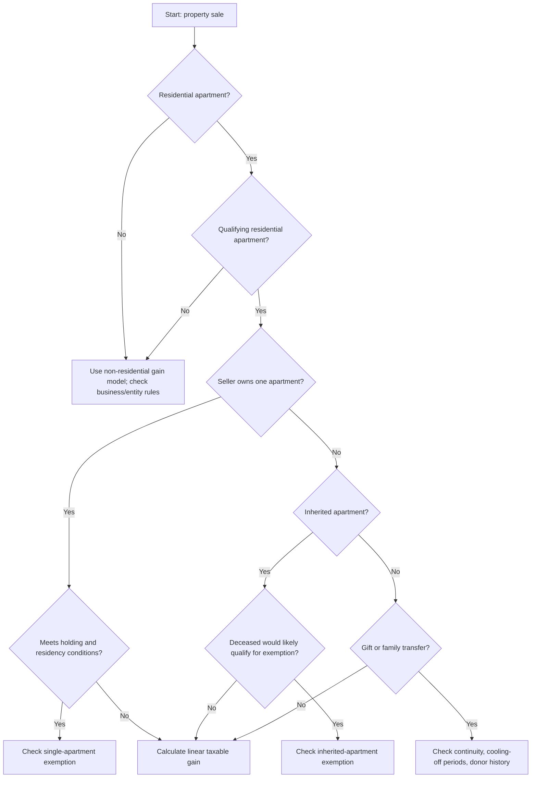
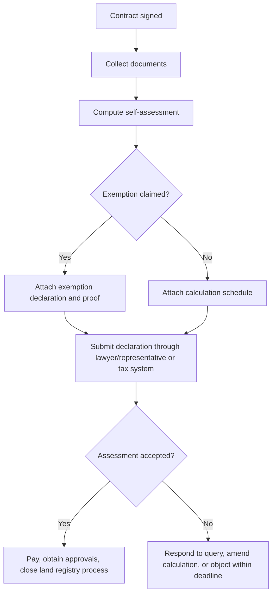

# Real Estate Capital-Gains Tax Assistant

Estimate Israeli **Mas Shevach** (real estate capital-gains tax) for a planned or completed sale of Israeli real property. Use this skill for small businesses, freelancers, families, and consumers who need a structured estimate before meeting a lawyer, CPA, tax adviser, or the Israel Tax Authority.

This skill is an estimation and workflow assistant. It does not replace a licensed Israeli real-estate tax professional, formal self-assessment filing, or a binding pre-ruling.

## Core use cases

- Estimate taxable appreciation on the sale of an apartment, shop, office, warehouse, land, inherited property, or mixed-use asset.
- Separate real gain from inflationary/index-linked gain when CPI data is available.
- Apply simplified linear allocation for residential apartments where part of the holding period may receive historical relief or exemption.
- Check common exemption paths such as single qualifying residential apartment, inheritance exemption, gift-transfer continuity, replacement/residence upgrade relief, and partial rights.
- Prepare the document set needed by a lawyer or accountant.
- Explain why a calculation may fail, why an exemption may not apply, and what data must be corrected before filing.

## Required inputs

Collect dates in `YYYY-MM-DD` format unless the user provides a different clear format.

| Field | Required | Notes |
|---|---:|---|
| `purchase_date` | Yes | Acquisition date, inheritance date for base-cost purposes, or historic donor purchase date if gift continuity applies. |
| `sale_date` | Yes | Contract signing date, not necessarily payment or possession date. |
| `purchase_price` | Yes | Contract price or statutory acquisition value in NIS. |
| `sale_price` | Yes | Contract sale value in NIS. |
| `improvements` | Recommended | Renovations, construction, betterment costs, architect, engineer, contractor, proof required. |
| `purchase_costs` | Recommended | Purchase tax, legal fees, broker fees, appraisal, mortgage registration where deductible. |
| `sale_costs` | Recommended | Broker fee, legal fee, appraisal, marketing, evacuation compensation where recognized. |
| `depreciation_claimed` | Conditional | Required for business/rental assets if depreciation was claimed. |
| `property_type` | Yes | `residential_apartment`, `land`, `commercial`, `mixed_use`, or `other`. |
| `is_qualifying_residential_apartment` | Conditional | Needed for apartment exemptions. |
| `seller_residency` | Conditional | Israeli resident / foreign resident rules may differ. |
| `ownership_share` | Recommended | Use 1.0 for full ownership; otherwise use exact fraction. |
| `cpi_purchase` and `cpi_sale` | Optional | Use official CPI index values to estimate inflationary gain. |
| `linear_relief_start_date` | Optional | Default: `2014-01-01` for common Israeli residential linear relief modeling. |
| `tax_rate` | Optional | Default: `0.25`; adjust for entity type, high-income surtax, historic periods, or professional advice. |

## Recommended conversation flow

1. Identify the asset and seller.
2. Ask whether the property is a **qualifying residential apartment** or another asset.
3. Gather purchase and sale dates, values, and ownership share.
4. Gather purchase costs, sale costs, improvements, and depreciation.
5. Ask whether CPI values are available. If not, run the estimate without indexation and flag it as conservative/rough.
6. Check exemptions before computing tax.
7. Compute gross gain, adjusted basis, net gain, indexed/inflationary gain, real gain, linear taxable share, and estimated tax.
8. Present a range if uncertainty exists.
9. Produce a document checklist and filing workflow.

## Calculation model

### 1. Basic gain

```text
Adjusted basis = purchase price + purchase costs + improvements - depreciation claimed
Net sale proceeds = sale price - sale costs
Gross gain = net sale proceeds - adjusted basis
Seller gain = gross gain × ownership share
```

If the result is zero or negative, estimated Mas Shevach is usually zero, but loss utilization and reporting requirements still require professional review.

### 2. Inflation indexation

When official CPI values are available:

```text
Indexed basis = adjusted basis × (CPI at sale / CPI at purchase)
Inflationary gain = max(0, indexed basis - adjusted basis)
Real gain = max(0, net sale proceeds - indexed basis)
```

If no CPI values are available, treat real gain as the gross gain and show a warning: “CPI indexation not applied.”

### 3. Linear allocation

For qualifying residential apartment calculations, use time-based allocation:

```text
Total holding days = sale date - purchase date
Taxable days = days from linear relief start date to sale date, capped between 0 and total holding days
Taxable share = taxable days / total holding days
Taxable real gain = real gain × taxable share
Estimated tax = taxable real gain × tax rate
```

Default `linear_relief_start_date` is `2014-01-01` because many Israeli residential apartment calculations distinguish pre-2014 and post-2014 periods. Always verify the exact legal rule for the seller, property, and transaction.

The default 25% tax rate excludes high-income surtax, the additional capital-income tax rules that may apply from 2025, company tax, foreign-resident withholding, and VAT. Treat the rate as a configurable planning assumption.

### 4. Ownership share

Apply ownership share after calculating the property-level gain unless the available records are already seller-level amounts. State which method was used.

### 5. Depreciation

For rental or business-use property, add back depreciation claimed or claimable when required. Do not ignore depreciation for a shop, office, clinic, warehouse, or apartment used to generate rental/business income.

## Exemption decision tree



## Filing decision tree



## Concrete examples

### Example 1: Residential apartment with linear relief

- Purchased: `2008-06-01`
- Sold: `2025-06-01`
- Purchase price: ₪1,000,000
- Purchase costs: ₪50,000
- Improvements: ₪150,000
- Sale price: ₪2,400,000
- Sale costs: ₪60,000
- CPI unavailable
- Linear relief start: `2014-01-01`
- Tax rate: 25%

Calculation:

```text
Adjusted basis = 1,000,000 + 50,000 + 150,000 = ₪1,200,000
Net sale proceeds = 2,400,000 - 60,000 = ₪2,340,000
Gross/real gain without CPI = ₪1,140,000
Total holding days ≈ 6,209
Taxable days from 2014-01-01 to 2025-06-01 ≈ 4,169
Taxable share ≈ 67.1%
Taxable gain ≈ ₪765,000
Estimated tax ≈ ₪191,000
```

### Example 2: Commercial shop

- Purchased: ₪800,000
- Purchase costs: ₪45,000
- Improvements: ₪200,000
- Depreciation claimed: ₪120,000
- Sold: ₪1,500,000
- Sale costs: ₪40,000
- CPI not supplied

```text
Adjusted basis = 800,000 + 45,000 + 200,000 - 120,000 = ₪925,000
Net sale proceeds = 1,500,000 - 40,000 = ₪1,460,000
Real gain estimate = ₪535,000
Tax at 25% = ₪133,750
```

Flag: commercial assets may involve marginal tax rates, company tax, VAT, depreciation recapture, and business-income classification.

### Example 3: Loss position

- Purchase price and costs: ₪2,300,000
- Sale proceeds net of costs: ₪2,180,000

Estimated gain is negative. Do not estimate tax. Flag possible capital loss treatment, land registry requirements, and professional review.

## Edge cases

### Inherited apartment

Ask:

- Did the deceased own only one residential apartment at death?
- Would the deceased have qualified for a sale exemption?
- Is the seller the spouse, descendant, or spouse of descendant?
- Was any consideration paid between heirs?

Use continuity rules carefully. Do not treat inheritance as a fresh market-value purchase unless legally confirmed.

### Gifted apartment

Ask:

- Date of donor acquisition.
- Date of gift transfer.
- Relationship between donor and recipient.
- Whether statutory cooling-off periods apply.
- Whether consideration, mortgage assumption, or linked payments occurred.

### Mixed-use apartment

For a home office, clinic, Airbnb, or rental unit, ask for floor-area split, usage periods, depreciation, and expense deductions. A residential exemption may be reduced or denied for business components.

### Tama 38 / urban renewal / combination transactions

Treat as advanced. Collect:

- Original apartment rights.
- Developer consideration.
- Construction services.
- Cash balancing payments.
- Temporary rent payments.
- Betterment levy.
- Project-specific exemption claim.

### Foreign resident seller

Check treaty/residency documentation, apartment ownership abroad, and withholding/certificate issues. Avoid assuming local-resident exemptions apply.

### Company seller or asset in business books

Do not use consumer residential defaults. Check corporate tax, VAT, depreciation, financial statements, related-party rules, and whether the gain is business income.

### Partial rights

Use exact share. For example, if two siblings sell an inherited apartment and one owns 60%, calculate each seller’s share separately because exemptions, residency, dates, and prior sales may differ.

### Betterment levy and municipal charges

Betterment levy may reduce net gain if legally borne by the seller and supported by documentation. Include only amounts that are properly deductible for Mas Shevach.

## Anti-patterns

Avoid these mistakes:

- Treating the sale date as the payment date instead of contract date.
- Ignoring purchase tax, legal fees, broker fees, and capital improvements.
- Deducting routine repairs as improvements without evidence.
- Ignoring depreciation on income-producing property.
- Applying a single-apartment exemption without checking whether the seller owns another apartment or apartment share.
- Applying Israeli resident exemptions to a foreign resident without verification.
- Treating all inherited property as exempt.
- Using CPI estimates from unofficial sources without labeling them.
- Applying linear relief to non-residential land or commercial property.
- Using a single seller calculation for multiple co-owners with different eligibility.

## Response template

Use this structure when answering a user:

```text
Estimated Mas Shevach: ₪X
Confidence: low / medium / high

Inputs used:
- Purchase date:
- Sale date:
- Purchase price:
- Sale price:
- Deductible costs:
- CPI values:
- Ownership share:

Calculation:
1. Adjusted basis:
2. Net sale proceeds:
3. Gross gain:
4. Inflationary gain:
5. Real gain:
6. Taxable linear share:
7. Taxable gain:
8. Estimated tax:

Exemption/relief checks:
- Single-apartment exemption:
- Inheritance exemption:
- Gift/continuity:
- Linear relief:
- Depreciation/business-use issue:

Missing documents:
- ...

Important caveats:
- ...
```

## Troubleshooting summary

| Symptom | Likely cause | Fix |
|---|---|---|
| Tax estimate seems too high | CPI omitted, costs omitted, exemption not checked | Add CPI and deductible costs; re-check exemption. |
| Tax estimate is zero but sale was profitable | Full exemption applied incorrectly | Verify exemption conditions and ownership history. |
| Negative gain despite high sale price | Purchase basis includes non-deductible items or typo | Reconcile contract values and invoices. |
| CLI rejects input | Invalid date, negative amount, or unknown property type | Use ISO dates and non-negative numeric values. |
| Linear share > 100% | Relief date/date ordering bug | Confirm purchase date is before sale date. |

## Production checklist

Before using an estimate in a professional setting:

- Confirm official CPI values from the Central Bureau of Statistics.
- Confirm current tax rates, surtax thresholds, the additional capital-income tax rules that may apply from 2025, and VAT exposure for business assets.
- Confirm seller type: individual, company, partnership, trust, estate.
- Confirm residency and foreign-property ownership.
- Confirm legal title and exact ownership share.
- Confirm whether purchase tax and prior transaction reports match the calculation.
- Confirm all deductible costs are supported by invoices/receipts.
- Confirm depreciation claimed or claimable.
- Confirm apartment eligibility and exemption history.
- Confirm payment deadlines and filing deadlines.
- Generate an audit trail with inputs, formulas, assumptions, and date/time.
- Obtain professional review before filing or signing a tax declaration.

## Command-line helper

The package includes:

- `real_estate_capital_gains_tax/` — installable typed calculation helper with sync and async entry points.
- `scripts/real-estate-capital-gains-tax-cli.py` — Typer-based CLI.
- `scripts/test_real_estate_capital_gains_tax_client.py` — pytest coverage with 20+ tests.
- `scripts/examples/` — runnable scenarios.

Example:

```bash
python scripts/real-estate-capital-gains-tax-cli.py estimate \
  --purchase-date 2008-06-01 \
  --sale-date 2025-06-01 \
  --purchase-price 1000000 \
  --sale-price 2400000 \
  --purchase-costs 50000 \
  --improvements 150000 \
  --sale-costs 60000 \
  --property-type residential_apartment \
  --qualifying-residential \
  --pretty
```

## Professional handoff checklist

Provide the adviser with:

- Purchase contract and sale contract.
- Land registry extract or rights confirmation.
- Purchase tax assessment and payment confirmations.
- Prior Mas Shevach filings for the property.
- Renovation invoices and proof of payment.
- Broker, legal, appraisal, engineering, architect, and surveyor invoices.
- CPI values used in the calculation.
- Rental/business-use history and depreciation schedules.
- Mortgage documents only where relevant to deductible registration/financing costs.
- Inheritance order, probate order, gift agreements, or family-transfer documents.
- Municipality betterment levy assessment and payment proof.
- Exemption claim rationale and supporting facts.

## Disclaimer / הבהרה

This skill is a preparation and automation aid only. It does not constitute tax, legal, financial, or other professional advice, and its output must be reviewed by a licensed professional (רו"ח / עו"ד / יועץ מס) before any filing, payment, or contractual use.

כלי זה מהווה שכבת הכנה ואוטומציה בלבד. אין בו ייעוץ מס, ייעוץ משפטי או ייעוץ מקצועי אחר, ויש לאמת כל פלט מול בעל מקצוע מורשה לפני הגשה, תשלום או שימוש חוזי.
