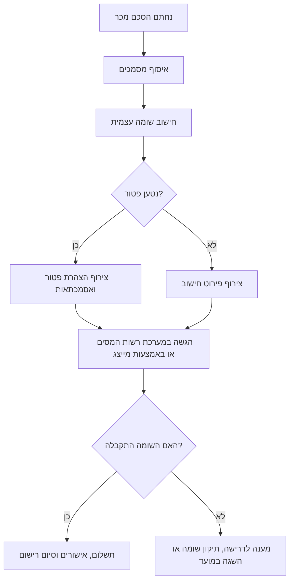

# מסייע לחישוב מס שבח במקרקעין

השתמשו בכלי זה כדי להכין **אומדן מס שבח** במכירת מקרקעין בישראל: דירת מגורים, משרד, חנות, מחסן, קרקע, נכס שהתקבל בירושה, נכס שניתן במתנה או נכס בשימוש מעורב. הכלי מתאים לעסקים קטנים, עצמאים, משפחות וצרכנים שרוצים להבין את סדר הגודל לפני פנייה לעורך דין, רואה חשבון, יועץ מס או רשות המסים.

הכלי מספק אומדן, תיעוד והכוונה תהליכית. אין להשתמש בו כתחליף לחוות דעת מקצועית, לדיווח עצמי מחייב או להחלטת מיסוי.

## מתי להשתמש בסקיל

- לאמוד את השבח במכירת דירה, משרד, חנות, מחסן, קרקע או נכס אחר.
- להפריד בין שבח ריאלי לבין רכיב אינפלציוני כאשר קיימים נתוני מדד.
- לחשב זכאות אפשרית לחישוב ליניארי מוטב בדירת מגורים מזכה.
- לבדוק כיווני פטור נפוצים: דירה יחידה, דירה שהתקבלה בירושה, העברה ללא תמורה, זכויות חלקיות ודירות בשימוש מעורב.
- להכין רשימת מסמכים לעורך דין או לרואה חשבון.
- לאתר טעויות בחישוב: פחת שלא נלקח בחשבון, עלויות שלא נוכו, תאריכים שגויים או פטור שהוחל שלא כדין.

## נתונים נדרשים

יש להזין תאריכים בפורמט `DD/MM/YYYY` בעברית, או `YYYY-MM-DD` בכלי ה־שורת הפקודה.

| שדה | חובה | הערות |
|---|---:|---|
| `purchase_date` | כן | יום רכישת הנכס. בירושה או במתנה ייתכן שיש להסתמך על יום הרכישה ההיסטורי של המוריש או נותן המתנה. |
| `sale_date` | כן | יום חתימת הסכם המכר, לא בהכרח יום התשלום או המסירה. |
| `purchase_price` | כן | מחיר הרכישה או שווי רכישה רלוונטי בש"ח. |
| `sale_price` | כן | שווי המכירה בש"ח לפי ההסכם. |
| `improvements` | מומלץ | שיפוצים, בנייה, הרחבה, אדריכל, מהנדס, קבלן והוצאות הוניות מוכחות. |
| `purchase_costs` | מומלץ | מס רכישה, שכר טרחת עורך דין, דמי תיווך, שמאות, רישום וכדומה לפי הכרה בדין. |
| `sale_costs` | מומלץ | דמי תיווך, שכר טרחת עורך דין, שמאות, שיווק, פינוי וכדומה לפי הכרה בדין. |
| `depreciation_claimed` | מותנה | חובה לבדוק בנכס עסקי, מושכר או נכס שנדרש בגינו פחת. |
| `property_type` | כן | `residential_apartment`, `land`, `commercial`, `mixed_use`, או `other`. |
| `is_qualifying_residential_apartment` | מותנה | נדרש לבדיקת פטורים וחישוב ליניארי בדירה. |
| `seller_residency` | מותנה | תושב ישראל / תושב חוץ. קיימים הבדלים בזכאות לפטורים. |
| `ownership_share` | מומלץ | 1.0 לבעלות מלאה; אחרת להזין חלק מדויק. |
| `cpi_purchase`, `cpi_sale` | אופציונלי | ערכי מדד רשמיים לצורך אומדן רכיב אינפלציוני. |
| `linear_relief_start_date` | אופציונלי | ברירת מחדל נפוצה: `01/01/2014`. |
| `tax_rate` | אופציונלי | ברירת מחדל: 25%. יש לעדכן לפי סוג המוכר, שיעורי מס, מס יסף, מס נוסף על הכנסות הוניות ככל שחל משנת 2025 וכללים היסטוריים. |

## מהלך עבודה מומלץ

1. לזהות את סוג הנכס ואת סוג המוכר.
2. לברר אם מדובר ב**דירת מגורים מזכה**.
3. לאסוף תאריכי רכישה ומכירה, שווי רכישה, שווי מכירה וחלק הבעלות.
4. לאסוף עלויות רכישה, עלויות מכירה, הוצאות השבחה ופחת.
5. לבדוק אם קיימים ערכי מדד רשמיים. בהיעדר מדד, להציג אזהרה שהחישוב אינו מוצמד.
6. לבדוק פטורים לפני חישוב המס.
7. לחשב שבח ברוטו, יתרת שווי רכישה מתואמת, שבח אינפלציוני, שבח ריאלי, חלק ליניארי חייב ואומדן מס.
8. להציג טווח או רמת ביטחון כאשר חסרים נתונים.
9. להכין רשימת מסמכים ודגשים להגשה.

## מודל החישוב

### 1. שבח בסיסי

```text
יתרת שווי רכישה = מחיר רכישה + הוצאות רכישה + השבחות - פחת שנדרש
תמורה נטו = שווי מכירה - הוצאות מכירה
שבח = תמורה נטו - יתרת שווי רכישה
שבח לפי חלק בעלות = שבח × חלק הבעלות
```

כאשר מתקבל הפסד או אפס, אומדן מס השבח יהיה בדרך כלל אפס, אך עדיין ייתכנו חובת דיווח, השלכות קיזוז הפסדים ודרישות לרישום בטאבו.

### 2. הצמדה למדד

כאשר קיימים ערכי מדד רשמיים:

```text
יתרת רכישה צמודה = יתרת שווי רכישה × (מדד מכירה / מדד רכישה)
שבח אינפלציוני = max(0, יתרת רכישה צמודה - יתרת שווי רכישה)
שבח ריאלי = max(0, תמורה נטו - יתרת רכישה צמודה)
```

כאשר אין ערכי מדד, יש להציג אזהרה: “לא בוצעה הצמדה למדד; התוצאה היא אומדן גס”.

### 3. חישוב ליניארי

בדירת מגורים מזכה, ניתן לבצע חלוקת זמן:

```text
תקופת החזקה כוללת = יום המכירה - יום הרכישה
ימים חייבים = ימים מיום תחילת ההקלה הליניארית ועד יום המכירה
חלק חייב = ימים חייבים / תקופת החזקה כוללת
שבח ריאלי חייב = שבח ריאלי × חלק חייב
אומדן מס = שבח ריאלי חייב × שיעור המס
```

ברירת המחדל היא `01/01/2014`, אך חובה לוודא את הדין החל על העסקה, המוכר והנכס.

שיעור המס של 25% הוא הנחת עבודה בלבד. הוא אינו כולל מס יסף, מס נוסף על הכנסות הוניות ככל שחל, מס חברות, ניכוי במקור לתושב חוץ או מע"מ בעסקאות עסקיות.

## עץ החלטה לפטורים

```mermaid
flowchart TD
    A[תחילת בדיקה: מכירת נכס] --> B{האם זו דירת מגורים?}
    B -- לא --> C[חישוב רגיל לנכס שאינו דירה; לבדוק כללי עסק/חברה/מע"מ]
    B -- כן --> D{האם זו דירת מגורים מזכה?}
    D -- לא --> C
    D -- כן --> E{האם למוכר דירה אחת בלבד?}
    E -- כן --> F{האם מתקיימים תנאי החזקה ותושבות?}
    F -- כן --> G[בדיקת פטור דירה יחידה]
    F -- לא --> H[חישוב ליניארי/חלק חייב]
    E -- לא --> I{האם הדירה התקבלה בירושה?}
    I -- כן --> J{האם המוריש היה עשוי להיות זכאי לפטור?}
    J -- כן --> K[בדיקת פטור דירת ירושה]
    J -- לא --> H
    I -- לא --> L{האם מדובר במתנה או העברה בתוך המשפחה?}
    L -- כן --> M[בדיקת רצף מס, תקופות צינון והיסטוריית נותן המתנה]
    L -- לא --> H
```

## עץ החלטה להגשה



## דוגמאות מספריות

### דוגמה 1: דירת מגורים עם חישוב ליניארי

- רכישה: `01/06/2008`
- מכירה: `01/06/2025`
- מחיר רכישה: ₪1,000,000
- הוצאות רכישה: ₪50,000
- השבחות: ₪150,000
- מחיר מכירה: ₪2,400,000
- הוצאות מכירה: ₪60,000
- אין נתוני מדד
- תחילת הקלה ליניארית: `01/01/2014`
- שיעור מס: 25%

```text
יתרת שווי רכישה = 1,000,000 + 50,000 + 150,000 = ₪1,200,000
תמורה נטו = 2,400,000 - 60,000 = ₪2,340,000
שבח ללא הצמדה = ₪1,140,000
תקופת החזקה כוללת ≈ 6,209 ימים
ימים חייבים מ־01/01/2014 עד 01-06-2025 ≈ 4,169
חלק חייב ≈ 67.1%
שבח חייב ≈ ₪765,000
אומדן מס ≈ ₪191,000
```

### דוגמה 2: חנות מסחרית

- מחיר רכישה: ₪800,000
- הוצאות רכישה: ₪45,000
- השבחות: ₪200,000
- פחת שנדרש: ₪120,000
- מחיר מכירה: ₪1,500,000
- הוצאות מכירה: ₪40,000

```text
יתרת שווי רכישה = 800,000 + 45,000 + 200,000 - 120,000 = ₪925,000
תמורה נטו = 1,500,000 - 40,000 = ₪1,460,000
שבח משוער = ₪535,000
מס בשיעור 25% = ₪133,750
```

נכס מסחרי מחייב בדיקה נוספת של פחת, סיווג הכנסה עסקית, מע"מ, חברה מוכרת ושיעורי מס.

### דוגמה 3: מכירה בהפסד

אם יתרת שווי הרכישה וההוצאות היא ₪2,300,000 והתמורה נטו היא ₪2,180,000, מתקבל הפסד של ₪120,000. אין אומדן מס חיובי, אך יש לבדוק חובת דיווח וקיזוז הפסדים.

## מצבים מורכבים

### דירה שהתקבלה בירושה

לברר:

- האם המוריש החזיק דירת מגורים אחת בלבד ביום הפטירה?
- האם המוריש היה זכאי לפטור אילו מכר את הדירה?
- האם היורש הוא בן זוג, צאצא או בן זוג של צאצא?
- האם שולמה תמורה בין יורשים?

אין להניח שירושה יוצרת שווי רכישה חדש. ברוב המקרים נדרש רצף מס או בדיקה פרטנית.

### דירה שהתקבלה במתנה

לברר:

- מועד רכישת נותן המתנה.
- מועד העברת המתנה.
- קרבה משפחתית.
- תקופות צינון.
- משכנתה, תמורה עקיפה או תשלום מוסווה.

### דירה בשימוש מעורב

בדירה ששימשה גם לקליניקה, משרד ביתי, Airbnb או השכרה, יש לבדוק שטחים, תקופות שימוש, פחת והוצאות שנדרשו. שימוש עסקי עלול לצמצם או לשלול פטור.

### התחדשות עירונית, תמ"א 38 ופינוי־בינוי

זהו מקרה מתקדם. יש לאסוף הסכם יזם, שירותי בנייה, תמורות כספיות, דמי שכירות זמניים, היטל השבחה, דירה חלופית וזכויות נוספות.

### מוכר תושב חוץ

יש לבדוק תושבות, דירות בחו"ל, אישורי מס, אמנות מס וניכוי במקור. אין להחיל פטור של תושב ישראל ללא בדיקה.

### חברה או נכס עסקי

אין להשתמש בברירת מחדל צרכנית. יש לבדוק מס חברות, מע"מ, פחת, דוחות כספיים, עסקאות בעלי עניין וסיווג כרווח הון או הכנסה עסקית.

## טעויות נפוצות

- שימוש ביום התשלום במקום יום חתימת ההסכם.
- התעלמות ממס רכישה, שכר טרחת עורך דין, תיווך והשבחות.
- ניכוי תיקונים שוטפים כאילו היו השבחה הונית.
- התעלמות מפחת בנכס מושכר או עסקי.
- החלת פטור דירה יחידה בלי לבדוק בעלות בדירות נוספות.
- החלת פטורים של תושב ישראל על תושב חוץ.
- הנחה שכל דירת ירושה פטורה.
- שימוש במדד לא רשמי בלי לציין זאת.
- החלת חישוב ליניארי על קרקע או חנות.
- חישוב אחד לכל השותפים למרות שלכל מוכר זכאות שונה.

## תבנית תשובה למשתמש

```text
אומדן מס שבח: ₪X
רמת ביטחון: נמוכה / בינונית / גבוהה

נתונים ששימשו לחישוב:
- יום רכישה:
- יום מכירה:
- מחיר רכישה:
- מחיר מכירה:
- הוצאות מוכרות:
- מדדים:
- חלק בעלות:

פירוט חישוב:
1. יתרת שווי רכישה:
2. תמורה נטו:
3. שבח ברוטו:
4. שבח אינפלציוני:
5. שבח ריאלי:
6. חלק ליניארי חייב:
7. שבח חייב:
8. אומדן מס:

בדיקת פטורים והקלות:
- פטור דירה יחידה:
- פטור דירת ירושה:
- מתנה/רצף מס:
- חישוב ליניארי:
- פחת/שימוש עסקי:

מסמכים חסרים:
- ...

הערות חשובות:
- ...
```

## בדיקות לפני שימוש מקצועי

- לאמת ערכי מדד רשמיים של הלשכה המרכזית לסטטיסטיקה.
- לאמת שיעורי מס ומס יסף עדכניים.
- לזהות את סוג המוכר: יחיד, חברה, שותפות, נאמנות או עיזבון.
- לוודא תושבות ובעלות בדירות נוספות בארץ ובחו"ל.
- לוודא זכויות בטאבו, ברמ"י או בחברה משכנת.
- להתאים את החישוב לשומות ודיווחים קודמים.
- לבדוק אסמכתאות לכל הוצאה.
- לבדוק פחת שנדרש או שהיה ניתן לדרוש.
- לבדוק היסטוריית פטורים ומכירות קודמות.
- לוודא מועדי דיווח ותשלום.
- לשמור עקבות חישוב מלאות: נתונים, נוסחאות, הנחות ומועד החישוב.
