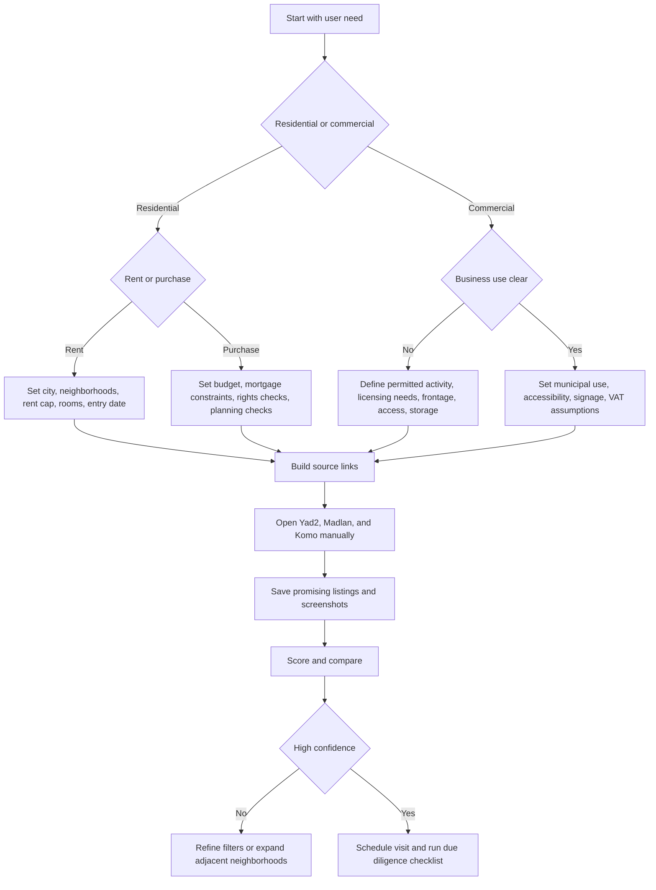
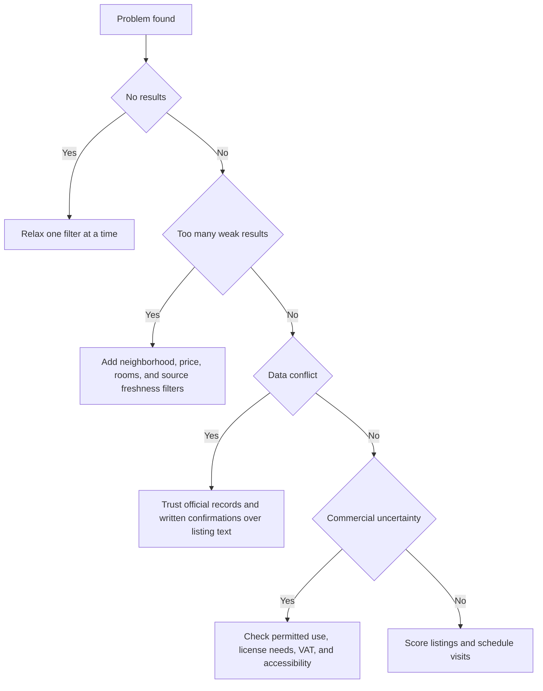

# Real-Estate Search Assistant

## Purpose

Turn Israeli real-estate requirements into a structured search plan across Yad2, Madlan, and Komo. Use source-specific links, neighborhood-aware filtering where the source supports it, manual neighborhood checks where it does not, comparison scoring, and localized legal and financial checks for consumers, freelancers, and small businesses.

Use the skill for:

- Apartment rentals and purchases.
- Office, clinic, studio, shop, and light-commercial searches.
- Neighborhood-focused shortlists.
- Manual comparison of listings collected from source sites.
- Pre-visit due diligence checklists.

Do not use the skill to bypass source-site access controls, scrape at scale, ignore robots rules, or treat advertiser text as verified fact.

## Operating principles

1. Define the real user need before opening sources.
2. Apply city, neighborhood, price, rooms, property type, and business-use filters first.
3. Treat every source result as a lead, not as verified information.
4. Confirm legal, tax, planning, accessibility, and broker-fee issues before signing.
5. Save dated evidence for every promising listing.

## Input model

Use this structure when collecting requirements:

```json
{
  "city": "חיפה",
  "deal_type": "rent",
  "neighborhoods": ["בת גלים", "כרמליה"],
  "max_price": 5200,
  "min_rooms": 2.5,
  "property_types": ["דירה"],
  "parking": true,
  "balcony": true,
  "entry_date": "15/07/2026",
  "sources": ["yad2", "madlan", "komo"]
}
```

Supported deal types:

| Value | Use case |
| --- | --- |
| `rent` | Residential rental. |
| `sale` | Residential purchase. |
| `commercial_rent` | Office, clinic, shop, studio, or other business rental. |
| `commercial_sale` | Commercial purchase. |

## Decision tree



## Source strategy

| Source | Strength | Verification step |
| --- | --- | --- |
| Yad2 | Broad classifieds coverage and many direct-owner leads. | Confirm advertiser role, current availability, and exact address. |
| Madlan | Neighborhood context and market signals. | Compare map location, planning context, and comparable transactions where shown. |
| Komo | Additional listing coverage and search discovery. | Reconfirm source freshness and duplicate listings. |

Use at least two sources for any serious decision. Use all three when neighborhood supply is thin or when the user is price sensitive.

## Concrete examples

### Family rental in Ramat Gan

```bash
real-estate-search create \
  --city "רמת גן" \
  --deal-type rent \
  --neighborhoods "מרום נווה,הראשונים" \
  --max-price 8500 \
  --min-rooms 3.5 \
  --parking true \
  --balcony true \
  --output ramat-gan-family.json
```

Review order:

1. Open all three generated links.
2. Sort by newest first.
3. Save listings with exact street, floor, elevator, parking, and entry date.
4. Ask whether pets, repairs, early exit, and renewal terms are permitted.
5. Estimate first-month cash: rent, deposit, broker fee, arnona, building committee, movers, and utilities.

### Freelancer clinic in Tel Aviv

```bash
real-estate-search create \
  --city "תל אביב-יפו" \
  --deal-type commercial_rent \
  --neighborhoods "לב העיר,הצפון הישן" \
  --property-types "משרד,קליניקה" \
  --max-price 6500 \
  --accessible true \
  --output clinic-plan.json
```

Check:

- Permitted business use for treatment, consulting, or studio activity.
- Accessibility and restroom suitability.
- Signage rights and building rules.
- VAT, management fees, and municipal classification.
- Noise, waiting area, elevator, and public transport access.

### Small shop in Haifa

```bash
real-estate-search create \
  --city "חיפה" \
  --deal-type commercial_rent \
  --neighborhoods "הדר,עיר תחתית" \
  --property-types "חנות,נכס מסחרי" \
  --max-price 9000 \
  --output shop-plan.json
```

Check frontage, foot traffic, delivery access, permitted use, fire-safety implications, signage, storage, and local licensing requirements.

### Purchase shortlist in Jerusalem

```bash
real-estate-search create \
  --city "ירושלים" \
  --deal-type sale \
  --neighborhoods "בקעה,רחביה" \
  --max-price 3200000 \
  --min-rooms 3 \
  --output jerusalem-buy.json
```

Before negotiation, order current rights documentation, check liens, compare recent transactions, check planning information, and calculate acquisition costs with current official rates.

## Edge cases

| Edge case | Recommended handling |
| --- | --- |
| Neighborhood names differ between sites | Search the Hebrew neighborhood name, common alternate spelling, and nearby streets. Verify on the map. |
| Listing lacks exact address | Ask for street and building number before visiting. Reject evasive answers for purchase or commercial deals. |
| Price is suspiciously low | Check whether the price excludes VAT, management fees, arnona, parking, storage, or broker fee. |
| Duplicate listing appears on several sites | Keep the freshest version and note all URLs. Prefer direct-owner listing when facts match. |
| Commercial listing uses vague terms | Ask for permitted use, municipal classification, business license fit, and VAT treatment. |
| Source filters are ignored by a site | Apply the filter manually after opening the generated link. |
| User has no fixed neighborhood | Start broad, rank by commute and budget, then narrow after ten candidate listings. |
| User wants immediate entry | Add entry date and call only listings updated in the last few days. |
| Broker status unclear | Ask directly whether a brokerage fee applies and request written confirmation. |
| Sale listing lacks rights clarity | Do not rely on the listing. Request current land registry or rights confirmation. |

## Anti-patterns

Avoid these patterns:

- Searching only by city when the user has commute, school, or business constraints.
- Treating a listing as available because it appears online.
- Comparing rent without arnona, building committee, parking, storage, VAT, and broker fee.
- Calling every lead without first removing duplicates.
- Signing a lease or memorandum before reading the full document.
- Ignoring planning or permitted-use checks for commercial properties.
- Collecting personal data from advertisers beyond what is needed for the transaction.
- Running automated scraping against source sites.

## Troubleshooting path



## Production checklist

Before using the workflow for a real decision:

- Confirm the user has a clear city, neighborhood set, budget ceiling, and deal type.
- Use `sandbox` for planning and `production` only for real user-facing work.
- Keep generated search links and screenshots with dates.
- Document source, advertiser name, phone, broker status, and last confirmation time.
- Verify residential lease terms or purchase rights with qualified professionals where needed.
- Verify commercial use, licensing, accessibility, tax treatment, and municipal classification.
- Avoid storing sensitive personal data unless required and lawfully handled.
- Refresh listings before visits and again before transferring money.
- Keep a comparison sheet with price, recurring costs, one-time costs, risks, and next action.

## Output format for assistants

When presenting results to a user, provide:

1. Search summary.
2. Source links grouped by Yad2, Madlan, and Komo.
3. Missing assumptions.
4. Top verification questions.
5. Next action checklist.

Example:

```text
Search: rental, Haifa, Bat Galim and Carmelia, up to ₪5,200, 2.5+ rooms.
Open: Yad2 link, Madlan link, Komo link.
Verify: exact address, broker fee, entry date, arnona, building committee, parking, elevator.
Next: save five listings, remove duplicates, call only leads updated this week.
```
