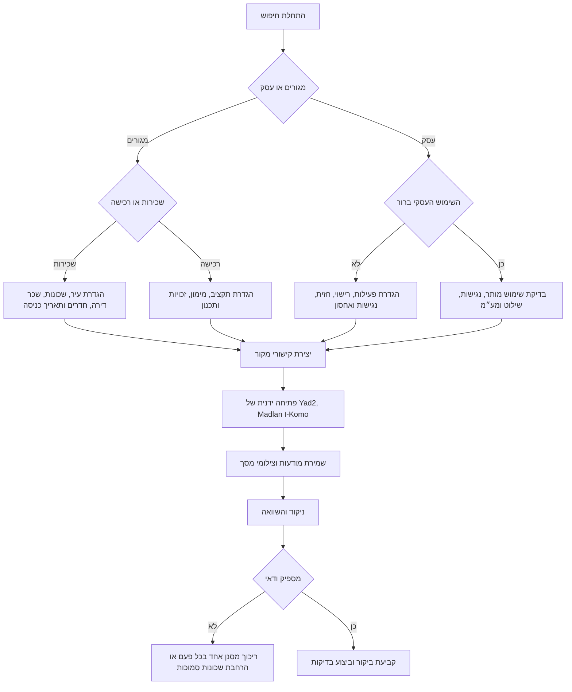
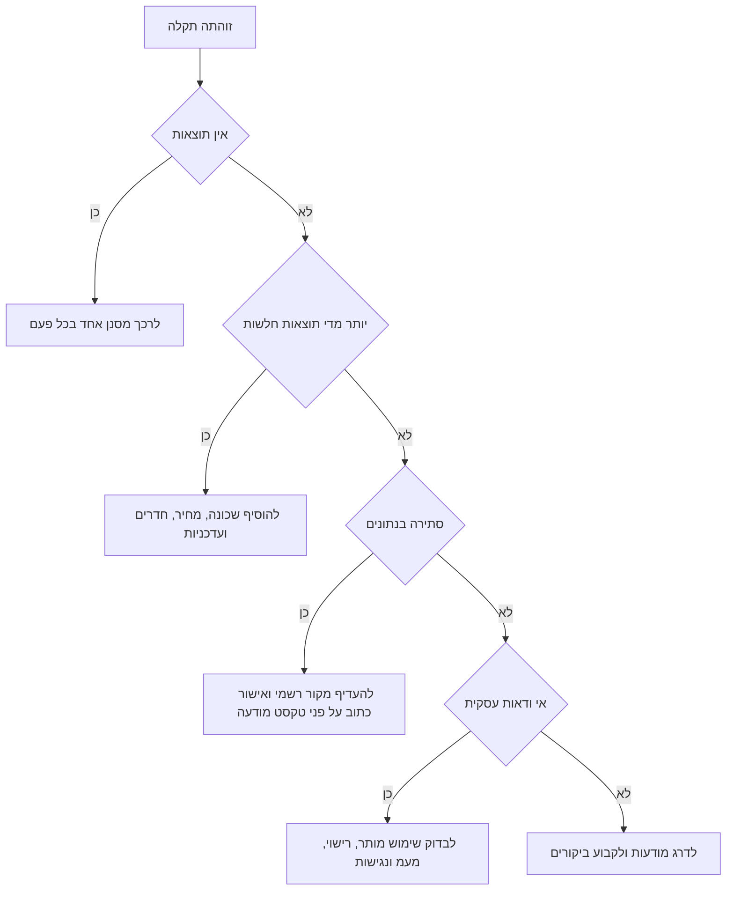

# מסייע חיפוש נדלן בישראל

## מטרה

להפוך דרישות חיפוש נדלן בישראל לתוכנית עבודה מסודרת ב-Yad2, Madlan ו-Komo. להשתמש בקישורי מקור ייעודיים, במסנני שכונה כאשר אתר המקור תומך בכך, ובבדיקת שכונה ידנית כאשר אין פרמטר מאומת. להוסיף בדיקות אימות לפני ביקור, משא ומתן או חתימה.

השימוש מתאים ל:

- שכירת דירה או רכישת דירה.
- חיפוש משרד, קליניקה, סטודיו, חנות או נכס מסחרי קטן.
- עצמאים, עסקים קטנים, משפחות וצרכנים פרטיים.
- השוואת מודעות שנאספו ידנית.
- יצירת רשימת בדיקות לפני ביקור בנכס.

אין להשתמש בתהליך כדי לעקוף מגבלות גישה, לבצע איסוף אוטומטי בהיקף חריג, להפר תנאי שימוש של אתר מקור או להתייחס לטקסט במודעה כאל עובדה מאומתת.

## עקרונות עבודה

1. להגדיר צורך אמיתי לפני פתיחת אתרי המקור.
2. להתחיל בעיר, שכונות, תקציב, חדרים, סוג נכס ושימוש מותר.
3. להתייחס לכל מודעה כליד ראשוני בלבד.
4. לאמת זכויות, מסים, תכנון, נגישות, דמי תיווך ותנאי חוזה לפני חתימה.
5. לשמור צילום מסך, קישור ותאריך לכל מודעה רלוונטית.

## מבנה קלט מומלץ

```json
{
  "city": "חיפה",
  "deal_type": "rent",
  "neighborhoods": ["בת גלים", "כרמליה"],
  "max_price": 5200,
  "min_rooms": 2.5,
  "property_types": ["דירה"],
  "parking": true,
  "balcony": true,
  "entry_date": "15/07/2026",
  "sources": ["yad2", "madlan", "komo"]
}
```

סוגי עסקה נתמכים:

| ערך | שימוש |
| --- | --- |
| `rent` | שכירות למגורים. |
| `sale` | רכישה למגורים. |
| `commercial_rent` | שכירות משרד, קליניקה, סטודיו, חנות או נכס עסקי. |
| `commercial_sale` | רכישת נכס מסחרי. |

## עץ החלטה



## אסטרטגיית מקורות

| מקור | יתרון | בדיקת אימות |
| --- | --- | --- |
| Yad2 | היצע רחב ולעיתים מודעות מבעלים פרטיים. | לאמת זמינות, תפקיד המפרסם וכתובת מדויקת. |
| Madlan | הקשר שכונתי ומידע שוק. | להשוות מיקום במפה, סביבת תכנון ועסקאות דומות כאשר מופיעות. |
| Komo | מקור נוסף לאיתור עמודי עיר ופרטי מודעות. | לסנן שכונה ידנית אם אין מזהה שכונה מאומת; לבדוק עדכניות, כפילויות ופרטי נכס מדויקים. |

יש להשתמש לפחות בשני מקורות לפני החלטה משמעותית. כאשר ההיצע נמוך או התקציב מוגבל, יש לפתוח את שלושתם.

## דוגמאות עבודה

### שכירות למשפחה ברמת גן

```bash
real-estate-search create \
  --city "רמת גן" \
  --deal-type rent \
  --neighborhoods "מרום נווה,הראשונים" \
  --max-price 8500 \
  --min-rooms 3.5 \
  --parking true \
  --balcony true \
  --output ramat-gan-family.json
```

סדר בדיקה:

1. לפתוח את שלושת הקישורים שנוצרו.
2. למיין לפי המודעות החדשות ביותר.
3. לשמור מודעות עם רחוב, קומה, מעלית, חניה ותאריך כניסה.
4. לשאול בכתב על בעלי חיים, תיקונים, יציאה מוקדמת ואופציית הארכה.
5. לחשב מזומן נדרש לחודש ראשון: שכר דירה, פיקדון, דמי תיווך, ארנונה, ועד בית, הובלה ותשתיות.

### קליניקה לעצמאי בתל אביב-יפו

```bash
real-estate-search create \
  --city "תל אביב-יפו" \
  --deal-type commercial_rent \
  --neighborhoods "לב העיר,הצפון הישן" \
  --property-types "משרד,קליניקה" \
  --max-price 6500 \
  --accessible true \
  --output clinic-plan.json
```

יש לבדוק:

- שימוש מותר לטיפול, ייעוץ או פעילות סטודיו.
- נגישות, שירותים, מעלית וחדר המתנה.
- זכויות שילוט וכללי ועד הבית.
- מעמ, דמי ניהול וסיווג ארנונה.
- רעש, תחבורה ציבורית, חניה וזמינות לקוחות.

### חנות קטנה בחיפה

```bash
real-estate-search create \
  --city "חיפה" \
  --deal-type commercial_rent \
  --neighborhoods "הדר,עיר תחתית" \
  --property-types "חנות,נכס מסחרי" \
  --max-price 9000 \
  --output shop-plan.json
```

יש לבדוק חזית מסחרית, תנועת הולכי רגל, גישה לפריקה וטעינה, שימוש מותר, דרישות בטיחות אש, שילוט, אחסון ורישוי עסק.

### רכישת דירה בירושלים

```bash
real-estate-search create \
  --city "ירושלים" \
  --deal-type sale \
  --neighborhoods "בקעה,רחביה" \
  --max-price 3200000 \
  --min-rooms 3 \
  --output jerusalem-buy.json
```

לפני משא ומתן יש להזמין נסח טאבו או אישור זכויות עדכני, לבדוק שעבודים, להשוות עסקאות דומות, לבדוק מידע תכנוני ולחשב עלויות רכישה לפי הנתונים הרשמיים העדכניים.

## מקרי קצה

| מצב | פעולה מומלצת |
| --- | --- |
| שם שכונה מופיע אחרת בכל אתר | לחפש שם שכונה, כתיב חלופי ורחובות מרכזיים; לאמת במפה. |
| אין כתובת מדויקת | לבקש רחוב ומספר בניין לפני ביקור; בעסקת רכישה או עסקית לא להתקדם בלי מיקום ברור. |
| מחיר נמוך מדי | לבדוק אם המחיר אינו כולל מעמ, דמי ניהול, ארנונה, חניה, מחסן או דמי תיווך. |
| אותה מודעה מופיעה בכמה אתרים | לשמור את הגרסה העדכנית ביותר ולתעד את כל הקישורים. |
| נכס מסחרי מתואר בצורה כללית | לבקש שימוש מותר, סיווג עירוני, התאמה לרישוי עסק ומעמ. |
| מסנן באתר לא נשמר בקישור | לפתוח את הקישור ולהחיל את המסנן ידנית. |
| אין שכונה מועדפת | להתחיל בעיר רחבה, לדרג לפי נסיעה ותקציב ואז לצמצם לאחר עשר מודעות. |
| נדרש מועד כניסה מידי | להוסיף תאריך כניסה ולפנות רק למודעות שעודכנו לאחרונה. |
| מעמד מתווך לא ברור | לשאול ישירות אם חלים דמי תיווך ולבקש תשובה כתובה. |
| מודעת מכירה ללא בהירות זכויות | לא להסתמך על המודעה; לבקש נסח טאבו או אישור זכויות עדכני. |

## דפוסי עבודה שגויים

יש להימנע מ:

- חיפוש לפי עיר בלבד כאשר יש אילוצי נסיעה, בית ספר או פעילות עסקית.
- הנחה שמודעה זמינה רק כי היא מופיעה באתר.
- השוואת שכר דירה בלי ארנונה, ועד בית, חניה, מחסן, מעמ ודמי תיווך.
- פנייה לכל מודעה לפני הסרת כפילויות.
- חתימה על חוזה או זיכרון דברים לפני קריאה מלאה.
- התעלמות מתכנון ושימוש מותר בנכס מסחרי.
- שמירת מידע אישי שאינו נחוץ לעסקה.
- איסוף אוטומטי מאתרי מקור בהיקף חריג.

## פתרון תקלות



## רשימת בדיקה לפני שימוש אמיתי

- לוודא שיש עיר, שכונות, תקרת תקציב וסוג עסקה.
- להשתמש ב-`sandbox` לתכנון וב-`production` רק בעבודה אמיתית מול משתמש.
- לשמור קישורים וצילומי מסך עם תאריך.
- לתעד מקור, שם מפרסם, טלפון, מעמד מתווך ושעת אישור אחרונה.
- לבדוק תנאי שכירות או זכויות רכישה עם בעלי מקצוע מתאימים לפי הצורך.
- לבדוק שימוש עסקי, רישוי, נגישות, מעמ וסיווג ארנונה בנכס מסחרי.
- לא לשמור מידע אישי רגיש בלי צורך ובסיס חוקי.
- לרענן מודעות לפני ביקור ולפני העברת כסף.
- לנהל טבלת השוואה עם מחיר, עלויות שוטפות, עלויות חד פעמיות, סיכונים ופעולה הבאה.

## פורמט תשובה מומלץ

בתשובה למשתמש יש להציג:

1. תקציר החיפוש.
2. קישורי מקור לפי Yad2, Madlan ו-Komo.
3. הנחות חסרות.
4. שאלות אימות חשובות.
5. רשימת פעולות הבאה.

דוגמה:

```text
חיפוש: שכירות בחיפה, בת גלים וכרמליה, עד ₪5,200, לפחות 2.5 חדרים.
פתיחה: קישור Yad2, קישור Madlan, קישור Komo.
אימות: כתובת מדויקת, דמי תיווך, תאריך כניסה, ארנונה, ועד בית, חניה ומעלית.
המשך: לשמור חמש מודעות, להסיר כפילויות ולפנות רק למודעות שעודכנו השבוע.
```
