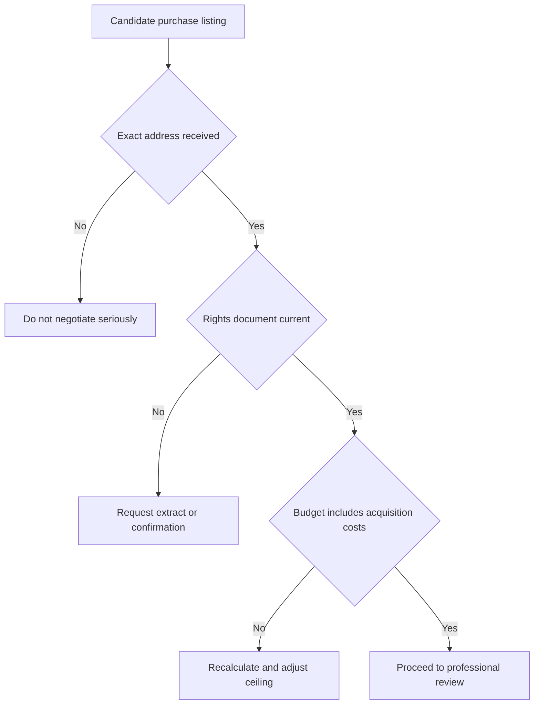

# Workflow Guide

## Workflow 1: Residential rental for a family

1. Collect city, neighborhoods, budget ceiling, room minimum, entry date, parking, elevator, pets, and school or commute constraints.
2. Build a plan with `deal_type=rent`.
3. Open Yad2, Madlan, and Komo links manually.
4. Sort by newest first.
5. Save no more than 15 candidate listings in the first pass.
6. Remove duplicates by street, photos, floor, and price.
7. Call or message only listings that match budget and entry date.
8. Ask about broker fee, exact address, arnona, building committee, repairs, deposits, guarantors, and renewal option.
9. Visit the top three to five listings.
10. Review lease terms before transferring money.

Suggested comparison columns:

| Column | Purpose |
| --- | --- |
| Source URL | Return to the original listing. |
| Last confirmed | Avoid stale leads. |
| Address | Detect duplicates and commute fit. |
| Monthly rent | Base comparison. |
| Arnona | Actual monthly burden. |
| Building committee | Actual monthly burden. |
| Broker fee | One-time cost. |
| Deposit | Cash needed before entry. |
| Repair obligations | Contract risk. |
| Score | Ranking from the client. |

## Workflow 2: First apartment purchase

1. Confirm budget, equity, mortgage estimate, target neighborhoods, and must-have features.
2. Build a plan with `deal_type=sale`.
3. Use generated links to gather candidate listings; apply neighborhood filters manually if a source ignores or lacks a verified query parameter.
4. Compare asking price with similar listings and recent transaction information where available.
5. Before negotiation, request exact address and rights details.
6. Order a current land registry extract or other rights confirmation.
7. Check planning information, building permits, known defects, and future neighborhood changes.
8. Estimate acquisition costs: purchase tax, lawyer, broker, mortgage fees, appraisal, moving, renovation, and immediate repairs.
9. Make offers only after legal and financing checks are aligned.

Decision checkpoint:

## Workflow 3: Freelancer clinic or studio

1. Define activity: treatment, consulting, lessons, design work, storage, or retail.
2. Determine whether clients visit the premises.
3. Build a commercial rental plan with neighborhoods and accessibility filters.
4. Open each source link and save candidates with floor, elevator, restroom, noise, and public transport details.
5. Ask the advertiser about permitted use, municipal classification, VAT, management fee, signage, and building rules. Treat the 18% VAT assumption as current only after checking official sources for the transaction date.
6. Contact the municipality before signing when licensing is relevant.
7. Confirm insurance and accessibility implications.
8. Compare total monthly cost, not only rent.

Risk flags:

- Residential apartment offered for client-facing business use without clear permission.
- Rent stated before VAT but budget assumes VAT-inclusive price.
- Management fee, arnona, or utilities are missing.
- No written confirmation of signage or client access.
- Accessibility duties are ignored for public-facing activity.

## Workflow 4: Small shop or street-front business

1. Define product or service category and expected foot traffic.
2. Set frontage, storage, loading, signage, and opening-hour requirements.
3. Search `commercial_rent` or `commercial_sale` with specific neighborhoods and property types.
4. Verify the unit is suitable for the intended activity before negotiating.
5. Ask for arnona classification, management fee, VAT treatment, and previous business type.
6. Check local competition, visibility, deliveries, parking, public transport, and accessibility.
7. Model conservative revenue and fixed costs before signing.

## Workflow 5: Consumer relocation with flexible neighborhoods

1. Start with city, commute destination, budget, room count, and must-have features.
2. Run a broad city search without neighborhoods.
3. Save the first ten plausible listings.
4. Group listings by neighborhood.
5. Identify two or three neighborhoods that repeatedly match budget and commute.
6. Run a second plan with those neighborhoods only.
7. Schedule visits by geography to reduce travel time.

## Workflow 6: Low-inventory market

1. Keep must-have requirements separate from preferences.
2. Run source links daily or every few days during active search.
3. Expand to adjacent neighborhoods only after confirming current target supply is weak.
4. Add a flexible price buffer only if total cash need remains acceptable.
5. Contact fresh listings quickly, but do not skip verification.

## Workflow 7: Post-visit decision

After each visit, record:

- Actual condition versus photos.
- Noise, light, ventilation, dampness, water pressure, and building maintenance.
- Advertiser role and fee terms.
- Missing repairs and promised fixes.
- Exact monthly and one-time costs.
- Contract risks.
- Final next action: reject, ask questions, second visit, or professional review.
