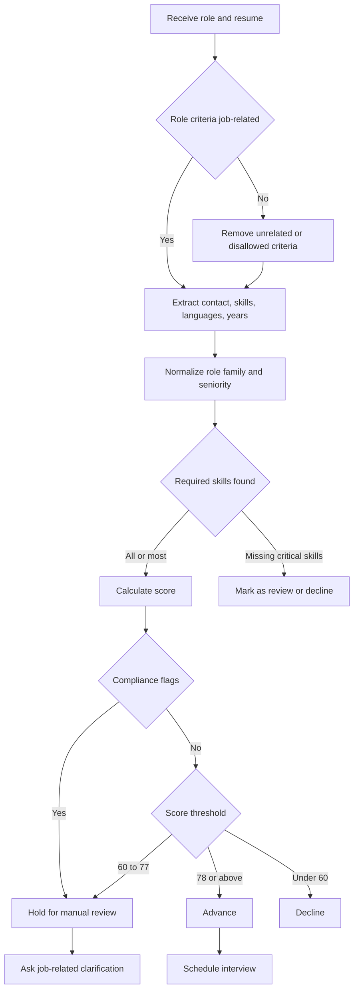

# Recruitment Assistant

## Purpose

Use this skill to screen resumes in Hebrew and English, normalize Israeli-market roles and seniority, validate job-ad criteria, and schedule interviews for small businesses, freelancers, and consumers in Israel. Keep the workflow practical, auditable, and neutral. Score only job-related evidence.

## Core outcomes

- Convert a raw resume into structured candidate evidence.
- Normalize title variations such as "מנהל משרד", "Office Manager", "מפתח פייתון", and "Python Developer".
- Normalize seniority into `intern`, `junior`, `mid`, `senior`, `lead`, `manager`, or `unknown`.
- Compare evidence against required and preferred job criteria.
- Flag criteria that may be discriminatory or unrelated to the job.
- Create interview slots with a conservative Sunday to Thursday default, then override only when the business has a documented scheduling policy and the candidate agrees.
- Return clear next actions: advance, review, or decline.

## Web-validated limits

Treat statutory references as guardrails, not as a full legal review. Use `references/verification-log.md` before changing any compliance wording. Do not present the internal score thresholds as legal thresholds. Do not calculate tax, social-security, pension, or payroll amounts from this skill; use qualified payroll or tax tooling for those tasks.

## Operating principles

Use imperative, factual language. Prefer evidence found in the resume. Do not infer protected personal characteristics. Do not penalize a candidate for gaps, military history, family status, address, age, gendered names, disability, religion, ethnicity, nationality, or pregnancy. When information is missing, mark it as missing and request clarification.

## Inputs

### Role profile

```json
{
  "title": "Mid Bookkeeper",
  "required_skills": ["excel", "hashavshevet"],
  "preferred_skills": ["payroll", "priority"],
  "seniority": "mid",
  "role_family": "accounting",
  "location": "Ramat Gan",
  "salary_min_ils": 9000,
  "salary_max_ils": 12000,
  "languages": ["hebrew"]
}
```

### Candidate resume

```json
{
  "name": "Dana Levi",
  "resume_text": "dana@example.co.il 052-1234567 הנהלת חשבונות, חשבשבת, אקסל, 4 שנות ניסיון",
  "source": "email"
}
```

## Decision tree



## Screening procedure

1. Parse the resume text.
2. Extract email, Israeli phone number, languages, explicit years of experience, and skills.
3. Normalize the role family from the title and aliases.
4. Normalize seniority from title, years of experience, and Hebrew or English terms.
5. Match required skills before preferred skills.
6. Apply a score penalty for missing required skills.
7. Add compliance flags only for process risk, not for personal characteristics.
8. Produce one recommendation: `advance`, `review`, or `decline`.
9. Store notes that can be explained to the hiring manager.

## Role-family normalization

| Input examples | Normalized family |
| --- | --- |
| Python Developer, מפתח תוכנה, Full Stack | software |
| מנהל מוצר, Product Manager | product |
| PPC, SEO, שיווק דיגיטלי | marketing |
| הנהלת חשבונות, חשבשבת, Payroll | accounting |
| שירות לקוחות, Customer Support | customer_service |
| ניהול משרד, מזכירות, Admin | administration |
| מחסן, שילוח, Logistics | logistics |

## Seniority normalization

| Evidence | Seniority |
| --- | --- |
| מתמחה, סטודנט, intern | intern |
| ג'וניור, ללא ניסיון, 0 to 2 years | junior |
| 3 to 5 years, בעל ניסיון | mid |
| 5 or more years, בכיר | senior |
| ראש צוות, מוביל מקצועי, tech lead | lead |
| מנהל, מנהלת, director, head | manager |

## Concrete examples

### Hebrew bookkeeper resume

Input:

```text
נועה כהן
noa@example.co.il
054-1234567
מנהלת חשבונות סוג 2, חשבשבת, אקסל, התאמות בנקים, 5 שנות ניסיון
```

Role:

```json
{
  "title": "מנהלת חשבונות",
  "required_skills": ["חשבשבת", "אקסל"],
  "preferred_skills": ["שכר", "פריוריטי"],
  "seniority": "mid",
  "role_family": "accounting"
}
```

Expected result: advance when required skills are present and no disallowed criteria appear.

### English customer-service resume

Input:

```text
Omer Ben David
omer@example.com
Customer service representative, CRM, phone support, Hebrew and English, 2 years experience
```

Expected result: review for a mid-level role requiring 3 years, advance for a junior customer-service role.

### Mixed-language marketing resume

Input:

```text
שיווק דיגיטלי, Google Ads, PPC, SEO, Analytics, קמפיינים בפייסבוק, 4 שנות ניסיון
```

Expected result: normalize to marketing, detect Hebrew and English, match PPC and SEO.

## Edge cases

- Resume has no explicit years: score on skills and mark years as unclear.
- Candidate uses gendered Hebrew title: do not infer gender or score on it.
- Candidate has military experience: score only transferable job skills, not service itself.
- Candidate lives far from the workplace: do not decline automatically; ask about availability if location is a real business requirement.
- Resume includes age or family status: ignore it.
- Skill appears in a project description but not in skills section: count it if job-related.
- Salary expectation exceeds range: handle outside screening score; use a separate compensation conversation.
- Candidate has freelance experience: count relevant projects and years.
- Duplicate candidates: use stable identifiers and compare email and phone.
- Friday interview requested: move to Sunday unless the business has a documented Friday interview policy, the candidate agrees, and local rest-day constraints are respected.

## Anti-patterns

- Rejecting a candidate because of age, family status, gender, military history, religion, disability, or address.
- Treating Hebrew-only resumes as lower quality.
- Requiring "native Hebrew" when professional Hebrew proficiency is enough.
- Scoring "מראה ייצוגי" as a requirement.
- Treating keyword absence as proof of inability when the resume is short.
- Sending interview invitations before validating contact details.
- Mixing job-ad compliance checks with candidate score.
- Reusing old role criteria without checking current job duties.

## Troubleshooting summary

| Symptom | Likely cause | Action |
| --- | --- | --- |
| High-quality candidate marked review | Missing explicit required skill | Check project descriptions and request clarification. |
| No phone detected | Non-standard formatting | Ask for contact details or normalize manually. |
| Too many candidates advance | Required criteria too broad | Separate must-have criteria from preferences. |
| Hebrew terms not matched | English-only role profile | Add Hebrew aliases to required and preferred skills. |
| Friday slots created manually | Calendar override | Re-run scheduler with the default Sunday to Thursday setting or document the business-specific exception. |

## Production checklist

- Confirm job criteria are current and job-related.
- Use separate required and preferred criteria.
- Remove protected or unrelated criteria from job ads and filters.
- Store a short reason for every recommendation.
- Keep resume data only as long as needed for hiring.
- Limit access to candidate records.
- Verify dates in DD/MM/YYYY format for Israeli-facing communications.
- Confirm salary ranges in ₪.
- Validate invitee email addresses before sending interview invitations.
- Review all `review` recommendations manually.
- Re-run tests before changing scoring thresholds.
- Document exceptions and legal review when role-specific requirements may affect protected criteria.

## Escalation rules

Escalate to a human decision-maker when a resume is unclear, when a protected characteristic appears in the data, when a role includes safety-sensitive duties, when a candidate asks for accommodation, or when the hiring manager wants to apply a criterion not listed in the role profile.
