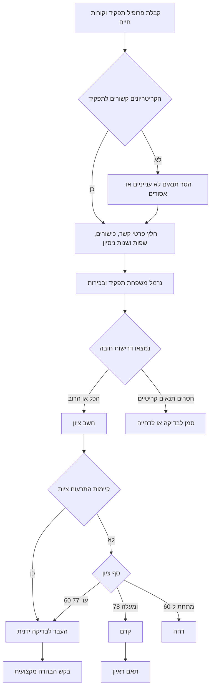

# מסייע גיוס

## מטרה

השתמש בכלי כדי לסנן קורות חיים בעברית ובאנגלית, לנרמל תפקידים ורמות בכירות בשוק הישראלי, לבדוק ניסוח מודעות דרושים, ולתאם ראיונות לעסקים קטנים, עצמאים וצרכנים בישראל. שמור על תהליך ענייני, מתועד וניטרלי. דרג רק לפי ראיות שקשורות לתפקיד.

## תוצרים מרכזיים

- המר קורות חיים לטבלת ראיות מובנית.
- נרמל שמות תפקידים כגון "מנהל משרד", "Office Manager", "מפתח פייתון" ו-"Python Developer".
- נרמל בכירות לערכים `intern`, `junior`, `mid`, `senior`, `lead`, `manager`, או `unknown`.
- השווה ראיות לדרישות חובה וליתרונות.
- סמן תנאים שעלולים להיות מפלים או לא קשורים לתפקיד.
- צור מועדי ראיונות כברירת מחדל בימים ראשון עד חמישי, ושנה זאת רק כאשר קיימת מדיניות תיאום מתועדת של העסק והסכמה של המועמד.
- החזר החלטה ברורה: קדם, בדוק ידנית, או דחה.

## מגבלות שאומתו מול מקורות עדכניים

התייחס להפניות לחקיקה כאל מסגרת עבודה ולא כאל ייעוץ משפטי מלא. בדוק את `references/verification-log.md` לפני שינוי ניסוחי ציות. אל תציג את ספי הציון הפנימיים כספים משפטיים. אל תחשב מע"מ, ביטוח לאומי, פנסיה או שכר מתוך מיומנות זו; השתמש בכלי שכר או מס ייעודי ובבדיקה מקצועית.

## עקרונות עבודה

כתוב בלשון ציווי ניטרלית ומקצועית. העדף ראיה שמופיעה בקורות החיים. אל תסיק מאפיינים אישיים מוגנים. אל תעניש מועמד על פערי תעסוקה, שירות צבאי או היעדרו, מצב משפחתי, כתובת, גיל, מגדר, שם פרטי, מוגבלות, דת, מוצא, לאום או הריון. כאשר מידע חסר, סמן אותו כחסר ובקש הבהרה מקצועית.

## קלטים

### פרופיל תפקיד

```json
{
  "title": "מנהל חשבונות בדרגת ביניים",
  "required_skills": ["אקסל", "חשבשבת"],
  "preferred_skills": ["שכר", "פריוריטי"],
  "seniority": "mid",
  "role_family": "accounting",
  "location": "רמת גן",
  "salary_min_ils": 9000,
  "salary_max_ils": 12000,
  "languages": ["hebrew"]
}
```

### קורות חיים

```json
{
  "name": "דנה לוי",
  "resume_text": "dana@example.co.il 052-1234567 הנהלת חשבונות, חשבשבת, אקסל, 4 שנות ניסיון",
  "source": "email"
}
```

## עץ החלטה



## הליך סינון

1. קרא את טקסט קורות החיים.
2. חלץ דואר אלקטרוני, מספר טלפון ישראלי, שפות, שנות ניסיון מפורשות וכישורים.
3. נרמל את משפחת התפקיד לפי כותרת ומילים נרדפות.
4. נרמל בכירות לפי כותרת, שנות ניסיון ומונחים בעברית או באנגלית.
5. התאם דרישות חובה לפני יתרונות.
6. הפחת ציון על דרישות חובה חסרות.
7. הוסף התרעות ציות רק לסיכון תהליך, לא למאפיינים אישיים.
8. החזר החלטה אחת: `advance`, `review`, או `decline`.
9. שמור נימוקים קצרים שניתן להסביר למנהל המגייס.

## נרמול משפחת תפקיד

| דוגמאות קלט | משפחה מנורמלת |
| --- | --- |
| Python Developer, מפתח תוכנה, Full Stack | software |
| מנהל מוצר, Product Manager | product |
| PPC, SEO, שיווק דיגיטלי | marketing |
| הנהלת חשבונות, חשבשבת, Payroll | accounting |
| שירות לקוחות, Customer Support | customer_service |
| ניהול משרד, מזכירות, Admin | administration |
| מחסן, שילוח, Logistics | logistics |

## נרמול בכירות

| ראיה | בכירות |
| --- | --- |
| מתמחה, סטודנט, intern | intern |
| ג'וניור, ללא ניסיון, 0 עד 2 שנות ניסיון | junior |
| 3 עד 5 שנות ניסיון, בעל ניסיון | mid |
| 5 שנות ניסיון ומעלה, בכיר | senior |
| ראש צוות, מוביל מקצועי, tech lead | lead |
| מנהל, מנהלת, director, head | manager |

## דוגמאות מעשיות

### קורות חיים בעברית לתפקיד הנהלת חשבונות

קלט:

```text
נועה כהן
noa@example.co.il
054-1234567
מנהלת חשבונות סוג 2, חשבשבת, אקסל, התאמות בנקים, 5 שנות ניסיון
```

תפקיד:

```json
{
  "title": "מנהלת חשבונות",
  "required_skills": ["חשבשבת", "אקסל"],
  "preferred_skills": ["שכר", "פריוריטי"],
  "seniority": "mid",
  "role_family": "accounting",
  "salary_min_ils": 9000,
  "salary_max_ils": 12000
}
```

תוצאה צפויה: קדם כאשר דרישות החובה קיימות ואין תנאי סינון אסורים. הצג שכר ב-₪ וכתוב תאריכי ראיונות בפורמט DD/MM/YYYY.

### קורות חיים באנגלית לשירות לקוחות

קלט:

```text
Omer Ben David
omer@example.com
Customer service representative, CRM, phone support, Hebrew and English, 2 years experience
```

תוצאה צפויה: בדוק ידנית לתפקיד ביניים שדורש 3 שנות ניסיון, וקדם לתפקיד זוטר בשירות לקוחות.

### קורות חיים מעורבים לשיווק

קלט:

```text
שיווק דיגיטלי, Google Ads, PPC, SEO, Analytics, קמפיינים בפייסבוק, 4 שנות ניסיון
```

תוצאה צפויה: נרמל לשיווק, זהה עברית ואנגלית, והתאם PPC ו-SEO.

## מקרי קצה

- אין שנות ניסיון מפורשות: דרג לפי כישורים וסמן שהוותק לא ברור.
- כותרת התפקיד בקורות החיים מנוסחת בלשון מגדרית: אל תסיק מגדר ואל תדרג לפי מגדר.
- מופיע ניסיון צבאי: דרג רק כישורים מקצועיים שניתנים להעברה.
- המועמד גר רחוק ממקום העבודה: אל תדחה אוטומטית; שאל על זמינות אם מיקום הוא צורך עסקי אמיתי.
- מופיעים גיל או מצב משפחתי: התעלם מהם.
- כישור מופיע בתיאור פרויקט ולא ברשימת כישורים: חשב אותו אם הוא קשור לתפקיד.
- ציפיית שכר גבוהה מהטווח: טפל בכך מחוץ לציון הסינון, בשיחה נפרדת על תגמול.
- ניסיון עצמאי: חשב פרויקטים ושנות ניסיון רלוונטיים.
- מועמדים כפולים: השווה דואר אלקטרוני ומספר טלפון.
- ראיון התבקש ביום שישי: העבר ליום ראשון אלא אם קיימת מדיניות ראיונות מתועדת ביום שישי, המועמד מסכים לכך, ונשמרות מגבלות יום המנוחה הרלוונטיות.

## טעויות נפוצות

- דחיית מועמד בגלל גיל, מצב משפחתי, מגדר, שירות צבאי, דת, מוגבלות או כתובת.
- התייחסות לקורות חיים בעברית בלבד כאיכותיים פחות.
- דרישת "שפת אם" כאשר נדרשת שליטה מקצועית בעברית.
- שימוש ב"מראה ייצוגי" כדרישת תפקיד.
- פירוש היעדר מילת מפתח כהוכחה לחוסר יכולת.
- שליחת זימון לפני אימות פרטי קשר.
- ערבוב בדיקת ציות של מודעת דרושים עם ציון המועמד.
- שימוש בדרישות תפקיד ישנות בלי לבדוק את הצרכים הנוכחיים.

## פתרון תקלות מקוצר

| סימפטום | סיבה אפשרית | פעולה |
| --- | --- | --- |
| מועמד חזק סומן לבדיקה | חסרה מילת חובה מפורשת | בדוק תיאורי פרויקטים ובקש הבהרה. |
| לא זוהה טלפון | פורמט לא רגיל | בקש פרטי קשר או נרמל ידנית. |
| יותר מדי מועמדים קודמו | דרישות החובה רחבות מדי | הפרד חובה מיתרון. |
| מונחים בעברית לא הותאמו | פרופיל התפקיד באנגלית בלבד | הוסף מילים נרדפות בעברית. |
| נקבעו ראיונות ביום שישי ידנית | עקיפת יומן | הרץ שוב את המתזמן לפי ברירת המחדל ראשון עד חמישי או תעד חריגה עסקית מוצדקת. |

## רשימת בדיקה להפעלה שוטפת

- אשר שדרישות התפקיד עדכניות וקשורות לתפקיד.
- הפרד בין דרישות חובה לבין יתרונות.
- הסר קריטריונים מוגנים או לא ענייניים ממודעות וממסננים.
- שמור נימוק קצר לכל החלטה.
- שמור קורות חיים רק למשך הזמן הנדרש לתהליך הגיוס.
- הגבל גישה לרשומות מועמדים.
- הצג תאריכים בפורמט DD/MM/YYYY במסרים למועמדים בישראל.
- הצג טווחי שכר ב-₪.
- אמת כתובות דואר אלקטרוני לפני שליחת זימונים.
- בדוק ידנית כל החלטת `review`.
- הרץ בדיקות לפני שינוי ספי ציון.
- תעד חריגים ובדיקה משפטית כאשר תפקיד דורש תנאים רגישים.
