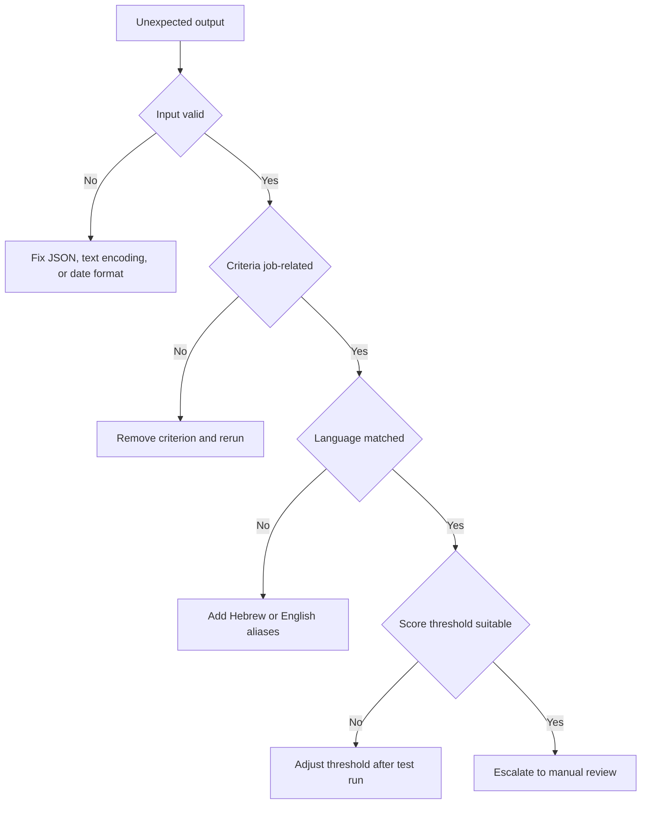

# Troubleshooting

## Quick diagnostic flow

## Resume parsing problems

| Problem | Diagnosis | Fix |
| --- | --- | --- |
| Email not extracted | Resume uses obfuscated text such as `name at domain`. | Ask for a standard email address. |
| Phone not extracted | Number uses uncommon separators or international format. | Normalize to Israeli mobile or landline format. |
| Hebrew skills missed | Role profile contains only English terms. | Add Hebrew aliases such as אקסל, חשבשבת, שירות לקוחות. |
| English skills missed | Resume uses platform names or abbreviations. | Add aliases such as CRM, PPC, SEO, SQL. |
| Years not detected | Resume describes dates instead of years. | Ask a human reviewer to estimate only from job-related employment history. |

## Scoring problems

| Symptom | Cause | Action |
| --- | --- | --- |
| Score too low despite fit | Required skills too narrow or aliases missing. | Expand role profile with equivalent professional terms. |
| Score too high for weak candidates | Requirements listed as preferences. | Move true must-have criteria to `required_skills`. |
| Too many declines | Threshold too strict or mandatory terms unclear. | Review examples and run test scenarios before changing. |
| Too many advances | Required skills are too generic. | Add specific tools, responsibilities, or certifications. |

## Compliance problems

| Symptom | Cause | Action |
| --- | --- | --- |
| Job ad validation fails | Ad includes age, gender, military, or appearance criteria. | Replace with job-related availability, skill, or responsibility wording. |
| Manager asks for a protected criterion | Criterion may be unlawful or unrelated. | Pause workflow and request legal or HR review. |
| Candidate includes personal information | Resume contains data that should not affect score. | Ignore it and keep notes job-related. |
| Accommodation request appears | Candidate asks for adjustment. | Route to a human process and avoid automated decline. |

## Scheduling problems

| Symptom | Cause | Action |
| --- | --- | --- |
| Interviews skip Friday and Saturday | Conservative default is active. | Keep the Sunday to Thursday default unless a documented business exception applies and the candidate agrees. |
| No slot appears after 17:00 | Daily end time closes at 17:00. | Extend the window only when candidates and business agree. |
| Slots are too dense | Default buffer is fifteen minutes. | Increase interview duration or schedule fewer candidates per day. |
| Date display confuses candidates | ISO date used in candidate message. | Convert candidate-facing text to DD/MM/YYYY. |

## CLI problems

| Symptom | Cause | Action |
| --- | --- | --- |
| Command not found | Package not installed in editable mode. | Run `pip install -e .`. |
| Missing test dependencies | Development packages not installed. | Run `pip install -r requirements-dev.txt`. |
| JSON parse error | File is not valid UTF-8 JSON. | Save as UTF-8 and validate quotes and commas. |
| Invalid environment | Value is not `sandbox` or `production`. | Pass `--env sandbox` for local testing. |

## Recovery checklist

1. Reproduce the issue with one candidate and one role.
2. Save the input JSON and raw resume text.
3. Validate job-ad wording.
4. Confirm required skills and preferred skills are separated.
5. Add missing Hebrew or English aliases.
6. Run the test scenarios.
7. Run `pytest`.
8. Run `python -m compileall scripts/ -q`.
9. Document any threshold change.
