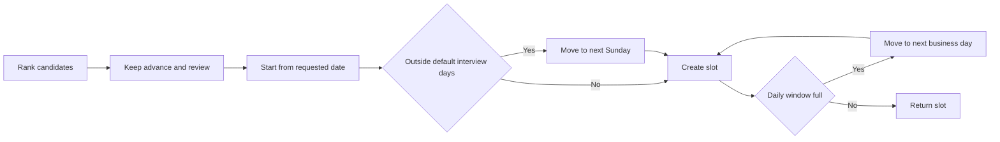

# Workflow Guide

## Workflow 1: Small retail business hiring a customer-service representative

1. Define the job outcome: answer customer calls, manage refunds, and update the customer system.
2. Create a role profile:
   - Required: Hebrew, customer service, CRM.
   - Preferred: English, phone support, retail experience.
   - Seniority: junior or mid.
3. Remove unrelated criteria from the job ad.
4. Screen each resume with the same role profile.
5. Review candidates with missing years of experience but clear service experience.
6. Schedule interviews with the Sunday to Thursday default between 09:00 and 17:00; document any Friday exception separately.
7. Ask the same job-related questions for every candidate.
8. Record notes only on customer handling, system experience, availability, and communication.

## Workflow 2: Freelancer hiring a bookkeeper

1. Define the work: invoices, bank reconciliations, monthly reports, and VAT file preparation.
2. Set required skills: חשבשבת, אקסל, הנהלת חשבונות.
3. Set preferred skills: פריוריטי, שכר.
4. Enter the salary or retainer range in ₪.
5. Screen resumes in Hebrew and English.
6. Advance candidates with required accounting tools and relevant years.
7. Review candidates who list accounting work without naming software.
8. Schedule a short video interview and request examples of reports without exposing other clients' confidential data.

## Workflow 3: Consumer hiring a private tutor

1. Define the service: subject, grade level, location, and schedule.
2. Use required skills such as mathematics, English, or exam preparation.
3. Avoid age, gender, marital status, religion, or origin requirements.
4. Screen for teaching experience and references.
5. Create interview slots after school hours if needed.
6. Keep notes limited to teaching approach, availability, price in ₪, and subject knowledge.

## Workflow 4: Startup hiring a software developer

1. Define the stack and responsibility level.
2. Split criteria:
   - Required: Python, SQL, production systems.
   - Preferred: React, cloud deployment, testing.
3. Normalize seniority from title and years.
4. Screen English, Hebrew, and mixed-language resumes.
5. Decline only when critical requirements are missing and score is low.
6. Review non-traditional backgrounds manually.
7. Schedule technical interviews during agreed Israeli business hours.

## Workflow 5: Agency screening a marketing specialist

1. Define campaign channels and budget ownership.
2. Required: PPC, SEO, analytics.
3. Preferred: social campaigns, landing pages, content coordination.
4. Validate the job ad for age or appearance wording.
5. Screen resumes that use Hebrew marketing terms and English platform names.
6. Use the shortlist output for manager review.
7. Send interview invitations only after contact validation.

## End-to-end example

```python
from recruitment_assistant import Candidate, RecruitmentAssistantClient, RoleProfile

client = RecruitmentAssistantClient(env="sandbox")

role = RoleProfile(
    title="מנהלת חשבונות",
    required_skills=["חשבשבת", "אקסל"],
    preferred_skills=["שכר", "פריוריטי"],
    seniority="mid",
    role_family="accounting",
    salary_min_ils=9000,
    salary_max_ils=12000,
)

candidate = Candidate(
    name="נועה כהן",
    resume_text="noa@example.co.il 054-1234567 חשבשבת אקסל התאמות בנקים 5 שנות ניסיון",
)

create_response = client.create_candidate(candidate)
candidate_id = create_response["id"]
stored_candidate = client.get_candidate(candidate_id)
result = client.screen_resume(stored_candidate, role)
slots = client.schedule_interviews([result], start_date="2026-06-07")

print(result.to_dict())
print([slot.to_dict() for slot in slots])
```

## Decision rules for manual review

Route to manual review when:

- Required evidence may exist but the resume uses non-standard wording.
- The role profile contains a sensitive or questionable criterion.
- Candidate seniority appears above or below target but skills match.
- Contact details are missing.
- Resume includes irrelevant personal details.
- Candidate asks for accommodation or schedule flexibility.
- Hiring manager wants to override a score.

## Interview scheduling workflow



## Records to keep

| Record | Reason | Suggested retention |
| --- | --- | --- |
| Role profile | Explain criteria | During hiring and short review period. |
| Screening result | Explain decision | During hiring and short review period. |
| Interview slot | Coordinate process | Until interview process ends. |
| Job-ad validation | Show review of wording | Keep with hiring file. |
| Candidate resume | Evaluate application | Delete when no longer needed. |


## Regulatory validation checkpoint

Before running a real shortlist, review `references/verification-log.md`. Confirm that the role profile contains only job-related criteria, that compensation examples are marked as illustrative, and that interview scheduling follows the default Sunday to Thursday window unless a documented business exception applies.
