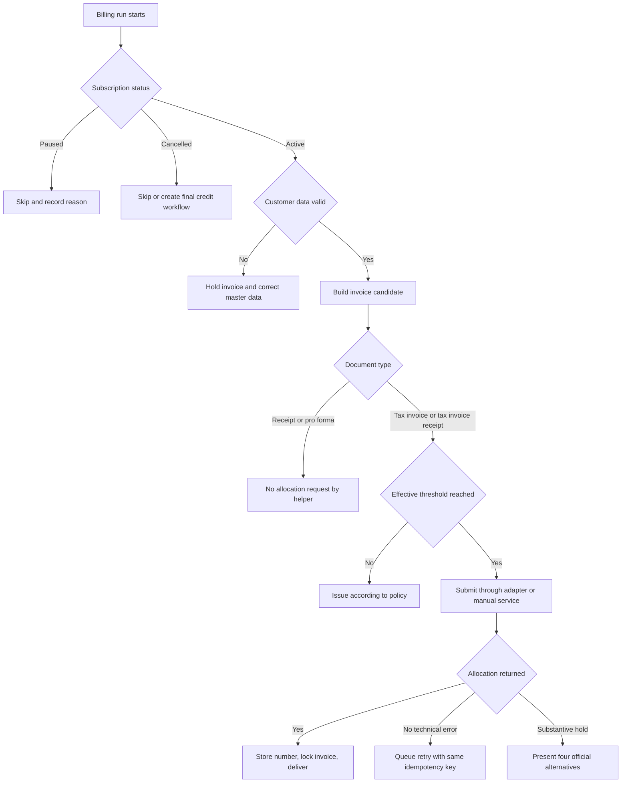

# Recurring Invoicing Automation

Use this skill to design, validate, and operate recurring invoice workflows for Israeli small businesses, freelancers, and consumer-facing service providers. Support subscription billing, VAT calculation, invoice scheduling, credit notes, allocation-number decisions, and migration from spreadsheets or manual bookkeeping.

## Operating boundaries

- Treat generated documents as accounting document candidates until final numbering, allocation submission, and delivery are complete.
- Verify current VAT rates, allocation thresholds, official schemas, and reporting obligations before production.
- Use a licensed bookkeeper, certified accountant, or legal adviser for fact-specific tax and bookkeeping decisions.
- Keep customer tax IDs, payment data, invoice details, and allocation responses protected under the organization retention and privacy policy.

## Core concepts

| Concept | Meaning | Example |
|---|---|---|
| Subscription | A recurring commercial agreement with a customer | Monthly support retainer |
| Issue date | Date printed on the invoice and used by the helper for default VAT-rate lookup | `31/01/2026` |
| Subtotal before VAT | Amount used for allocation-threshold decisions | `₪10,000.00` |
| Tax invoice | Israeli VAT document used for taxable B2B sales | `tax_invoice` |
| Tax invoice receipt | Combined invoice and receipt document | `tax_invoice_receipt` |
| Allocation number | Tax Authority number required for input-VAT deduction when conditions apply | `202606010000000001` |
| Credit tax invoice | Correction document for cancellation or overbilling | Negative linked document |

## Live-validated 2026 compliance defaults

- VAT defaults to 18 percent from 01/01/2025 onward and 17 percent before that date.
- Allocation threshold defaults are date-effective: ₪20,000 from 01/01/2025, ₪10,000 from 01/01/2026, and ₪5,000 from 01/06/2026.
- The old full-year 2026 threshold of ₪15,000 was corrected during the web-validated pass.
- Official v2 SHAAM API input fields are lowercase. The package local payload is an adapter payload and must be mapped before direct Tax Authority submission.

## Decision tree



## End-to-end workflow

1. Normalize customer records.
   - Strip formatting from Israeli tax IDs.
   - Pad IDs to 9 digits when appropriate.
   - Validate checksum for VAT-registered customers.
2. Build a subscription.
   - Store interval, start date, end date, document type, and line items.
   - Keep pricing exclusive of VAT unless the business policy explicitly stores VAT-inclusive pricing.
3. Generate invoice candidates.
   - Use issue date for VAT-rate lookup.
   - Calculate every line with `Decimal` values.
   - Store a deterministic invoice ID before any external submission.
4. Decide whether allocation is required.
   - Use subtotal before VAT.
   - Use date-effective thresholds, not a single yearly threshold.
   - Apply document-type and customer-type rules.
5. Submit through a registered adapter.
   - Keep the official endpoint, credentials, and field mapping outside business logic.
   - Use the same idempotency key for retries.
   - Store raw request and response bodies.
6. Finalize and deliver.
   - Save allocation number and rightmost 9 digits when needed for printing/reporting.
   - Lock issued invoices against recalculation.
   - Correct issued errors with a credit tax invoice or another accepted correction process.

## Concrete examples

### Build a monthly subscription

```python
from datetime import date
from recurring_invoicing import Customer, Interval, LineItem, Subscription, build_invoice

subscription = Subscription(
    subscription_id="SUB-2026-001",
    customer=Customer(name="Acme Israel Ltd", tax_id="514324995"),
    line_items=[LineItem(description="Monthly support", quantity="1", unit_price="10000.00")],
    start_date=date(2026, 1, 31),
    interval=Interval.MONTHLY,
)

invoice = build_invoice(subscription, date(2026, 1, 31), invoice_sequence=1)
print(invoice.to_dict())
```

### Check allocation after the June 2026 threshold change

```python
from datetime import date
from recurring_invoicing import should_request_allocation, threshold_for_issue_date

print(threshold_for_issue_date(date(2026, 5, 31)))
print(threshold_for_issue_date(date(2026, 6, 1)))
print(should_request_allocation(invoice, "000000018"))
```

### Create an allocation adapter payload

```python
from recurring_invoicing import AllocationRequest, create_shaam_allocation_payload

payload = create_shaam_allocation_payload(
    AllocationRequest(
        environment="sandbox",
        business_tax_id="000000018",
        invoice=invoice,
        client_transaction_id="TX-2026-0001",
        software_id="registered-software-id",
    )
)
```

## Edge cases

| Case | Required handling |
|---|---|
| Subscription starts on 31/01 | Preserve month-end dates when configured |
| Paused customer | Skip generation and log the reason |
| Customer tax ID has leading zeros | Normalize to 9 digits before checksum validation |
| 31/12/2024 issue date | Use 17 percent default VAT |
| 01/01/2025 issue date | Use 18 percent default VAT |
| 31/05/2026 subtotal ₪7,000 | Below default allocation threshold |
| 01/06/2026 subtotal ₪7,000 | Above default allocation threshold |
| Payment received before invoice | Generate tax invoice receipt only once after deduplication |
| Allocation service timeout | Retry with the same idempotency key; do not duplicate invoice |
| Substantive allocation hold | Present cancel, continue, reverse-charge, and hearing alternatives |
| Incorrect issued invoice | Use credit workflow; do not edit the locked document |
| Foreign customer or zero-rated transaction | Require accountant review before assuming no allocation is needed |

## Anti-patterns

- Hard-code a single yearly threshold for 2026.
- Submit the package local payload directly to SHAAM without field mapping.
- Generate final invoice numbers before validation and allocation checks.
- Recalculate an issued invoice after delivery.
- Retry failed submissions with a new transaction key.
- Store allocation responses without raw payloads.
- Treat pro forma documents as final tax invoices.
- Mix VAT-inclusive and VAT-exclusive prices without explicit flags.

## Troubleshooting

| Symptom | Likely cause | Action |
|---|---|---|
| Allocation unexpectedly required | Date-effective threshold changed on 01/06/2026 | Check `threshold_for_issue_date` output |
| Allocation unexpectedly skipped | Receipt or pro forma document type | Confirm document type and customer status |
| VAT total differs by one agorah | Rounding done with floats | Use `Decimal` and line-level rounding policy |
| Customer ID rejected | Invalid checksum or missing leading zeros | Normalize and validate the 9-digit ID |
| Duplicate invoice created | Payment event and billing run both triggered | Add idempotency by subscription, date, and sequence |
| API schema rejection | Local payload sent directly | Map to current official lowercase schema |

## Production checklist

- Verify VAT rate and allocation thresholds against current official Tax Authority publications.
- Confirm SHAAM endpoint paths inside the registered developer portal.
- Confirm document-type code mapping with the current official schema.
- Store thresholds as effective-date configuration.
- Run regression tests for 31/05/2026 and 01/06/2026.
- Validate Israeli tax IDs on customer creation and before invoice generation.
- Lock invoice documents after issue.
- Keep retry queues idempotent.
- Keep raw allocation requests and responses in an audit log.
- Review privacy, retention, and access controls for invoices and tax IDs.
