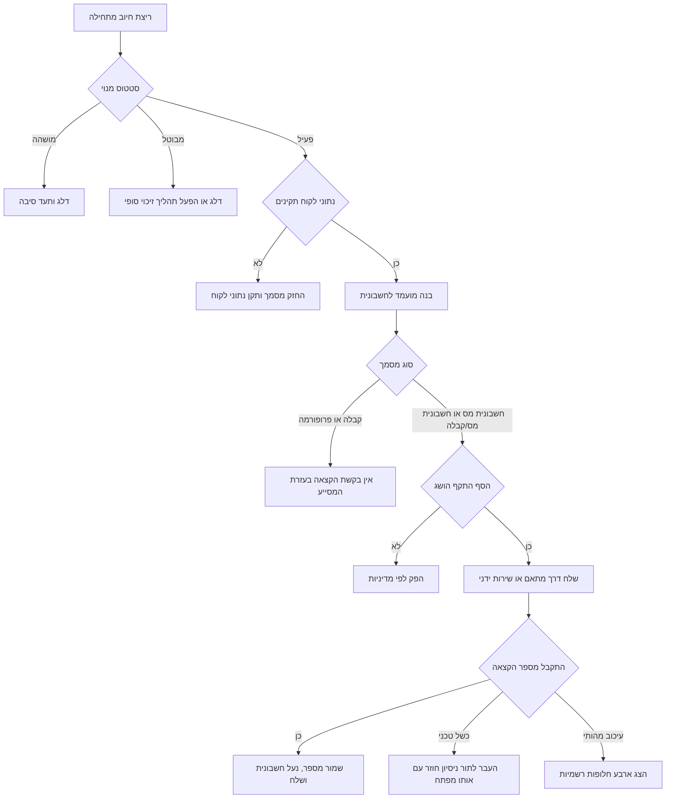

# אוטומציה לחשבוניות מחזוריות

השתמש במיומנות זו לתכנון, בדיקה ותפעול של חיוב מחזורי לעסקים קטנים, עצמאיות ועצמאים, נותני שירות ועסקים צרכניים בישראל. נהל מנויים, חישוב מע"מ, מועדי הפקת חשבוניות, חשבוניות זיכוי, החלטות לגבי מספר הקצאה ומעבר מגיליונות עבודה או ניהול ידני.

## גבולות שימוש

- התייחס לכל מסמך שנוצר כמועמד למסמך חשבונאי עד לסיום מספור, בדיקת הקצאה ומסירה ללקוח.
- אמת את שיעור המע"מ, ספי מספר הקצאה, סכמות רשמיות וחובות דיווח מול פרסומים עדכניים לפני שימוש בייצור.
- פנה למנהלת חשבונות, מנהל חשבונות, רואת חשבון, רואה חשבון או יועץ משפטי להחלטות פרטניות.
- הגן על מספרי עוסק, פרטי תשלום, פרטי חשבוניות ותשובות הקצאה לפי מדיניות פרטיות ושמירת מידע.

## מושגי יסוד

| מושג | משמעות | דוגמה |
|---|---|---|
| מנוי | הסכם חיוב חוזר מול לקוח | ריטיינר שירות חודשי |
| תאריך מסמך | התאריך המודפס על החשבונית ומשמש כברירת מחדל לבחירת שיעור מע"מ | `31/01/2026` |
| סכום לפני מע"מ | הסכום שלפיו נבדק סף מספר הקצאה | `₪10,000.00` |
| חשבונית מס | מסמך מע"מ לעסקה חייבת | `tax_invoice` |
| חשבונית מס/קבלה | מסמך משולב של חשבונית וקבלה | `tax_invoice_receipt` |
| מספר הקצאה | מספר מרשות המסים הנדרש לניכוי מס תשומות בתנאים הרלוונטיים | `202606010000000001` |
| חשבונית מס זיכוי | מסמך תיקון לביטול או חיוב יתר | מסמך שלילי מקושר |

## ברירות מחדל שאומתו לשנת 2026

- שיעור המע"מ הוא 18 אחוז החל מ-01/01/2025, ו-17 אחוז לפני תאריך זה.
- ספי ההקצאה הם לפי תאריך תחילה: ₪20,000 מ-01/01/2025, ₪10,000 מ-01/01/2026 ו-₪5,000 מ-01/06/2026.
- הסף הישן של ₪15,000 לכל שנת 2026 תוקן בבדיקת המקורות החיה.
- בשירותי API בגרסה 2 של שע"ם שמות שדות הקלט נכתבים באותיות קטנות. המטען המקומי של החבילה מיועד למתאם ויש למפות אותו לסכמה הרשמית לפני שליחה ישירה לרשות המסים.

## עץ החלטה



## תהליך מקצה לקצה

1. נרמל רשומות לקוחות.
   - הסר מקפים ורווחים ממספר עוסק או ח.פ.
   - השלם ל-9 ספרות לפי הצורך.
   - בדוק ספרת ביקורת ללקוח הרשום כעוסק מורשה.
2. בנה מנוי.
   - שמור מחזור חיוב, תאריך התחלה, תאריך סיום, סוג מסמך ושורות חיוב.
   - שמור מחירים לפני מע"מ אלא אם קיימת מדיניות מפורשת למחיר כולל מע"מ.
3. צור מועמד לחשבונית.
   - בחר שיעור מע"מ לפי תאריך המסמך.
   - חשב סכומים באמצעות `Decimal`.
   - שמור מזהה חשבונית קבוע לפני פנייה חיצונית.
4. בדוק אם נדרש מספר הקצאה.
   - השתמש בסכום לפני מע"מ.
   - השתמש בספים לפי תאריך תחילה, לא בסף שנתי יחיד.
   - בדוק סוג מסמך וסוג לקוח.
5. שלח דרך מתאם רשום.
   - שמור כתובת שירות, הרשאות ומיפוי שדות מחוץ ללוגיקה העסקית.
   - השתמש באותו מפתח ייחודיות בכל ניסיון חוזר.
   - שמור גוף בקשה וגוף תשובה גולמיים.
6. סיים הפקה ומסירה.
   - שמור מספר הקצאה ואת 9 הספרות הימניות כאשר הן דרושות להדפסה או דיווח.
   - נעל חשבונית שהופקה מפני חישוב מחדש.
   - תקן טעויות באמצעות חשבונית מס זיכוי או תהליך תיקון מקובל אחר.

## דוגמאות

### יצירת מנוי חודשי

```python
from datetime import date
from recurring_invoicing import Customer, Interval, LineItem, Subscription, build_invoice

subscription = Subscription(
    subscription_id="SUB-2026-001",
    customer=Customer(name="Acme Israel Ltd", tax_id="514324995"),
    line_items=[LineItem(description="שירות חודשי", quantity="1", unit_price="10000.00")],
    start_date=date(2026, 1, 31),
    interval=Interval.MONTHLY,
)

invoice = build_invoice(subscription, date(2026, 1, 31), invoice_sequence=1)
print(invoice.to_dict())
```

### בדיקת סף לאחר 01/06/2026

```python
from datetime import date
from recurring_invoicing import should_request_allocation, threshold_for_issue_date

print(threshold_for_issue_date(date(2026, 5, 31)))
print(threshold_for_issue_date(date(2026, 6, 1)))
print(should_request_allocation(invoice, "000000018"))
```

## מקרי קצה

| מקרה | טיפול נדרש |
|---|---|
| מנוי מתחיל ב-31/01 | שמור עוגן סוף חודש כאשר ההגדרה פעילה |
| לקוח מושהה | דלג על הפקה ותעד סיבה |
| מספר עוסק כולל אפסים מובילים | נרמל ל-9 ספרות לפני בדיקת ספרת ביקורת |
| תאריך מסמך 31/12/2024 | השתמש ב-17 אחוז מע"מ כברירת מחדל |
| תאריך מסמך 01/01/2025 | השתמש ב-18 אחוז מע"מ כברירת מחדל |
| סכום ₪7,000 בתאריך 31/05/2026 | מתחת לסף ההקצאה כברירת מחדל |
| סכום ₪7,000 בתאריך 01/06/2026 | מעל סף ההקצאה כברירת מחדל |
| התקבל תשלום לפני חשבונית | הפק חשבונית מס/קבלה פעם אחת בלבד לאחר מניעת כפילות |
| פקיעת זמן בשירות הקצאה | נסה שוב עם אותו מפתח ייחודיות |
| עיכוב מהותי בהקצאה | הצג ביטול, המשך ללא מספר, היפוך חיוב ובקשה לשימוע |

## תקלות נפוצות

| תסמין | סיבה אפשרית | פעולה |
|---|---|---|
| נדרשת הקצאה באופן לא צפוי | הסף ירד ב-01/06/2026 | בדוק את `threshold_for_issue_date` |
| הקצאה לא נדרשת אף שהסכום גבוה | סוג המסמך הוא קבלה או פרופורמה | בדוק סוג מסמך וסוג לקוח |
| הפרש אגורה במע"מ | חישוב בעזרת מספרים צפים | השתמש ב-`Decimal` ובמדיניות עיגול עקבית |
| מספר עוסק נדחה | ספרת ביקורת שגויה או אפסים חסרים | נרמל ובדוק 9 ספרות |
| נוצרה חשבונית כפולה | אירוע תשלום וריצת חיוב הופעלו יחד | הוסף מפתח ייחודיות לפי מנוי, תאריך ורצף |
| דחיית סכמה ב-API | המטען המקומי נשלח ישירות | מפה לסכמה הרשמית עם שמות שדות באותיות קטנות |

## רשימת בדיקה לייצור

- אמת שיעור מע"מ וספי הקצאה מול פרסומים רשמיים עדכניים של רשות המסים.
- אמת כתובות שירות של שע"ם בפורטל המפתחים הרשום.
- אמת מיפוי קודי סוגי מסמך מול הסכמה הרשמית.
- שמור ספי הקצאה לפי תאריך תחילה.
- הרץ בדיקות רגרסיה ל-31/05/2026 ול-01/06/2026.
- בדוק מספרי עוסק בעת יצירת לקוח ולפני הפקת חשבונית.
- נעל מסמכים לאחר הפקה.
- שמור ניסיונות חוזרים עם מפתח ייחודיות קבוע.
- שמור בקשות ותשובות הקצאה גולמיות ביומן ביקורת.
- בדוק בקרות פרטיות, שמירה והרשאות גישה למסמכים ולמספרי עוסק.
