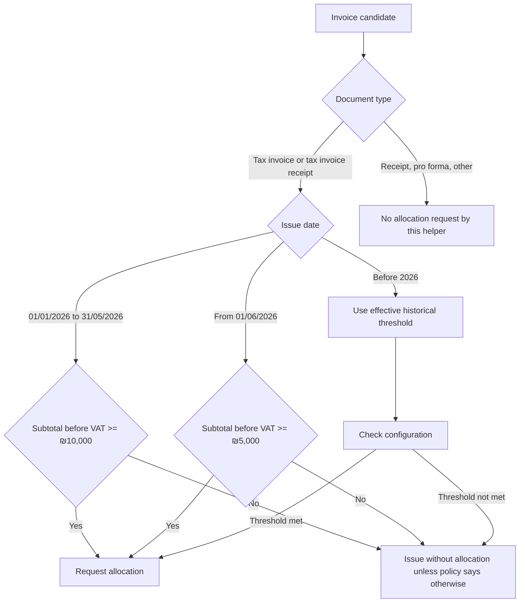

# Workflow Guide

Use these workflows to operate recurring billing without hard-coding tax assumptions. Keep VAT rates, allocation thresholds, and external endpoint mapping in reviewed configuration.

## Workflow 1: Monthly recurring invoice

1. Load the active subscription.
2. Validate customer name, email, address, and Israeli tax ID.
3. Generate the issue date from the recurrence schedule.
4. Select VAT by issue date.
5. Calculate subtotal, VAT, and total using two-decimal rounding.
6. Store an invoice candidate without final external submission.
7. Check allocation requirement using the issue-date threshold.
8. Request an allocation number through the adapter when required.
9. Store the raw response and allocation number.
10. Lock the invoice and deliver it to the customer.

## Workflow 2: 2026 allocation decision

## Workflow 3: Manual allocation fallback

Use this path when software is not connected to the service or when a temporary adapter outage prevents automated submission.

1. Confirm that the invoice is not final if local policy requires allocation before issue.
2. Collect customer authorized dealer number, invoice number, amount before VAT, and VAT amount.
3. Submit the request through the official Tax Authority manual service.
4. Save the allocation number in the invoice record.
5. Print or display the allocation number according to the official requirement, emphasizing the rightmost 9 digits when applicable.
6. Store evidence of the manual request and response.

## Workflow 4: Held invoice

1. Detect that the failure is a substantive hold, not a schema or technical failure.
2. Present the four official alternatives to the operator: cancel, continue without allocation number, reverse charge, or request a hearing.
3. Record the operator decision, timestamp, and approver.
4. For cancel or continue, update the Tax Authority using the current developer-portal endpoint only after confirming the path.
5. For reverse charge, follow the current approval flow and customer-consent process.
6. For hearing, store the hearing reference and retry allocation if the invoice is permitted.

## Workflow 5: Payment-before-invoice subscription

1. Receive the payment event from the payment processor.
2. Deduplicate by payment ID and subscription ID.
3. Generate a tax invoice receipt only once.
4. Check allocation requirement by subtotal before VAT and issue date.
5. Submit through the adapter or manual service if required.
6. Deliver the document only after final locking.

## Workflow 6: Mid-year threshold change

1. Store thresholds as effective-date configuration, not as a single yearly value.
2. Load the threshold by invoice issue date.
3. Run regression tests for the day before and the day of the threshold change.
4. Backfill only unissued invoice candidates.
5. Do not recalculate historical invoices that were already issued.

## Workflow 7: Migration from spreadsheets

1. Freeze the spreadsheet as the source snapshot.
2. Normalize customer tax IDs to 9 digits.
3. Create one subscription record per recurring agreement.
4. Import last-issued invoice sequence and last issue date.
5. Reconcile open payments and credit notes.
6. Generate a dry-run schedule for the next 12 cycles.
7. Compare totals with the spreadsheet before activating automation.
