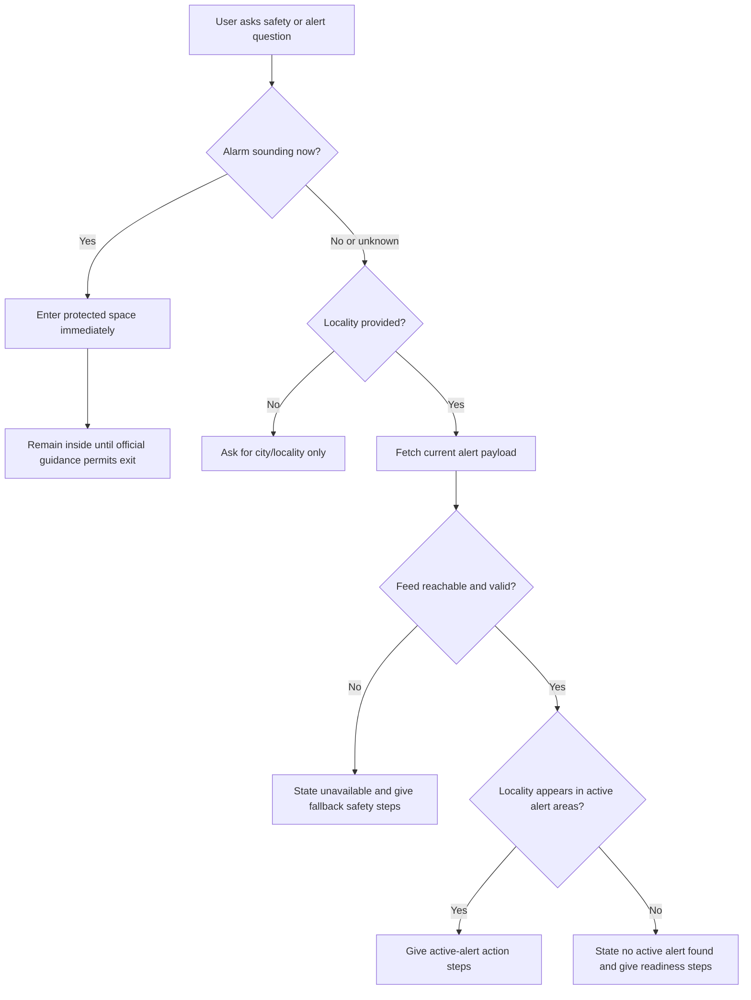
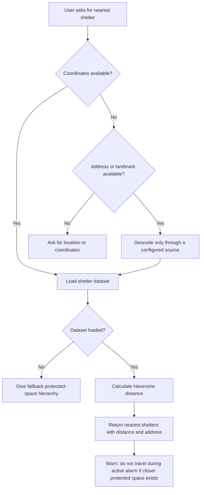
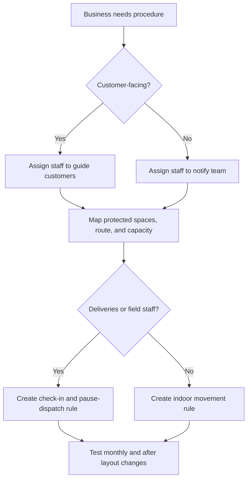

# Red-Alert & Shelter Finder

Provide current Home Front Command alert status through configured sources and nearest public-shelter guidance for Israeli small businesses, freelancers, and consumers. Use this skill when a user needs to check whether a locality is under an active alert, decide what to do during an alarm, find nearby public shelters, create a business continuity routine, or troubleshoot an alert/shelter integration.

This skill is operational guidance, not an emergency-services substitute. When an alarm sounds, follow Home Front Command instructions, enter the protected space immediately, and remain there until official guidance permits exit.

## Core outcomes

- Check active Home Front Command alert payloads.
- Match user-provided localities against alert areas, including Hebrew spelling variants.
- Find nearest public shelters from a local or configured shelter dataset.
- Provide clear action steps for shops, clinics, offices, delivery teams, freelancers, households, and consumers outside.
- Separate “no active alert found” from “alert feed unavailable”.
- Preserve privacy. Do not store precise home or workplace location unless explicitly required.

## Typical users

| User type | Need | Recommended response |
|---|---|---|
| Small business owner | Keep staff and customers safe during business hours | Give current alert status, nearest shelter list, and a staff/customer action script |
| Freelancer | Pause a meeting, delivery, or client visit | Check location, recommend immediate protected-space steps, suggest client message |
| Consumer outside | Find nearby public shelter | Ask for current location or coordinates, rank shelters, include fallback guidance |
| Operations manager | Prepare standing procedure | Use the production checklist and test scenarios |
| Developer | Integrate alert/shelter data into a kiosk, website, or app | Use the Python client, CLI, and API reference |

## Inputs to request

Ask only for missing information needed to complete the task.

| Need | Ask for |
|---|---|
| Check active alerts | Locality name in Hebrew or English |
| Find nearest shelters | Current address, landmark, or coordinates |
| Create business procedure | Business type, city, staff count, customer-facing status |
| Debug integration | Endpoint, response sample, HTTP status, timestamp |
| Build automated monitor | Locality list, polling interval, escalation channel |

During an active alarm, do not ask optional questions. Give immediate protective steps first.

## Fast response patterns

### Active alert in the user's area

1. State: “Active alert detected for `<area>`.”
2. Direct: “Enter the nearest protected space now.”
3. Wait: “Remain inside until official guidance permits exit.”
4. If outside, list nearest shelters only when it does not encourage unsafe travel.
5. For a business, stop checkout, move customers, pause deliveries, and keep exits clear.

### No active alert found

1. State: “No active alert found for `<area>` in the current payload.”
2. Add: “Alert feeds can change within seconds.”
3. Prepare: “Keep the protected-space route clear and notifications active.”
4. Offer shelter lookup or preparedness checklist.

### Data unavailable

1. State: “Alert feed unavailable” or “Shelter dataset unavailable.”
2. Do not translate unavailable data into “no alerts”.
3. Give fallback safety guidance: follow sirens, official alerts, and municipal instructions.
4. Log timestamp, status, and failure category.

## Decision tree: safety question

## Decision tree: nearest shelter

## Decision tree: business workflow

## Concrete examples

### Shop in Rishon LeZion

User: “Check alerts for ראשון לציון and tell me what to do if customers are in the store.”

Response:
- Check the current payload for “ראשון לציון”.
- If active: “Enter the protected space now. Staff member 1 guides customers. Staff member 2 closes the register and keeps the route clear. Do not send anyone outside to move cars or collect bags.”
- If inactive: “No active alert appears for ראשון לציון in the current payload. Keep the route clear and brief staff at shift start.”

### Freelancer near Dizengoff Center

User: “I’m near Dizengoff Center, where is the closest miklat?”

Response:
- Request coordinates or use supplied coordinates.
- Return up to five shelters sorted by distance.
- Add: “If an alarm is sounding now, enter the closest protected space immediately. Do not walk to a farther shelter.”

### Remote worker in Haifa

User: “Is there a red alert in חיפה?”

Response:
- Normalize “חיפה”.
- Fetch and parse alert data.
- Return active, inactive, or unavailable.
- Add concise protective-space guidance.

### Restaurant with delivery riders

User: “Create a protocol for delivery riders in אשדוד.”

Response:
- Add Ashdod to watch list.
- Pause dispatch when alert appears.
- Instruct riders to stop safely, enter nearest protected space, and check in after the waiting period.
- Prepare customer delay message.

### Consumer with no shelter nearby

User: “No miklat nearby. What do I do?”

Response:
- Give fallback hierarchy: residential protected room, shared shelter, stairwell, interior room, lie down and protect head if outside and no protected space can be reached.
- Do not recommend travel during an active alarm.

## Edge cases

| Edge case | Handling |
|---|---|
| Locality spelling differs | Normalize Unicode, Hebrew punctuation, hyphens, apostrophes, niqqud, and duplicate spaces |
| Regional council supplied | Match official alert-area names; do not expand all nearby towns without verified mapping |
| Feed returns empty JSON | Treat as no active alert only if response is valid and timely |
| Feed returns HTTP 403/429 | Report access blocked or rate-limited; retry with backoff |
| Feed times out | Report unavailable; give fallback safety guidance |
| User says “near me” | Request location or coordinates |
| User asks for route during alarm | Do not encourage travel; recommend nearest protected space |
| Shelter data lacks opening hours | Say “opening status not verified”; include municipal fallback |
| GPS is imprecise | Mark distances approximate |
| Multiple shelters tie | Sort by distance, then name |
| Pets involved | Mention leash/carrier only if it does not delay entry |
| Accessibility need | Assign assistance buddy and prefer accessible protected spaces when data exists |
| Reopening after alert | Wait for official guidance, then check people, damage, and route safety |

## Anti-patterns

Do not:
- Claim a location is safe because the latest feed is empty.
- Tell a user to travel to a public shelter during an active alarm when a closer protected space exists.
- Store exact home coordinates without explicit consent.
- Invent shelter addresses or opening status.
- Treat municipal shelter data as complete unless the source states that.
- Poll aggressively without backoff.
- Hide feed errors behind “no alerts”.
- Use promotional language, visual marks, image references, creator callouts, or distribution callouts.
- Use first-person organizational language in procedure text.

## Production checklist

### Data
- Configure alert endpoint and shelter source through settings.
- Keep a last-known-good shelter dataset.
- Validate coordinates and reject impossible lat/lon values.
- Maintain Hebrew and English locality aliases.
- Log response status, latency, payload size, parse result, and staleness.
- Store minimal location data.

### Reliability
- Use short timeouts.
- Apply exponential backoff for 403, 429, 500, 502, 503, and 504.
- Treat stale data as unavailable.
- Separate inactive status from unavailable data.
- Run the bundled pytest suite and scenario checklist after every schema or dataset change.

### UX
- During active alerts, show immediate action before explanation.
- Use large text and high contrast on storefront displays.
- Support Hebrew first for Israeli consumer flows.
- Use meters/kilometers for distances.
- Use DD/MM/YYYY and ₪ in Hebrew business documents.

### Operations
- Assign one owner per shift.
- Keep the route clear.
- Train staff during onboarding and quarterly.
- Test notifications monthly.
- Keep an offline printed procedure.
- Review every real event and update the checklist.

## Security and privacy

- Do not publish exact home, clinic, kindergarten, or workplace coordinates.
- Redact precise coordinates from logs unless operationally required.
- Do not expose API keys or internal endpoints in CLI output.
- Prefer local distance calculation.
- Limit retention for alert checks tied to user locations.

## File map

- `SKILL.md` — English guide.
- `SKILL_HE.md` — Hebrew guide.
- `references/api-reference.md` — API, data, and regulation reference.
- `references/workflow-guide.md` — end-to-end workflows.
- `references/troubleshooting.md` — deeper troubleshooting.
- `references/test-scenarios.md` — scenario coverage.
- `references/migration-checklist.md` — migration steps.
- `src/red_alert_shelter_finder/client.py` — typed sync/async client.
- `scripts/red_alert_shelter_finder_cli.py` — Click CLI.
- `scripts/test_red_alert_shelter_finder_client.py` — pytest suite.
- `scripts/examples/` — runnable examples.
