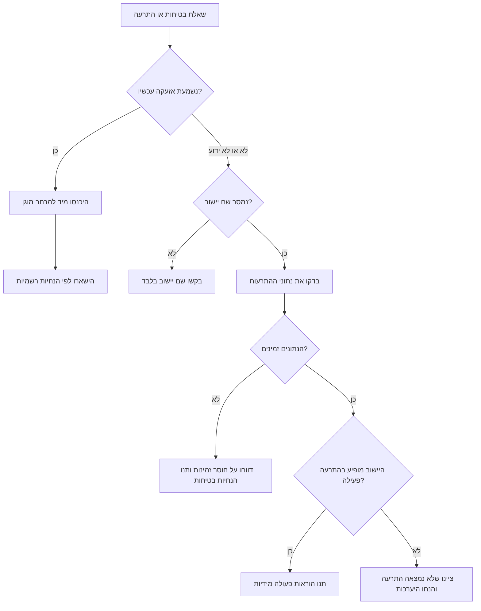
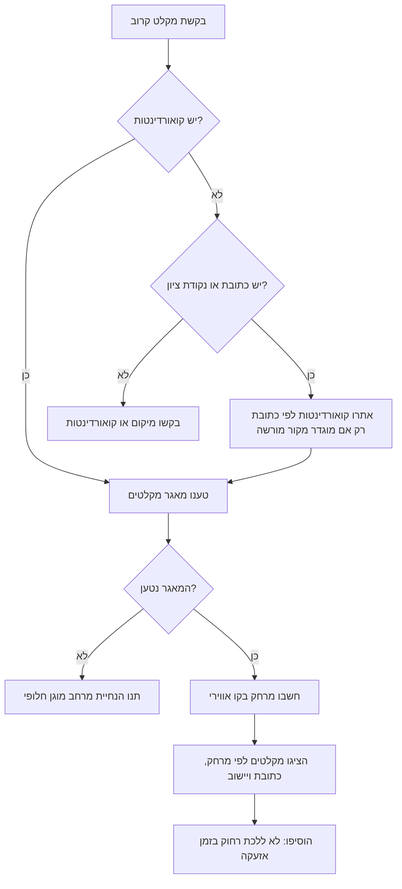
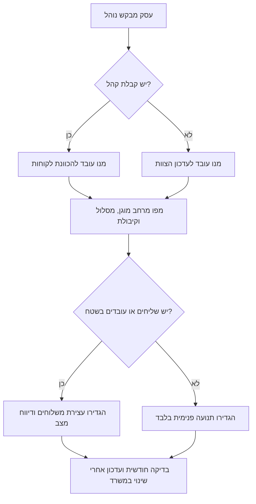

# איתור התרעות ומקלטים

השתמשו במיומנות זו לבדיקת התרעות פיקוד העורף דרך מקורות מוגדרים, להתאמת יישוב לאזור התרעה פעיל, ולאיתור מקלט ציבורי קרוב עבור עסקים קטנים, עצמאים, עובדים בשטח וצרכנים בישראל. נסחו מענה קצר, מעשי וניטרלי, במיוחד בזמן אזעקה.

ההנחיות כאן אינן מחליפות את הוראות פיקוד העורף, הרשות המקומית או גורמי החירום. בזמן אזעקה יש להיכנס מיד למרחב המוגן הקרוב ולפעול לפי ההנחיות הרשמיות.

## מטרות מרכזיות

- בדקו התרעות פעילות מתוך נתוני פיקוד העורף.
- התאימו שם יישוב בעברית או באנגלית לשמות אזורי התרעה.
- אתרו מקלטים ציבוריים קרובים לפי קואורדינטות או מקור נתונים מקומי.
- צרו תהליך עבודה ברור לעסק, לעובדים, ללקוחות ולשליחים.
- הפרידו בין "לא נמצאה התרעה פעילה" לבין "מקור הנתונים אינו זמין".
- שמרו על פרטיות: אל תשמרו כתובת בית או מיקום מדויק ללא בקשה מפורשת.

## למי זה מיועד

| משתמש | צורך | מענה מומלץ |
|---|---|---|
| בעל חנות | העברת עובדים ולקוחות למרחב מוגן | סטטוס התרעה, מקלטים קרובים ונוהל קצר למשמרת |
| עצמאי | החלטה אם לעצור פגישה, נסיעה או שירות | בדיקת יישוב, הנחיית כניסה למרחב מוגן ונוסח הודעה ללקוח |
| צרכן ברחוב | מציאת מקלט ציבורי קרוב | בקשת מיקום או קואורדינטות, דירוג מקלטים לפי מרחק |
| מנהל תפעול | נוהל המשכיות עסקית | רשימת בדיקות, תרחישי בדיקה ותיעוד |
| מפתח | שילוב נתוני התרעות ומקלטים במערכת | שימוש בלקוח Python ובמסמך הממשקים |

## אילו פרטים לבקש

בקשו רק את המידע שחסר לביצוע הפעולה.

| משימה | פרטים נדרשים |
|---|---|
| בדיקת התרעה | שם יישוב או אזור |
| מציאת מקלט | כתובת, נקודת ציון או קואורדינטות |
| נוהל לעסק | סוג עסק, יישוב, מספר עובדים, קבלת קהל או ללא קהל |
| פתרון תקלה | כתובת ממשק, דוגמת תגובה, קוד HTTP ושעה |
| ניטור קבוע | רשימת יישובים, תדירות בדיקה וערוץ התראה |

בזמן אזעקה אין לעכב את המשתמש בשאלות לא חיוניות. תחילה תנו הוראת כניסה למרחב מוגן.

## תבניות מענה מהיר

### קיימת התרעה פעילה באזור

1. ציינו סטטוס: "נמצאה התרעה פעילה עבור `<יישוב>`."
2. הנחו פעולה מידית: "היכנסו עכשיו למרחב המוגן הקרוב."
3. ציינו המתנה: "הישארו במרחב המוגן עד לקבלת הנחיה רשמית לצאת."
4. אם המשתמש נמצא בחוץ, הציגו מקלטים קרובים או הנחיית מרחב מוגן חלופי.
5. לעסק: עצרו קופה, כוונו לקוחות, עצרו משלוחים ושמרו מעברים פנויים.

### לא נמצאה התרעה פעילה

1. ציינו: "לא נמצאה התרעה פעילה עבור `<יישוב>` בנתונים הנוכחיים."
2. הוסיפו הסתייגות: "התרעות עשויות להשתנות בתוך שניות."
3. הנחו היערכות: "השאירו את הדרך למרחב המוגן פנויה והפעילו התראות."
4. הציעו איתור מקלט או נוהל מוכנות.

### מקור הנתונים אינו זמין

1. ציינו את התקלה: "מקור ההתרעות אינו זמין" או "מאגר המקלטים אינו זמין."
2. אל תציגו זאת כאילו אין התרעה.
3. תנו הנחיית בטיחות: פעלו לפי אזעקות, יישומון פיקוד העורף והנחיות הרשות המקומית.
4. המליצו לתעד שעה, קוד שגיאה ומשך תקלה.

## עץ החלטה: "האם בטוח?"

## עץ החלטה: איתור מקלט

## עץ החלטה: נוהל לעסק

## דוגמאות שימוש

### דוגמה 1: חנות בראשון לציון

בקשה: "בדוק התרעות בראשון לציון ומה לעשות כשיש לקוחות בחנות."

מענה:

- בדקו את "ראשון לציון" מול נתוני ההתרעות.
- אם קיימת התרעה: "היכנסו עכשיו למרחב המוגן. עובד אחד מכוון לקוחות. עובד שני סוגר קופה ושומר שהכניסה לא תחסום את המעבר. אין לשלוח עובדים החוצה להזיז רכבים או להביא תיקים."
- אם אין התרעה: "לא נמצאה התרעה פעילה בראשון לציון בנתונים הנוכחיים. שמרו את המעבר למרחב המוגן פנוי ותדרכו את הצוות בתחילת משמרת."

### דוגמה 2: עצמאי ליד דיזנגוף סנטר

בקשה: "איפה המקלט הכי קרוב?"

מענה:

- בקשו קואורדינטות או נקודת ציון אם לא קיימות.
- הציגו עד חמישה מקלטים לפי מרחק.
- הוסיפו: "בזמן אזעקה אין להתחיל הליכה למקלט רחוק אם יש מרחב מוגן קרוב יותר. היכנסו לבניין קרוב, חדר מדרגות, ממ"ד או חדר פנימי לפי ההנחיות."

### דוגמה 3: עובד מרחוק בחיפה

בקשה: "יש התרעה בחיפה?"

מענה:

- נרמלו את שם היישוב "חיפה".
- בדקו אם הוא מופיע באזורי ההתרעה הפעילים.
- החזירו סטטוס ברור: פעיל, לא פעיל או מקור נתונים לא זמין.
- הוסיפו הנחיית מוכנות קצרה.

### דוגמה 4: מסעדה עם שליחים באשדוד

בקשה: "בנה נוהל לשליחים באשדוד."

מענה:

- הוסיפו את אשדוד לרשימת ניטור.
- עצרו שילוח כאשר מופיעה התרעה.
- הנחו שליח לעצור במקום בטוח, להיכנס למרחב מוגן קרוב ולדווח לאחר זמן ההמתנה.
- הכינו נוסח עדכון ללקוח.

### דוגמה 5: צרכן בלי מקלט קרוב

בקשה: "אין מקלט באזור, מה עושים?"

מענה:

- סדר עדיפות: ממ"ד, מקלט משותף, חדר מדרגות פנימי, חדר פנימי עם מינימום קירות חיצוניים וחלונות.
- אם נמצאים בשטח פתוח ואין מרחב מוגן קרוב, יש לשכב על הקרקע ולהגן על הראש לפי ההנחיות.
- אין להמליץ על נסיעה או הליכה ארוכה בזמן אזעקה.

## מונחים מקצועיים בעברית

| English | עברית מומלצת |
|---|---|
| protected space | מרחב מוגן |
| public shelter | מקלט ציבורי |
| shared shelter | מקלט משותף |
| residential protected room | ממ"ד |
| alert area | אזור התרעה |
| active alert | התרעה פעילה |
| fallback guidance | הנחיית חלופה |
| business continuity | המשכיות עסקית |
| incident log | יומן אירוע |
| drill | תרגול |
| polling | תשאול מחזורי |
| timeout | חריגת זמן |
| backoff | השהיה מדורגת |
| parsing | פענוח נתונים |

## התאמה לעסקים בישראל

- עלות שילוט בסיסי לדלתות ולמסלול: לדוגמה, ₪150-₪500, תלוי בכמות ובחומר.
- תיעוד תרגול: השתמשו בתאריך בפורמט DD/MM/YYYY, לדוגמה 04/06/2026.
- שמירת מסמכים: נוהל משמרת, רשימת אנשי קשר, יומן אירועים, תיעוד תרגול.
- חנויות ומרפאות: הגדירו עובד אחראי קהל ועובד אחראי דלת או קופה.
- משרדים קטנים: שמרו מעבר פנוי לממ"ד או לחדר מדרגות פנימי.
- עצמאים בבית: הכינו מראש מטען, מים, תרופות חיוניות ומקום לחיית מחמד במרחב המוגן.
- שליחים ונותני שירות: הגדירו עצירת נסיעה, דיווח מצב וחזרה לשירות רק לאחר הנחיה רשמית.

## מקרי קצה

| מקרה | טיפול |
|---|---|
| שם יישוב כתוב אחרת | נרמלו גרשיים, מקפים, רווחים וסימני ניקוד |
| יישוב במועצה אזורית | התאימו לשם אזור ההתרעה המדויק; אל תניחו שכל היישובים הסמוכים כלולים |
| תגובת JSON ריקה | התייחסו כאל אין התרעה רק אם התגובה תקינה ועדכנית |
| HTTP 403 או 429 | דווחו על חסימה או הגבלת קצב; הפעילו השהיה מדורגת וניסיון חוזר |
| חריגת זמן | דווחו על חוסר זמינות ותנו הנחיות בטיחות |
| "לידי" ללא מיקום | בקשו מיקום או קואורדינטות |
| בקשת מסלול בזמן אזעקה | אל תעודדו תנועה; הנחו כניסה למרחב המוגן הקרוב |
| מאגר מקלטים ללא שעות פתיחה | ציינו "סטטוס פתיחה לא אומת" והפנו לרשות המקומית |
| GPS לא מדויק | ציינו מרחק משוער ובקשו נקודת ציון רק אם צריך |
| כמה מקלטים באותו מרחק | מיינו לפי מרחק ואז שם |
| חיות מחמד | הוסיפו רצועה או כלוב נשיאה אם הדבר אינו מעכב כניסה |
| עובד עם מוגבלות | הגדירו מלווה וסדר עדיפויות למרחב נגיש |
| פתיחה מחדש | חכו להנחיה רשמית, ואז בדקו עובדים, לקוחות ונזקים |

## מה לא לעשות

- לא לומר שמקום "בטוח" רק מפני שהתגובה האחרונה ריקה.
- לא לשלוח משתמש למקלט רחוק בזמן אזעקה אם יש מרחב מוגן קרוב יותר.
- לא לשמור מיקום בית מדויק בלי בקשה מפורשת.
- לא להמציא כתובות מקלטים.
- לא להציג מאגר עירוני כשלם אם המקור לא מציין זאת.
- לא לבצע תשאול מחזורי אגרסיבי ללא השהיה מדורגת.
- לא להסתיר שגיאות מקור נתונים מאחורי "אין התרעות".
- לא להשתמש במיתוג, סמלים, באנרים או קרדיטים.
- לא להשתמש בשפה שיווקית.
- לא לתעתק מונחים כשיש מונח מקצועי בעברית.

## רשימת בדיקות להטמעה

### נתונים

- הגדירו כתובת מקור התרעות דרך משתנה סביבה.
- הגדירו מקור מאגר מקלטים ותדירות רענון.
- שמרו עותק אחרון תקין של מאגר מקלטים.
- אמתו קואורדינטות בישראל.
- נהלו מילון כינויים ליישובים בעברית ובאנגלית.
- תעדו קוד תגובה, זמן תגובה, גודל תוכן תגובה ותוצאת פענוח.
- מזערו שמירת נתוני מיקום.

### אמינות

- השתמשו בזמן המתנה קצר.
- הפעילו השהיה מדורגת עבור 403, 429, 500, 502, 503 ו-504.
- התייחסו לנתון ישן כלא זמין.
- הפרידו בין "אין התרעה" לבין "המקור לא זמין".
- הריצו לפחות 20 תרחישי בדיקה.
- נטרו שינויי מבנה נתונים.

### חוויית משתמש

- בזמן התרעה פעילה: פעולה לפני הסבר.
- במסך חנות או עמדת מידע: טקסט גדול וניגודיות גבוהה.
- בעברית: תאריך DD/MM/YYYY וסכומים ב-₪.
- מרחקים: מטרים או קילומטרים.
- ניסוח: ציווי ברור, ללא "אנחנו" וללא "אני".

### תפעול

- מנו אחראי משמרת.
- שמרו מסלול פנוי למרחב מוגן.
- תדרכו עובד חדש ביום הראשון.
- בצעו תרגול רבעוני ובדיקה חודשית.
- שמרו עותק מודפס של הנוהל.
- בצעו תחקיר קצר אחרי אירוע אמת.

## פתרון תקלות מקוצר

| סימפטום | סיבה אפשרית | פעולה |
|---|---|---|
| כל היישובים מוצגים ללא התרעה | תגובה ריקה או שינוי מבנה נתונים | בדקו תוכן תגובה גולמי ומבנה נתונים |
| 403 | חסימת גישה, כותרות חסרות או עומס | השתמשו בגישה מאושרת והפעילו השהיה מדורגת |
| שמות עבריים לא מזוהים | Unicode או כינוי חסר | נרמלו והוסיפו כינוי |
| מרחקי מקלטים שגויים | קו רוחב וקו אורך הפוכים | בדקו גבולות קואורדינטות בישראל |
| CLI לא טוען לקוח | התקנה חסרה או סביבה לא פעילה | הריצו `pip install -e .` בסביבת העבודה |
| בדיקת async נכשלת | שימוש שגוי בלולאת אירועים | השתמשו ב-asyncio.run או pytest-asyncio |

## אבטחת מידע ופרטיות

- אל תפרסמו כתובת בית, גן ילדים, מרפאה או עסק של המשתמש.
- השחירו קואורדינטות מדויקות ביומנים אלא אם נדרש תפעולית.
- אל תציגו מפתחות גישה בפלט CLI.
- אל תשמרו היסטוריית התרעות עם מיקומי משתמשים ללא צורך.
- העדיפו חישוב מרחקים מקומי.

## הערות אימות רשת

- ערוצי פיקוד העורף הרשמיים מאשרים קבלת התרעות ומידע מציל חיים דרך היישומון והפורטל.
- לא אומת מסמך רשמי שמגדיר את `alerts.json` כממשק ציבורי מחייב. שמרו את כתובת המקור כפרמטר הניתן לשינוי.
- איתור מקלטים תלוי במאגר שהוגדר. רשויות מקומיות מפרסמות רשימות ומפות מקלטים, אך כיסוי וזמינות בפועל תלויים במקור.
- החבילה אינה מחשבת מע"מ. אם מוסיפים בעתיד חישובי עלות לעסקים, אמתו את שיעור המע"מ העדכני לפני שימוש.
