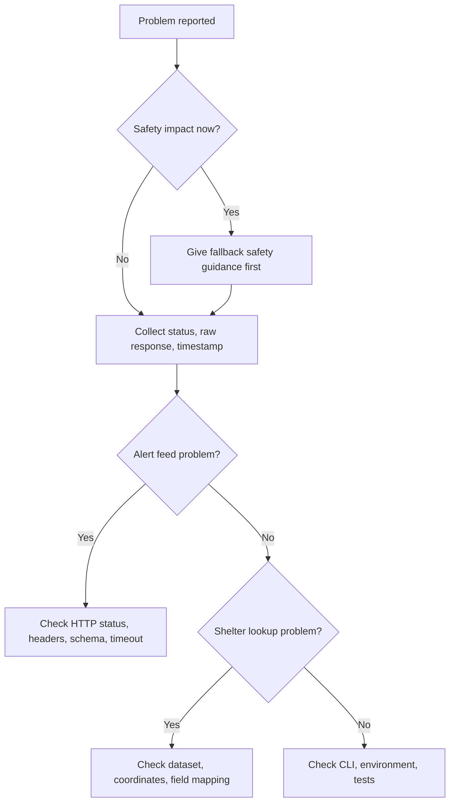

# Troubleshooting

## Triage flow



## Alert feed returns no alerts for every city

Possible causes:
- Payload is valid and no active alerts exist.
- Cache serves stale empty content.
- Parser reads the wrong field.
- Endpoint changed.
- Proxy or CDN block page is parsed incorrectly.

Checks:

```bash
python scripts/red_alert_shelter_finder_cli.py alerts --raw
```

Confirm:
- HTTP status is 200.
- Payload is valid JSON.
- Timestamp is recent.
- `data` contains localities when alerts are active.
- Empty payload is not caused by a parsing failure.

## HTTP 403

Possible causes:
- Missing headers.
- Source access policy changed.
- Rate limit or automated-client filtering.
- Origin or referer policy.

Actions:
1. Reduce polling.
2. Add backoff.
3. Use configured headers.
4. Confirm source policy.
5. Surface “feed unavailable” rather than “no alerts”.

## HTTP 429

Cause: rate limit.

Actions:
- Back off exponentially.
- Stop background polling when not needed.
- Cache identical alert IDs briefly.
- Do not retry in a tight loop.

## Malformed JSON

Possible causes:
- JSONP wrapper.
- HTML block page.
- Encoding issue.
- Partial response.

Actions:
- Log the first 200 characters after redaction.
- Check content type.
- Use the client parser for callback wrappers.
- Fail closed: status unavailable, not inactive.

## Hebrew locality does not match

Possible causes:
- Geresh/gershayim variants.
- Hyphen variants.
- Extra spaces.
- Niqqud.
- Missing alias.
- English name supplied without alias.

Actions:
- Normalize Unicode.
- Remove niqqud.
- Collapse spaces.
- Add alias:

```json
{
  "תא": "תל אביב - יפו",
  "tel aviv": "תל אביב - יפו"
}
```

## Regional council confusion

Do not map an entire regional council to all localities automatically. Alerts are listed by official alert areas. Use exact names or verified aliases.

## Shelter lookup returns wrong nearest shelter

Possible causes:
- Latitude and longitude reversed.
- GeoJSON `[lon, lat]` interpreted as `[lat, lon]`.
- Dataset uses Israel Grid coordinates instead of WGS84.
- Duplicate or outdated shelter records.

Actions:
- Validate coordinate bounds.
- Confirm source coordinate reference system.
- Convert coordinates before loading.
- Print top distances for manual inspection.
- Check duplicate records within 10 meters.

## Shelter has no opening status

Many datasets list shelter locations but not real-time opening status. State “opening status not verified” and include the municipality as a fallback source.

## CLI import error

The required client filename contains hyphens. The CLI loads it with `importlib.util`. Run commands from the repository root or use an absolute path.

```bash
python scripts/red_alert_shelter_finder_cli.py --help
```

## Async test failure

Use `asyncio.run()` in standalone scripts. Keep event loops isolated in pytest. The bundled tests avoid external async plugins.

## Production incident checklist

- Record timestamp and timezone.
- Record status code and latency.
- Save redacted raw payload.
- Record whether fallback guidance appeared.
- Identify whether the issue is source, network, parser, dataset, or UI.
- Update tests if schema changed.
- Document the fix in `CHANGELOG.md`.

## Safe fallback wording

English:

```text
Alert data is unavailable right now. If an alarm is sounding or official instructions are issued, enter the nearest protected space immediately and remain there until official guidance permits exit.
```

Hebrew:

```text
נתוני ההתרעות אינם זמינים כרגע. אם נשמעת אזעקה או מתקבלת הנחיה רשמית, היכנסו מיד למרחב המוגן הקרוב והישארו בו עד לקבלת הנחיה רשמית לצאת.
```
