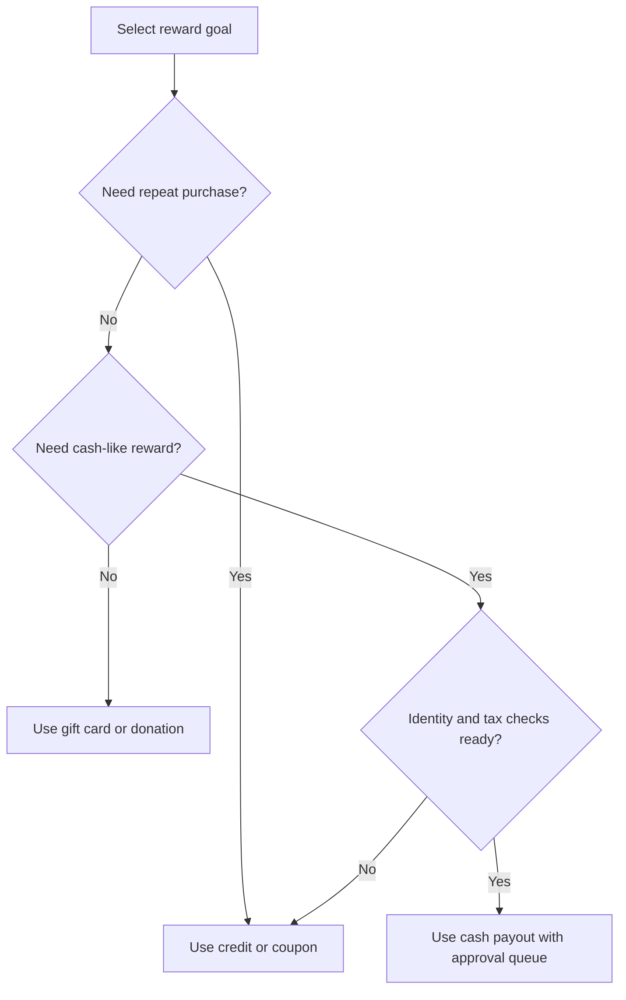
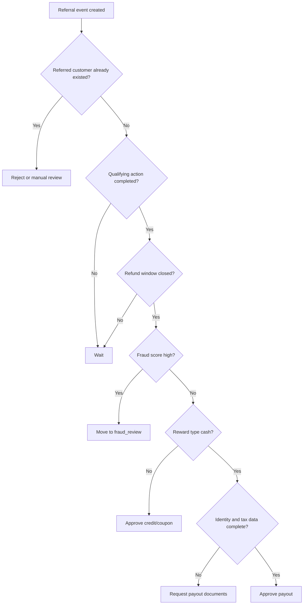

# Referral Program Manager

## Purpose

Use this skill to design, launch, track, and audit referral programs for Israeli small businesses, freelancers, service providers, online shops, communities, and consumer-facing ventures. Build a clear "friend brings friend" program, track referrals from invitation through payout, integrate with Israeli payment-gateway or operational payout workflows, and keep privacy, tax, consumer, and messaging controls visible.

## Operating principles

1. Define a reward only after the qualifying action is measurable.
2. Record consent before sending promotional messages.
3. Separate marketing eligibility from accounting eligibility.
4. Keep a ledger for every referral, credit, coupon, payout, refund, reversal, and tax document.
5. Prefer customer credit or coupon rewards when cash payout creates disproportionate tax and operational burden.
6. Verify gateway-specific behavior in the merchant dashboard before production.
7. Avoid promising instant rewards unless payment, refund, fraud, and tax flows can complete instantly.
8. Attach a terms version to every referral event.

## Israeli use cases

| Business type | Qualifying action | Recommended reward | Notes |
|---|---:|---|---|
| Hair salon, clinic, trainer, tutor | Referred customer attends and pays | ₪50–₪100 credit for each side | Use booking status and invoice receipt as trigger. |
| Online store | Order paid and not refunded after cooling-off window | Coupon or store credit | Delay reward until cancellation/return window ends. |
| Freelancer or consultant | Referred client signs and pays first invoice | Fixed ₪ or percentage credit | Cap referrals per referrer per month. |
| SaaS or digital service | Referred account becomes paid and remains active | Account credit or invoice discount | Track churn before payout. |
| Local consumer group | Verified signup plus first purchase | Coupon code or wallet credit | Avoid cash unless identity and tax handling are ready. |

## Core data model

| Object | Required fields | Purpose |
|---|---|---|
| `Customer` | `customer_id`, `name`, `phone`, `email`, `consent_marketing`, `created_at` | Represents referrers and referred customers. |
| `Program` | `program_id`, `reward_type`, `reward_amount_ils`, `qualifying_action`, `cooldown_days`, `max_rewards_per_customer` | Defines rules and limits. |
| `ReferralEvent` | `event_id`, `program_id`, `referrer_id`, `referred_customer_id`, `status`, `source`, `created_at` | Tracks the lifecycle. |
| `Reward` | `reward_id`, `event_id`, `recipient_customer_id`, `amount_ils`, `status`, `tax_treatment`, `gateway_reference` | Tracks approval and payout. |
| `GatewayPayout` | `gateway`, `payload`, `response`, `idempotency_key`, `status` | Records gateway/refund/payout integration. |
| `AuditEntry` | `timestamp`, `actor`, `action`, `before`, `after` | Provides traceability. |

Suggested statuses:

```text
invited -> registered -> qualified -> reward_pending -> reward_approved -> reward_paid
                                  \-> fraud_review
                                  \-> rejected
                                  \-> reversed
```

## Referral lifecycle

1. Create a program with a clear rule, for example: "Reward after the referred customer pays first invoice and the payment is not refunded for 14 days."
2. Register the referrer and referred customer with unique IDs.
3. Generate a referral code or link.
4. Capture attribution during signup, checkout, quote request, booking, or manual CRM entry.
5. Validate eligibility:
   - no self-referral;
   - no duplicate household/phone when prohibited;
   - referred customer not already active;
   - paid qualifying action completed;
   - refund/cancellation window closed;
   - marketing consent recorded for promotional messaging.
6. Create a reward in `pending` status.
7. Approve after fraud review and accounting review.
8. Pay through gateway refund, store credit, coupon, bank-transfer batch, or manual ledger entry.
9. Issue required invoice, receipt, credit note, or accounting entry according to reward type.
10. Monitor disputes, chargebacks, cancellations, and reversals.

## Reward design

| Type | Best for | Implementation notes |
|---|---|---|
| Store credit | Retail, clinics, repeat services | Apply as balance against future invoice; record VAT treatment. |
| Coupon | Ecommerce and booking | Generate one-time code with expiry and minimum spend. |
| Cash payout | B2B referrers, affiliates | Require identity, tax and payment controls. |
| Card refund | "get ₪ back" offers | Use only when gateway supports partial refund tied to original transaction. |
| Gift card | Consumer acquisition | Track liability until redeemed or expired. |
| Donation | Community campaigns | Record beneficiary and receipt process. |

### Decision tree: choose a reward



Recommended defaults:

| Setting | Default |
|---|---|
| Reward amount | 5%–15% of gross margin, not revenue |
| Minimum qualifying payment | At least 2x reward amount |
| Cooling-off delay | 14 days for goods; 7–30 days for services |
| Monthly cap | 5 rewards per customer unless manually approved |
| Expiry | 90–180 days for coupons or credits |
| Fraud review threshold | ≥3 referrals from same device/IP/payment card/phone family in 30 days |

## Israeli compliance checklist

This skill is operational guidance, not legal or tax advice. Confirm production rules with a licensed Israeli accountant or lawyer.

| Area | Practical requirement | Control |
|---|---|---|
| VAT and bookkeeping | Rewards may be discounts, credits, marketing expenses, or compensation depending on structure. | Store accounting classification and document number. |
| Income tax and withholding | Cash rewards to businesses or individuals may require tax-document collection or withholding checks. | Require identity and tax fields before cash payout. |
| Consumer Protection Law | Promotion terms must be clear, available, and not misleading. | Publish eligibility, exclusions, expiry, cap, and reversal terms. |
| Privacy Protection Law | Personal data collection must be proportionate, secured, and disclosed. | Keep purpose, consent, retention, and access records. |
| Communications Law §30A | Marketing SMS/email/WhatsApp requires consent or another lawful basis. | Store opt-in timestamp, channel, source, and opt-out status. |
| Payment-card rules | Refunds and card operations must follow acquirer and gateway rules. | Use idempotency keys and daily reconciliation. |

## Payment-gateway integration strategy

Israeli providers differ by contract, merchant terminal, endpoint version, and enabled modules. Use a provider adapter behind one internal interface.

```text
Referral reward approved
        |
        v
Build payout/refund/credit request
        |
        v
Send to gateway adapter or export manual payout CSV
        |
        v
Store transaction ID, status, raw response hash
        |
        v
Reconcile against settlement/export
```

| Provider | Common use | Verify before production |
|---|---|---|
| Cardcom | card charges, refunds, tokens, invoices in selected plans | partial refund support, webhook format, invoice module, sandbox |
| Tranzila | card clearing, hosted payment pages, recurring/token payments | refund permissions, response codes, signature validation |
| Meshulam | hosted checkout, card and Bit-style flows depending on contract | refund API availability, webhook signing, settlement references |
| PayPlus | ecommerce checkout, invoices, refunds, tokens | API version, refund route, webhook secret |
| Yaad Sarig / YaadPay | hosted payment and callback flows | callback format, refund/manual operations, encoding |
| Isracard / MAX / Cal | direct acquirer or merchant services | settlement reports, refund controls, portal roles |

## Concrete examples

### Salon program

Offer: "Give ₪50, get ₪50 after the friend completes and pays for a first appointment."

Rules:

- Program ID: `salon-50-2026`
- Reward: ₪50 credit to referrer and ₪50 first-visit coupon for referred customer
- Qualifying action: invoice receipt paid and appointment completed
- Cooling period: 3 days
- Cap: 10 rewards per referrer per month
- Anti-abuse: block same phone, same customer ID, same card token, employees

Operational flow:

1. Add referrer to customer table.
2. Generate code `R-<customer_id>-<hash>`.
3. Add code field to booking form.
4. On paid appointment, register qualification.
5. Create credit ledger entry.
6. Show credit balance on next invoice.
7. Reconcile monthly.

### Accountant or consultant

Offer: "Receive ₪250 credit after a referred business pays the first invoice of at least ₪1,500."

Rules:

- Reward only after invoice payment clears.
- Reward posts as credit against future services.
- Cash payout disabled by default.
- Employees, suppliers, family members, and related parties follow separate policy.
- Referral expires after 120 days if no signed engagement exists.

### Ecommerce store

Offer: "Friend receives 10% off first order; referrer receives ₪40 coupon after the order is not returned."

Rules:

- Reward delay: 14 days after delivery.
- Minimum order: ₪199.
- Exclusions: gift cards, wholesale orders, canceled orders, returned items, existing customers.
- Coupon expiry: 120 days.
- Reversal: mark reward `reversed` if qualifying order is refunded before payout.

## Edge cases

| Edge case | Handling |
|---|---|
| Self-referral | Reject automatically by customer ID, email, phone, national ID, VAT number, card token, or internal account ID. |
| Existing customer uses code | Reject or convert to loyalty benefit only if terms allow it. |
| Multiple referrers claim same customer | Use first valid attribution unless terms say last-click wins. |
| Signup happens later on another device | Store code on signup form and allow manual claim review. |
| Cancellation after payout | Reverse future credit; avoid pulling funds unless terms and payment rails support it. |
| Chargeback after cash payout | Freeze referrer account and move balance to review. |
| Employee referral | Route to separate HR/payroll policy. |
| Influencer or affiliate | Use a separate contract and tax workflow. |
| Minor customer | Avoid cash; require guardian approval for sensitive data processing. |
| Shared phone in family business | Allow manual review; record reason. |
| Cash reward above threshold | Require identity, bank details, tax form, approval, and payment proof. |
| Coupon stacking | Default to no stacking unless terms explicitly allow it. |
| Fraud ring | Block by graph pattern: device, card, address, IP, repeated low-value transactions. |

### Decision tree: qualification and payout



## Fraud controls

Minimum controls:

- Block self-referrals by customer ID, email, phone, national ID, VAT number, card token, and internal account ID.
- Detect repeated referrals from the same IP, device, shipping address, payment token, or household account.
- Delay payout until after refund and chargeback risk windows.
- Cap reward count and reward amount per referrer.
- Require manual approval for unusual patterns.
- Store review reason and reviewer identity.

Fraud scoring:

| Signal | Score |
|---|---:|
| Same phone/email/customer ID | 100 |
| Same card token or bank account | 90 |
| Same device/IP for ≥3 referrals | 40 |
| New referrer with high-value reward | 25 |
| Order value just above minimum | 15 |
| Many cancellations after reward | 50 |
| Manual trusted-customer override | -30 |

## Accounting and tax handling

Classify the reward before launch and keep classifications stable.

| Reward structure | Likely operational treatment | Required record |
|---|---|---|
| Discount to referred customer | Sales discount | Coupon record and invoice showing discount. |
| Store credit to referrer | Customer liability until redeemed | Credit ledger, expiry, redemption record. |
| Cash to private individual | Marketing expense or service compensation depending on facts | Identity details, approval, payment proof, accountant assessment. |
| Cash to business | Vendor/affiliate expense | Tax invoice or receipt, withholding details, payment proof. |
| Refund to card | Payment reversal | Original transaction, refund transaction, credit note where applicable. |

## Privacy and consent

Collect only data needed for referral tracking and payout. Record consent channel, timestamp, text version, source, and opt-out status. Treat unknown marketing consent as not opted in.

Suggested retention:

| Data | Suggested retention |
|---|---:|
| Referral events tied to accounting | 7 years |
| Consent records | While marketing remains active plus limitation period |
| Fraud signals | Shortest operational period possible; review every 12 months |
| Raw gateway payloads | Hash or minimize when full payload is unnecessary |
| National ID / bank data | Collect only for cash payout; restrict access |

## Implementation guide

### Define terms

Publish a one-page terms document with eligibility, exclusions, reward value, qualifying action, cooling period, expiry, reversal policy, payout method, privacy notice, opt-out instructions, and support contact.

### Configure a program

```python
program = manager.create_program(
    program_id="salon-50-2026",
    name="Salon ₪50 referral",
    reward_type="credit",
    reward_amount_ils=50,
    qualifying_action="paid_completed_appointment",
    cooldown_days=3,
    max_rewards_per_customer=10,
)
```

### Register customers

```python
referrer = manager.add_customer(
    customer_id="cust_1001",
    name="Dana Levi",
    email="dana@example.co.il",
    phone="050-1234567",
    consent_marketing=True,
)
```

### Register, qualify, and approve

```python
event = manager.register_referral("salon-50-2026", "cust_1001", "cust_2002", "booking_form")
manager.qualify_referral(event.event_id, evidence={"invoice": "INV-2026-0042"})
reward = manager.approve_reward(event.event_id, actor="owner", tax_treatment="customer_credit")
```

### Export reward ledger

```python
manager.export_rewards_csv("rewards-31-03-2026.csv", status="approved")
```

## Troubleshooting quick guide

| Symptom | Likely cause | Fix |
|---|---|---|
| Reward stays pending | Qualifying action missing or cooling period open | Check evidence, payment status, and delay. |
| Gateway rejects refund | Merchant lacks refund permission or amount exceeds captured amount | Check terminal, transaction ID, currency, and partial refund permissions. |
| Duplicate reward | Attribution processed twice | Enforce idempotency key per `program_id + referrer_id + referred_customer_id`. |
| VAT treatment unclear | Reward structure not classified | Pause payout and classify with accountant. |
| Marketing complaint | Consent source missing or opt-out ignored | Suppress contact and review workflow. |
| Hebrew date mismatch | DD-MM-YYYY imported as MM-DD-YYYY | Normalize dates during import and reject ambiguous dates. |

## Anti-patterns

Avoid:

- Paying cash immediately after signup without paid activity.
- Sending WhatsApp promotions without consent records.
- Combining employee referral bonuses with customer rewards.
- Treating every reward as a discount without checking tax/accounting structure.
- Using one shared coupon code for all referrers.
- Launching without exclusions.
- Rewarding refunded or chargebacked purchases.
- Storing full payment-card details instead of tokens.
- Editing reward amounts without audit entries.
- Letting support override fraud review without reason codes.

## Production checklist

### Legal and policy

- [ ] Terms published in Hebrew and any other customer-facing language.
- [ ] Privacy notice includes referral tracking and payout data.
- [ ] Marketing consent text approved.
- [ ] Opt-out workflow tested.
- [ ] Consumer-promotion limitations checked.
- [ ] Cash-payout tax classification approved.

### Data and security

- [ ] Unique customer IDs exist.
- [ ] Phone and email normalization enabled.
- [ ] National ID and bank details encrypted or excluded unless required.
- [ ] Access controls restrict payout and fraud data.
- [ ] Audit log enabled.
- [ ] Backups tested.

### Payments and accounting

- [ ] Gateway sandbox or test terminal verified.
- [ ] Refund permissions verified.
- [ ] Webhook signature validation implemented.
- [ ] Idempotency keys enforced.
- [ ] Daily reconciliation process defined.
- [ ] Accounting export tested.
- [ ] Reversal process tested.

### Operations

- [ ] Customer support scripts prepared.
- [ ] Manual review queue owner assigned.
- [ ] Fraud thresholds configured.
- [ ] Monthly cap configured.
- [ ] Expiry reminders configured.
- [ ] Dashboard metrics configured.

## Metrics

| Metric | Formula |
|---|---|
| Referral conversion rate | qualified referrals ÷ registered referral events |
| Reward cost per acquired customer | approved rewards ÷ acquired referred customers |
| Referral revenue | revenue from referred customers after refunds |
| Fraud review rate | fraud review events ÷ total events |
| Payout SLA | median approval-to-paid time |
| Credit breakage | expired credit ÷ issued credit |
| Complaint rate | complaints ÷ referral messages sent |
