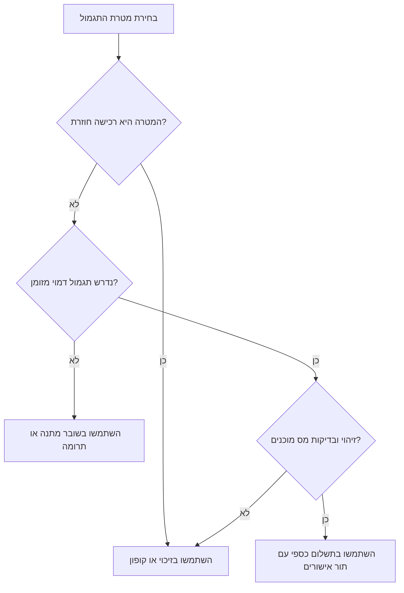
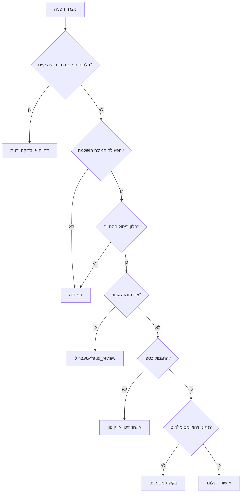

# מנהל תוכניות הפניה

## מטרה

השתמשו בסקיל זה כדי לתכנן, להפעיל, למדוד ולבקר תוכנית "חבר מביא חבר" לעסקים קטנים, פרילנסרים, נותני שירותים, חנויות מקוונות וקהילות צרכניות בישראל. הסקיל מסייע בהגדרת תנאי זכאות, מעקב אחר הפניות, מניעת ניצול לרעה, עבודה מול שערי תשלום ישראליים, ניהול תגמולים, התאמה להנהלת חשבונות ושמירה על כללי פרטיות, דיוור וצרכנות.

## עקרונות עבודה

1. הגדירו תגמול רק לאחר שאפשר למדוד פעולה מזכה.
2. תעדו הסכמה לפני שליחת מסר פרסומי ב-SMS, דוא"ל או WhatsApp.
3. הפרידו בין זכאות שיווקית לבין זכאות חשבונאית.
4. שמרו יומן בקרה לכל הפניה, זיכוי, קופון, תשלום, החזר, ביטול ומסמך חשבונאי.
5. העדיפו זיכוי לקוח או קופון כאשר תגמול כספי יוצר עומס מס ותפעול.
6. בדקו את שער התשלום במסוף בית העסק לפני עלייה לאוויר.
7. אל תבטיחו תגמול מיידי אם תהליך התשלום, ההחזר, מניעת ההונאה והחשבונאות אינו מיידי.
8. הצמידו גרסת תנאים לכל הפניה.

## שימושים נפוצים בישראל

| סוג עסק | פעולה מזכה | תגמול מומלץ | הערות |
|---|---:|---|---|
| מספרה, קליניקה, מאמנת כושר, מורה פרטי | לקוח מופנה הגיע ושילם | זיכוי ₪50–₪100 לשני הצדדים | השתמשו במצב תור ובחשבונית/קבלה כגורם מפעיל. |
| חנות אונליין | הזמנה שולמה ולא הוחזרה לאחר חלון ביטול | קופון או יתרת זיכוי | דחו תגמול עד סוף תקופת החזרה. |
| פרילנסר או יועץ | לקוח מופנה חתם ושילם חשבונית ראשונה | זיכוי קבוע בש"ח או אחוז | הגבילו תגמולים למפנה בחודש. |
| שירות דיגיטלי | חשבון מופנה הפך למנוי משלם ונשאר פעיל | יתרת זיכוי לחשבון או הנחה בחשבונית | בדקו נטישה לפני תשלום. |
| קהילה צרכנית | הרשמה מאומתת ורכישה ראשונה | קופון או יתרת ארנק | הימנעו ממזומן ללא זיהוי ובקרות מס. |

## מודל נתונים

| אובייקט | שדות חובה | שימוש |
|---|---|---|
| `Customer` | `customer_id`, `name`, `phone`, `email`, `consent_marketing`, `created_at` | מייצג לקוח מפנה ולקוח מופנה. |
| `Program` | `program_id`, `reward_type`, `reward_amount_ils`, `qualifying_action`, `cooldown_days`, `max_rewards_per_customer` | מגדיר תנאים ותקרות. |
| `ReferralEvent` | `event_id`, `program_id`, `referrer_id`, `referred_customer_id`, `status`, `source`, `created_at` | עוקב אחר מחזור החיים. |
| `Reward` | `reward_id`, `event_id`, `recipient_customer_id`, `amount_ils`, `status`, `tax_treatment`, `gateway_reference` | עוקב אחר אישור ותשלום. |
| `GatewayPayout` | `gateway`, `payload`, `response`, `idempotency_key`, `status` | מתעד פעולה מול שער תשלום או יצוא ידני. |
| `AuditEntry` | `timestamp`, `actor`, `action`, `before`, `after` | מאפשר עקיבות ובקרה. |

מצבים מומלצים:

```text
invited -> registered -> qualified -> reward_pending -> reward_approved -> reward_paid
                                  \-> fraud_review
                                  \-> rejected
                                  \-> reversed
```

## מחזור חיים של הפניה

1. הגדירו כלל ברור: "תגמול מאושר לאחר שהלקוח המופנה שילם חשבונית ראשונה והחיוב לא בוטל במשך 14 יום".
2. רשמו מפנה ומופנה עם מזהה ייחודי.
3. צרו קוד או קישור אישי.
4. קלטו ייחוס בטופס הרשמה, קופה, הצעת מחיר, הזמנה או מערכת ניהול קשרי לקוחות.
5. בדקו זכאות: אין הפניה עצמית, אין כפילות אסורה, הלקוח חדש, פעולה מזכה בוצעה, חלון ביטול הסתיים, וקיימת הסכמה לשיווק כאשר נשלח מסר פרסומי.
6. צרו תגמול במצב `pending`.
7. אשרו לאחר בדיקת הונאה ובדיקה חשבונאית.
8. שלמו באמצעות זיכוי, קופון, החזר כרטיס, קובץ העברה בנקאית או רישום ידני.
9. הנפיקו חשבונית, קבלה, חשבונית זיכוי או פקודת יומן לפי סוג התגמול.
10. עקבו אחר החזרים, ביטולים, הכחשות עסקה וביטולי תגמול.

## עיצוב תגמולים

| סוג תגמול | מתאים ל | דגשים |
|---|---|---|
| זיכוי לקוח | קמעונאות, קליניקות, שירותים חוזרים | יתרה לחשבונית עתידית; סיווג מע"מ מול הנהלת חשבונות. |
| קופון | מסחר מקוון והזמנות | קוד חד-פעמי עם תוקף ומינימום הזמנה. |
| תשלום כספי | שותפים עסקיים, משפיענים | זיהוי, מסמכי מס ובקרת תשלום. |
| החזר לכרטיס | מבצעי "קבלו ₪ בחזרה" | רק אם שער התשלום תומך בהחזר חלקי לעסקה המקורית. |
| שובר מתנה | רכישת לקוחות צרכנית | מעקב אחר התחייבות עד מימוש או פקיעה. |
| תרומה | קמפיינים קהילתיים | תיעוד מוטב ואסמכתאות. |

### עץ החלטה לבחירת תגמול



ברירות מחדל מומלצות:

| הגדרה | ערך |
|---|---:|
| גובה תגמול | 5%–15% מהרווח הגולמי, לא מהמחזור |
| מינימום פעולה מזכה | לפחות פי 2 מגובה התגמול |
| תקופת המתנה | 14 יום למוצרים; 7–30 יום לשירותים |
| תקרה חודשית | 5 תגמולים ללקוח ללא אישור ידני |
| תוקף קופון/זיכוי | 90–180 יום |
| סף בדיקת הונאה | 3 הפניות ומעלה מאותו מכשיר/IP/כרטיס/משפחת טלפון ב-30 יום |

## ציות בישראל

הסקיל מספק הנחיה תפעולית בלבד ואינו מהווה ייעוץ משפטי או ייעוץ מס. אשרו תוכנית ייצור עם רואה/ת חשבון או עורך/ת דין בישראל.

| תחום | דרישה תפעולית | בקרה |
|---|---|---|
| מע"מ והנהלת חשבונות | תגמול עשוי להיות הנחה, זיכוי, הוצאה שיווקית או תמורה לשירות. | שמרו סיווג חשבונאי ומספר מסמך. |
| מס הכנסה וניכוי מס במקור | תשלום כספי עשוי לדרוש מסמכים או אישור ניכוי מס במקור. | דרשו פרטי זיהוי ומס לפני תשלום. |
| חוק הגנת הצרכן | תנאי מבצע חייבים להיות ברורים, זמינים ולא מטעים. | פרסמו זכאות, חריגים, תוקף, תקרות וביטול תגמול. |
| חוק הגנת הפרטיות | איסוף מידע אישי חייב להיות מידתי, מאובטח ומוסבר. | תעדו מטרה, הסכמה, שמירה וגישה. |
| חוק הספאם, סעיף 30א לחוק התקשורת | מסר פרסומי דורש הסכמה או בסיס חוקי מתאים. | שמרו מקור הסכמה, ערוץ, תאריך והסרה. |
| כללי סליקה | החזרים ופעולות כרטיס חייבים לעמוד בכללי הסולק ושער התשלום. | השתמשו באידמפוטנטיות ובפיוס יומי. |

## אסטרטגיית חיבור לשערי תשלום

ספקי תשלום בישראל שונים לפי חוזה, הרשאות מסוף, גרסת ממשק תכנות והגדרות בית עסק. השתמשו בשכבת מתאם אחידה.

```text
תגמול אושר
        |
        v
בניית בקשת זיכוי/החזר/תשלום
        |
        v
שליחה למתאם שער תשלום או יצוא קובץ
        |
        v
שמירת מזהה פעולה, מצב וחתימת תגובה
        |
        v
פיוס מול דוח סליקה או יצוא ספק
```

| ספק | שימוש נפוץ | בדיקות לפני ייצור |
|---|---|---|
| Cardcom | סליקה, החזרים, טוקנים, חשבוניות במסלולים מסוימים | החזר חלקי, קריאת רשת חוזרת, מודול חשבוניות, סביבת בדיקות |
| Tranzila | סליקה, דפי תשלום, חיובים חוזרים | הרשאות החזר, קודי תגובה, אימות חתימה |
| Meshulam | דפי תשלום, כרטיס אשראי ו-Bit לפי הסכם | זמינות ממשק תכנות להחזר, חתימת קריאת רשת חוזרת, אסמכתאות סליקה |
| PayPlus | מסחר מקוון, חשבוניות, החזרים, טוקנים | גרסת ממשק תכנות, נתיב החזר, סוד קריאת רשת חוזרת |
| Yaad Sarig / YaadPay | דפי תשלום ו-קריאה חוזרת | פורמט קריאה חוזרת, קידוד, החזרים |
| Isracard / MAX / Cal | סולקים ושירותי בית עסק | דוחות סגירה, הרשאות החזר, תפקידי משתמשים |

## דוגמאות

### מספרה

הצעה: "תנו ₪50 וקבלו ₪50 אחרי שהחברה משלימה ביקור ראשון ומשלמת."

כללים: מזהה תוכנית `salon-50-2026`, תגמול ₪50, פעולה מזכה היא תור ששולם, תקופת המתנה 3 ימים, תקרה 10 תגמולים בחודש, חסימת אותו טלפון/לקוח/טוקן כרטיס ועובדים.

תהליך: הוסיפו לקוחה מפנה, צרו קוד `R-<customer_id>-<hash>`, הוסיפו שדה לטופס הזמנה, סמנו זכאות לאחר תשלום, צרו יתרת זיכוי, הציגו יתרה בחשבונית הבאה, בצעו פיוס חודשי.

### רואה חשבון או יועץ

הצעה: "קבלו זיכוי ₪250 אחרי שעסק שהפניתם משלם חשבונית ראשונה של לפחות ₪1,500." תגמול מאושר רק לאחר קבלת תשלום. זיכוי נרשם לשירותים עתידיים. תשלום מזומן כבוי כברירת מחדל. עובדים, ספקים, בני משפחה וגורמים קשורים עוברים למסלול נפרד.

### חנות אונליין

הצעה: "החבר מקבל 10% הנחה בהזמנה ראשונה; המפנה מקבל קופון ₪40 לאחר שההזמנה לא הוחזרה." עיכוב תגמול 14 יום לאחר מסירה, מינימום הזמנה ₪199, תוקף קופון 120 יום, החרגת שובר מתנה, סיטונאות, ביטולים, החזרות ולקוחות קיימים.

## מקרי קצה

| מקרה | טיפול |
|---|---|
| הפניה עצמית | דחו לפי מזהה לקוח, טלפון, דוא"ל, ת"ז, ח.פ/ע.מ או טוקן כרטיס. |
| לקוח קיים משתמש בקוד | דחו או המירו להטבת נאמנות רק אם התנאים מאפשרים. |
| כמה מפנים דורשים יתרת זיכוי | השתמשו בייחוס התקף הראשון אלא אם נקבע "קליק אחרון". |
| הרשמה ממכשיר אחר | אפשרו הזנת קוד ובדיקה ידנית. |
| ביטול אחרי תשלום תגמול | בטלו זיכוי עתידי; אל תגבו חזרה ללא תנאים וכלי גבייה. |
| הכחשת עסקה | הקפיאו מפנה והעבירו לבדיקה. |
| תגמול עובדים | הפעילו מדיניות משאבי אנוש נפרדת. |
| משפיען או שותף | השתמשו בהסכם ובתהליך מס נפרדים. |
| קטין | הימנעו מתשלום כספי; דרשו אישור הורה לעיבוד מידע רגיש. |
| טלפון משפחתי משותף | בצעו בדיקה ידנית ותעדו נימוק. |
| תגמול כספי גבוה | דרשו זיהוי, פרטי בנק, מסמכי מס, אישור ואסמכתת תשלום. |
| צבירת קופונים | ברירת מחדל: אין כפל מבצעים. |
| טבעת הונאה | חסמו לפי מכשיר, IP, כתובת, כרטיס ודפוסי עסקאות מינימום. |

### עץ החלטה לזכאות ותשלום



## בקרות הונאה

חסמו הפניה עצמית, אתרו ריבוי הפניות מאותו מכשיר/IP/כתובת/טוקן כרטיס, דחו תשלום עד אחרי חלון החזר, הגדירו תקרות, דרשו אישור ידני לדפוסים חריגים ושמרו סיבת בדיקה.

| איתות | ניקוד |
|---|---:|
| אותו טלפון/דוא"ל/מזהה לקוח | 100 |
| אותו טוקן כרטיס או חשבון בנק | 90 |
| אותו מכשיר/IP ל-3 הפניות ומעלה | 40 |
| מפנה חדש עם תגמול גבוה | 25 |
| הזמנה קרובה למינימום | 15 |
| ביטולים רבים לאחר תגמול | 50 |
| החרגת לקוח אמין ידנית | -30 |

## הנהלת חשבונות ומס

| מבנה תגמול | טיפול תפעולי נפוץ | רשומה נדרשת |
|---|---|---|
| הנחה למופנה | הנחת מכירה | קופון וחשבונית שמציגה הנחה. |
| זיכוי למפנה | התחייבות ללקוח עד מימוש | ספר זיכויים, תוקף ומימוש. |
| כסף לאדם פרטי | הוצאה שיווקית או תמורה לשירות לפי נסיבות | זיהוי, אישור, אסמכתת תשלום ובדיקת רו"ח. |
| כסף לעסק | הוצאה לספק/שותף | חשבונית מס/קבלה, ניכוי מס במקור ואסמכתה. |
| החזר לכרטיס | ביטול/החזר עסקת תשלום | עסקה מקורית, עסקת החזר וחשבונית זיכוי לפי הצורך. |

## פרטיות והסכמה

אספו רק מידע דרוש. תעדו ערוץ הסכמה, תאריך, נוסח, מקור והסרה. אם אין תיעוד הסכמה שיווקית, סמנו כלא מאושר לדיוור. פורמט תאריך מומלץ בישראל: `DD/MM/YYYY`, למשל `31/03/2026`.

| מידע | תקופת שמירה מומלצת |
|---|---:|
| הפניות הקשורות לחשבונאות | 7 שנים |
| הסכמות | כל עוד מתבצע דיוור בתוספת תקופת התיישנות |
| איתותי הונאה | התקופה הקצרה הנדרשת; בדיקה שנתית |
| תגובות שער תשלום | צמצום או גיבוב כאשר אין צורך במטען מלא |
| ת"ז ופרטי בנק | רק לתשלום כספי; גישה מוגבלת |

## יישום

```python
program = manager.create_program(
    program_id="salon-50-2026",
    name="תוכנית הפניה ₪50 למספרה",
    reward_type="credit",
    reward_amount_ils=50,
    qualifying_action="paid_completed_appointment",
    cooldown_days=3,
    max_rewards_per_customer=10,
)
```

```python
referrer = manager.add_customer(
    customer_id="cust_1001",
    name="דנה לוי",
    email="dana@example.co.il",
    phone="050-1234567",
    consent_marketing=True,
)
```

```python
event = manager.register_referral("salon-50-2026", "cust_1001", "cust_2002", "booking_form")
manager.qualify_referral(event.event_id, evidence={"invoice": "INV-2026-0042"})
reward = manager.approve_reward(event.event_id, actor="owner", tax_treatment="customer_credit")
manager.export_rewards_csv("rewards-31_03_2026.csv", status="approved")
```

## תקלות נפוצות

| סימפטום | סיבה אפשרית | טיפול |
|---|---|---|
| תגמול נשאר בהמתנה | חסרה פעולה מזכה או תקופת המתנה פתוחה | בדקו אסמכתאות, תשלום ותנאי תוכנית. |
| שער תשלום דוחה החזר | אין הרשאה או הסכום גבוה מהחיוב המקורי | בדקו מסוף, מזהה עסקה, מטבע והרשאות. |
| תגמול כפול | אותו אירוע עובד פעמיים | השתמשו במפתח אידמפוטנטיות. |
| טיפול מע"מ לא ברור | סוג התגמול לא סווג | עצרו תשלום וסווגו מול רו"ח. |
| תלונת דיוור | מקור הסכמה חסר או הסרה לא כובדה | חסמו קשר נוסף ובדקו תהליך. |
| בלבול תאריכים | DD/MM/YYYY נקלט כ-MM-DD-YYYY | נרמלו תאריכים ודחו תאריכים עמומים. |

## דפוסים מסוכנים

הימנעו מתשלום מזומן מיידי לאחר הרשמה בלבד, שליחת WhatsApp שיווקי ללא הסכמה, ערבוב בונוס עובדים עם תגמול לקוחות, סיווג כל תגמול כהנחה ללא בדיקה, שימוש בקוד קופון משותף, תגמול על עסקה שהוחזרה, שמירת פרטי כרטיס מלאים, שינוי סכומים ללא יומן בקרה ועקיפת בדיקת הונאה ללא נימוק.

## רשימת בדיקות לייצור

### משפטי ותנאים

- [ ] תנאי התוכנית פורסמו בעברית.
- [ ] הודעת פרטיות כוללת מעקב הפניות ונתוני תשלום.
- [ ] נוסח הסכמה שיווקית אושר.
- [ ] תהליך הסרה נבדק.
- [ ] מגבלות חוק הגנת הצרכן נבדקו.
- [ ] סיווג מס לתשלום כספי אושר.

### נתונים ואבטחה

- [ ] קיימים מזהי לקוחות ייחודיים.
- [ ] מופעל נרמול טלפונים ודוא"ל.
- [ ] ת"ז ופרטי בנק מוצפנים או לא נאספים ללא צורך.
- [ ] הרשאות גישה מגבילות נתוני תשלום והונאה.
- [ ] יומן בקרה מופעל.
- [ ] גיבויים נבדקו.

### תשלומים והנהלת חשבונות

- [ ] מסוף בדיקות אומת.
- [ ] הרשאות החזר אומתו.
- [ ] אימות חתימת קריאת רשת חוזרת מיושם.
- [ ] אידמפוטנטיות נאכפת.
- [ ] תהליך פיוס יומי מוגדר.
- [ ] יצוא להנהלת חשבונות נבדק.
- [ ] תהליך ביטול תגמול נבדק.

### תפעול

- [ ] תסריטי שירות לקוחות מוכנים.
- [ ] בעל/ת תור בדיקה ידנית הוגדר/ה.
- [ ] ספי הונאה הוגדרו.
- [ ] תקרות חודשיות הוגדרו.
- [ ] תזכורות תפוגה הוגדרו.
- [ ] מדדי בקרה מוצגים בלוח מחוונים.

## מדדים

| מדד | נוסחה |
|---|---|
| שיעור המרה | הפניות מזכות ÷ אירועי הפניה |
| עלות תגמול ללקוח נרכש | תגמולים מאושרים ÷ לקוחות מופנים שנרכשו |
| הכנסות מהפניות | הכנסות מלקוחות מופנים לאחר החזרים |
| שיעור בדיקת הונאה | אירועי בדיקה ÷ כלל האירועים |
| רמת שירות לתשלום | חציון זמן מאישור לתשלום |
| פקיעת יתרת זיכוי | יתרת זיכוי שפג תוקף ÷ יתרת זיכוי שהונפק |
| שיעור תלונות | תלונות ÷ הודעות הפניה שנשלחו |
