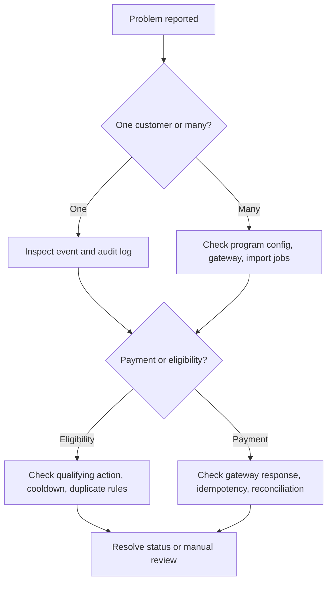

# Troubleshooting

## Diagnostic flow

## Symptoms and fixes

| Symptom | Likely cause | Fix | Prevention |
|---|---|---|---|
| Referral link works but referrer not credited | Landing page does not persist referral code | Store code server-side and in hidden field | End-to-end form test |
| Reward created twice | Worker retry lacks idempotency | Use deterministic key | Unique constraint |
| Reward before refund window | Cooldown set to 0 or wrong trigger | Move to pending and delay | Program review |
| Transaction not found | Wrong provider reference | Store gateway ID separately from invoice number | Field validation |
| Webhook rejected | Signature mismatch or timestamp drift | Check secret, raw body, server time | Webhook test |
| Status not updated | Event mapping missing | Add mapping and replay event | Compatibility matrix |
| Cash payout blocked | Missing identity/tax/bank details | Request documents | Payout checklist |
| VAT unclear | Reward type changed | Freeze and classify | Accounting sign-off |
| Fraud queue grows | Threshold too strict or abuse spike | Tune thresholds | Dashboard |
| Opt-out ignored | Suppression not shared | Centralize opt-out registry | Channel tests |
| Hebrew names corrupted | Encoding mismatch | Normalize UTF-8 | Hebrew payload tests |
| Date imported incorrectly | US parser applied | Use explicit DD-MM-YYYY | Import validation |
| Coupon not redeemable | Not synced | Replay coupon job | Platform reconciliation |
| Support cannot find referral | Code stored in notes | Add structured field | Required CRM field |
| Manual override not auditable | Direct status edit | Require reason and actor | RBAC and audit |
| Payout CSV rejected | Bank format wrong | Match template | Test small upload |
| Refund exceeds balance | Partial return already refunded | Use credit for remainder | Refund balance check |
| Existing customer accepted | Dedup checked only email | Add phone/ID/card checks | Prequalification |
| Terms changed silently | No versioning | Attach terms version | Versioned document |
| Rewards missing in accounting | Export failed | Re-export with documents | Month-end checklist |

## Gateway checklist

1. Confirm merchant account, terminal, and environment.
2. Confirm refund/credit permission.
3. Confirm transaction ID belongs to merchant.
4. Confirm amount is ILS and provider decimal format.
5. Confirm idempotency key was not reused for a different reward.
6. Confirm credentials are valid.
7. Confirm webhook signing secret.
8. Confirm provider IP allowlist if enabled.
9. Confirm response code mapping.
10. Save sanitized request/response.

## Data checklist

1. Normalize phone numbers.
2. Normalize email case and whitespace.
3. Reject empty customer IDs.
4. Match duplicate VAT/ID numbers.
5. Check imported date format.
6. Check consent records.
7. Check duplicate referral code.
8. Check status sequence.
9. Check reward status sequence.
10. Reconcile totals.

## Recovery procedures

### Replay failed webhook

Locate provider event ID, validate raw payload if available, confirm reward mapping, run dry-run mapping, apply update with actor `system_replay`, and reconcile provider report.

### Reverse reward

Confirm published terms allow reversal, record reason, set unpaid rewards to `reversed`, subtract unused credit, disable coupon, flag paid cash cases for accounting/legal review, and store support note.

### Restore from backup

Restore to staging, run tests, compare totals, confirm no duplicate payout requests, and switch production only after reconciliation.
