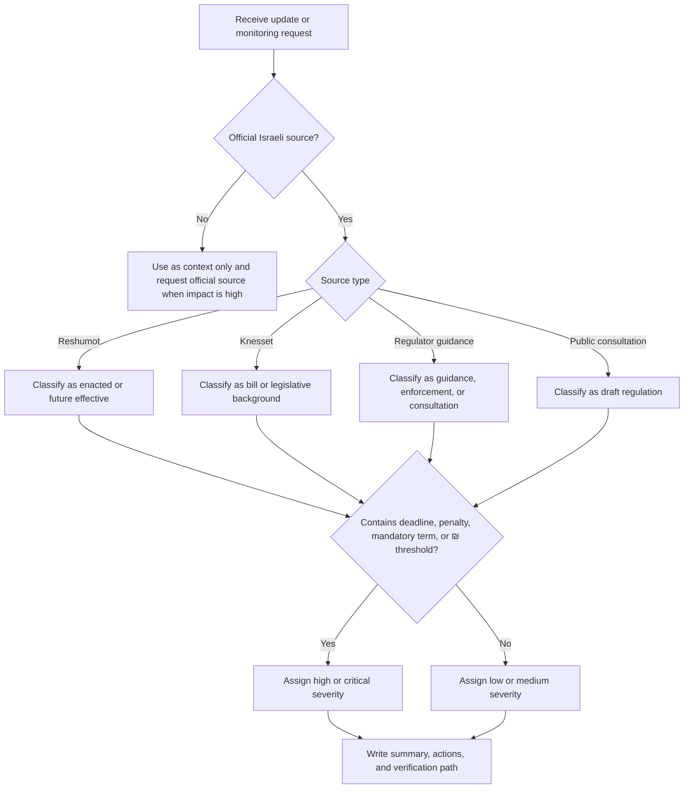

# Regulatory Update Notifier

## Purpose

Monitor, classify, summarize, and route Israeli legal and regulatory updates for small businesses, freelancers, consumers, and operational teams. Cover primary legislation, secondary legislation, official gazette publications, regulator guidance, public consultations, enforcement notices, and authority announcements.

Use the skill when the user asks to track changes from Israeli sources such as the Knesset, Reshumot, government authority pages, the Government Legislation Site, public consultation portals, or sector regulators. Produce practical summaries that distinguish official legal force from draft material, guidance, background, or enforcement activity.

## Operating principles

Use imperative, neutral language. State what changed, who may be affected, the effective date or response deadline, what evidence supports the classification, and what action is appropriate. Do not present summaries as legal advice. Route uncertain or high-impact matters to qualified review.

Prefer official source hierarchy:

1. Reshumot or official gazette publication for enacted text.
2. Knesset source for bills, committee records, readings, and legislative progress.
3. Regulator or ministry page for guidance, circulars, notices, consultations, and enforcement.
4. Government consultation page for drafts and requests for comments.
5. Secondary reporting only as context; never use it as the controlling source.

## Inputs to collect

Ask for missing information only when it materially changes the result. Otherwise use safe defaults.

| Input | Default | Notes |
|---|---:|---|
| Industry or actor type | `all` | Examples: ecommerce, freelancer, employer, consumer, clinic, importer |
| Sources | starter Israeli registry | Add specific authorities when the user names them |
| Period | latest available | Use `since` when the user needs a date range |
| Locale | Hebrew for Israeli operations | Use English when requested |
| Alert threshold | medium | Raise threshold for noisy sectors |
| Output | action-oriented digest | Include source links and verification notes |

## Decision tree



## Classification rules

### Enacted or future effective

Classify as enacted when the source is Reshumot, an official gazette page, or a final regulation or order. Classify as future effective when the text includes a commencement date later than the current date. Extract dates in `YYYY-MM-DD`, `DD/MM/YYYY`, and `DD-MM-YYYY`.

Example:

```text
Order published in Reshumot on 02/06/2026. Commencement on 01/01/2027. Applies to importers above the monetary threshold stated in the official source.
```

Result:

```json
{
  "status": "future-effective",
  "severity": "high",
  "actions": [
    "Verify final text in Reshumot",
    "Check sales threshold",
    "Prepare operating change before 01/01/2027"
  ]
}
```

### Bill

Classify Knesset OData records, readings, committee stages, and bill proposals as bill. Do not describe a bill as binding law unless final enactment and publication are confirmed.

### Draft regulation

Classify drafts, memoranda, consultations, and documents open for public comments as draft regulation. Include response deadline and affected sectors.

### Guidance

Classify FAQs, circulars, authority positions, procedure pages, and regulator guidance as guidance. Note that binding force may vary by authority and legal basis.

### Enforcement

Classify fines, financial sanctions, inspections, warning campaigns, and penalty announcements as enforcement. Treat enforcement notices as strong compliance signals even when they do not change the legal text.

## Relevance scoring

Use a 0 to 100 score. Assign higher scores when multiple signals appear.

| Signal | Add |
|---|---:|
| Industry match | 30 |
| Keyword match | 20 |
| Mandatory language | 15 |
| Deadline or commencement date | 15 |
| Enacted, future effective, or enforcement | 10 |
| Fine, sanction, inspection, or penalty | 10 |
| ₪ amount or threshold | 5 |
| Generic all-sector source | 10 |

Use the score as a triage aid, not as legal certainty.

## Output template

```markdown
### Title

- Status: enacted, future-effective, bill, draft-regulation, guidance, enforcement, or background
- Source: official source name and regulator
- Published: YYYY-MM-DD or unknown
- Effective or response deadline: date or unknown
- Relevant to: industries, actor types, or consumer group
- Alert level: low, medium, high, or critical
- What changed: concise factual summary
- Impact: operational, tax, consumer disclosure, employment, privacy, licensing, or reporting impact
- Actions: concrete checklist
- Verification: official source to recheck before implementation
```

## Concrete examples

### Online store

Input:

```text
Consumer authority guidance requires clearer cancellation disclosure for distance selling by 30/06/2026.
```

Output focus:

- Confirm whether the notice is guidance or binding regulation.
- Identify affected sales flows: checkout, terms, cancellation form, customer service scripts.
- Record any ₪ refund or fee thresholds.
- Set owner and due date.

### Freelancer or small business

Input:

```text
Tax Authority announcement about digital invoices for dealers.
```

Output focus:

- Check whether the update affects an exempt dealer, authorized dealer, company, or nonprofit.
- Extract commencement date, turnover threshold, reporting method, and sanction language.
- Flag accountant review when the update changes VAT, withholding tax, bookkeeping, invoices, or Israel Invoice allocation thresholds.

### Consumer

Input:

```text
New enforcement notice about misleading prices.
```

Output focus:

- Explain consumer rights in plain language.
- Avoid promising compensation.
- Include complaint channel and official authority source where available.

### Employer

Input:

```text
Ministry of Labor circular about wage slip obligations.
```

Output focus:

- Identify affected employers, payroll provider, and employees.
- Extract deadline, recordkeeping duty, and penalty indicators.
- Mark as high severity when fines or mandatory language appear.

## Edge cases

| Case | Handling |
|---|---|
| Same change appears in a bill and Reshumot | Prefer Reshumot for binding status; mention bill only as history |
| Regulator guidance conflicts with statute | Flag legal review and cite both |
| Public consultation has no deadline | Mark deadline unknown; recommend checking the source page manually |
| PDF contains scanned text | Use manual extraction or OCR; mark confidence lower |
| Source page updated but no change log exists | Compare saved snapshot and current text; avoid overstating novelty |
| Law applies only by threshold | Extract ₪ threshold and request user revenue, turnover, headcount, or transaction facts |
| Mixed consumer and business impact | Split the summary into consumer action and business action |
| Hebrew and English source titles differ | Preserve official title and translate only the summary |
| Ambiguous commencement phrase | Mark as uncertain and route to review |
| Secondary news article cites a regulation | Locate the official source before classifying as enacted |

## Production checklist

- Configure only official or regulator-owned sources for automated alerts.
- Store source URL, retrieval time, content hash, and extracted publication date.
- Deduplicate by URL, normalized title, and publication date.
- Keep raw text with each alert for audit.
- Set sector-specific keywords and ignored terms.
- Require manual review for critical alerts.
- Confirm Reshumot publication before describing a rule as final law.
- Track public consultation deadlines separately from effective dates.
- Keep a Hebrew digest for Israeli operational users and an English digest for management when needed.
- Archive generated digests with the source snapshots used to create them.

## Troubleshooting summary

| Symptom | Likely cause | Fix |
|---|---|---|
| No updates found | Filters too narrow or source returned an empty page | Lower threshold, remove keyword, inspect raw source |
| Many irrelevant alerts | Industry list too broad | Add keywords and ignored sectors |
| Bill marked as binding | Source hierarchy ignored | Require Reshumot confirmation |
| Date displayed incorrectly | Locale parsing mismatch | Normalize to `DD/MM/YYYY` for Hebrew output |
| HTTP failure | Rate limit, redirect, TLS, or bot control | Retry politely and keep manual fallback |
| Duplicate alerts | Same item appears across RSS, HTML, and OData | Deduplicate by normalized title and URL |

## Anti-patterns

- Do not call a bill a law before final publication.
- Do not omit the official source.
- Do not hide uncertainty.
- Do not mix response deadlines with effective dates.
- Do not treat all regulator FAQs as binding legal text.
- Do not translate legal terms loosely when the Hebrew term is material.
- Do not send high-impact tax, privacy, labor, health, or finance advice without review.


## Web-validated source practice

Use `references/verification-log.md` as the current package baseline. For production summaries, recheck live official sources when citing VAT, thresholds, fees, percentages, official forms, or endpoint paths. Do not copy illustrative amounts into user-facing advice unless the active official source contains the amount.
