# מודיע עדכוני רגולציה בישראל

## מטרה

ניטור, סיווג, סיכום וניתוב של שינויי חקיקה ורגולציה בישראל עבור עסקים קטנים, עצמאים, צרכנים וצוותי תפעול. כלול חקיקה ראשית, חקיקת משנה, פרסומים ברשומות, הנחיות רגולטוריות, טיוטות להערות הציבור, הודעות אכיפה ופרסומי רשויות.

הפעל כאשר נדרש לעקוב אחר שינויים ממקורות ישראליים רשמיים כגון הכנסת, רשומות, אתרי משרדי ממשלה, אתר החקיקה הממשלתי, פרסומי רשויות ועמדות רגולטורים. הפק סיכום מעשי שמבדיל בין דין מחייב, הצעת חוק, טיוטה, הנחיה, רקע והודעת אכיפה.

## עקרונות עבודה

נסח בלשון ניטרלית ומעשית. ציין מה השתנה, מי עשוי להיות מושפע, מה מועד התחילה או מועד הגשת ההערות, מהו המקור התומך בסיווג, ואיזו פעולה נדרשת. אל תציג את הסיכום כייעוץ משפטי. העבר עניינים לא ברורים או בעלי השפעה גבוהה לבדיקה מקצועית.

העדף את מדרג המקורות הבא:

1. רשומות או פרסום רשמי אחר לנוסח מחייב.
2. מקור הכנסת להצעות חוק, דיוני ועדות, קריאות והתקדמות חקיקה.
3. אתר רשות או משרד ממשלתי להנחיות, חוזרים, הודעות, שימועים ואכיפה.
4. פרסום להערות הציבור לטיוטות ולבקשות תגובה.
5. דיווח משני כרקע בלבד, לא כמקור קובע.

## קלט לאיסוף

שאל רק כאשר החסר משנה מהותית את התוצאה. אחרת השתמש בברירות מחדל זהירות.

| קלט | ברירת מחדל | הערות |
|---|---:|---|
| ענף או סוג גורם | `all` | דוגמאות: מסחר מקוון, עצמאי, מעסיק, צרכן, מרפאה, יבואן |
| מקורות | מאגר מקורות ישראלי בסיסי | הוסף רשות מסוימת כאשר המשתמש מציין אותה |
| תקופה | העדכונים האחרונים הזמינים | השתמש בפרמטר תאריך כאשר נדרש טווח |
| שפה | עברית לפעילות בישראל | עבור לאנגלית רק לפי בקשה |
| סף התראה | בינוני | העלה סף בענפים רועשים |
| פלט | דוח פעולה | כלול קישור מקור והערת אימות |

## עץ החלטה

```mermaid
flowchart TD
    A[התקבלה בקשת ניטור או עדכון] --> B{מקור ישראלי רשמי?}
    B -- לא --> C[השתמש כרקע בלבד ובקש מקור רשמי כאשר ההשפעה גבוהה]
    B -- כן --> D{סוג המקור}
    D -- רשומות --> E[סווג כדין מחייב או תחילה עתידית]
    D -- הכנסת --> F[סווג כהצעת חוק או רקע חקיקתי]
    D -- הנחיית רשות --> G[סווג כהנחיה, אכיפה או שימוע]
    D -- הערות הציבור --> H[סווג כטיוטת תקנות או טיוטת מדיניות]
    E --> I{יש מועד, קנס, חובה או סף ₪?}
    F --> I
    G --> I
    H --> I
    I -- כן --> J[קבע חומרה גבוהה או קריטית]
    I -- לא --> K[קבע חומרה נמוכה או בינונית]
    J --> L[כתוב סיכום, פעולות ואופן אימות]
    K --> L
```



## כללי סיווג

### דין מחייב או תחילה עתידית

סווג כדין מחייב כאשר המקור הוא רשומות, פרסום רשמי, תקנות סופיות, צו או חוק שפורסם. סווג כתחילה עתידית כאשר מופיע מועד תחילה מאוחר ממועד הבדיקה. חלץ תאריכים בפורמטים `YYYY-MM-DD`, `DD/MM/YYYY` ו-`DD-MM-YYYY`.

דוגמה:

```text
צו פורסם ברשומות ביום 02/06/2026. תחילה ביום 01/01/2027. חל על יבואנים שמחזור המכירות השנתי שלהם עולה על הסף הכספי שמופיע במקור הרשמי.
```

תוצאה:

```json
{
  "status": "future-effective",
  "severity": "high",
  "actions": [
    "בדיקת הנוסח הסופי ברשומות",
    "בדיקת סף המחזור",
    "היערכות לשינוי תפעולי לפני 01/01/2027"
  ]
}
```

### הצעת חוק

סווג רשומות מממשק הכנסת, קריאות, דיוני ועדות והצעות חוק כהצעת חוק. אל תתאר הצעת חוק כדין מחייב בלי אימות של חקיקה סופית ופרסום ברשומות.

### טיוטת תקנות או מדיניות

סווג טיוטות, תזכירים, שימועים ומסמכים להערות הציבור כטיוטה. כלול מועד להגשת הערות וענפים מושפעים.

### הנחיה

סווג שאלות ותשובות, חוזרים, עמדות רשות, נהלים והנחיות כהנחיה. ציין שכוח מחייב עשוי להשתנות לפי מקור הסמכות והנסיבות.

### אכיפה

סווג קנסות, עיצומים כספיים, ביקורות, התראות ואזהרות ציבוריות כהודעת אכיפה. התייחס להודעות אכיפה כאיתות ציות משמעותי גם כאשר אין שינוי בנוסח הדין.

## דירוג רלוונטיות

השתמש בציון 0 עד 100. העלה ציון כאשר מופיעים כמה סימנים יחד.

| סימן | תוספת |
|---|---:|
| התאמה לענף | 30 |
| התאמה למילת מפתח | 20 |
| לשון חובה | 15 |
| מועד תחילה או מועד תגובה | 15 |
| דין מחייב, תחילה עתידית או אכיפה | 10 |
| קנס, עיצום, ביקורת או סנקציה | 10 |
| סכום או סף ב-₪ | 5 |
| מקור כללי לכלל המשק | 10 |

השתמש בציון ככלי תיעדוף בלבד, לא כקביעה משפטית.

## תבנית פלט

```markdown
### כותרת

- מעמד: דין מחייב, תחילה עתידית, הצעת חוק, טיוטה, הנחיה, אכיפה או רקע
- מקור: שם המקור והרשות
- פורסם: DD/MM/YYYY או לא ידוע
- תחילה או מועד תגובה: תאריך או לא ידוע
- רלוונטי ל: ענפים, סוגי גורמים או קבוצת צרכנים
- רמת התראה: נמוכה, בינונית, גבוהה או קריטית
- מה השתנה: סיכום עובדתי קצר
- השפעה: תפעול, מס, גילוי לצרכן, עבודה, פרטיות, רישוי או דיווח
- פעולות: רשימת בדיקה מעשית
- אימות: מקור רשמי לבדיקה לפני יישום
```

## דוגמאות מעשיות

### חנות מקוונת

קלט:

```text
הרשות להגנת הצרכן מפרסמת הנחיה להצגת פרטי ביטול עסקה במכר מרחוק עד 30/06/2026.
```

דגשים לפלט:

- אמת אם מדובר בהנחיה או בתקנה מחייבת.
- זהה תהליכים מושפעים: עמוד תשלום, תקנון אתר, טופס ביטול, תסריטי שירות לקוחות.
- שמור סכומי החזר או דמי ביטול ב-₪ כאשר מופיעים.
- קבע בעל אחריות ומועד ביצוע.

### עצמאי או עסק קטן

קלט:

```text
רשות המסים מפרסמת הודעה בנושא חשבוניות דיגיטליות לעוסקים.
```

דגשים לפלט:

- בדוק אם העדכון חל על עוסק פטור, עוסק מורשה, חברה או עמותה.
- חלץ מועד תחילה, סף מחזור, אופן דיווח ולשון סנקציה.
- סמן בדיקת רואה חשבון כאשר העדכון משנה מעמ, ניכוי מס במקור, הוראות ניהול ספרים, חשבוניות או ספי מספר הקצאה לחשבוניות ישראל.

### צרכן

קלט:

```text
פורסמה הודעת אכיפה לגבי הטעיית מחיר.
```

דגשים לפלט:

- הסבר זכויות צרכן בשפה פשוטה.
- אל תבטיח פיצוי.
- כלול ערוץ תלונה ומקור רשמי כאשר קיימים.

### מעסיק

קלט:

```text
משרד העבודה מפרסם חוזר בנושא חובות תלוש שכר.
```

דגשים לפלט:

- זהה מעסיקים מושפעים, ספק שכר ועובדים.
- חלץ מועד, חובת שמירת מסמכים וסימני קנס.
- סמן חומרה גבוהה כאשר מופיעים קנסות או לשון חובה.

## מקרי קצה

| מקרה | טיפול |
|---|---|
| אותו שינוי מופיע גם בהצעת חוק וגם ברשומות | העדף רשומות לקביעת מעמד מחייב; ציין את ההצעה כרקע בלבד |
| הנחיית רשות מתנגשת עם חוק | סמן בדיקה משפטית וציין את שני המקורות |
| פרסום להערות הציבור ללא מועד | סמן מועד לא ידוע והמלץ לבדוק ידנית בדף המקור |
| מסמך סרוק ללא טקסט | בצע חילוץ ידני או זיהוי תווים; סמן ביטחון נמוך יותר |
| דף מקור עודכן בלי יומן שינויים | השווה צילום מצב שמור לטקסט הנוכחי; אל תגזים בטענת חידוש |
| תחולה לפי סף כספי | חלץ סף ₪ ובקש מחזור, הכנסות, מספר עובדים או נתוני עסקה לפי הצורך |
| השפעה מעורבת על צרכנים ועסקים | פצל את הסיכום לפעולת צרכן ולפעולת עסק |
| כותרת בעברית שונה מכותרת באנגלית | שמור כותרת רשמית ותרגם רק את הסיכום |
| מועד תחילה עמום | סמן אי ודאות והעבר לבדיקה מקצועית |
| כתבה משנית מצטטת תקנה | אתר מקור רשמי לפני סיווג כדין מחייב |

## רשימת בדיקה להפעלה

- הגדר רק מקורות רשמיים או דפי רגולטור להתראות אוטומטיות.
- שמור כתובת מקור, זמן שליפה, טביעת תוכן ותאריך פרסום שחולץ.
- בצע הסרת כפילויות לפי כתובת, כותרת מנורמלת ותאריך פרסום.
- שמור טקסט גולמי לכל התראה לצורך ביקורת.
- הגדר מילות מפתח וסינונים לפי ענף.
- דרוש בדיקה ידנית להתראות קריטיות.
- אמת פרסום ברשומות לפני תיאור כלל כדין סופי.
- נהל בנפרד מועד להגשת הערות ומועד תחילה.
- שמור דוח בעברית למשתמשים תפעוליים בישראל ודוח באנגלית להנהלה כאשר נדרש.
- ארכב דוחות עם צילום המקורות ששימשו להפקתם.

## תקלות נפוצות

| תסמין | גורם סביר | תיקון |
|---|---|---|
| לא נמצאו עדכונים | סינון צר מדי או מקור ריק | הורד סף, הסר מילת מפתח, בדוק טקסט מקור |
| יותר מדי התראות לא רלוונטיות | רשימת ענפים רחבה מדי | הוסף מילות מפתח וסינוני ענף |
| הצעת חוק מוצגת כדין מחייב | מדרג מקורות לא יושם | דרוש אימות ברשומות |
| תאריך מוצג לא נכון | אי התאמת פורמט | נרמל פלט עברי ל-`DD/MM/YYYY` |
| כשל שליפה | חסימה, הפניה, תעודת אבטחה או עומס | נסה שוב בזהירות ושמור חלופה ידנית |
| כפילויות | אותו פריט מופיע בכמה מקורות | בצע הסרת כפילויות לפי כותרת וכתובת |

## דפוסים פסולים

- אל תקרא להצעת חוק חוק לפני פרסום סופי.
- אל תשמיט מקור רשמי.
- אל תסתיר אי ודאות.
- אל תערבב מועד להגשת הערות עם מועד תחילה.
- אל תתייחס לכל שאלות ותשובות של רשות כנוסח דין מחייב.
- אל תתרגם מונח משפטי באופן חופשי כאשר המונח העברי קובע.
- אל תספק המלצות בעלות השפעה גבוהה במס, פרטיות, עבודה, בריאות או פיננסים בלי בדיקה מקצועית.


## נוהל אימות מקורות חי

השתמש ב-`references/verification-log.md` כבסיס האימות הנוכחי של החבילה. לפני סיכום תפעולי, בדוק שוב מקור רשמי חי כאשר מציינים מעמ, ספים, אגרות, אחוזים, טפסים רשמיים או נתיבי ממשק. אל תעתיק סכומים מדוגמאות למסמך שמוצג למשתמש אלא אם הסכום מופיע במקור הרשמי הפעיל.
