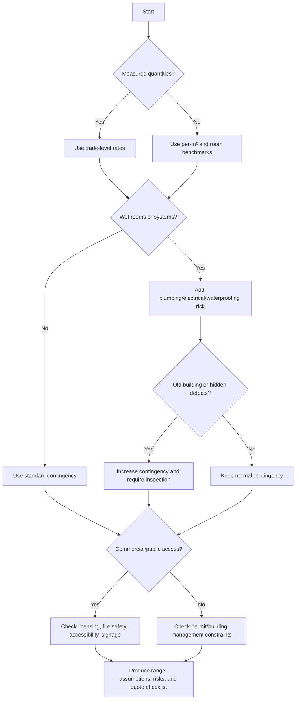

# Renovation Cost Estimator

Estimate planning-level renovation costs for Israeli apartments, houses, offices, clinics, shops, studios, and small commercial premises. Use planning benchmarks checked against official indices and live market comparators, per-meter rates, per-room ranges, line-item trade rates, VAT handling, and compliance flags.

This skill supports early budgeting, quote review, scope comparison, and change-order control. Treat every result as a planning estimate until measured quantities, current market quotes, and professional reviews are available.

## Web-validated source rules

- Treat the Israel Tax Authority rate history as the source for the default VAT rate.
- Treat Central Bureau of Statistics construction input indices as index-adjustment data, not as official renovation price lists.
- Treat per-meter and per-room renovation amounts as planning heuristics from market comparators and contractor quote experience.
- Do not present any bathroom, kitchen, office, clinic, or shop fit-out rate as an official Israeli rate.
- Verify permit, business licensing, accessibility, fire safety, health, asbestos, and waste requirements with the relevant authority before final decisions.

## Operating principles

- Return low / expected / high ranges, not a single exact price.
- State whether amounts include VAT.
- Separate direct works, contingency, professional fees, compliance allowances, and VAT.
- Use per-m² ranges for early feasibility and trade-level quantities when available.
- Apply multipliers only where relevant; avoid double-counting.
- Flag permits, business licensing, accessibility, fire safety, structural work, old buildings, and tax documentation.
- Require written contractor quotes for decision use.

## Israeli defaults

| Item | Default |
|---|---:|
| Currency | ₪ / ILS |
| User-facing Hebrew dates | DD-MM-YYYY |
| VAT model | 18% configurable; verify current rate before production use |
| Concept contingency | 10%–20% |
| Old building / hidden infrastructure contingency | 15%–30% |
| Professional fees | 5%–15% |
| Commercial compliance allowance | 2%–8% or explicit line items |

## Input checklist

Collect city, area in m², property type, scope level, finish level, room count, bathrooms, kitchens, wet rooms, building year, floor, elevator, occupancy, parking/loading access, commercial use, public access, signage, food/health use, structural changes, VAT preference, and any measured line items.

## Scope levels

| Level | Use |
|---|---|
| cosmetic | paint, small repairs, rental refresh, minor replacement |
| partial | floors, bathroom, kitchen, selected systems |
| full | broad apartment renovation including wet rooms and systems |
| shell | empty shell to finished dwelling |
| office_fitout | office partitions, lighting, data, finishes |
| retail_fitout | shopfront, display lighting, signage, customer areas |
| commercial_fitout | clinics and mixed regulated premises |

## Finish levels

| Level | Description |
|---|---|
| basic | rental-grade, simple suppliers, limited custom work |
| standard | common family-apartment quality |
| premium | designer details, better brands, more carpentry |
| luxury | custom, imported, complex detailing, high supervision |

## Planning benchmark ranges

| Scope | Basic | Standard | Premium | Luxury |
|---|---:|---:|---:|---:|
| Cosmetic refresh | ₪650–1,100/m² | ₪1,000–1,700/m² | ₪1,600–2,600/m² | ₪2,500+/m² |
| Partial renovation | ₪1,500–2,700/m² | ₪2,500–4,300/m² | ₪4,000–6,500/m² | ₪6,500+/m² |
| Full apartment renovation | ₪3,000–5,000/m² | ₪4,500–7,500/m² | ₪7,000–11,000/m² | ₪11,000+/m² |
| Shell-to-finish residential | ₪4,500–7,000/m² | ₪6,500–10,000/m² | ₪9,000–14,000/m² | ₪14,000+/m² |
| Small office fit-out | ₪2,000–3,800/m² | ₪3,500–6,000/m² | ₪5,500–9,000/m² | ₪9,000+/m² |
| Retail fit-out | ₪2,800–5,000/m² | ₪4,500–8,000/m² | ₪7,500–12,000/m² | ₪12,000+/m² |
| Clinic/commercial fit-out | ₪3,500–6,500/m² | ₪6,000–10,000/m² | ₪9,000–14,000/m² | ₪14,000+/m² |

## Planning room and trade benchmarks

| Item | Low | Expected | High |
|---|---:|---:|---:|
| Full bathroom | ₪35,000 | ₪65,000 | ₪110,000 |
| Bathroom refresh | ₪18,000 | ₪32,000 | ₪55,000 |
| Guest toilet | ₪12,000 | ₪30,000 | ₪60,000 |
| Full kitchen | ₪45,000 | ₪120,000 | ₪240,000 |
| Kitchen refresh | ₪18,000 | ₪50,000 | ₪110,000 |
| Demolition and removal | ₪90/m² | ₪160/m² | ₪280/m² |
| Floor tiling | ₪220/m² | ₪380/m² | ₪650/m² |
| Paint | ₪35/m² surface | ₪55/m² | ₪90/m² |
| Electrical point | ₪250 | ₪450 | ₪850 |
| Plumbing point | ₪550 | ₪950 | ₪1,800 |
| Interior door | ₪1,000 | ₪1,800 | ₪3,500 |
| Electrical panel upgrade | ₪3,000 | ₪6,500 | ₪14,000 |

## Adjustment rules

| Condition | Expected adjustment |
|---|---:|
| Tel Aviv / dense center | +10% |
| Jerusalem old/stone/logistics complexity | +8% |
| Haifa slopes/access complexity | +6% |
| No elevator above 2nd floor | +7% |
| Occupied renovation | +10% |
| Building before 1980 | +15% |
| Tight schedule or night work | +15% |
| Public-facing commercial premises | add compliance lines and schedule buffer |

## Decision tree

## Estimation workflow

1. Classify the estimate as rough, concept, pre-tender, or quote-based.
2. Select the benchmark method: per-m², per-room, line-item, or quote normalization.
3. Add only relevant multipliers.
4. Add room allowances only when not already fully captured.
5. Add contingency based on hidden-risk profile.
6. Add professional and compliance allowances.
7. Apply VAT according to user needs.
8. Produce assumptions, exclusions, risk actions, and requested contractor data.

## Examples

### 72 m² apartment, partial standard renovation

Input: Ramat Gan, 72 m², partial, standard, one bathroom, one kitchen, VAT included.

Expected planning output: roughly ₪285,000–₪385,000 including VAT at concept level, subject to electrical panel, waterproofing, kitchen specification, access, and waste removal checks.

### 38 m² clinic in Tel Aviv

Input: clinic, 38 m², standard commercial fit-out, public access, licensing required, VAT excluded.

Expected output: pre-VAT range, plus explicit fire-safety, accessibility, business licensing, signage, privacy/acoustic, and municipal checks.

### Contractor quote sanity check

If a contractor quotes ₪300,000 before VAT for an 80 m² full standard apartment renovation, normalize to ₪354,000 at 18% VAT and compare against the benchmark. If materially below expected range, request quantities, exclusions, material specifications, VAT status, warranty, insurance, and licensed-trade evidence.

## Edge cases

### Very low quote

Treat as high risk if it lacks quantities, VAT status, material models, waterproofing scope, waste removal, payment milestones, warranty, insurance, or licensed electrical/plumbing work.

### Old building

Check galvanized pipes, dampness, old electrical panels, asbestos suspicion, prior unpermitted alterations, weak access, and structural uncertainty.

### Renovation while occupied

Add protection, phasing, daily cleaning, temporary kitchen/bathroom arrangements, furniture moving, and productivity loss.

### Commercial fit-out

Check municipal business licensing, fire safety, accessibility, signage, landlord approval, restoration obligations, health rules where relevant, ventilation, grease trap, and emergency lighting.

### VAT handling

For consumers, show cash cost including VAT. For businesses, show both before and including VAT and state that input VAT treatment depends on valid invoices, business use, and accounting/legal review.

## Troubleshooting

| Symptom | Likely cause | Fix |
|---|---|---|
| Too low | VAT, wet rooms, kitchen, infrastructure, access, or contingency missing | Add missing buckets |
| Too high | per-m² and room items double-counted | separate base scope from add-ons |
| Quote not comparable | no quantities or VAT status | normalize by unit and VAT |
| User wants exact price | data is insufficient | give range and list required data |
| Business scope looks residential | wrong benchmark | switch to commercial fit-out |
| VAT confusion | user type unclear | show both VAT views |

## Anti-patterns

Avoid exact totals without ranges, hidden VAT, applying every multiplier to every line item, counting kitchen/bathroom twice, ignoring waste and access, accepting oral change orders, treating licensing as optional for businesses, and presenting stale tax/index assumptions as current facts.

## Production checklist

- Verify current VAT rate.
- Verify official construction input index if updating stored benchmarks.
- Measure quantities.
- Request three comparable written quotes.
- Check building committee or management rules.
- Check permits, business licensing, accessibility, fire safety, signage, and lease restrictions.
- Keep tax invoices and contracts.
- Use licensed professionals where required.
- Escalate structural, legal, tax, safety, or engineering issues to qualified professionals.
