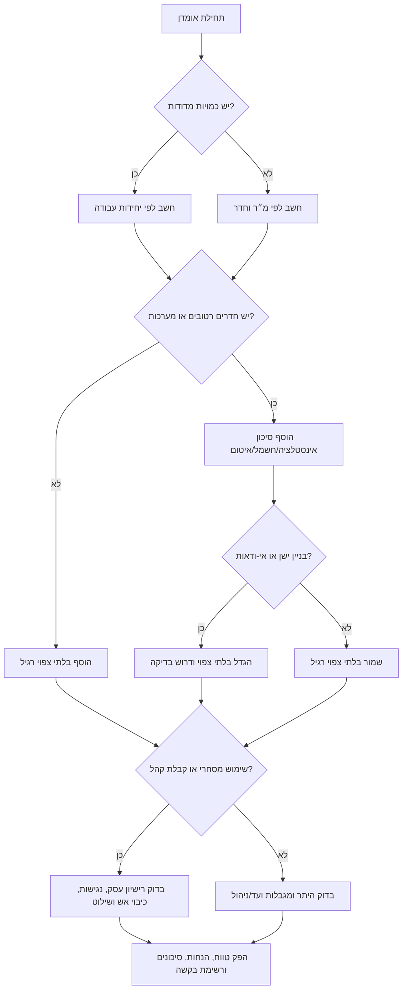

# אומדן עלויות שיפוץ

חשב אומדן עלויות לשיפוץ דירות, בתים פרטיים, משרדים, קליניקות, חנויות וחללים מסחריים קטנים בישראל. השתמש בטווחים מקומיים למ״ר, אומדנים לפי חדר, מחירי יחידה לפי מקצוע, מע״מ, התאמות גישה וסיכוני רישוי.

האומדן מיועד לתכנון תקציב, בדיקת הצעות קבלנים, השוואת תכולות וניהול חריגים. אין להציג אותו כהצעה מחייבת ללא מדידות, מפרט, הצעות כתובות ובדיקת בעלי מקצוע רלוונטיים.

## כללי מקור מאומתים

- התייחס לשיעור המע״מ של רשות המסים כמקור לשיעור ברירת המחדל.
- התייחס למדדי מחירי תשומה בבנייה של הלמ״ס כנתוני הצמדה ועדכון, לא כמחירון שיפוצים רשמי.
- התייחס למחירי מ״ר וחדרים כאומדני תכנון המבוססים על השוואות שוק וניסיון הצעות קבלנים.
- אל תציג מחיר חדר רחצה, מטבח, משרד, קליניקה או חנות כמחיר רשמי בישראל.
- ודא היתר, רישיון עסק, נגישות, כיבוי אש, בריאות, אסבסט ופסולת מול הרשות המתאימה לפני החלטה מחייבת.

## עקרונות עבודה

- הצג טווח נמוך / צפוי / גבוה.
- ציין אם הסכומים כוללים מע״מ.
- הפרד עבודות ישירות, בלתי צפוי, ייעוץ, רישוי, התאמות ומע״מ.
- השתמש במחיר למ״ר לאומדן ראשוני ובכמויות מדודות כשיש נתונים.
- הפעל מכפילים בזהירות והימנע מספירה כפולה.
- סמן היתר בנייה, רישיון עסק, נגישות, כיבוי אש, עבודות קונסטרוקציה ותיעוד מס.
- דרוש הצעות כתובות לפני החלטה.

## ברירות מחדל בישראל

| נושא | ערך |
|---|---:|
| מטבע | ₪ |
| תאריך | DD/MM/YYYY |
| מע״מ | 18% ניתן לשינוי; יש לוודא שיעור עדכני |
| בלתי צפוי רגיל | 10%–20% |
| בניין ישן / תשתיות נסתרות | 15%–30% |
| תכנון, פיקוח וייעוץ | 5%–15% |
| התאמות רישוי לעסק | 2%–8% או סעיפים מפורטים |

## נתונים לאיסוף

אסוף עיר, שטח במ״ר, סוג נכס, רמת תכולה, רמת גמר, מספר חדרים, חדרי רחצה, מטבח, חדרים רטובים, שנת בנייה, קומה, מעלית, אכלוס בזמן עבודה, חניה ופריקה, שימוש עסקי, קבלת קהל, שילוט, מזון/בריאות, שינויי קונסטרוקציה, העדפת מע״מ וכמויות מדודות.

## רמות תכולה

| רמה | שימוש |
|---|---|
| cosmetic | רענון, צבע, תיקונים קטנים |
| partial | ריצוף, מטבח, חדר רחצה או מערכות חלקיות |
| full | שיפוץ דירה רחב כולל מערכות וחדרים רטובים |
| shell | גמר ממעטפת |
| office_fitout | התאמת משרד |
| retail_fitout | התאמת חנות |
| commercial_fitout | קליניקה או חלל מסחרי עם דרישות ציות |

## רמות גמר

| רמה | תיאור |
|---|---|
| basic | בסיסי, מתאים להשכרה |
| standard | סטנדרטי, איכות נפוצה לדירת מגורים |
| premium | פרימיום, מותגים טובים, יותר נגרות ופרטים |
| luxury | יוקרתי, מותאם אישית, חומרים יקרים ופיקוח מוגבר |

## טווחי תכנון למ״ר

| תכולה | בסיסי | סטנדרטי | פרימיום | יוקרתי |
|---|---:|---:|---:|---:|
| רענון קוסמטי | ₪650–1,100 | ₪1,000–1,700 | ₪1,600–2,600 | ₪2,500+ |
| שיפוץ חלקי | ₪1,500–2,700 | ₪2,500–4,300 | ₪4,000–6,500 | ₪6,500+ |
| שיפוץ מלא | ₪3,000–5,000 | ₪4,500–7,500 | ₪7,000–11,000 | ₪11,000+ |
| גמר ממעטפת | ₪4,500–7,000 | ₪6,500–10,000 | ₪9,000–14,000 | ₪14,000+ |
| התאמת משרד | ₪2,000–3,800 | ₪3,500–6,000 | ₪5,500–9,000 | ₪9,000+ |
| התאמת חנות | ₪2,800–5,000 | ₪4,500–8,000 | ₪7,500–12,000 | ₪12,000+ |
| קליניקה / מסחרי | ₪3,500–6,500 | ₪6,000–10,000 | ₪9,000–14,000 | ₪14,000+ |

## אומדני תכנון לחדר וליחידה

| סעיף | נמוך | צפוי | גבוה |
|---|---:|---:|---:|
| חדר רחצה מלא | ₪35,000 | ₪65,000 | ₪110,000 |
| רענון חדר רחצה | ₪18,000 | ₪32,000 | ₪55,000 |
| שירותי אורחים | ₪12,000 | ₪30,000 | ₪60,000 |
| מטבח מלא | ₪45,000 | ₪120,000 | ₪240,000 |
| רענון מטבח | ₪18,000 | ₪50,000 | ₪110,000 |
| פירוק ופינוי | ₪90 למ״ר | ₪160 למ״ר | ₪280 למ״ר |
| ריצוף | ₪220 למ״ר | ₪380 למ״ר | ₪650 למ״ר |
| צבע | ₪35 למ״ר שטח פנים | ₪55 | ₪90 |
| נקודת חשמל | ₪250 | ₪450 | ₪850 |
| נקודת אינסטלציה | ₪550 | ₪950 | ₪1,800 |

## התאמות

| תנאי | התאמה צפויה |
|---|---:|
| תל אביב / מרכז צפוף | +10% |
| ירושלים / בנייה ותיקה ולוגיסטיקה מורכבת | +8% |
| חיפה / שיפועים וגישה | +6% |
| אין מעלית מעל קומה 2 | +7% |
| עבודה בנכס מאוכלס | +10% |
| בניין לפני 1980 | +15% |
| לוח זמנים צפוף או עבודות לילה | +15% |
| עסק עם קבלת קהל | סעיפי ציות ולוח זמנים |

## עץ החלטה

## תהליך עבודה

1. סווג את רמת האומדן: ראשוני, רעיוני, לפני מכרז או מבוסס הצעות.
2. בחר שיטה: מחיר למ״ר, לפי חדר, לפי כמויות או נרמול הצעת קבלן.
3. הוסף התאמות רלוונטיות בלבד.
4. הוסף חדרים רטובים ומטבח רק אם אינם כלולים כבר בתכולה.
5. הוסף בלתי צפוי לפי סיכון.
6. הוסף תכנון, פיקוח, רישוי וציות.
7. חשב מע״מ לפי צורכי המשתמש.
8. הצג הנחות, החרגות, דגלים אדומים ופעולות להמשך.

## דוגמאות

### דירת 72 מ״ר ברמת גן

תכולה חלקית, רמת גמר סטנדרטית, חדר רחצה אחד ומטבח אחד. אומדן תכנון סביר: כ-₪285,000–₪385,000 כולל מע״מ, בכפוף ללוח חשמל, איטום, מפרט מטבח, גישה ופינוי פסולת.

### קליניקה 38 מ״ר בתל אביב

הצג תקציב לפני מע״מ לצד מע״מ אפשרי. הוסף רישיון עסק, נגישות, כיבוי אש, שילוט, פרטיות/אקוסטיקה ובדיקת עירייה.

### בדיקת הצעת קבלן

הצעה של ₪300,000 לפני מע״מ לשיפוץ מלא של 80 מ״ר מנורמלת ל-₪354,000 במע״מ 18%. אם היא נמוכה משמעותית מהמדד, דרוש כמויות, החרגות, דגמי חומרים, חשבונית מס, אחריות, ביטוח ובעלי מקצוע מורשים.

## מקרי קצה

- הצעה נמוכה במיוחד: סמן סיכון אם חסרות כמויות, מע״מ, איטום, פינוי פסולת, אחריות או ביטוח.
- בניין ישן: בדוק צנרת, רטיבות, לוח חשמל, חשד לאסבסט ושינויים קודמים.
- שיפוץ בזמן מגורים: הוסף הגנות, שלבים, ניקיון יומי, פתרונות זמניים והזזת ריהוט.
- התאמת עסק: בדוק רישיון עסק, נגישות, כיבוי אש, שילוט, אישור משכיר, משרד הבריאות לפי העניין, אוורור ומפריד שומנים.
- מע״מ: לצרכן הצג כולל מע״מ; לעסק הצג לפני ואחרי מע״מ וציין שהקיזוז תלוי בחשבונית מס ובבדיקת רואה חשבון.

## פתרון תקלות

| סימפטום | סיבה | תיקון |
|---|---|---|
| האומדן נמוך | חסרים מע״מ, מטבח, חדר רטוב או תשתיות | הוסף סעיפים |
| האומדן גבוה | ספירה כפולה של מ״ר וחדרים | הפרד בסיס ותוספות |
| הצעה לא ניתנת להשוואה | אין כמויות או סטטוס מע״מ | נרמל לפי יחידה ומע״מ |
| בקשת מחיר מדויק | חסרים נתונים | הצג טווח ונתונים נדרשים |
| עסק מתומחר כמגורים | מדד שגוי | עבור להתאמה מסחרית |

## כשלים נפוצים

הימנע ממחיר יחיד, מע״מ מוסתר, הפעלת כל מכפיל על כל סעיף, ספירה כפולה של מטבח וחדר רחצה, התעלמות מפינוי וגישה, אישור חריגים בעל פה, והתייחסות לרישוי עסק כאפשרות שולית.

## רשימת בדיקה לפני החלטה

ודא שיעור מע״מ, מדוד כמויות, בקש שלוש הצעות כתובות, בדוק ועד בית או חברת ניהול, בדוק היתר בנייה, רישיון עסק, נגישות, כיבוי אש, שילוט וחוזה שכירות, שמור חשבוניות מס וחוזים, והעבר נושאי קונסטרוקציה, מס, בטיחות או משפט לבעל מקצוע מתאים.
