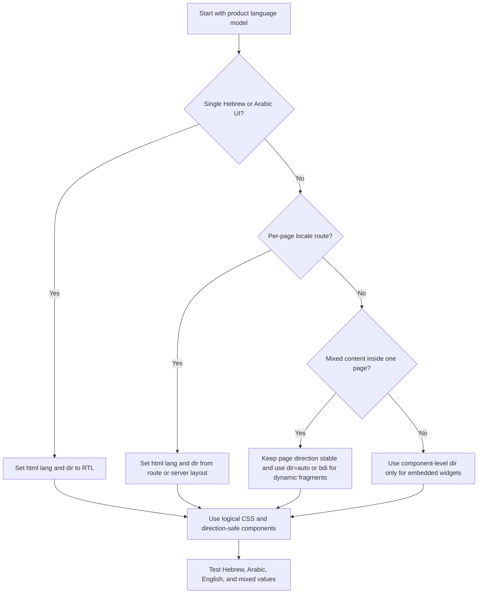

# RTL UI Design Advisor

## Purpose

Build right-to-left interfaces that feel native for Hebrew and Arabic users in Israel. Cover layout direction, bidirectional text, forms, React component architecture, Tailwind usage, accessibility checkpoints, QA, and production readiness. Prioritize real workflows for small businesses, freelancers, nonprofit teams, local services, stores, booking pages, receipts, invoices, support portals, and consumer accounts.

Use semantic direction boundaries. Prefer logical layout primitives over duplicated LTR and RTL styles. Keep numbers, URLs, email addresses, coupon codes, bank details, phone numbers, invoice numbers, order identifiers, and SKU codes readable inside Hebrew or Arabic sentences.

## Default decisions

| Decision | Use | Avoid |
|---|---|---|
| Page direction | `<html lang="he" dir="rtl">` or `<html lang="ar" dir="rtl">` | Setting `direction: rtl` only on `body` |
| Alignment | `text-align: start` | `text-align: right` as a global default |
| Spacing | `margin-inline-start`, `padding-inline-end`, `gap` | `margin-left`, `padding-right` |
| Positioning | `inset-inline-start`, `inset-inline-end` | `left`, `right` |
| Icons | Mirror only directional icons | Mirroring logos, currency symbols, charts, phones, calendars, or user icons |
| Input direction | `dir="auto"` for names and free text; `dir="ltr"` for email, URLs, phone, IDs, amounts, and codes | One direction for every input |
| Currency | `Intl.NumberFormat("he-IL", { style: "currency", currency: "ILS" })` plus isolation in surrounding RTL text | Manual concatenation without bidirectional isolation |
| Dates | Explicit Israeli policy, commonly DD/MM/YYYY such as `03/06/2026` | Ambiguous date strings such as `03/04/2026` without policy |
| QA | Hebrew, Arabic, English, mixed strings, mobile, keyboard, screen reader, PDF, email | Visual-only desktop review |

## Decision tree: choose the direction strategy



## HTML foundation

Set language and direction at the highest stable boundary.

```html
<!doctype html>
<html lang="he" dir="rtl">
  <head>
    <meta charset="utf-8" />
    <title>ניהול הזמנות</title>
  </head>
  <body>
    <main>
      <h1>הזמנות פתוחות</h1>
    </main>
  </body>
</html>
```

For Arabic:

```html
<html lang="ar" dir="rtl">
```

For a route-level locale in React:

```tsx
type Locale = "he" | "ar" | "en";

export function RootLayout({ locale, children }: { locale: Locale; children: React.ReactNode }) {
  const dir = locale === "he" || locale === "ar" ? "rtl" : "ltr";
  return (
    <html lang={locale} dir={dir}>
      <body>{children}</body>
    </html>
  );
}
```

## Bidirectional text

Use `<bdi>` around variable inline values. Use `dir="auto"` when a user-provided value can start in Hebrew, Arabic, English, a number, or a symbol.

```html
<p>לקוח: <bdi dir="auto">Maya Cohen</bdi></p>
<p>מסעדה: <bdi dir="auto">مطعم القدس</bdi></p>
<p>מספר הזמנה: <bdi dir="ltr">ORD-2026-0042</bdi></p>
<p>דוא"ל: <bdi dir="ltr">client@example.co.il</bdi></p>
<p>סה"כ לתשלום: <bdi dir="ltr">₪ 1,250.00</bdi></p>
<p>תאריך אספקה: <bdi dir="ltr">03/06/2026</bdi></p>
```

Avoid `unicode-bidi: bidi-override` for ordinary interface text. It forces character order and often damages mixed-language content. Use isolation instead.

## Form direction matrix

| Field | Recommended direction | Notes |
|---|---|---|
| Full name | `dir="auto"` | Handles Hebrew, Arabic, English, and mixed names |
| Business name | `dir="auto"` | Handles local names, English brands, and legal suffixes |
| Free-text note | `dir="auto"` | Keeps paragraph direction natural |
| Search | `dir="auto"` | Query may be a Hebrew phrase, Arabic phrase, SKU, or email |
| Email | `dir="ltr"` | Keeps `@`, dots, and domain order stable |
| URL | `dir="ltr"` | Keeps protocol, path, and query string stable |
| Phone | `dir="ltr"` | Add `inputmode="tel"` |
| Amount | `dir="ltr"` or isolated localized display | Keeps digits and decimal point stable |
| Israeli ID / business number | `dir="ltr"` | Keeps all digits in order |
| Bank account | `dir="ltr"` | Keeps branch and account digits stable |

```html
<label for="customer-name">שם לקוח</label>
<input id="customer-name" name="customerName" dir="auto" autocomplete="name" />

<label for="email">דוא"ל</label>
<input id="email" name="email" type="email" dir="ltr" autocomplete="email" />

<label for="phone">טלפון</label>
<input id="phone" name="phone" type="tel" dir="ltr" inputmode="tel" autocomplete="tel" />

<label for="amount">סכום</label>
<input id="amount" name="amount" inputmode="decimal" dir="ltr" />
```

## CSS: prefer logical properties

Logical properties adapt to `dir` and encode intent.

```css
.card {
  padding-inline: 1rem;
  padding-block: 0.75rem;
  border-inline-start: 4px solid currentColor;
}

.toolbar {
  display: flex;
  flex-wrap: wrap;
  gap: 0.75rem;
  justify-content: space-between;
}

.badge {
  position: absolute;
  inset-inline-end: 0.5rem;
  inset-block-start: 0.5rem;
}
```

### Physical-to-logical table

| Physical property | Logical replacement |
|---|---|
| `margin-left` | `margin-inline-start` or `margin-inline-end` after semantic review |
| `margin-right` | `margin-inline-end` or `margin-inline-start` after semantic review |
| `padding-left` | `padding-inline-start` |
| `padding-right` | `padding-inline-end` |
| `border-left` | `border-inline-start` |
| `border-right` | `border-inline-end` |
| `left` | `inset-inline-start` |
| `right` | `inset-inline-end` |
| `top` | `inset-block-start` |
| `bottom` | `inset-block-end` |
| `text-align: left` | `text-align: start` or `end` by meaning |
| `text-align: right` | `text-align: start` for default RTL paragraphs |

Before:

```css
.invoice-row {
  padding-left: 16px;
  margin-right: 8px;
  text-align: right;
}
```

After:

```css
.invoice-row {
  padding-inline-start: 16px;
  margin-inline-end: 8px;
  text-align: start;
}
```

## React patterns

Derive direction from locale once.

```tsx
type Locale = "he" | "he-IL" | "ar" | "ar-IL" | "en" | "en-IL";

const rtlLocales = new Set<Locale>(["he", "he-IL", "ar", "ar-IL"]);

export function getDir(locale: Locale): "rtl" | "ltr" {
  return rtlLocales.has(locale) ? "rtl" : "ltr";
}
```

Use it at the shell:

```tsx
export function AppShell({ locale, children }: { locale: Locale; children: React.ReactNode }) {
  const dir = getDir(locale);
  return (
    <div lang={locale} dir={dir}>
      {children}
    </div>
  );
}
```

Render dynamic values with isolation:

```tsx
export function InlineValue({ value, dir = "auto" }: { value: string | number; dir?: "auto" | "ltr" | "rtl" }) {
  return <bdi dir={dir}>{String(value)}</bdi>;
}
```

Format Israeli values:

```tsx
export function formatILS(amount: number, locale: "he-IL" | "ar-IL" | "en-IL" = "he-IL") {
  return new Intl.NumberFormat(locale, {
    style: "currency",
    currency: "ILS",
    currencyDisplay: "symbol",
  }).format(amount);
}

export function formatIsraelDate(date: Date) {
  const parts = new Intl.DateTimeFormat("en-GB", {
    day: "2-digit",
    month: "2-digit",
    year: "numeric",
  }).formatToParts(date);
  const get = (type: string) => parts.find((part) => part.type === type)?.value ?? "";
  return `${get("day")}/${get("month")}/${get("year")}`;
}
```


### Verified VAT note

As of the 03/06/2026 verification pass, official Israeli sources confirm the standard VAT rate as 18%, effective 01/01/2025. Do not hard-code the rate in visual components. Load rates from configuration, the server, or shared business logic so future changes do not require UI rewrites.

## Tailwind guidance

Use logical utilities in modern Tailwind.

```html
<div dir="rtl" class="p-4">
  <article class="border-s-4 ps-4 text-start">
    <h2 class="text-xl font-bold">חשבונית מס</h2>
    <p class="mt-2">סה"כ: <bdi dir="ltr">₪ 1,250.00</bdi></p>
  </article>
</div>
```

| Avoid | Prefer |
|---|---|
| `ml-4` | `ms-4` or `me-4` after semantic review |
| `mr-4` | `me-4` or `ms-4` after semantic review |
| `pl-4` | `ps-4` |
| `pr-4` | `pe-4` |
| `left-0` | `start-0` |
| `right-0` | `end-0` |
| `text-left` | `text-start` |
| `text-right` | `text-start` for default RTL paragraphs or `text-end` for trailing alignment |
| `border-l` | `border-s` |
| `border-r` | `border-e` |
| `space-x-4` | `gap-4` when possible |

## Accessibility checkpoints

- Set `lang` accurately for page and embedded language changes.
- Set `dir` at stable boundaries and portal roots.
- Preserve logical keyboard order.
- Keep focus outlines visible.
- Associate labels and controls programmatically.
- Connect error messages with `aria-describedby`.
- Test screen-reader output for Hebrew, Arabic, English, amounts, dates, and validation messages.
- Avoid conveying state only through left or right placement.
- Validate zoom and enlarged text in RTL.

## Anti-patterns

| Anti-pattern | Consequence | Safer pattern |
|---|---|---|
| `body { direction: rtl; }` without root `dir` | Browser and assistive technology inconsistencies | Set `<html lang="he" dir="rtl">` |
| Replacing every `left` with `right` | Breaks semantic sides and embedded LTR content | Convert intent to logical properties |
| Global `flex-row-reverse` | Creates unexpected reading and keyboard order | Let `dir` control inline start/end |
| Mirroring every SVG | Damages logos, charts, symbols, and media controls | Mirror only directional icons |
| Manual `₪` concatenation | Punctuation and symbol may move | Use `Intl.NumberFormat` and `<bdi>` |
| `text-align: right` everywhere | Damages English and auto-direction content | Use `text-align: start` |
| Manual date strings | Creates ambiguity | Use explicit DD/MM/YYYY policy |
| Duplicated RTL stylesheet | Causes drift between variants | Use logical CSS and targeted exceptions |

## Production checklist

### Structure
- [ ] Root layout sets `lang` and `dir`.
- [ ] Locale switching updates language and direction together.
- [ ] Dialogs, popovers, tooltips, and toast portals inherit direction.
- [ ] Dynamic values use `<bdi>` or `dir="auto"`.

### CSS and components
- [ ] Physical spacing, borders, and insets are replaced or justified.
- [ ] `text-align: start` is the default.
- [ ] `gap` replaces fragile margin spacing.
- [ ] Icon mirroring follows semantic meaning.
- [ ] Carousels, drawers, steppers, breadcrumbs, and pagination are reviewed.

### Forms
- [ ] Names, business names, search, and notes use `dir="auto"`.
- [ ] Email, URL, phone, amount, ID, SKU, and bank fields use LTR direction.
- [ ] Error summaries preserve task order.
- [ ] Mobile keyboards match field type.

### Israeli localization
- [ ] ILS amounts show ₪ and remain isolated in RTL sentences.
- [ ] Dates follow an explicit DD/MM/YYYY policy where required by the product.
- [ ] Phone numbers are readable and machine-actionable.
- [ ] Invoice and receipt labels match entity type and accounting context.
- [ ] Standard Israeli VAT is documented as 18% effective 01/01/2025 and double-confirmed for 2026 in `references/verification-log.md`; rates still come from configuration or business logic, not visual components.

### QA
- [ ] Test Hebrew, Arabic, English, and mixed content.
- [ ] Test small screens, zoom, and large text.
- [ ] Test keyboard-only navigation.
- [ ] Test screen-reader output.
- [ ] Test PDFs, emails, receipts, invoices, and print views.
- [ ] Capture screenshots before and after rollout.
