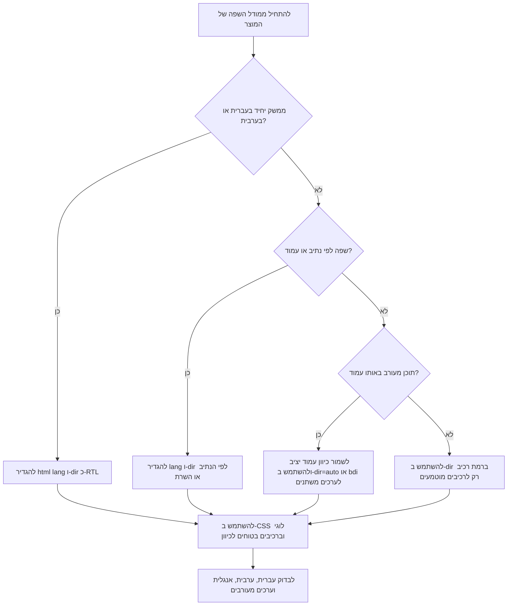

# יועץ ממשק RTL

## מטרה

לבנות ולבדוק ממשקי משתמש מימין לשמאל שמרגישים טבעיים לדוברי עברית וערבית בישראל. להתמקד ב-HTML, CSS, React, Tailwind, טקסט דו-כיווני, טפסים, נגישות, בדיקות איכות והכנה לסביבת ייצור. להתאים לעסקים קטנים, עצמאים, חנויות מקוונות, נותני שירות, עמותות, מערכות הזמנות, חשבוניות, קבלות, דפי תשלום, אזורי לקוח ואתרי צרכנות.

להגדיר גבולות כיוון ברורים. להעדיף מאפייני CSS לוגיים על פני כפילות בין גרסאות LTR ו-RTL. לשמור על קריאות של מספרים, כתובות אתר, דוא"ל, קודי קופון, פרטי בנק, מספרי טלפון, מספרי הזמנה, מספרי חשבונית ומק"טים בתוך משפטים בעברית או בערבית.

## החלטות ברירת מחדל

| החלטה | מומלץ | להימנע |
|---|---|---|
| כיוון עמוד | `<html lang="he" dir="rtl">` או `<html lang="ar" dir="rtl">` | הגדרת `direction: rtl` רק על `body` |
| יישור טקסט | `text-align: start` | `text-align: right` כברירת מחדל גורפת |
| ריווח | `margin-inline-start`, `padding-inline-end`, `gap` | `margin-left`, `padding-right` |
| מיקום | `inset-inline-start`, `inset-inline-end` | `left`, `right` |
| סמלים | לשקף רק סמלים כיווניים | לשקף לוגו, סמל מטבע, תרשים, טלפון, לוח שנה או משתמש |
| שדות קלט | `dir="auto"` לשמות ולטקסט חופשי; `dir="ltr"` לדוא"ל, כתובות אתר, טלפון, מזהים, סכומים וקודים | כיוון אחיד לכל השדות |
| מטבע | `Intl.NumberFormat("he-IL", { style: "currency", currency: "ILS" })` ובידוד בתוך טקסט RTL | שרשור ידני של סכום וסמל ללא בידוד |
| תאריכים | מדיניות מפורשת, לרוב DD/MM/YYYY כגון `03/06/2026` | תאריך דו-משמעי ללא מדיניות |
| בדיקות | עברית, ערבית, אנגלית, טקסט מעורב, נייד, מקלדת, קורא מסך, PDF ודוא"ל | בדיקה חזותית בלבד במחשב שולחני |

## עץ החלטה לבחירת אסטרטגיית כיוון



## בסיס HTML

להגדיר שפה וכיוון בגבול הגבוה והיציב ביותר.

```html
<!doctype html>
<html lang="he" dir="rtl">
  <head>
    <meta charset="utf-8" />
    <title>ניהול הזמנות</title>
  </head>
  <body>
    <main>
      <h1>הזמנות פתוחות</h1>
    </main>
  </body>
</html>
```

בערבית:

```html
<html lang="ar" dir="rtl">
```

ביישום עם שפה לפי נתיב:

```tsx
type Locale = "he" | "ar" | "en";

export function RootLayout({ locale, children }: { locale: Locale; children: React.ReactNode }) {
  const dir = locale === "he" || locale === "ar" ? "rtl" : "ltr";
  return (
    <html lang={locale} dir={dir}>
      <body>{children}</body>
    </html>
  );
}
```

## טקסט דו-כיווני

להשתמש ב-`<bdi>` סביב ערכים משתנים. להשתמש ב-`dir="auto"` כאשר ערך שמוזן על ידי משתמש יכול להתחיל בעברית, בערבית, באנגלית, במספר או בסימן.

```html
<p>לקוח: <bdi dir="auto">Maya Cohen</bdi></p>
<p>מסעדה: <bdi dir="auto">مطعم القدس</bdi></p>
<p>מספר הזמנה: <bdi dir="ltr">ORD-2026-0042</bdi></p>
<p>דוא"ל: <bdi dir="ltr">client@example.co.il</bdi></p>
<p>סה"כ לתשלום: <bdi dir="ltr">₪ 1,250.00</bdi></p>
<p>תאריך אספקה: <bdi dir="ltr">03/06/2026</bdi></p>
```

להימנע מ-`unicode-bidi: bidi-override` בטקסט רגיל של ממשק. הוא כופה סדר תווים ועלול לפגוע בטקסט מעורב. להשתמש בבידוד במקום זאת.

## מטריצת כיוון לטפסים

| שדה | כיוון מומלץ | הערות |
|---|---|---|
| שם מלא | `dir="auto"` | מתאים לעברית, ערבית, אנגלית ושמות מעורבים |
| שם עסק | `dir="auto"` | מתאים לשם מקומי, שם מסחרי באנגלית וסיומת משפטית |
| הערה חופשית | `dir="auto"` | שומר על קריאות טבעית של פסקה |
| חיפוש | `dir="auto"` | שאילתה יכולה להיות בעברית, בערבית, מק"ט או דוא"ל |
| דוא"ל | `dir="ltr"` | שומר על `@`, נקודות וסדר הדומיין |
| כתובת אתר | `dir="ltr"` | שומר על פרוטוקול, נתיב ופרמטרים |
| טלפון | `dir="ltr"` | להוסיף `inputmode="tel"` |
| סכום | `dir="ltr"` או תצוגה מקומית מבודדת | שומר על ספרות ונקודה עשרונית |
| תעודת זהות / מספר עסק | `dir="ltr"` | שומר על סדר הספרות |
| חשבון בנק | `dir="ltr"` | שומר על מספר סניף ומספר חשבון |

```html
<label for="customer-name">שם לקוח</label>
<input id="customer-name" name="customerName" dir="auto" autocomplete="name" />

<label for="email">דוא"ל</label>
<input id="email" name="email" type="email" dir="ltr" autocomplete="email" />

<label for="phone">טלפון</label>
<input id="phone" name="phone" type="tel" dir="ltr" inputmode="tel" autocomplete="tel" />

<label for="amount">סכום</label>
<input id="amount" name="amount" inputmode="decimal" dir="ltr" />
```

## CSS לוגי

מאפיינים לוגיים מתאימים את עצמם לכיוון ומבטאים כוונה.

```css
.card {
  padding-inline: 1rem;
  padding-block: 0.75rem;
  border-inline-start: 4px solid currentColor;
}

.toolbar {
  display: flex;
  flex-wrap: wrap;
  gap: 0.75rem;
  justify-content: space-between;
}

.badge {
  position: absolute;
  inset-inline-end: 0.5rem;
  inset-block-start: 0.5rem;
}
```

### טבלת המרה

| מאפיין פיזי | חלופה לוגית |
|---|---|
| `margin-left` | `margin-inline-start` או `margin-inline-end` לאחר בדיקת משמעות |
| `margin-right` | `margin-inline-end` או `margin-inline-start` לאחר בדיקת משמעות |
| `padding-left` | `padding-inline-start` |
| `padding-right` | `padding-inline-end` |
| `border-left` | `border-inline-start` |
| `border-right` | `border-inline-end` |
| `left` | `inset-inline-start` |
| `right` | `inset-inline-end` |
| `top` | `inset-block-start` |
| `bottom` | `inset-block-end` |
| `text-align: left` | `text-align: start` או `end` לפי משמעות |
| `text-align: right` | `text-align: start` לטקסט RTL רגיל |

לפני:

```css
.invoice-row {
  padding-left: 16px;
  margin-right: 8px;
  text-align: right;
}
```

אחרי:

```css
.invoice-row {
  padding-inline-start: 16px;
  margin-inline-end: 8px;
  text-align: start;
}
```

## React

לגזור כיוון משפה במקום אחד.

```tsx
type Locale = "he" | "he-IL" | "ar" | "ar-IL" | "en" | "en-IL";

const rtlLocales = new Set<Locale>(["he", "he-IL", "ar", "ar-IL"]);

export function getDir(locale: Locale): "rtl" | "ltr" {
  return rtlLocales.has(locale) ? "rtl" : "ltr";
}
```

להשתמש בו במעטפת היישום:

```tsx
export function AppShell({ locale, children }: { locale: Locale; children: React.ReactNode }) {
  const dir = getDir(locale);
  return (
    <div lang={locale} dir={dir}>
      {children}
    </div>
  );
}
```

להציג ערכים משתנים בבידוד:

```tsx
export function InlineValue({ value, dir = "auto" }: { value: string | number; dir?: "auto" | "ltr" | "rtl" }) {
  return <bdi dir={dir}>{String(value)}</bdi>;
}
```

## מטבע ותאריכים בישראל

```tsx
export function formatILS(amount: number, locale: "he-IL" | "ar-IL" | "en-IL" = "he-IL") {
  return new Intl.NumberFormat(locale, {
    style: "currency",
    currency: "ILS",
    currencyDisplay: "symbol",
  }).format(amount);
}

export function formatIsraelDate(date: Date) {
  const parts = new Intl.DateTimeFormat("en-GB", {
    day: "2-digit",
    month: "2-digit",
    year: "numeric",
  }).formatToParts(date);
  const get = (type: string) => parts.find((part) => part.type === type)?.value ?? "";
  return `${get("day")}/${get("month")}/${get("year")}`;
}
```

בתצוגת חשבונית או קבלה:

```html
<p>תאריך הפקה: <bdi dir="ltr">03/06/2026</bdi></p>
<p>חשבונית מס: <bdi dir="ltr">INV-2026-0042</bdi></p>
<p>עוסק מורשה: <bdi dir="ltr">512345678</bdi></p>
<p>סה"כ לפני מע"מ: <bdi dir="ltr">₪ 1,000.00</bdi></p>
<p>מע"מ: <bdi dir="ltr">₪ 180.00</bdi></p>
<p>סה"כ לתשלום: <bdi dir="ltr">₪ 1,180.00</bdi></p>
```

לא לקבע שיעור מע"מ ברכיב חזותי. לשמור שיעור מס בהגדרות, בשרת או בשכבת לוגיקה עסקית.


### הערת מע"מ מאומתת

נכון לבדיקת האימות מ-03/06/2026, מקורות רשמיים בישראל מאשרים ששיעור המע"מ הסטנדרטי הוא 18%, החל מ-01/01/2025. לא לקבע את השיעור ברכיב חזותי. להביא שיעורים מהגדרות, מהשרת או משכבת לוגיקה עסקית משותפת כדי ששינוי עתידי לא יחייב שינוי ממשק.

## Tailwind

להעדיף מחלקות לוגיות כאשר הן זמינות: `ms-*`, `me-*`, `ps-*`, `pe-*`, `start-*`, `end-*`, `text-start`, `text-end`.

```html
<div dir="rtl" class="p-4">
  <article class="border-s-4 ps-4 text-start">
    <h2 class="text-xl font-bold">חשבונית מס</h2>
    <p class="mt-2">סה"כ: <bdi dir="ltr">₪ 1,250.00</bdi></p>
  </article>
</div>
```

| להימנע | עדיף |
|---|---|
| `ml-4` | `ms-4` או `me-4` לפי המשמעות |
| `mr-4` | `me-4` או `ms-4` לפי המשמעות |
| `pl-4` | `ps-4` |
| `pr-4` | `pe-4` |
| `left-0` | `start-0` |
| `right-0` | `end-0` |
| `text-left` | `text-start` |
| `text-right` | `text-start` לטקסט RTL רגיל או `text-end` ליישור קצה |
| `border-l` | `border-s` |
| `border-r` | `border-e` |
| `space-x-4` | `gap-4` כאשר ניתן |

## נגישות

- להגדיר `lang` מדויק לעמוד ולשינויי שפה בתוך העמוד.
- להגדיר `dir` בגבול יציב ובשורש של חלונות קופצים.
- לשמור סדר מקלדת לוגי.
- לוודא שמסגרת מיקוד גלויה.
- לקשר תוויות ושדות באופן תכנותי.
- לחבר הודעות שגיאה באמצעות `aria-describedby`.
- לבדוק הקראה של עברית, ערבית, אנגלית, סכומים, תאריכים והודעות שגיאה.
- לא להעביר מצב רק באמצעות צד ימין או צד שמאל.
- לבדוק הגדלת תצוגה וטקסט גדול בממשק RTL.

## דפוסים שגויים

| דפוס שגוי | נזק | חלופה |
|---|---|---|
| `body { direction: rtl; }` בלי `dir` בשורש | חוסר עקביות בדפדפן ובטכנולוגיות מסייעות | להגדיר `<html lang="he" dir="rtl">` |
| החלפה גורפת של כל `left` ל-`right` | שבירת משמעות וקטעי LTR מוטמעים | לתרגם כוונה למאפיינים לוגיים |
| `flex-row-reverse` כפתרון גורף | סדר קריאה ומקלדת לא צפוי | לתת ל-`dir` לשלוט ב-start/end |
| שיקוף כל SVG | פגיעה בלוגו, תרשימים, סמלים ופקדי מדיה | לשקף רק סמלים כיווניים |
| שרשור ידני של `₪` וסכום | סימני פיסוק וסמל מטבע עלולים לזוז | להשתמש ב-`Intl.NumberFormat` וב-`bdi` |
| `text-align: right` בכל מקום | פגיעה באנגלית ובכיוון אוטומטי | להשתמש ב-`text-align: start` |
| תאריכים ידניים | עמימות | להשתמש במדיניות DD/MM/YYYY מפורשת |
| גיליון RTL נפרד ומלא | סטייה בין גרסאות | להשתמש ב-CSS לוגי ובחריגים ממוקדים |

## צ'קליסט לסביבת ייצור

### מבנה
- [ ] מעטפת השורש מגדירה `lang` ו-`dir`.
- [ ] החלפת שפה מעדכנת שפה וכיוון יחד.
- [ ] חלונות קופצים, תפריטים, רמזים והודעות מערכת יורשים כיוון.
- [ ] ערכים משתנים משתמשים ב-`<bdi>` או ב-`dir="auto"`.

### CSS ורכיבים
- [ ] ריווח, גבולות ומיקום פיזיים הוחלפו או תועדו.
- [ ] ברירת המחדל היא `text-align: start`.
- [ ] `gap` מחליף ריווח שביר באמצעות שוליים.
- [ ] שיקוף סמלים מבוסס משמעות.
- [ ] קרוסלות, מגירות צד, שלבי תהליך, פירורי לחם ודפדוף נבדקו.

### טפסים
- [ ] שמות, שמות עסקים, חיפוש והערות משתמשים ב-`dir="auto"`.
- [ ] דוא"ל, כתובת אתר, טלפון, סכום, מזהה, מק"ט ופרטי בנק משתמשים בכיוון LTR.
- [ ] סיכום שגיאות שומר סדר משימה.
- [ ] מקלדות בנייד מתאימות לסוג השדה.

### התאמה לישראל
- [ ] סכומי ILS מציגים ₪ ונשארים מבודדים במשפטי RTL.
- [ ] תאריכים מוצגים לפי מדיניות DD/MM/YYYY כאשר זה נדרש במוצר.
- [ ] מספרי טלפון קריאים וגם ניתנים להפעלה.
- [ ] תוויות חשבונית וקבלה תואמות סוג ישות והקשר חשבונאי.
- [ ] שיעור המע"מ הסטנדרטי מתועד כ-18% החל מ-01/01/2025 ואומת לשנת 2026 ב-`references/verification-log.md`; עדיין יש להביא שיעורי מס מהגדרות או מלוגיקה עסקית, לא מרכיב חזותי.

### בדיקות
- [ ] לבדוק עברית, ערבית, אנגלית ותוכן מעורב.
- [ ] לבדוק מסכים צרים, הגדלת תצוגה וטקסט גדול.
- [ ] לבדוק ניווט מקלדת בלבד.
- [ ] לבדוק קורא מסך.
- [ ] לבדוק PDF, דוא"ל, קבלות, חשבוניות והדפסה.
- [ ] לשמור צילומי מסך לפני ואחרי העלאה.
