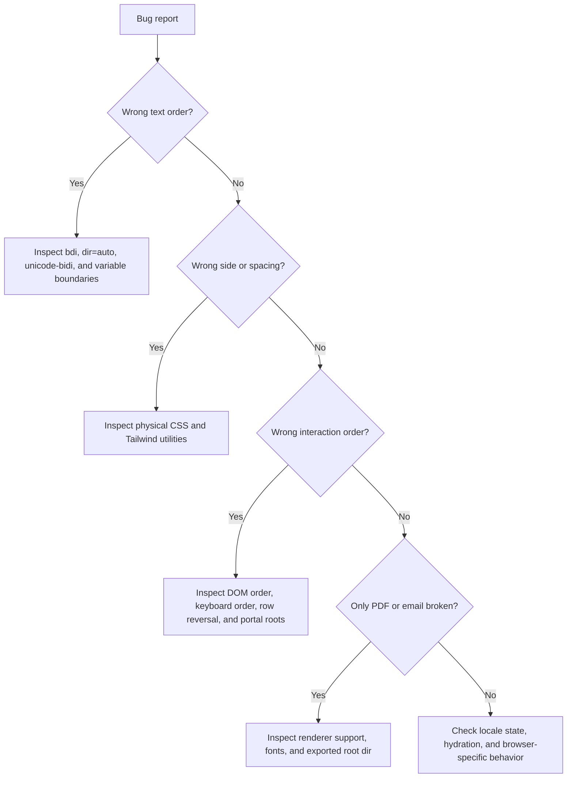

# Troubleshooting RTL Interfaces

Use this guide to diagnose common RTL bugs in Hebrew and Arabic products.

## Quick triage



## Symptoms and fixes

### Email appears scrambled inside Hebrew text

Cause: email appears directly inside an RTL sentence.

Fix:

```html
<p>נשלח אל <bdi dir="ltr">client@example.co.il</bdi></p>
```

### Order number punctuation moves

Cause: identifier is not isolated.

Fix:

```html
<p>מספר הזמנה: <bdi dir="ltr">ORD-2026-0007</bdi></p>
```

### Phone number is hard to edit

Cause: phone input inherits RTL.

Fix:

```html
<input type="tel" dir="ltr" inputmode="tel" autocomplete="tel" />
```

### Modal content is LTR inside a Hebrew page

Cause: portal renders outside the RTL tree.

Fix: add `dir` and `lang` to the portal root or to the rendered dialog.

### Dropdown opens on the wrong side

Cause: positioning uses `left` or `right`.

Fix:

```css
.menu {
  inset-inline-start: 0;
}
```

### Icon points the wrong way

Cause: directional icon was not mirrored, or a non-directional icon was mirrored.

| Icon type | Mirror in RTL? |
|---|---|
| Back or next arrow | Yes, when semantic direction changes |
| Horizontal disclosure chevron | Usually yes |
| Play media | Usually no |
| Phone | No |
| Calendar | No |
| Credit card | No |
| Logo | No |
| Chart axis | No without chart-specific review |

### Tailwind spacing is reversed

Cause: `ml-*`, `mr-*`, `space-x-*`, or physical positioning utilities.

Fix:

```html
<div class="flex gap-3 ps-4 text-start">
```

Prefer `gap` over `space-x`.

### `text-right` breaks English values

Cause: paragraph alignment is physical rather than logical.

Fix:

```css
.description {
  text-align: start;
}
```

### Drawer animation moves in the wrong direction

Cause: `translateX(100%)` or `translateX(-100%)` assumes one direction.

Fix: use direction-aware custom properties.

```css
.drawer {
  --closed-x: 100%;
  transform: translateX(var(--closed-x));
}

[dir="ltr"] .drawer {
  --closed-x: -100%;
}
```

### Tooltip arrow points to the wrong target

Cause: physical border or position.

Fix: convert arrow placement to logical sides or use a placement system that supports RTL.

### Numeric table column is unreadable

Cause: numbers inherit RTL and align inconsistently.

Fix:

```css
td.amount {
  text-align: end;
  direction: ltr;
  unicode-bidi: isolate;
}
```

### Date is ambiguous

Cause: date format is not explicit.

Fix:

```html
<time datetime="2026-06-03"><bdi dir="ltr">03/06/2026</bdi></time>
```

### PDF export loses Hebrew order

Fix checklist:
- Add `dir="rtl"` to the exported root.
- Embed a font that supports Hebrew, Arabic, Latin, punctuation, and ₪.
- Avoid relying on CSS not supported by the PDF renderer.
- Test the generated PDF, not only the browser preview.
- Isolate document numbers, dates, and amounts.

### Screen reader announces the wrong language

Cause: missing or incorrect `lang`.

Fix:

```html
<html lang="he" dir="rtl">
<p lang="en" dir="ltr">Support code: <bdi>ABC-123</bdi></p>
```

### Keyboard order feels reversed

Cause: visual order changed with `row-reverse`, absolute positioning, or DOM order mismatch.

Fix:
- Preserve meaningful DOM order.
- Let `dir` control inline start and end.
- Avoid `tabindex` except for managed widgets.
- Test Tab, Shift+Tab, arrow keys, Enter, and Escape.

## Static scan commands

```bash
grep -R "margin-left\|margin-right\|padding-left\|padding-right\|text-align: left\|text-align: right\|left:" src
grep -R "ml-\|mr-\|pl-\|pr-\|left-\|right-\|text-left\|text-right\|space-x-" src
```

## Severity guide

| Severity | Criteria |
|---|---|
| High | Blocks checkout, login, payment, legal document, phone contact, or form completion |
| Medium | Creates confusion, wrong alignment, ambiguous amounts or dates, or inconsistent navigation |
| Low | Cosmetic spacing issue with no workflow impact |
