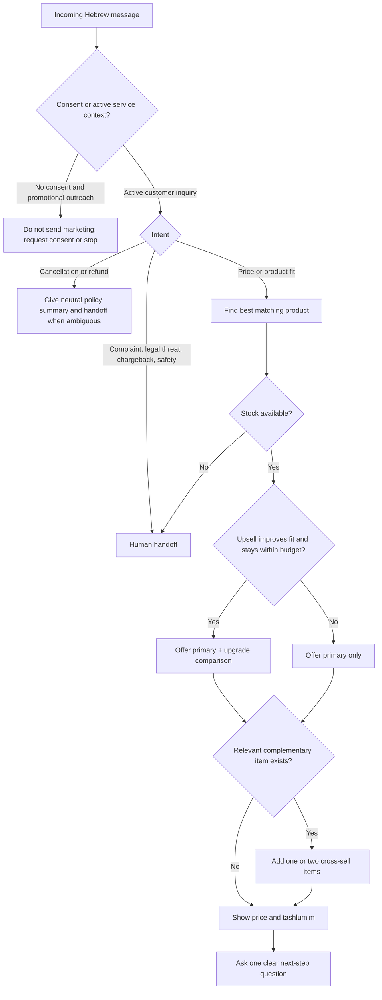
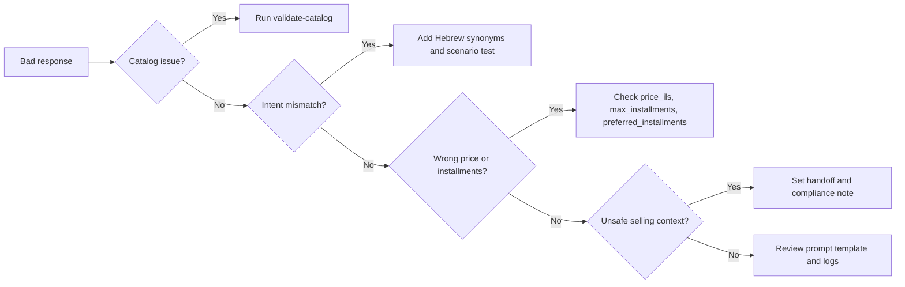

# Sales Chatbot

Build Hebrew sales conversations for Israeli small businesses, freelancers, and consumer-facing teams. Use this skill to draft, implement, test, and operate a chatbot that answers in Hebrew, presents prices in ₪, offers tashlumim, and recommends relevant upsells and cross-sells without sounding pushy.

## Scope

Use the skill for:

- WhatsApp, website chat, Instagram/Facebook lead inboxes, SMS support flows, and CRM handoff scripts.
- Product discovery, pricing, quotes, order qualification, booking, delivery questions, warranty answers, and post-purchase cross-sell.
- Israeli price presentation, VAT-aware wording, DD/MM/YYYY dates, Hebrew conversation design, and opt-in marketing safeguards.

Do not use the skill for:

- Storing credit-card numbers in chat.
- Replacing legal, accounting, tax, privacy, or accessibility review.
- Sending unsolicited marketing messages without recorded consent.
- Promising guaranteed tax, refund, shipping, or financing outcomes.

## Core operating principles

1. Start from the customer’s explicit need.
2. Present one primary recommendation before add-ons.
3. Mention the full price in ₪ and state whether VAT is included.
4. Offer installments only as a payment option, not as a way to hide the total cost.
5. Use cross-sell only when it reduces friction or improves the original purchase.
6. Use upsell only when the upgraded item is measurably better for the stated need.
7. Escalate complaints, legal threats, payment failures, safety concerns, and cancellation disputes.
8. Treat marketing consent as a gate for promotional outreach.
9. Keep Hebrew natural, direct, and local: "אפשר", "כדאי", "כולל מע״מ", "עד 3 תשלומים".
10. Avoid exaggerated claims such as "הכי טוב בארץ", "אפס סיכון", or "מובטח".


## Web-validated constants

Validated on 03/06/2026:

- The standard Israeli VAT rate is 18% from 01/01/2025 and remains configured as `0.18`.
- The Israel Tax Authority invoice-allocation threshold is treated as above ₪5,000 before VAT from 01/06/2026. Always fetch or confirm the live threshold before issuing B2B invoices.
- Bank of Israel representative exchange rates use the SDMX API on `edge.boi.gov.il`, not a generic `/exchange-rates` path.
- WhatsApp Cloud API sends messages through `https://graph.facebook.com/{version}/{phone-number-id}/messages` and uses the `messages` webhook field with `messages` and `statuses` payloads.

## Conversation stages

| Stage | Goal | Good chatbot action | Avoid |
|---|---|---|---|
| Greeting | Open politely and identify intent | Ask one focused question | Long generic menu |
| Discovery | Understand use case, budget, urgency, location | Ask for need, budget, quantity, delivery city | Asking for unnecessary personal details |
| Recommendation | Pick one item | Explain why it fits | Listing every catalog item |
| Upsell | Offer a higher-value option | Compare value and price gap | Pushing the most expensive option |
| Cross-sell | Add complementary item | Tie add-on to the original goal | Random add-on |
| Payment | Present total and installments | Show total first, then per-payment option | Hiding total in installment wording |
| Handoff | Transfer when risk appears | Summarize facts for the human | Continuing a dispute loop |

## Decision tree



## Upsell and cross-sell decision rules

### Upsell rules

Offer an upgrade when at least two conditions are true:

- The customer described a problem solved better by the upgraded item.
- The upgrade price fits the stated budget.
- The upgrade saves measurable time, delivery cost, support cost, or operational effort.
- The original item may be too limited within 30 days.
- The customer asked to compare options.

Do not upsell when:

- The customer is price-sensitive and the upgrade exceeds budget.
- The product is out of stock.
- The customer asks for cancellation, refund, or complaint handling.
- The upgrade adds complexity without clear value.
- The conversation is a mandatory service notice or opt-out request.

### Cross-sell rules

Offer a complementary item when it directly supports the original purchase:

- Setup or installation for software.
- Filters, cables, or protective accessories for electronics.
- Gift wrapping or greeting card for gifts.
- Delivery upgrade for urgent local orders.
- Training session for professional tools.
- Warranty extension where legally and commercially appropriate.

Limit cross-sell to one or two items. Explain the connection in one sentence.

## Israeli pricing and tashlumim presentation

Use this pattern:

> "המחיר הוא ₪499.00 כולל מע״מ. אפשר לשלם עד 6 תשלומים שווים של ₪83.17; סך הכול ₪499.00."

Required details:

- Show the full total before or immediately beside installment amounts.
- State "כולל מע״מ" for consumer-facing prices unless the flow is clearly B2B and configured otherwise.
- Do not imply credit approval is guaranteed.
- Do not claim "ללא ריבית" unless the business and payment provider actually offer that.
- Round installment amounts consistently.
- Include delivery fees, setup fees, or recurring subscription charges before checkout.

## Hebrew message templates

### Product fit

```text
לפי מה שתיארת, האפשרות המתאימה ביותר היא {product_name}.
המחיר: ₪{price} כולל מע״מ.
הסיבה: {fit_reason}.
אפשר גם לשדרג ל־{upsell_name} אם חשוב לך {upgrade_reason}.
רוצה שאשלח קישור הזמנה מאובטח?
```

### Cross-sell

```text
כדי להשלים את ההזמנה בלי עיכובים, כדאי להוסיף {addon_name}.
זה מתאים כי {addon_reason}.
העלות: ₪{addon_price} כולל מע״מ.
```

### Budget-sensitive answer

```text
אפשר להישאר במסגרת התקציב עם {product_name}.
לא אציע כרגע את השדרוג, כי הוא חורג מהסכום שציינת.
אפשר להתחיל מהחבילה הזו ולשדרג בהמשך.
```

### Unsubscribe

```text
בוצע. יש להסיר אותך מרשימת הודעות שיווקיות.
אפשר להמשיך לשלוח הודעות שירות הכרחיות בלבד, למשל עדכוני הזמנה.
```

### Complaint

```text
תודה על העדכון. כדי לטפל בזה נכון, אעביר לנציג שירות.
נא לציין מספר הזמנה, תיאור התקלה ותמונה או מסמך רלוונטי אם קיים.
```

## Edge cases

| Case | Required behavior |
|---|---|
| Customer writes in slang | Answer in natural Hebrew, do not correct wording |
| Customer mixes Hebrew and English | Keep Hebrew response; preserve product terms |
| Customer asks "כמה זה לחודש?" | Show installment amount and full total |
| Customer asks for discount | Offer approved discount only; otherwise suggest lower-priced option |
| Customer says "יקר לי" | Re-anchor value, offer smaller package, avoid pressure |
| Customer requests invoice | Ask for invoice details; mention that tax documents follow current Israeli rules |
| Customer asks for refund after use | Provide neutral policy summary and handoff |
| Customer asks to remove marketing messages | Confirm removal and stop promotional flow |
| Customer is angry | Apologetic service tone, no selling, handoff |
| Customer shares ID or card number | Tell customer not to send sensitive data in chat |
| Product has age restriction | Require age confirmation before purchase |
| Stock is missing | Do not collect payment before stock confirmation |
| Delivery city is remote | Give cautious delivery estimate and handoff if uncertain |
| Installments fail | Offer retry through secure payment provider or human support |
| Business asks for B2B terms | Present price policy, invoice data, and payment due date |
| Consumer asks "כולל מע״מ?" | Answer clearly: included or not included |
| Customer requests exact legal rights | Give general guidance and escalate |
| Customer compares competitor price | Compare service, stock, warranty, delivery; avoid defamation |
| Customer asks for cash price | Follow business policy and tax documentation requirements |
| Customer sends voice transcription with errors | Confirm the understood need before quoting |

## Implementation workflow

1. Collect catalog data: SKU, Hebrew name, category, price in ILS, tags, stock, max installments, upsell SKU, cross-sell SKUs, warranty.
2. Define approved response rules: discounts, free shipping, handoff phone, return policy, support hours.
3. Configure marketing consent handling per channel.
4. Connect the helper client to the inbound message source.
5. Save a conversation state object per customer.
6. Call `recommend()` for synchronous systems or `recommend_async()` for async systems.
7. Store the structured response, not only the rendered Hebrew text.
8. Log quote ID, chosen SKU, consent state, and handoff flag.
9. Route payment through a secure payment page, not chat.
10. Run the test suite after catalog changes.

## Minimal Python example

```python
import importlib.util
from pathlib import Path

client_path = Path("scripts/sales_chatbot_client.py")
spec = importlib.util.spec_from_file_location("sales_chatbot_client", client_path)
module = importlib.util.module_from_spec(spec)
spec.loader.exec_module(module)

bot = module.SalesChatbotClient(module.sample_catalog())
response = bot.recommend(
    "כמה עולה CRM לעסק קטן ואפשר בתשלומים?",
    {"name": "דנה", "has_marketing_consent": True, "preferred_installments": 3, "budget_ils": "600"},
)

print(response.reply_he)
```

## Production checklist

- [ ] Catalog prices approved by finance or owner.
- [ ] VAT wording reviewed for consumer and B2B flows.
- [ ] All installment text shows full total.
- [ ] Marketing consent stored with timestamp, source, and wording.
- [ ] Opt-out path tested.
- [ ] Payment link handled by PCI-compliant provider.
- [ ] No credit-card data stored in chat logs.
- [ ] Human handoff configured for complaints, cancellation disputes, legal questions, payment failures, and stock exceptions.
- [ ] Privacy notice available before collecting personal data.
- [ ] Accessibility statement and alternative service route available where required.
- [ ] Returns, cancellation, warranty, delivery, and subscription renewal wording approved.
- [ ] Conversation logs have retention limits.
- [ ] Hebrew responses tested with male, female, plural, and neutral wording.
- [ ] DD/MM/YYYY dates checked.
- [ ] ₪ price rendering checked.
- [ ] Test scenarios passed.
- [ ] Provider API errors mapped to safe customer messages.
- [ ] Staff trained on handoff summaries.
- [ ] Audit log includes quote ID and response version.
- [ ] Rollback plan prepared for broken catalog or API outage.

## Anti-patterns

| Anti-pattern | Better approach |
|---|---|
| "רק היום, חובה לסגור עכשיו" | "המבצע בתוקף עד DD/MM/YYYY, בכפוף למלאי" |
| "3 תשלומים של ₪99" without total | "סך הכול ₪297.00; עד 3 תשלומים שווים של ₪99.00" |
| Selling during complaint | Acknowledge, collect facts, handoff |
| Offering random add-ons | Offer only add-ons that support the selected product |
| Asking for card number | Send secure payment link |
| Ignoring opt-out | Confirm removal and stop promotional flow |
| Legal certainty | "יש לבדוק לפי תנאי העסק והדין החל" plus handoff |
| Excessive choices | One primary option, one upgrade, up to two add-ons |
| Machine-translated Hebrew | Use natural Israeli sales and service phrasing |
| Hidden recurring fees | State monthly price, billing period, renewal, and cancellation terms |

## Troubleshooting map



## File index

- `SKILL.md` — English guide.
- `SKILL_HE.md` — Hebrew guide.
- `references/api-reference.md` — Israeli integrations and regulatory reference.
- `references/workflow-guide.md` — end-to-end workflow recipes.
- `references/troubleshooting.md` — operational troubleshooting.
- `references/test-scenarios.md` — concrete scenario catalog.
- `references/migration-checklist.md` — migration checklist.
- `scripts/sales_chatbot_client.py` — typed sync and async helper.
- `scripts/sales_chatbot_cli.py` — Typer-based command line interface with fallback mode.
- `scripts/test_sales_chatbot_client.py` — pytest suite.
- `scripts/examples/` — runnable examples.

## Web-validated source policy

Review `references/verification-log.md` before deploying a production adapter. Keep VAT configurable even though the 03/06/2026 validation confirmed `18%` from `01/01/2025`. For invoice allocation, fetch the Tax Authority `MinimumAmount` value instead of relying on stale threshold text. For WhatsApp, use the verified Graph API message endpoint and parse `messages` webhook payloads, including `statuses`.

