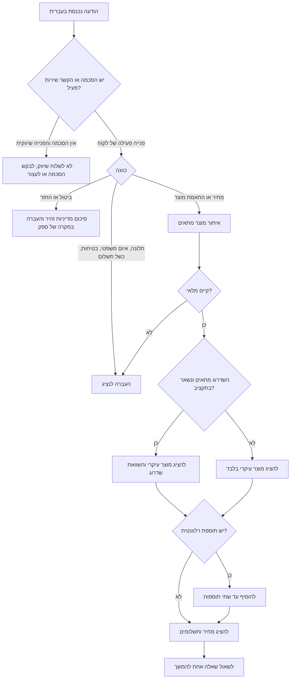
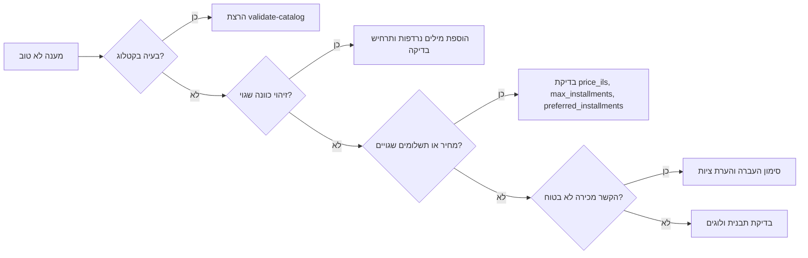

# צ׳אטבוט מכירות

מטרת המיומנות היא לבנות שיחות מכירה בעברית עבור עסקים קטנים, עצמאים ונותני שירות בישראל. הצ׳אטבוט מציג מחירים בשקלים, מציע תשלומים, ממליץ על שדרוגים ותוספות, ושומר על שפה ישראלית מקצועית בלי לחץ מכירתי מיותר.

## מתי להשתמש

השתמשו במיומנות עבור:

- וואטסאפ עסקי, צ׳אט באתר, הודעות מרשתות חברתיות, SMS ותהליכי CRM.
- התאמת מוצר, הצגת מחיר, הצעת מחיר, הזמנה, משלוח, אחריות, ביטול עסקה ותמיכה ראשונית.
- ניסוח עברי טבעי, הצגת ₪, תאריכים בפורמט DD/MM/YYYY, מע״מ ותשלומים.
- מכירה משלימה ושדרוגים כאשר יש קשר ברור לצורך של הלקוח.

אין להשתמש עבור:

- שמירת מספרי כרטיס אשראי בצ׳אט.
- החלפת ייעוץ משפטי, חשבונאי, מס, פרטיות או נגישות.
- שליחת מסרים שיווקיים ללא הסכמה מתועדת.
- הבטחות מוחלטות לגבי מס, החזר, אספקה או אישור אשראי.

## עקרונות עבודה

1. התחילו מהצורך שהלקוח כתב בפועל.
2. הציגו המלצה עיקרית אחת לפני תוספות.
3. הציגו מחיר מלא ב־₪ וציינו אם המחיר כולל מע״מ.
4. הציעו תשלומים כאפשרות תשלום, לא כאמצעי להסתיר את המחיר הכולל.
5. הציעו תוספת רק כאשר היא באמת משלימה את הקנייה.
6. הציעו שדרוג רק כאשר הערך ללקוח ברור.
7. העבירו לנציג אנושי במקרה של תלונה, איום משפטי, כשל תשלום, סוגיית בטיחות או מחלוקת על ביטול.
8. התייחסו להסכמה שיווקית כתנאי לשליחת הצעות יזומות.
9. כתבו בעברית ישראלית טבעית: "אפשר", "כדאי", "כולל מע״מ", "עד 3 תשלומים".
10. הימנעו מהבטחות מוגזמות כמו "הכי טוב בארץ", "בלי שום סיכון" או "מובטח".


## ערכים שאומתו מול מקורות רשמיים

אומת ביום 03/06/2026:

- שיעור המע״מ הכללי בישראל הוא 18% מיום 01/01/2025, ולכן ברירת המחדל בקוד נשארת `0.18`.
- סף הקצאת מספר לחשבונית מס דרך רשות המסים הוא מעל ₪5,000 לפני מע״מ החל מיום 01/06/2026. יש לבדוק את הסף החי לפני הפקת חשבוניות עסקיות.
- שערים יציגים של בנק ישראל נשלפים דרך ממשק SDMX ב־`edge.boi.gov.il`, לא דרך נתיב כללי מסוג `/exchange-rates`.
- שליחת הודעות WhatsApp Cloud API מתבצעת דרך `https://graph.facebook.com/{version}/{phone-number-id}/messages`, ואירועי Webhook מגיעים בשדה `messages` עם מטעני `messages` ו־`statuses`.

## שלבי שיחה

| שלב | מטרה | פעולה מומלצת | מה לא לעשות |
|---|---|---|---|
| פתיחה | לזהות כוונה | שאלה קצרה וממוקדת | תפריט ארוך |
| בירור צורך | להבין שימוש, תקציב, דחיפות ועיר | לשאול צורך, תקציב, כמות וכתובת כללית | לבקש פרטים אישיים ללא צורך |
| המלצה | לבחור מוצר אחד | להסביר התאמה | להציף את כל הקטלוג |
| שדרוג | להציע ערך גבוה יותר | להסביר פער מחיר ותועלת | לדחוף את היקר ביותר |
| מכירה משלימה | להוסיף מוצר רלוונטי | לקשור את התוספת לצורך המקורי | להציע תוספת אקראית |
| תשלום | להציג מחיר ותשלומים | סך הכול לפני תשלום חודשי | להסתיר מחיר מלא |
| העברה לנציג | לטפל בסיכון | לסכם עובדות לנציג | להמשיך מכירה בזמן תלונה |

## עץ החלטה



## כללי שדרוג

הציעו שדרוג כאשר מתקיימים לפחות שני תנאים:

- הלקוח תיאר צורך שהשדרוג פותר טוב יותר.
- מחיר השדרוג מתאים לתקציב שצוין.
- השדרוג חוסך זמן, עלות תמיכה, עלות משלוח או עבודה ידנית.
- המוצר הבסיסי צפוי להיות מוגבל בתוך 30 יום.
- הלקוח ביקש השוואה.

אל תציעו שדרוג כאשר:

- הלקוח כתב שהמחיר גבוה והשדרוג חורג מהתקציב.
- אין מלאי.
- מדובר בתלונה, ביטול או בקשת החזר.
- השדרוג מוסיף מורכבות בלי ערך ברור.
- מדובר בהודעת שירות חובה או בקשת הסרה מרשימת דיוור.

## כללי מכירה משלימה

הציעו תוספת כאשר היא באמת תומכת בקנייה המקורית:

- הקמה או הדרכה למערכת תוכנה.
- כבל, פילטר או אביזר הגנה למוצר חשמלי.
- עטיפה וברכה למתנה.
- שדרוג משלוח כאשר יש דחיפות.
- הדרכה לכלי מקצועי.
- הארכת אחריות כאשר הדבר מותר ומתאים למדיניות העסק.

הגבילו מכירה משלימה לפריט אחד או שניים. הסבירו במשפט אחד למה התוספת רלוונטית.

## הצגת מחיר ותשלומים בישראל

נוסח מומלץ:

> "המחיר הוא ₪499.00 כולל מע״מ. אפשר לשלם עד 6 תשלומים שווים של ₪83.17; סך הכול ₪499.00."

חובה להקפיד על:

- סך הכול מלא לפני או לצד סכום התשלום.
- "כולל מע״מ" במחירים לצרכן, אלא אם מדובר בתהליך עסקי שהוגדר אחרת.
- אין להבטיח אישור אשראי.
- אין לכתוב "ללא ריבית" בלי אישור מהעסק ומספק הסליקה.
- יש לעגל סכומי תשלומים באופן עקבי.
- יש לציין דמי משלוח, התקנה, הקמה או חיוב חודשי לפני קופה.

## תבניות הודעה

### התאמת מוצר

```text
לפי מה שתיארת, האפשרות המתאימה ביותר היא {product_name}.
המחיר: ₪{price} כולל מע״מ.
הסיבה: {fit_reason}.
אפשר גם לשדרג ל־{upsell_name} אם חשוב לך {upgrade_reason}.
רוצה שאשלח קישור הזמנה מאובטח?
```

### תוספת משלימה

```text
כדי להשלים את ההזמנה בלי עיכובים, כדאי להוסיף {addon_name}.
זה מתאים כי {addon_reason}.
העלות: ₪{addon_price} כולל מע״מ.
```

### לקוח רגיש למחיר

```text
אפשר להישאר במסגרת התקציב עם {product_name}.
לא אציע כרגע את השדרוג, כי הוא חורג מהסכום שציינת.
אפשר להתחיל מהחבילה הזו ולשדרג בהמשך.
```

### בקשת הסרה

```text
בוצע. יש להסיר אותך מרשימת הודעות שיווקיות.
אפשר להמשיך לשלוח הודעות שירות הכרחיות בלבד, למשל עדכוני הזמנה.
```

### תלונה

```text
תודה על העדכון. כדי לטפל בזה נכון, אעביר לנציג שירות.
נא לציין מספר הזמנה, תיאור התקלה ותמונה או מסמך רלוונטי אם קיים.
```

## מקרי קצה

| מצב | התנהגות נדרשת |
|---|---|
| הלקוח כותב בסלנג | לענות בעברית טבעית ולא לתקן אותו |
| הלקוח מערבב עברית ואנגלית | לענות בעברית ולשמור מונחי מוצר באנגלית אם צריך |
| "כמה זה לחודש?" | להציג גם תשלום וגם מחיר כולל |
| בקשת הנחה | להציע רק הנחה מאושרת או מוצר זול יותר |
| "יקר לי" | להסביר ערך, להציע חלופה קטנה יותר, לא ללחוץ |
| בקשת חשבונית | לבקש פרטי חשבונית ולהזכיר שהמסמך יופק לפי הכללים בישראל |
| החזר אחרי שימוש | סיכום מדיניות זהיר והעברה לנציג |
| הסרה משיווק | אישור הסרה ועצירת מסרים שיווקיים |
| לקוח כועס | שירות לפני מכירה והעברה לנציג |
| הלקוח שולח תעודת זהות או כרטיס | להנחות לא לשלוח מידע רגיש בצ׳אט |
| מוצר מוגבל גיל | לוודא גיל וזכאות לפני רכישה |
| אין מלאי | לא לגבות תשלום לפני אישור מלאי |
| עיר מרוחקת | לתת הערכת משלוח זהירה ולהעביר לנציג במקרה של ספק |
| כשל תשלומים | להציע ניסיון מחדש בקישור מאובטח או נציג |
| לקוח עסקי | להציג תנאי תשלום, חשבונית ותאריך פירעון |
| "כולל מע״מ?" | לענות בצורה חד-משמעית |
| זכויות משפטיות מדויקות | מידע כללי בלבד והעברה לנציג |
| השוואה למתחרה | להשוות שירות, מלאי, אחריות ומשלוח; לא להכפיש |
| מחיר מזומן | לפעול לפי מדיניות העסק וחובת תיעוד מס |
| תמלול קול שגוי | לאשר מה הובן לפני הצעת מחיר |

## תהליך הטמעה

1. הגדירו קטלוג: SKU, שם בעברית, קטגוריה, מחיר בש״ח, תגיות, מלאי, מספר תשלומים, שדרוג ותוספות.
2. הגדירו כללים מאושרים: הנחות, משלוח חינם, טלפון לנציג, מדיניות החזרה ושעות פעילות.
3. הגדירו טיפול בהסכמה שיווקית לפי ערוץ.
4. חברו את הלקוח הסקריפטי למקור ההודעות.
5. שמרו מצב שיחה לכל לקוח.
6. קראו ל־`recommend()` במערכת סינכרונית או ל־`recommend_async()` במערכת אסינכרונית.
7. שמרו את התשובה המובנית ולא רק את הטקסט.
8. תעדו מספר הצעת מחיר, SKU שנבחר, מצב הסכמה וסימון העברה לנציג.
9. גבו תשלום רק בקישור מאובטח.
10. הריצו בדיקות אחרי כל שינוי בקטלוג.

## דוגמת Python קצרה

```python
import importlib.util
from pathlib import Path

client_path = Path("scripts/sales_chatbot_client.py")
spec = importlib.util.spec_from_file_location("sales_chatbot_client", client_path)
module = importlib.util.module_from_spec(spec)
spec.loader.exec_module(module)

bot = module.SalesChatbotClient(module.sample_catalog())
response = bot.recommend(
    "כמה עולה CRM לעסק קטן ואפשר בתשלומים?",
    {"name": "דנה", "has_marketing_consent": True, "preferred_installments": 3, "budget_ils": "600"},
)

print(response.reply_he)
```

## רשימת בדיקה לייצור

- [ ] מחירי הקטלוג אושרו על ידי בעל העסק או הנהלת חשבונות.
- [ ] נוסח מע״מ נבדק ללקוח פרטי וללקוח עסקי.
- [ ] כל נוסח תשלומים מציג סך הכול.
- [ ] הסכמה שיווקית נשמרת עם תאריך, מקור ונוסח.
- [ ] בקשת הסרה נבדקה מקצה לקצה.
- [ ] קישור תשלום מופק מספק סליקה מאובטח.
- [ ] אין שמירת פרטי כרטיס בצ׳אט.
- [ ] קיימת העברה לנציג עבור תלונות, ביטולים, כשלי תשלום וחריגות מלאי.
- [ ] הודעת פרטיות זמינה לפני איסוף מידע אישי.
- [ ] קיימת חלופת שירות נגישה לפי הצורך.
- [ ] נוסחי החזרה, ביטול, אחריות, משלוח וחידוש מנוי אושרו.
- [ ] לוגי שיחה נשמרים לתקופה מוגבלת.
- [ ] עברית נבדקה בלשון זכר, נקבה, רבים וניסוח ניטרלי.
- [ ] תאריכים בפורמט DD/MM/YYYY.
- [ ] הצגת ₪ נבדקה.
- [ ] תרחישי הבדיקה עברו.
- [ ] שגיאות API ממופות להודעות בטוחות ללקוח.
- [ ] צוות השירות יודע לקרוא סיכום העברה.
- [ ] תיעוד שיחה כולל מספר הצעת מחיר וגרסת מענה.
- [ ] קיימת תוכנית חזרה לאחור במקרה של קטלוג שגוי או כשל ספק.

## דפוסים לא מומלצים

| דפוס שגוי | חלופה נכונה |
|---|---|
| "רק היום, חובה לסגור עכשיו" | "המבצע בתוקף עד DD/MM/YYYY, בכפוף למלאי" |
| "3 תשלומים של ₪99" בלי מחיר כולל | "סך הכול ₪297.00; עד 3 תשלומים שווים של ₪99.00" |
| מכירה בזמן תלונה | הכרה בבעיה, איסוף עובדות והעברה לנציג |
| תוספות אקראיות | תוספות שמשרתות את המוצר שנבחר |
| בקשת מספר כרטיס | קישור תשלום מאובטח |
| התעלמות מהסרה | אישור הסרה ועצירת שיווק |
| ודאות משפטית | "יש לבדוק לפי תנאי העסק והדין החל" והעברה לנציג |
| יותר מדי אפשרויות | מוצר אחד, שדרוג אחד ועד שתי תוספות |
| עברית מתורגמת מדי | עברית ישראלית טבעית |
| הסתרת חיוב חוזר | מחיר חודשי, תקופת חיוב, חידוש וביטול |

## מפת איתור תקלות



## מפתח קבצים

- `SKILL.md` — מדריך באנגלית.
- `SKILL_HE.md` — מדריך בעברית.
- `references/api-reference.md` — אינטגרציות ורגולציה בישראל.
- `references/workflow-guide.md` — תהליכי עבודה מקצה לקצה.
- `references/troubleshooting.md` — איתור תקלות תפעולי.
- `references/test-scenarios.md` — תרחישי בדיקה.
- `references/migration-checklist.md` — רשימת מעבר.
- `scripts/sales_chatbot_client.py` — לקוח סינכרוני ואסינכרוני.
- `scripts/sales_chatbot_cli.py` — ממשק שורת פקודה מבוסס Typer עם מצב גיבוי.
- `scripts/test_sales_chatbot_client.py` — בדיקות pytest.
- `scripts/examples/` — דוגמאות להרצה.

## מדיניות אימות מקורות

בדוק את `references/verification-log.md` לפני חיבור לסביבת ייצור. השאר את שיעור המע״מ ניתן להגדרה גם לאחר אימות `18%` מיום `01/01/2025`. בחשבוניות ישראל, שלוף את ערך `MinimumAmount` מרשות המסים במקום להסתמך על סף סטטי. ב-WhatsApp, השתמש בנקודת הקצה המאומתת לשליחת הודעות ונתח את שדה ה-webhook `messages`, כולל `statuses`.

