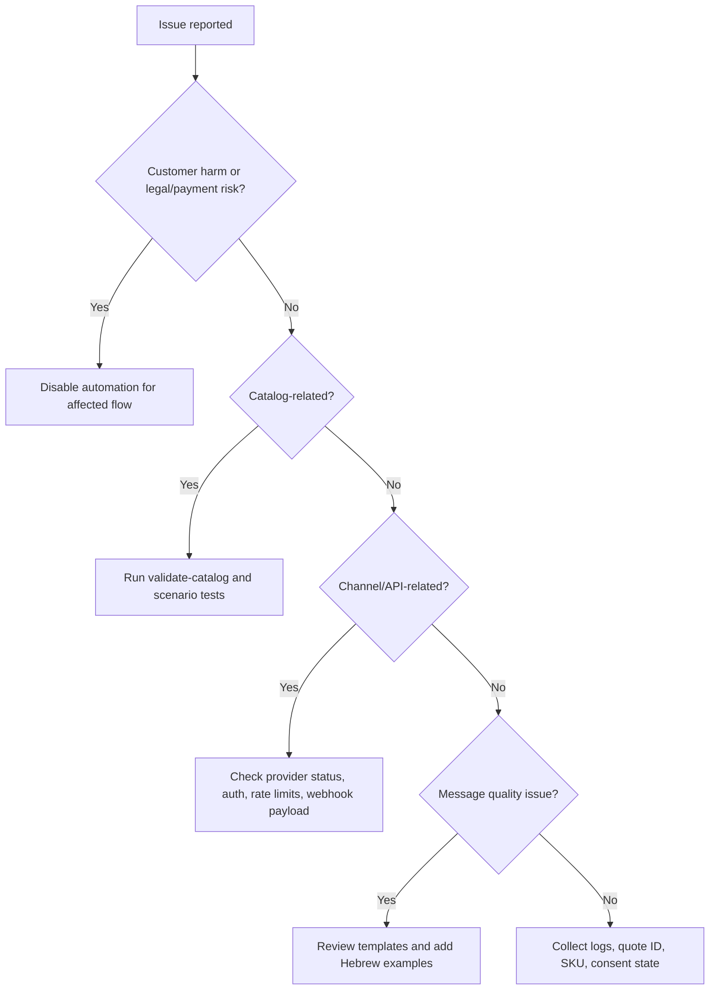

# Troubleshooting

## Fast diagnosis table

| Symptom | Likely cause | Fix |
|---|---|---|
| Bot recommends wrong product | Missing tags or poor SKU mapping | Add Hebrew synonyms to product tags |
| Bot offers upgrade too often | `upsell_to` set for low-budget flows | Add customer budget and test budget-sensitive scenario |
| Installments missing | `preferred_installments` absent or `max_installments` is 1 | Configure product `max_installments` and customer preference |
| Total price unclear | Template edited incorrectly | Restore total-before-installment wording |
| Customer receives marketing after opt-out | Consent system not updated | Mark consent revoked and block promotional templates |
| Complaint gets sales reply | Complaint terms missing | Add trigger words and force handoff |
| Price lacks VAT wording | `format_ils` call changed or custom template omitted suffix | Use `format_ils(amount)` for consumer price |
| Wrong date format | ISO date shown to customer | Use `format_date_he()` |
| Duplicate products | Catalog export duplicates SKU | Run catalog validation before deployment |
| Cross-sell references missing item | Deleted SKU still referenced | Fix `cross_sell` list |
| Payment link amount differs | Stale catalog or manual override | Stop checkout and reconcile quote |
| Invoice not issued | Missing customer billing details or allocation issue | Handoff to bookkeeping |
| Shipping date unrealistic | Remote address or provider delay | Use cautious wording and handoff |
| Typer CLI fails | Typer not installed | Install `requirements-dev.txt` or use fallback mode |
| Async integration hangs | Await missing in webhook handler | Use `await recommend_async(...)` |
| Hebrew sounds translated | Overly literal prompt or English source text | Replace with local phrase templates |
| Bot asks too many questions | Discovery step has no priority | Ask only one next question |
| Lead conversion dropped | Too many add-ons before primary recommendation | Move cross-sell after customer interest |
| Logs contain sensitive data | Raw messages stored without filtering | Mask IDs, emails, phone numbers where possible |
| Tests fail after catalog change | Expected SKUs changed | Update scenario tests intentionally |

## Diagnostic decision tree



## Log fields to inspect

- `external_conversation_id`
- `quote_id`
- `message`
- `intent`
- `selected_sku`
- `offers`
- `handoff_required`
- `warnings`
- `compliance_notes`
- `catalog_version`
- `consent_state`
- `channel`
- `provider_status_code`

## Common fixes

### Add synonyms

```json
{
  "sku": "BASIC-CRM",
  "tags": ["crm", "לקוחות", "לידים", "ניהול לקוחות", "עסק קטן", "מערכת לקוחות"]
}
```

### Stop aggressive upsell

Remove `upsell_to` from the basic product or apply budget in context:

```json
{
  "budget_ils": "300",
  "preferred_installments": 3
}
```

### Fix missing cross-sell

Ensure all referenced SKUs exist:

```json
{
  "sku": "BASIC-CRM",
  "cross_sell": ["SETUP-1H", "WA-TEMPLATES"]
}
```

### Handle payment failure safely

```text
התשלום לא הושלם. לא לשלוח פרטי אשראי בצ׳אט.
אפשר לנסות שוב בקישור מאובטח או לקבל עזרה מנציג.
```

### Handle invoice allocation issue

```text
המסמך החשבונאי דורש בדיקה של הנהלת חשבונות לפני שליחה.
נציג יעדכן לאחר אישור.
```

## Rollback procedure

1. Stop promotional outbound messages for affected segment.
2. Revert to previous catalog version.
3. Disable changed templates.
4. Route risky intents to human handoff.
5. Re-run pytest and 20 scenario prompts.
6. Review quote IDs generated during the incident.
7. Notify affected customers only when operationally required and approved.


## Web-validated configuration issues

| Symptom | Likely cause | Fix |
|---|---|---|
| Wrong invoice allocation threshold | Static threshold from an older rollout stage | Call the Tax Authority `MinimumAmount` service and compare the transaction amount before VAT. |
| Currency conversion date mismatch | Exchange rate pulled without `startPeriod` or `endPeriod` | Use the Bank of Israel SDMX API date filters and disclose the representative-rate date. |
| WhatsApp delivery status not mapped | Webhook handler expects a custom event name | Subscribe to the `messages` webhook field and parse `statuses` payloads. |
