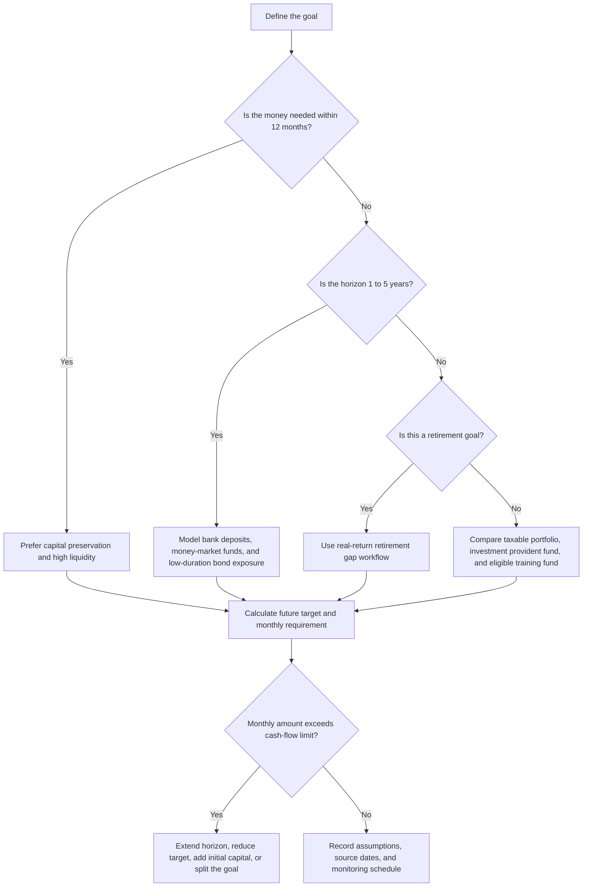

# Savings Goal Planner

## Purpose

Calculate the monthly amount required to reach a future financial goal in Israel. Cover purchase goals such as a car, wedding, renovation, equipment, VAT reserve, income-tax reserve, National Insurance reserve, emergency fund, equipment upgrade, and retirement gap. Use Israeli terminology, shekel formatting, and clear warnings when a vehicle is not suitable for the time horizon or liquidity need.

Produce a practical planning output, not a personal investment recommendation. Use the calculations as a deterministic scenario model. Validate tax, pension, provident-fund, inflation, and interest-rate assumptions against official sources before production use.

## Required inputs

| Field | Required | Meaning | Example |
|---|---:|---|---|
| `goal_name` | No | Human-readable goal | `Used delivery vehicle` |
| `target_amount` | Yes | Target amount in ₪ | `180000` |
| `months` | Yes | Months until funds are needed | `36` |
| `current_savings` | No | Existing amount allocated to the goal | `40000` |
| `current_monthly_savings` | No | Existing monthly contribution | `1500` |
| `annual_return` | No | Expected annual nominal return before fee/tax drag | `0.035` |
| `annual_fee` | No | Annual fee estimate | `0.004` |
| `tax_rate_on_gain` | No | Approximate tax drag on gains | `0.25` |
| `inflation_rate` | No | Annual inflation assumption when target is in today's terms | `0.025` |
| `amount_is_today_terms` | No | Treat target as today's ₪ and inflate to target date | `true` |
| `contribution_timing` | No | Monthly deposit timing | `end` or `beginning` |
| `vehicle_key` | No | Israeli vehicle preset | `bank_deposit_fixed` |
| `monthly_income` | No | Used for affordability warnings | `22000` |

## Core outputs

| Output | Meaning | Format |
|---|---|---|
| Future target value | Target adjusted for inflation if the starting amount is in today's terms | ₪ with 2 decimals |
| Required monthly saving | Additional monthly amount needed beyond current monthly saving | ₪ with 2 decimals |
| Existing savings future value | Current balance projected to the goal date | ₪ with 2 decimals |
| Current monthly saving future value | Existing deposits projected to the goal date | ₪ with 2 decimals |
| Effective annual return | Return after approximate fees and tax drag | Percent |
| Shortfall at current rate | Gap if no additional monthly contribution is made | ₪ |
| Vehicle warning | Liquidity, horizon, tax, and risk concerns | Plain text |
| Assumption checklist | Source freshness and validation items | Plain text |

## Formula model

Use nominal values for purchase goals. Use real values for retirement gap calculations unless a nominal retirement analysis is explicitly requested.

```text
future_target = target_amount * (1 + inflation_rate) ** (months / 12)
net_annual_return = max(-0.99, annual_return - annual_fee)
effective_annual_return = net_annual_return * (1 - tax_rate_on_gain) when positive
monthly_return = (1 + effective_annual_return) ** (1 / 12) - 1
future_current_savings = current_savings * (1 + monthly_return) ** months
future_current_monthly = current_monthly_savings * annuity_future_value_factor
required_monthly = remaining_gap / annuity_future_value_factor
```

When the monthly return is zero, the annuity factor equals the number of months. For beginning-of-month deposits, multiply the ordinary annuity factor by `(1 + monthly_return)`.

## Decision tree



## Israeli vehicle presets

| Key | Use case | Minimum horizon | Liquidity | Main caution |
|---|---|---:|---|---|
| `cash_bank` | Emergency reserve, VAT reserve, immediate purchases | 0 months | Same day | Purchasing power can erode |
| `bank_deposit_fixed` | Known payment date and low volatility | 3 months | Often locked | Early withdrawal can reduce interest |
| `money_market_fund` | Short reserve with daily pricing | 1 month | Usually a few days | Yield changes with interest-rate environment |
| `government_bond_fund` | Medium horizon and lower credit risk | 24 months | Usually a few days | Unit price can fall when yields rise |
| `taxable_brokerage_balanced` | Medium or long flexible goal | 36 months | Usually a few days | Capital-gains tax and market volatility |
| `equity_index_fund` | Long horizon and high risk tolerance | 84 months | Usually a few days | Large drawdowns can occur near the goal date |
| `keren_hishtalmut` | Eligible saver with at least six-year horizon | 72 months | Restricted before eligibility | Contribution and withdrawal rules matter |
| `kupat_gemel_investment` | Long flexible investment wrapper | 60 months | Usually a few days | Fees, tax treatment, and product rules vary |
| `pension_fund` | Retirement only | 120 months | Restricted | Not suitable for ordinary purchases |

## Concrete examples

### Used delivery vehicle

Inputs:
```json
{
  "goal_name": "Used delivery vehicle",
  "target_amount": 180000,
  "months": 36,
  "current_savings": 40000,
  "current_monthly_savings": 1500,
  "inflation_rate": 0.025,
  "vehicle_key": "bank_deposit_fixed",
  "monthly_income": 22000
}
```

Interpretation:
- Inflate the purchase price because the vehicle price is stated in today's ₪.
- Use a low-volatility vehicle because the purchase date is close.
- Add a warning if the required monthly saving exceeds 30 percent of monthly income.

### Freelancer equipment upgrade

Inputs:
```json
{
  "goal_name": "Camera and editing workstation",
  "target_amount": 42000,
  "months": 18,
  "current_savings": 8000,
  "current_monthly_savings": 900,
  "vehicle_key": "money_market_fund"
}
```

Interpretation:
- Keep the time horizon short.
- Avoid equity exposure for funds needed within 18 months.
- Record whether VAT reclaim timing changes the cash requirement.

### Retirement gap

Inputs:
```json
{
  "current_age": 42,
  "retirement_age": 67,
  "life_expectancy": 95,
  "desired_monthly_spending_today": 14000,
  "expected_monthly_pension_today": 7000,
  "current_retirement_savings": 180000,
  "annual_real_return_accumulation": 0.04,
  "annual_real_return_retirement": 0.025
}
```

Interpretation:
- Use today's shekels.
- Calculate the monthly income gap.
- Convert the gap into a required retirement nest egg.
- Calculate the monthly saving required until retirement.

## CLI quick start

Install locally:

```bash
pip install -e .
pip install -r requirements-dev.txt
```

Create a stored goal and chain the returned identifier into the next command:

```bash
CREATE_RESPONSE="$(savings-goal-planner create-goal \
  --name "Used delivery vehicle" \
  --target 180000 \
  --months 36 \
  --current-savings 40000 \
  --inflation-rate 0.025 \
  --vehicle bank_deposit_fixed \
  --env sandbox \
  --format json)"

GOAL_ID="$(python -c 'import json,sys; print(json.load(sys.stdin)["id"])' <<< "$CREATE_RESPONSE")"

savings-goal-planner show-goal \
  --id "$GOAL_ID" \
  --env sandbox \
  --format json
```

Run a direct calculation without storing:

```bash
savings-goal-planner goal \
  --target 12000 \
  --months 12 \
  --format json
```

## Python quick start

```python
from savings_goal_planner import GoalRequest, SavingsGoalPlannerClient

client = SavingsGoalPlannerClient()
result = client.calculate_goal(
    GoalRequest(
        goal_name="Renovation",
        target_amount=90000,
        months=30,
        current_savings=25000,
        inflation_rate=0.025,
        vehicle_key="money_market_fund",
    )
)
print(result.to_dict()["monthly_required"])
```

## Edge cases

| Case | Correct handling |
|---|---|
| Target already stated as future invoice amount | Set `amount_is_today_terms=false` |
| Current savings already exceed future target | Return monthly required of `0` |
| Monthly return is zero | Use straight-line monthly saving |
| Negative amount | Raise validation error |
| Month count is zero | Raise validation error |
| Annual return below minus 99 percent | Raise validation error |
| Training fund before six-year eligibility | Warn and avoid treating as liquid |
| Pension fund for ordinary purchase | Warn that retirement assets should not fund ordinary purchases |
| Inflation assumption above 6 percent | Add stress-test warning |
| Required monthly amount above 30 percent of income | Add affordability warning |
| Business reserve includes VAT | Model VAT and income-tax reserve separately |
| Retirement income gap is zero | Return zero required monthly contribution and add explanation |

## Troubleshooting

| Symptom | Likely cause | Action |
|---|---|---|
| Required monthly amount seems too high | Target was inflated twice | Confirm whether the target is in today's ₪ or future nominal ₪ |
| Output is lower than a bank quote | Fees, tax, or lower actual rate are missing | Enter product fee and tax drag explicitly |
| Vehicle looks unsuitable | Horizon is shorter than the preset minimum | Select a more liquid vehicle or extend the horizon |
| Retirement result is unrealistic | Nominal and real assumptions were mixed | Use real returns and today's ₪ consistently |
| CLI cannot import the package | Editable install was not run | Run `pip install -e .` from the package root |
| Stored goal cannot be found | Different store path or environment was used | Pass the same `--store` and `--env` values to `show-goal` |

## Anti-patterns

Avoid these practices:

- Treating the highest expected return as the best vehicle for every goal.
- Using pension assets for short-term business purchases.
- Ignoring VAT, income-tax, and National Insurance timing for freelancers.
- Modelling a one-year purchase with equity-like returns.
- Mixing nominal purchase prices with real retirement returns in the same calculation.
- Using stale tax caps or contribution limits without source validation.
- Hiding assumptions from the final output.
- Presenting a scenario as personal investment advice.
- Treating monthly affordability as acceptable without checking business cash flow.

## Production checklist

1. Define the goal and owner.
2. Capture target amount, horizon, existing funds, existing monthly saving, and target date.
3. Classify the target as today's ₪ or future nominal ₪.
4. Select a vehicle scenario only after checking horizon and liquidity.
5. Record inflation, return, fee, and tax assumptions.
6. Validate assumptions against official source pages listed in `references/api-reference.md`.
7. Run a base case, downside return case, and higher inflation case.
8. Verify affordability against household or business cash flow.
9. Separate business tax reserves from discretionary purchases.
10. Store the goal with `create-goal` when repeat review is needed.
11. Save the output and the source dates used.
12. Schedule a review after rate, tax, or price changes.
13. Use a licensed professional for personal investment, pension, tax, or legal decisions.
