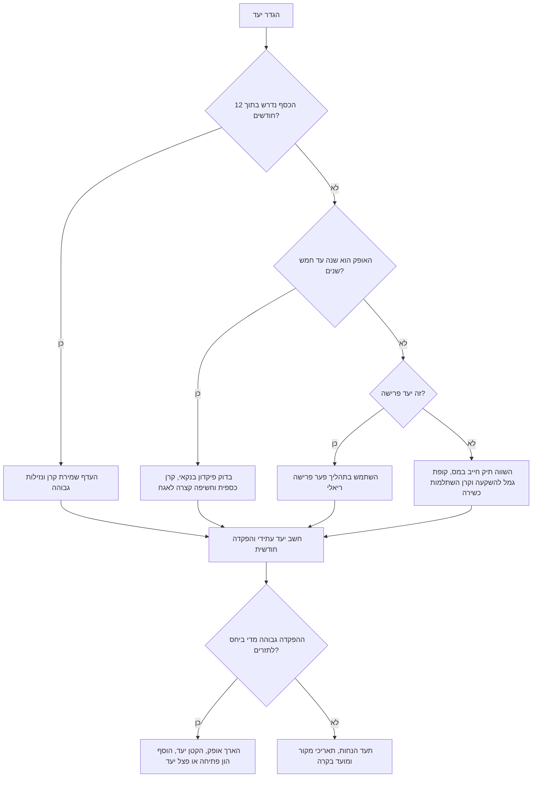

# מתכנן יעד חיסכון

## מטרה

חשב את הסכום החודשי הנדרש כדי להגיע ליעד כספי עתידי בישראל. התאם את החישוב לצרכנים, עצמאים, פרילנסרים ועסקים קטנים. כלול יעדים כמו רכב, חתונה, שיפוץ, ציוד מקצועי, עתודת מעמ, מקדמות מס הכנסה, דמי ביטוח לאומי, כרית ביטחון ופער פרישה.

הצג תרחיש מעשי, שמרני ושקוף. אל תציג כלי חיסכון כהמלצה אישית. הצג הנחות, אזהרות התאמה ובדיקות מול מקורות רשמיים. השתמש בסימן ₪, בתאריכים בפורמט DD/MM/YYYY, ובמונחים ישראליים מקצועיים.

## קלט נדרש

| שדה | חובה | משמעות | דוגמה |
|---|---:|---|---|
| `goal_name` | לא | שם היעד | `רכב מסחרי משומש` |
| `target_amount` | כן | סכום יעד בשקלים | `180000` |
| `months` | כן | מספר חודשים עד הצורך בכסף | `36` |
| `current_savings` | לא | סכום קיים שהוקצה ליעד | `40000` |
| `current_monthly_savings` | לא | הפקדה חודשית קיימת | `1500` |
| `annual_return` | לא | תשואה שנתית נומינלית לפני דמי ניהול ומס | `0.035` |
| `annual_fee` | לא | אומדן דמי ניהול שנתיים | `0.004` |
| `tax_rate_on_gain` | לא | אומדן מס על רווחים | `0.25` |
| `inflation_rate` | לא | הנחת אינפלציה שנתית כאשר היעד במחירי היום | `0.025` |
| `amount_is_today_terms` | לא | התייחס לסכום כאל מחיר היום והצמד אותו למועד היעד | `true` |
| `contribution_timing` | לא | תזמון ההפקדה החודשית | `end` או `beginning` |
| `vehicle_key` | לא | כלי חיסכון ישראלי מוגדר מראש | `bank_deposit_fixed` |
| `monthly_income` | לא | משמש לאזהרת עומס תזרימי | `22000` |

## פלט חובה

| פלט | משמעות | פורמט |
|---|---|---|
| סכום יעד עתידי | היעד לאחר הצמדה לאינפלציה, אם הסכום הוזן במחירי היום | ₪ עם שתי ספרות |
| חיסכון חודשי נדרש | תוספת חודשית מעבר לחיסכון חודשי קיים | ₪ עם שתי ספרות |
| ערך עתידי של חיסכון קיים | יתרה קיימת לאחר תשואה משוערת עד מועד היעד | ₪ |
| ערך עתידי של הפקדות קיימות | הפקדות חודשיות קיימות עד מועד היעד | ₪ |
| תשואה שנתית אפקטיבית | תשואה לאחר דמי ניהול ומס משוער על רווחים | אחוז |
| פער בקצב הנוכחי | חסר אם לא מגדילים את ההפקדה החודשית | ₪ |
| אזהרת כלי חיסכון | נזילות, אופק, מס וסיכון | טקסט ברור |
| רשימת הנחות | מקורות, תאריך בדיקה ואימות נתונים | טקסט ברור |

## מודל חישוב

השתמש בערכים נומינליים ליעדי רכישה. השתמש בערכים ריאליים לפער פרישה, אלא אם נדרש במפורש ניתוח פרישה נומינלי.

```text
יעד עתידי = יעד במחירי היום × (1 + שיעור אינפלציה)^(מספר חודשים / 12)
תשואה נטו שנתית = תשואה שנתית − דמי ניהול
תשואה אפקטיבית = תשואה נטו × (1 − שיעור מס על רווח) כאשר התשואה חיובית
תשואה חודשית = (1 + תשואה אפקטיבית)^(1 / 12) − 1
ערך עתידי של יתרה קיימת = יתרה קיימת × (1 + תשואה חודשית)^מספר חודשים
ערך עתידי של הפקדות קיימות = הפקדה חודשית קיימת × מקדם קצבה עתידית
הפקדה חודשית נדרשת = פער שנותר / מקדם קצבה עתידית
```

כאשר התשואה החודשית היא אפס, מקדם הקצבה שווה למספר החודשים. כאשר ההפקדה מתבצעת בתחילת החודש, הכפל את המקדם ב-`(1 + תשואה חודשית)`.

## עץ החלטה



## כלי חיסכון ישראליים

| מפתח | שימוש מתאים | אופק מינימלי | נזילות | אזהרה מרכזית |
|---|---|---:|---|---|
| `cash_bank` | כרית ביטחון, עתודת מעמ, רכישה מיידית | 0 חודשים | מיידית | כוח הקנייה עלול להישחק |
| `bank_deposit_fixed` | מועד תשלום ידוע ותנודתיות נמוכה | 3 חודשים | לעיתים נעול | משיכה מוקדמת עלולה לפגוע בריבית |
| `money_market_fund` | עתודה קצרה עם תמחור יומי | חודש | לרוב כמה ימי עסקים | התשואה משתנה לפי סביבת הריבית |
| `government_bond_fund` | אופק בינוני וסיכון אשראי נמוך יחסית | 24 חודשים | לרוב כמה ימי עסקים | מחיר היחידות עלול לרדת כשהתשואות עולות |
| `taxable_brokerage_balanced` | יעד גמיש לטווח בינוני או ארוך | 36 חודשים | לרוב כמה ימי עסקים | מס רווח הון ותנודתיות שוק |
| `equity_index_fund` | אופק ארוך וסובלנות גבוהה לסיכון | 84 חודשים | לרוב כמה ימי עסקים | ירידות חדות עלולות להתרחש סמוך למועד היעד |
| `keren_hishtalmut` | חוסך כשיר עם אופק של שש שנים לפחות | 72 חודשים | מוגבלת לפני זכאות | חשוב לבדוק תקרות, זכאות וכללי משיכה |
| `kupat_gemel_investment` | מעטפת השקעה גמישה לטווח ארוך | 60 חודשים | לרוב כמה ימי עסקים | דמי ניהול, מס וכללי מוצר משתנים |
| `pension_fund` | פרישה בלבד | 120 חודשים | מוגבלת | לא מתאים לרכישות רגילות |

## דוגמאות מעשיות

### רכב מסחרי משומש

קלט:
```json
{
  "goal_name": "רכב מסחרי משומש",
  "target_amount": 180000,
  "months": 36,
  "current_savings": 40000,
  "current_monthly_savings": 1500,
  "inflation_rate": 0.025,
  "vehicle_key": "bank_deposit_fixed",
  "monthly_income": 22000
}
```

פירוש:
- הצמד את מחיר הרכב כי המחיר הוזן במחירי היום.
- העדף תנודתיות נמוכה כי מועד הרכישה קרוב.
- הצג אזהרה אם ההפקדה הנדרשת גבוהה מ-30 אחוז מהכנסה חודשית.

### ציוד מקצועי לעצמאי

קלט:
```json
{
  "goal_name": "מצלמה ועמדת עריכה",
  "target_amount": 42000,
  "months": 18,
  "current_savings": 8000,
  "current_monthly_savings": 900,
  "vehicle_key": "money_market_fund"
}
```

פירוש:
- שמור על אופק קצר.
- הימנע מתרחיש מנייתי לכסף שנדרש בתוך 18 חודשים.
- בדוק אם קיזוז מעמ משנה את דרישת המזומן.

### פער פרישה

קלט:
```json
{
  "current_age": 42,
  "retirement_age": 67,
  "life_expectancy": 95,
  "desired_monthly_spending_today": 14000,
  "expected_monthly_pension_today": 7000,
  "current_retirement_savings": 180000,
  "annual_real_return_accumulation": 0.04,
  "annual_real_return_retirement": 0.025
}
```

פירוש:
- עבוד בשקלים של היום.
- חשב פער הכנסה חודשי.
- המר את הפער לסכום הון נדרש בפרישה.
- חשב הפקדה חודשית נדרשת עד גיל פרישה.

## התחלה מהירה בממשק שורת פקודה

התקן מקומית:

```bash
pip install -e .
pip install -r requirements-dev.txt
```

צור יעד שמור והעבר את המזהה שהתקבל לפקודה הבאה:

```bash
CREATE_RESPONSE="$(savings-goal-planner create-goal \
  --name "רכב מסחרי משומש" \
  --target 180000 \
  --months 36 \
  --current-savings 40000 \
  --inflation-rate 0.025 \
  --vehicle bank_deposit_fixed \
  --env sandbox \
  --format json)"

GOAL_ID="$(python -c 'import json,sys; print(json.load(sys.stdin)["id"])' <<< "$CREATE_RESPONSE")"

savings-goal-planner show-goal \
  --id "$GOAL_ID" \
  --env sandbox \
  --format json
```

חשב יעד ללא שמירה:

```bash
savings-goal-planner goal \
  --target 12000 \
  --months 12 \
  --format json
```

## התחלה מהירה בפייתון

```python
from savings_goal_planner import GoalRequest, SavingsGoalPlannerClient

client = SavingsGoalPlannerClient()
result = client.calculate_goal(
    GoalRequest(
        goal_name="שיפוץ",
        target_amount=90000,
        months=30,
        current_savings=25000,
        inflation_rate=0.025,
        vehicle_key="money_market_fund",
    )
)
print(result.to_dict()["monthly_required"])
```

## מקרי קצה

| מקרה | טיפול נכון |
|---|---|
| היעד כבר מוגדר כסכום עתידי בחשבונית | קבע `amount_is_today_terms=false` |
| החיסכון הקיים כבר מכסה את היעד העתידי | החזר הפקדה חודשית נדרשת של `0` |
| התשואה החודשית אפס | חשב חיסכון חודשי בקו ישר |
| סכום שלילי | החזר שגיאת אימות |
| מספר חודשים אפס | החזר שגיאת אימות |
| תשואה שנתית נמוכה ממינוס 99 אחוז | החזר שגיאת אימות |
| קרן השתלמות לפני זכאות | הצג אזהרה ואל תתייחס אליה כנזילה |
| קרן פנסיה לרכישה רגילה | הצג אזהרה שנכסי פרישה אינם מיועדים לכך |
| הנחת אינפלציה מעל 6 אחוז | דרוש בדיקת רגישות |
| הפקדה חודשית מעל 30 אחוז מההכנסה | הצג אזהרת יכולת תזרימית |
| עתודה עסקית כוללת מעמ | הפרד מעמ, מס הכנסה ודמי ביטוח לאומי |
| פער הכנסה בפרישה הוא אפס | החזר הפקדה חודשית אפס והוסף הסבר |

## תקלות נפוצות

| סימפטום | סיבה אפשרית | פעולה |
|---|---|---|
| ההפקדה החודשית נראית גבוהה מדי | היעד הוצמד פעמיים | בדוק אם היעד במחירי היום או בסכום עתידי |
| הפלט נמוך מהצעת הבנק | חסרים דמי ניהול, מס או ריבית בפועל | הזן דמי ניהול ומס במפורש |
| כלי החיסכון נראה לא מתאים | האופק קצר מהמינימום | בחר כלי נזיל יותר או הארך אופק |
| תוצאת פרישה לא סבירה | הנחות נומינליות וריאליות התערבבו | השתמש בתשואה ריאלית ובשקלים של היום |
| שורת הפקודה אינה מייבאת את החבילה | התקנה מקומית לא בוצעה | הרץ `pip install -e .` מתיקיית החבילה |
| יעד שמור לא נמצא | נעשה שימוש בנתיב שמירה או סביבה שונים | העבר אותם ערכי `--store` ו-`--env` לפקודת `show-goal` |

## דפוסים שגויים

הימנע מהפעולות הבאות:

- בחירת כלי לפי התשואה הצפויה הגבוהה ביותר בלבד.
- שימוש בנכסי פנסיה לרכישה עסקית קצרת טווח.
- התעלמות ממועדי מעמ, מס הכנסה ודמי ביטוח לאומי.
- שימוש בתרחיש מנייתי ליעד של שנה.
- ערבוב מחירי רכישה נומינליים עם תשואות פרישה ריאליות.
- שימוש בתקרות מס מיושנות ללא בדיקת מקור.
- הסתרת הנחות מהפלט.
- הצגת תרחיש כהמלצת השקעה אישית.
- אישור הפקדה חודשית בלי בדיקת תזרים משק בית או עסק.

## רשימת בדיקה להפקה

1. הגדר יעד ובעלים.
2. אסוף סכום יעד, אופק, כספים קיימים, הפקדה חודשית קיימת ותאריך יעד בפורמט DD/MM/YYYY.
3. סווג את סכום היעד כמחירי היום או כסכום עתידי.
4. בחר תרחיש כלי חיסכון רק לאחר בדיקת אופק ונזילות.
5. תעד אינפלציה, תשואה, דמי ניהול ומס.
6. אמת הנחות מול מקורות רשמיים שמופיעים ב-`references/api-reference.md`.
7. הרץ תרחיש בסיס, תרחיש תשואה נמוכה ותרחיש אינפלציה גבוהה.
8. בדוק יכולת תזרימית של משק בית או עסק.
9. הפרד עתודות מס עסקיות מרכישות לפי שיקול דעת.
10. שמור יעד עם `create-goal` כאשר נדרשת בקרה חוזרת.
11. שמור את הפלט ואת תאריכי המקורות.
12. קבע בקרה לאחר שינוי ריבית, מס או מחיר.
13. פנה לבעל רישיון עבור החלטות השקעה, פנסיה, מס או משפט.
