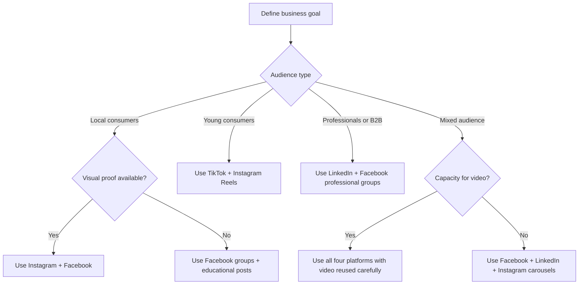
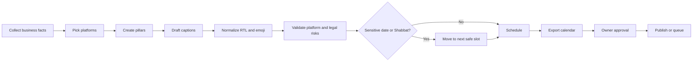
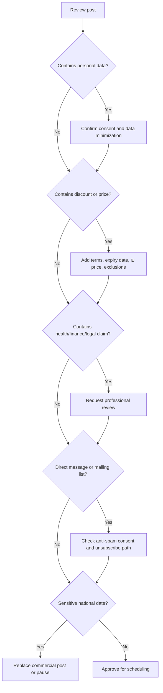

# Social-Media Manager

## Purpose

Use this skill to create practical, Hebrew-friendly organic social-media plans for Israeli businesses and independent professionals. Produce schedules for Facebook, Instagram, TikTok, and LinkedIn in `Asia/Jerusalem`, handle right-to-left captions safely, preserve emoji, validate platform-specific limits, and flag Israeli legal/commercial risks before publishing.

Prioritize useful execution over generic marketing advice. Output concrete post drafts, posting dates, captions, hashtags, platform rationale, and operational checks.

## Operating principles

- Use imperative, action-oriented guidance.
- Prefer Hebrew copy in natural Israeli professional language when the audience is local.
- Use `DD/MM/YYYY` dates for Hebrew deliverables and `YYYY-MM-DD` for machine-readable files.
- Use `₪` for budgets, prices, discounts, and examples intended for Israeli audiences.
- Schedule in `Asia/Jerusalem` unless another timezone is explicitly requested.
- Avoid commercial posts during Shabbat-sensitive windows when the business requests a traditional or broad Israeli audience strategy.
- Avoid commercial content on memorial days, Yom Kippur, and other sensitive national dates.
- Keep platform automation compliant with each platform’s API and terms.
- Use `references/verification-log.md` before production handoff; re-check live sources when API versions or Israeli rules change.
- Require consent before sending direct messages, uploading customer lists, or using personal data.
- Flag claims, discounts, testimonials, before/after images, medical claims, financial promises, and influencer disclosures for review.

## Inputs to collect

Ask only for missing details that materially change the schedule. When details are absent, apply the defaults below and state assumptions.

| Input | Default | Why it matters |
|---|---:|---|
| Business type | Local service business | Determines platform mix and tone |
| City or service area | Israel-wide | Determines local hashtags and Facebook group strategy |
| Audience | Hebrew-speaking adults in Israel | Determines language, references, and timing |
| Platforms | Facebook, Instagram, TikTok, LinkedIn | Provides complete cross-platform schedule |
| Posting window | Next 14 days | Gives enough posts for a useful plan |
| Brand tone | Clear, direct, helpful | Works for most Israeli small businesses |
| Religious sensitivity | Moderate | Avoids obvious Shabbat and holiday issues |
| Content assets | Text-only plus placeholders | Avoids inventing images or videos |
| Budget | Organic only | Keeps the skill outside paid-media planning |
| Approval workflow | Owner approval before publish | Reduces legal and reputational risk |

## Quick start

Use this sequence for most requests:

1. Classify the business and audience.
2. Pick the platform mix.
3. Create content pillars.
4. Generate Hebrew captions and hooks.
5. Normalize RTL text and emoji placement.
6. Validate limits, hashtags, links, and disclosure needs.
7. Schedule posts in `Asia/Jerusalem`.
8. Export the plan to a table, CSV, JSON, or API-ready payloads.
9. Add risk notes and approval checklist.

### Example request

> Create a 2-week Hebrew content calendar for a hair salon in Rishon LeZion, mostly women 25-45, organic only, Instagram and Facebook, no posting on Shabbat.

### Example output shape

| Date | Time | Platform | Format | Caption hook | CTA | Notes |
|---|---:|---|---|---|---|---|
| 08/06/2026 | 09:00 | Instagram | Reel | "לפני צבע? 3 דברים שכדאי לדעת" | "שלחי הודעה לקביעת תור" | Add before/after disclosure and client consent |
| 09/06/2026 | 19:00 | Facebook | Group post | "מחפשת גוון טבעי לקיץ?" | "כתבי בתגובות איזה גוון מעניין אותך" | Use local group rules; avoid spammy reposting |
| 10/06/2026 | 12:30 | Instagram | Story | "מקום פנוי היום ב-17:00" | "לחצי להזמנה" | Confirm availability before publish |

## Platform selection

Use the primary goal to choose the platform mix.

| Goal | Facebook | Instagram | TikTok | LinkedIn |
|---|---|---|---|---|
| Local discovery | Strong | Strong | Medium | Weak |
| Community trust | Strong | Medium | Weak | Medium |
| Visual portfolio | Medium | Strong | Strong | Weak |
| Young consumer reach | Weak | Strong | Strong | Weak |
| B2B credibility | Medium | Weak | Weak | Strong |
| Recruiting | Medium | Weak | Weak | Strong |
| Educational authority | Strong | Medium | Medium | Strong |
| Event promotion | Strong | Medium | Medium | Medium |

### Decision tree



## Recommended Israeli posting windows

Treat these as starting points, not guarantees. Adjust after 2-4 weeks of actual performance.

| Platform | Suggested days | Suggested local times | Notes |
|---|---|---|---|
| Facebook | Sunday, Tuesday, Wednesday, Thursday | 09:00, 12:30, 19:00 | Works for local groups, services, parenting, food, and community content |
| Instagram | Sunday, Monday, Wednesday, Thursday | 08:30, 12:00, 20:00 | Reels can perform outside office hours; stories can be more frequent |
| TikTok | Sunday, Tuesday, Thursday | 12:00, 17:00, 21:00 | Test trend-based posts quickly; avoid over-polishing |
| LinkedIn | Sunday, Tuesday, Wednesday | 08:30, 11:30, 17:00 | Sunday morning can work well in Israel because it is a workday |

### Shabbat and holiday handling

Apply this conservative default unless the business explicitly serves a secular or global audience and accepts the risk:

- Avoid new commercial posts from Friday 15:00 until Saturday 20:30.
- Avoid scheduled commercial content on Yom Kippur.
- Avoid promotional content on Yom HaZikaron and Holocaust Remembrance Day.
- Use respectful informational content only when a relevant public-service reason exists.
- Avoid automatic "Happy holiday" posts for sensitive days.
- Confirm Hebrew-date holidays against a current calendar before final publishing.

## Hebrew, RTL, and emoji handling

Hebrew captions frequently mix Hebrew, English product names, prices, phone numbers, hashtags, and emoji. Handle them deliberately.

### Rules

- Keep the first line short and strong.
- Place emoji at natural phrase boundaries, not in the middle of Hebrew words.
- Avoid starting every sentence with emoji.
- Preserve English brand names in English.
- Use real Hebrew terms where they exist.
- Keep `₪` before or after amounts consistently in the same post. Prefer `₪120` or `120 ₪`; do not mix.
- Use punctuation that reads well in RTL contexts.
- Avoid excessive hashtag blocks in Hebrew. Use 3-8 focused hashtags for most organic posts.
- Test captions visually on mobile before publishing.

### Safe caption pattern

```text
שורה ראשונה: הוק ברור שמפסיק גלילה

2-4 שורות קצרות עם ערך אמיתי.
נקודה אחת בכל פסקה.

CTA פשוט:
להזמנות: 050-0000000

#עסקיםקטנים #תלאביב #שיווקדיגיטלי
```

### Bad caption pattern

```text
 מבצעעעעעע מטורףףףף!!!!!! קנו עכשיו!!!!!!!!! #מבצע #מבצע #מבצע #מבצע #מבצע #מבצע
```

### Mixed Hebrew and English examples

| Case | Prefer | Avoid |
|---|---|---|
| SaaS post | "מערכת SaaS לצוותי מכירות" | "מערכת תוכנה כשירות לצוותי מכירות" |
| Price | "אבחון ראשוני ב-₪250" | "אבחון ב 250 שחחח" |
| CTA | "כתבו 'פרטים' בתגובות" | "תפציצו בתגובותתתתת" |
| Local hashtag | `#עסקיםקטנים` | `#עסקים_קטנים_בישראל_2026_חדש` |
| English brand | "Canva, Meta Business Suite" | "קנבה, מטא ביזנס סוויט" when the UI is in English |

## Content pillars for Israeli small businesses

Use 3-5 pillars. Keep them simple enough to repeat weekly.

| Pillar | Purpose | Example |
|---|---|---|
| Trust | Reduce hesitation | "איך בודקים הצעת מחיר בלי ליפול על אותיות קטנות" |
| Education | Teach before selling | "3 טעויות נפוצות לפני שמזמינים מדביר" |
| Proof | Show outcomes | "לפני/אחרי באישור הלקוחה" |
| Local relevance | Connect to place | "זמינות השבוע ברמת גן וגבעתיים" |
| Offer | Drive action | "10% הנחה להזמנות עד 15-06-2026" |
| Behind the scenes | Humanize | "איך נראה יום עבודה בסטודיו" |
| FAQ | Answer objections | "כמה זמן מראש כדאי להזמין תור?" |

## Platform-specific guidance

### Facebook

Use Facebook for community trust, local discovery, events, groups, and longer explanations.

Do:
- Write group-specific posts instead of copying the same text everywhere.
- Read group rules before posting.
- Use helpful posts with a light CTA.
- Post as a person when group rules require it and the owner approves.
- Use local context: neighborhood, delivery radius, parking, opening hours.

Avoid:
- Posting the same promotional text across many groups.
- Tagging unrelated businesses.
- Using bait such as "boost this post" or "share everywhere".
- Publishing client photos without consent.
- Treating a Facebook Page as the only organic channel.

### Instagram

Use Instagram for Reels, Stories, carousels, visual proof, and lifestyle positioning.

Do:
- Lead with a visual concept before writing the caption.
- Add Hebrew subtitles to Reels.
- Use 3-8 hashtags and location tags.
- Keep CTA simple: DM, link in bio, call, WhatsApp.
- Use Stories for daily availability and quick updates.

Avoid:
- Uploading videos without captions.
- Using tiny text inside images.
- Overloading caption with hashtags.
- Making claims that the image cannot support.
- Posting before/after content without documented consent.

### TikTok

Use TikTok for direct, informal, educational, and personality-driven video.

Do:
- Open with a strong spoken hook in the first 2 seconds.
- Use Hebrew subtitles.
- Use simple scenes: phone camera, workplace, real customer questions.
- Repurpose ideas, not exact Instagram edits.
- Respond to comments with short videos when relevant.

Avoid:
- Corporate scripts.
- Over-edited videos that hide the person.
- Sensitive customer stories without consent.
- Medical, financial, or professional claims without review.
- Trend participation that conflicts with brand safety.

### LinkedIn

Use LinkedIn for B2B trust, recruiting, professional education, and founder-led content.

Do:
- Use clear professional Hebrew or English depending on the audience.
- Start with a specific insight, not a motivational cliché.
- Use case studies, lessons learned, hiring updates, and practical frameworks.
- Add a polite CTA: "Interested in comparing notes?" or "Happy to share the checklist."
- Keep tone useful and grounded.

Avoid:
- Copying Facebook jokes into LinkedIn.
- Using too many emoji.
- Publishing confidential client details.
- Inflating metrics.
- Making unverified claims about market leadership.

## Scheduling workflow



### Default cadence

| Business capacity | Facebook | Instagram | TikTok | LinkedIn |
|---|---:|---:|---:|---:|
| Very limited | 2/wk | 2/wk | 0-1/wk | 1/wk |
| Standard | 3/wk | 3/wk + stories | 2/wk | 2/wk |
| High capacity | 5/wk | 5/wk + stories | 3-5/wk | 3/wk |
| Launch week | 5-7/wk | 5-7/wk | 3-5/wk | 2-3/wk |

## Legal and compliance checklist for Israel

This is not legal advice. Use it as an operational checklist and escalate unclear cases.

- Marketing messages: follow anti-spam rules before sending direct electronic marketing messages.
- Privacy: collect only necessary personal data, keep it secure, and explain the purpose.
- Customer lists: upload to ad platforms only when consent and legal basis exist.
- Influencers: disclose paid collaborations clearly.
- Discounts: show real terms, dates, exclusions, and final price where applicable.
- Consumer protection: avoid misleading claims, hidden conditions, and pressure tactics.
- Accessibility: make visual content understandable with captions, alt text, or text alternatives where feasible.
- Testimonials: keep written consent and avoid changing meaning.
- Health, finance, legal, insurance, education, and employment claims: require professional review.
- Children: apply extra caution; avoid targeting minors with inappropriate products.

## Decision tree for compliance escalation



## Concrete examples

### Local café in Haifa

Platforms: Facebook, Instagram, TikTok.

Pillars:
- Daily menu and availability.
- Behind-the-scenes baking.
- Local community moments.
- Seasonal offers.

Example caption:

```text
קפה טוב זה נחמד.
מאפה שיצא עכשיו מהתנור זה כבר סיבה לעצור הכול 

היום בוויטרינה:
בריוש שקדים, קראנץ' שוקולד ועוגיות חמאה.

פתוח עד 18:00 ברחוב מוריה, חיפה.
#חיפה #קפהבחיפה #מאפייה
```

Schedule:
- Instagram Reel: Sunday 08:30.
- Facebook local group post: Tuesday 12:30.
- TikTok behind-the-scenes: Thursday 17:00.
- Instagram Story: daily when fresh stock exists.

### Freelance accountant

Platforms: LinkedIn, Facebook, Instagram.

Pillars:
- Tax deadline reminders.
- Practical expense examples.
- Myth-busting for freelancers.
- Client onboarding.

Example caption:

```text
עצמאים: לא כל קבלה ש"קשורה לעבודה" מוכרת אוטומטית.

לפני שמכניסים הוצאה לדוח, בדקו:
1. האם יש קשר ישיר לעסק?
2. האם יש מסמך תקין?
3. האם מדובר בהוצאה מעורבת?

שמירה מסודרת עכשיו חוסכת כאב ראש בסוף השנה.
#עצמאים #ראייתחשבון #עסקיםקטנים
```

Risk note: Review tax phrasing. Avoid presenting general content as personal tax advice.

### B2B SaaS startup

Platforms: LinkedIn, Facebook professional groups, Instagram for employer brand.

Pillars:
- Product education.
- Customer problem framing.
- Hiring culture.
- Lessons learned.

Example LinkedIn opener:

```text
רוב צוותי המכירות לא צריכים עוד dashboard.
הם צריכים פחות רעש בין lead לפעולה הבאה.
```

## Edge cases

| Edge case | Handling |
|---|---|
| Mixed Hebrew and Arabic audience | Create separate captions; do not rely on machine-translated Hebrew |
| Hebrew plus English product UI | Keep UI terms in English and explain briefly in Hebrew |
| Business open on Shabbat | Ask for sensitivity preference; still avoid broad-audience promotional pushes during sensitive windows |
| National emergency | Pause automated promotional content; publish only useful, verified service updates |
| No assets | Use text posts, carousels with simple templates, FAQ content, and behind-the-scenes placeholders |
| Highly regulated service | Add review gates for health, finance, legal, insurance, real estate, and education |
| Franchise or chain | Confirm brand guidelines and location-specific approval rules |
| User asks to scrape group members | Refuse scraping; suggest compliant community posting and consent-based lead capture |
| User asks for fake reviews | Refuse fake engagement; suggest legitimate testimonial collection workflow |
| Client wants one caption everywhere | Adapt the same idea per platform instead of duplicating the same post |
| TikTok trend conflicts with brand | Skip the trend; protect trust over reach |
| Holiday greeting uncertainty | Use a neutral greeting or skip; verify holiday timing first |

## Anti-patterns

Avoid these patterns:

- Posting identical copy on all platforms.
- Publishing Hebrew text with broken number/order rendering.
- Treating hashtags as the strategy.
- Scheduling sales posts on Yom Kippur or memorial days.
- Using "limited offer" without real end date.
- Claiming "the best" or "guaranteed" without support.
- Uploading a customer list without consent.
- Ignoring Facebook group rules.
- Posting visual text that cannot be read on mobile.
- Automating replies that appear human without disclosure.
- Using engagement bait.
- Hiding material terms in tiny image text.
- Publishing customer faces, homes, cars, medical details, or children without explicit consent.
- Translating English clichés directly into unnatural Hebrew.

## Troubleshooting

| Symptom | Likely cause | Fix |
|---|---|---|
| Hebrew punctuation appears reversed | Mixed RTL/LTR text without isolation | Add Unicode isolation around mixed segments or test in the target app |
| Hashtags break | Spaces or punctuation inside Hebrew hashtag | Remove spaces; keep one readable word or short phrase |
| Link preview missing | Platform crawler blocked or URL metadata absent | Test the URL, add Open Graph metadata, or use native media |
| Instagram post rejected | Missing media, expired token, unsupported aspect ratio | Use a valid image/video and refresh token |
| TikTok post stuck | Upload processing or moderation review | Check status endpoint and platform policy |
| LinkedIn post looks too casual | Facebook-style copy reused | Rewrite around professional insight |
| Facebook group post removed | Rule violation or repeated promotion | Read rules and provide value before CTA |
| Engagement low | Weak hook, wrong timing, mismatch to platform | Rewrite first line and test another slot |
| Comments attract complaints | Offer terms unclear | Add price, dates, eligibility, and exclusions |
| Posts publish at wrong time | Timezone mismatch | Store datetimes with `Asia/Jerusalem` and never as naive local time |

## Production checklist

Before scheduling:
- Confirm business name, service area, offer, and contact details.
- Confirm platform list and account access.
- Confirm timezone is `Asia/Jerusalem`.
- Confirm holidays and sensitive dates for the schedule period.
- Confirm Shabbat policy.
- Confirm asset rights for photos, music, templates, and fonts.
- Confirm customer consent for testimonials and before/after content.
- Confirm discount terms and expiry date.
- Confirm privacy notice for lead forms.
- Confirm anti-spam consent for direct messages, SMS, email, or WhatsApp campaigns.
- Validate captions for platform limits.
- Validate hashtag count and readability.
- Validate emoji rendering on mobile.
- Validate links and UTM parameters.
- Review all posts in a calendar view.
- Get owner approval.
- Queue posts in approved platform tools or compliant APIs.
- Monitor comments during the first hour after publishing.
- Record actual performance for future scheduling.

## Output templates

### Calendar table

| Date | Time IL | Platform | Format | Pillar | Caption | CTA | Compliance notes | Owner status |
|---|---:|---|---|---|---|---|---|---|

### JSON schedule item

```json
{
  "platform": "instagram",
  "scheduled_at": "2026-06-08T08:30:00+03:00",
  "timezone": "Asia/Jerusalem",
  "format": "reel",
  "caption": "לפני שמעלים Reel: בדקו שיש כתוביות בעברית.",
  "hashtags": ["#עסקיםקטנים", "#שיווקדיגיטלי"],
  "cta": "שלחו הודעה לקבלת צ'ק-ליסט",
  "approval_status": "pending_owner_review",
  "risk_flags": ["requires_asset_rights_check"]
}
```

## Using the included helper scripts

Use the structured client when a repeatable schedule is needed.

```bash
python scripts/social_media_manager_client.py plan --platform instagram --platform facebook --days 14 --business-type "מספרה"
python scripts/social-media-manager-cli.py validate --platform instagram --caption "טיפ קצר לבעלי עסקים "
python scripts/social-media-manager-cli.py export --platform linkedin --days 7 --format json
```

The helper supports synchronous and asynchronous scheduling, JSON/CSV export, RTL normalization, Hebrew hashtag cleanup, Shabbat avoidance, custom blackout dates, and platform validation.

## Handoff guidance

Provide outputs in a format the business owner can approve quickly:

- Start with a one-screen summary.
- Add a calendar table.
- Add captions grouped by platform.
- Add risk notes and missing assets.
- Add publishing instructions.
- Add a short measurement plan for the next cycle.

## Measurement plan

Track only metrics that lead to decisions.

| Metric | Meaning | Decision |
|---|---|---|
| Saves | Valuable educational content | Create more guides/checklists |
| Comments | Conversation potential | Follow up and turn into FAQ posts |
| Shares | Strong local relevance | Repeat the topic from another angle |
| Profile visits | Interest in business | Improve bio and contact flow |
| Link clicks | Action intent | Check landing page and offer clarity |
| DMs | Lead potential | Improve response scripts and consent handling |
| Watch time | Video strength | Keep hooks that retain viewers |
| Unfollows or negative comments | Tone mismatch | Reduce hard selling or clarify claims |

## Safety boundaries

Do not assist with fake engagement, bought followers, scraping private groups, impersonation, unauthorized account access, stealth advertising, misleading endorsements, or evasion of platform enforcement. Offer compliant alternatives such as consent-based lead capture, transparent testimonials, community guidelines, and owner-approved organic posting.
