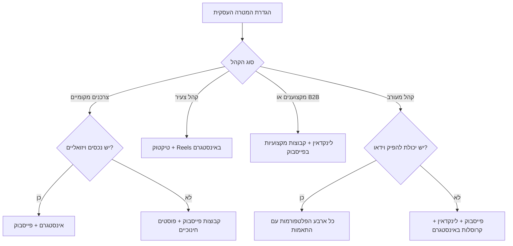
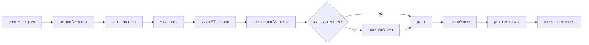
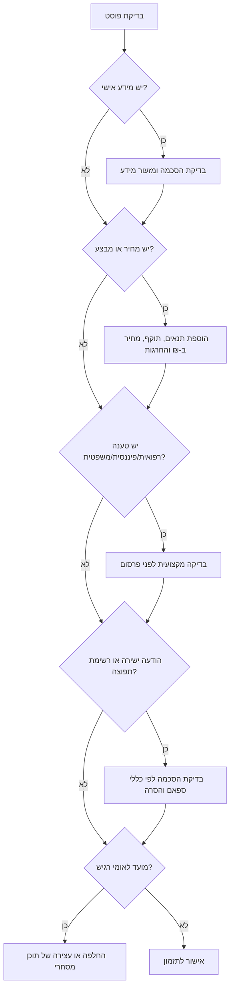

# מנהל רשתות חברתיות

## מטרה

המיומנות מיועדת לתכנון, בדיקה ותזמון של פוסטים אורגניים לעסקים קטנים, פרילנסרים ונותני שירות בישראל. השתמשו בה כדי לבנות לוחות תוכן לפייסבוק, אינסטגרם, טיקטוק ולינקדאין, עם טיפול נכון בעברית, אימוג'י, כתיבה מימין לשמאל, אזור זמן ישראלי, מועדים רגישים ובדיקות ציות בסיסיות לפני פרסום.

הפלט צריך להיות מעשי: תאריכים, שעות, פלטפורמות, פורמטים, קופי בעברית, האשטגים, קריאות לפעולה, הערות סיכון ורשימת אישור לפרסום.

## עקרונות עבודה

- כתבו בעברית טבעית, מקצועית וישירה.
- השתמשו בתאריכים בפורמט `DD/MM/YYYY` במסמכים שמיועדים ללקוח ישראלי.
- השתמשו ב-`₪` להצגת מחירים, הנחות, חבילות ודוגמאות כספיות.
- תזמנו לפי `Asia/Jerusalem`, אלא אם נדרש אזור זמן אחר.
- הימנעו מפרסום מסחרי בחלון רגיש של שבת כאשר הקהל רחב או מסורתי.
- הימנעו מפרסום מסחרי ביום כיפור, יום הזיכרון, יום השואה ומועדים לאומיים רגישים.
- שמרו על התאמה לכללי הפלטפורמות ולתנאי השימוש שלהן.
- בדקו את `references/verification-log.md` לפני מסירה לייצור; אמתו מקורות חיים כשגרסאות ממשקי תכנות או כללים בישראל משתנים.
- דרשו הסכמה לפני שימוש בתמונות לקוחות, המלצות, רשימות תפוצה או מידע אישי.
- סמנו לבדיקה משפטית טענות רפואיות, פיננסיות, משפטיות, ביטוחיות, תעסוקתיות או לימודיות.
- הציגו תנאי מבצע בצורה ברורה: מחיר, תוקף, החרגות, מלאי, תנאי ביטול ואופן מימוש.

## פרטים שצריך לאסוף

שאלו רק על מידע שחסר ומשנה את התכנון. כשאין מידע, השתמשו בברירות המחדל והציגו אותן כהנחות.

| פרט | ברירת מחדל | למה זה חשוב |
|---|---:|---|
| סוג העסק | עסק שירות מקומי | משפיע על פלטפורמות, טון ותוכן |
| אזור פעילות | כלל ישראל | משפיע על האשטגים, קבוצות וזמני פרסום |
| קהל יעד | דוברי עברית בישראל | משפיע על שפה, רפרנסים ושעות |
| פלטפורמות | פייסבוק, אינסטגרם, טיקטוק, לינקדאין | מאפשר תכנון רב-ערוצי |
| תקופת תכנון | 14 ימים קדימה | מספק נפח תוכן שימושי |
| טון מותג | ברור, דוגרי, מועיל | מתאים לרוב העסקים הקטנים בישראל |
| רגישות לשבת | בינונית | מצמצם סיכון תרבותי ותדמיתי |
| נכסים ויזואליים | טקסט ומקומות שמורים לתמונה/וידאו | מונע המצאת חומרי מדיה |
| תקציב | אורגני בלבד | שומר על גבולות מחוץ לקמפיינים ממומנים |
| אישור פרסום | בעל העסק מאשר לפני פרסום | מצמצם טעויות משפטיות ותדמיתיות |

## התחלה מהירה

פעלו כך ברוב הבקשות:

1. הגדירו את סוג העסק וקהל היעד.
2. בחרו את תמהיל הפלטפורמות.
3. בנו 3-5 עמודי תוכן.
4. כתבו קופי, הוקים וקריאות לפעולה.
5. נרמלו עברית, אימוג'י ומקטעים באנגלית.
6. בדקו מגבלות פלטפורמה, האשטגים, קישורים וסיכוני ציות.
7. תזמנו לפי שעון ישראל.
8. ייצאו טבלה, CSV, JSON או מבנה שמתאים לכלי פרסום.
9. הוסיפו הערות סיכון ורשימת אישור.

### בקשה לדוגמה

> הכינו לוח תוכן לשבועיים למספרה בראשון לציון. קהל עיקרי: נשים בגיל 25-45. פייסבוק ואינסטגרם בלבד. בלי פרסום בשבת. תקציב אורגני.

### מבנה פלט מומלץ

| תאריך | שעה | פלטפורמה | פורמט | הוק | קריאה לפעולה | הערות |
|---|---:|---|---|---|---|---|
| 08/06/2026 | 09:00 | אינסטגרם | Reel | "לפני צבע? 3 דברים שכדאי לדעת" | "שלחי הודעה לקביעת תור" | צריך אישור לקוחה לתמונות לפני/אחרי |
| 09/06/2026 | 19:00 | פייסבוק | פוסט בקבוצה | "מחפשת גוון טבעי לקיץ?" | "כתבי בתגובות איזה גוון מעניין אותך" | לבדוק את חוקי הקבוצה |
| 10/06/2026 | 12:30 | אינסטגרם | Story | "התפנה תור היום ב-17:00" | "לחצי להזמנה" | לאמת זמינות לפני העלאה |

## בחירת פלטפורמות

בחרו לפי מטרה עסקית וקהל.

| מטרה | פייסבוק | אינסטגרם | טיקטוק | לינקדאין |
|---|---|---|---|---|
| חשיפה מקומית | חזק | חזק | בינוני | חלש |
| אמון קהילתי | חזק | בינוני | חלש | בינוני |
| תיק עבודות ויזואלי | בינוני | חזק | חזק | חלש |
| קהל צעיר | חלש | חזק | חזק | חלש |
| אמינות B2B | בינוני | חלש | חלש | חזק |
| גיוס עובדים | בינוני | חלש | חלש | חזק |
| סמכות מקצועית | חזק | בינוני | בינוני | חזק |
| קידום אירוע | חזק | בינוני | בינוני | בינוני |

### עץ החלטה



## חלונות פרסום מומלצים בישראל

התייחסו לשעות כנקודת פתיחה. התאימו לפי נתוני ביצועים בפועל לאחר 2-4 שבועות.

| פלטפורמה | ימים מומלצים | שעות מומלצות בשעון ישראל | הערות |
|---|---|---|---|
| פייסבוק | ראשון, שלישי, רביעי, חמישי | 09:00, 12:30, 19:00 | מתאים לקבוצות, שירותים מקומיים, הורים, אוכל וקהילה |
| אינסטגרם | ראשון, שני, רביעי, חמישי | 08:30, 12:00, 20:00 | Reels יכולים לעבוד טוב גם בערב |
| טיקטוק | ראשון, שלישי, חמישי | 12:00, 17:00, 21:00 | בדקו רעיונות טרנדיים מהר; לא להבריק יתר על המידה |
| לינקדאין | ראשון, שלישי, רביעי | 08:30, 11:30, 17:00 | ראשון בבוקר הוא יום עבודה בישראל ולכן יכול לעבוד היטב |

### שבת ומועדים רגישים

ברירת מחדל שמרנית:

- אל תתזמנו תוכן מסחרי חדש מיום שישי 15:00 עד מוצאי שבת 20:30.
- אל תפרסמו תוכן מסחרי ביום כיפור.
- אל תפרסמו מבצעים ביום הזיכרון או ביום השואה.
- פרסמו עדכוני שירות חיוניים בלבד בזמן חירום או מועד רגיש.
- אל תשתמשו בברכות חג אוטומטיות בלי לבדוק את משמעות המועד.
- בדקו תאריכים עבריים מול לוח עדכני לפני אישור סופי.

## כתיבה בעברית, כיווניות ואימוג'י

קופי בעברית משלב לעיתים אנגלית, מספרים, מחירים, טלפונים, קישורים והאשטגים. תכננו את זה מראש.

### כללים

- פתחו בשורה קצרה וחזקה.
- הציבו אימוג'י בקצות משפטים או פסקאות, לא באמצע מילה בעברית.
- אל תתחילו כל משפט באימוג'י.
- השאירו שמות מוצרים וממשקים באנגלית כשזה השם המקובל.
- השתמשו במונחים עבריים קיימים: "חשבונית", "עוסק פטור", "הצהרת נגישות", "מדיניות פרטיות".
- הציגו מחירים בצורה עקבית: `₪120` או `120 ₪`, לא שניהם באותו פוסט.
- בדקו פיסוק מימין לשמאל במובייל.
- השתמשו ב-3-8 האשטגים ממוקדים ברוב הפוסטים.
- אל תדחסו האשטגים לא קריאים בסוף כל פוסט.

### מבנה בטוח לפוסט

```text
שורה ראשונה: הוק ברור שעוצר גלילה

2-4 שורות קצרות עם ערך אמיתי.
רעיון אחד בכל פסקה.

קריאה לפעולה פשוטה:
להזמנות: 050-0000000

#עסקיםקטנים #תלאביב #שיווקדיגיטלי
```

### דוגמה לא טובה

```text
 מבצעעעעעע מטורףףףף!!!!!! קנו עכשיו!!!!!!!!! #מבצע #מבצע #מבצע #מבצע #מבצע
```

### שילוב עברית ואנגלית

| מצב | עדיף | להימנע |
|---|---|---|
| SaaS | "מערכת SaaS לצוותי מכירות" | "מערכת תוכנה כשירות" כשהקהל רגיל למונח SaaS |
| מחיר | "אבחון ראשוני ב-₪250" | "אבחון ב 250 שחחח" |
| CTA | "כתבו 'פרטים' בתגובות" | "תפציצו בתגובותתתת" |
| האשטג מקומי | `#עסקיםקטנים` | `#עסקים_קטנים_בישראל_מבצע_חדש` |
| ממשק באנגלית | "Canva, Meta Business Suite" | תרגום מאולץ של שמות מוצרים |

## עמודי תוכן לעסקים ישראליים קטנים

בחרו 3-5 עמודים קבועים.

| עמוד תוכן | מטרה | דוגמה |
|---|---|---|
| אמון | להפחית חשש | "איך בודקים הצעת מחיר בלי ליפול על אותיות קטנות" |
| חינוך | לתת ערך לפני מכירה | "3 טעויות לפני שמזמינים מדביר" |
| הוכחה | להראות תוצאה | "לפני/אחרי באישור הלקוחה" |
| מקומיות | לחבר לאזור | "זמינות השבוע ברמת גן וגבעתיים" |
| הצעה | להניע לפעולה | "10% הנחה להזמנות עד 15/06/2026" |
| מאחורי הקלעים | ליצור אנושיות | "כך נראה יום עבודה בסטודיו" |
| שאלות נפוצות | לענות להתנגדויות | "כמה זמן מראש כדאי לקבוע תור?" |

## הנחיות לפי פלטפורמה

### פייסבוק

פייסבוק מתאים לאמון קהילתי, גילוי מקומי, אירועים וקבוצות.

עשו:
- התאימו פוסט לקבוצה ספציפית.
- קראו את חוקי הקבוצה לפני פרסום.
- תנו ערך לפני קריאה לפעולה.
- השתמשו בהקשר מקומי: שכונה, אזור משלוחים, חניה, שעות פתיחה.
- שמרו על טון אנושי ולא תאגידי.

הימנעו:
- מהעתקת אותו טקסט לקבוצות רבות.
- מתיוג עסקים לא קשורים.
- מפוסטים שנראים כמו ספאם.
- מתמונות לקוחות ללא הסכמה.
- מהסתמכות על דף עסקי בלבד.

### אינסטגרם

אינסטגרם מתאים ל-Reels, Stories, קרוסלות, הוכחה ויזואלית וסגנון חיים.

עשו:
- התחילו ברעיון ויזואלי לפני כתיבת הקופי.
- הוסיפו כתוביות בעברית לכל וידאו.
- השתמשו בהאשטגים ממוקדים ובתג מיקום.
- שמרו על CTA פשוט: הודעה, קישור בביו, טלפון או WhatsApp.
- השתמשו ב-Stories לעדכוני זמינות יומיים.

הימנעו:
- מסרטונים ללא כתוביות.
- מטקסט קטן מדי על גבי תמונה.
- מערימת האשטגים לא קריאה.
- מטענות שלא נתמכות בתוכן.
- מתמונות לפני/אחרי ללא אישור מתועד.

### טיקטוק

טיקטוק מתאים לוידאו ישיר, לא פורמלי, חינוכי ואישי.

עשו:
- פתחו בהוק מדובר בשתי השניות הראשונות.
- הוסיפו כתוביות בעברית.
- צלמו סצנות פשוטות: טלפון, מקום עבודה, שאלות אמיתיות של לקוחות.
- מחזרו רעיונות, לא עריכות זהות.
- הגיבו לשאלות בסרטוני המשך כשזה מתאים.

הימנעו:
- מתסריטים תאגידיים.
- מעריכה שמסתירה את האדם.
- מסיפורי לקוחות רגישים ללא הסכמה.
- מטענות רפואיות או פיננסיות בלי בדיקה.
- מטרנדים שפוגעים באמון.

### לינקדאין

לינקדאין מתאים ל-B2B, גיוס, סמכות מקצועית ותוכן מייסדים.

עשו:
- כתבו בעברית מקצועית או באנגלית לפי הקהל.
- פתחו בתובנה ספציפית, לא בסיסמה כללית.
- השתמשו בקייס סטאדיז, לקחים, גיוס ומסגרות עבודה.
- הוסיפו CTA מכבד: "רוצים להשוות תובנות?" או "אפשר לשלוח את הצ'ק-ליסט".
- שמרו על דוגמאות אמינות ומדויקות.

הימנעו:
- מהעתקת בדיחות מפייסבוק ללינקדאין.
- מעודף אימוג'י.
- מחשיפת פרטי לקוח חסויים.
- מניפוח נתונים.
- מטענות כמו "המוביל בישראל" בלי בסיס.

## תהליך תזמון



### קצב ברירת מחדל

| יכולת הפקה | פייסבוק | אינסטגרם | טיקטוק | לינקדאין |
|---|---:|---:|---:|---:|
| מוגבלת מאוד | 2 בשבוע | 2 בשבוע | 0-1 בשבוע | 1 בשבוע |
| רגילה | 3 בשבוע | 3 בשבוע + Stories | 2 בשבוע | 2 בשבוע |
| גבוהה | 5 בשבוע | 5 בשבוע + Stories | 3-5 בשבוע | 3 בשבוע |
| שבוע השקה | 5-7 בשבוע | 5-7 בשבוע | 3-5 בשבוע | 2-3 בשבוע |

## בדיקות ציות בישראל

המידע אינו ייעוץ משפטי. השתמשו בו כרשימת עבודה והעבירו מקרים לא ברורים לבדיקה מקצועית.

- דיוור שיווקי: בדקו הסכמה, זיהוי שולח ואפשרות הסרה לפני הודעות אלקטרוניות שיווקיות.
- פרטיות: אספו רק מידע נחוץ, הסבירו למה הוא נאסף, שמרו עליו בצורה מאובטחת.
- רשימות לקוחות: העלו לפלטפורמות רק כאשר יש בסיס חוקי והסכמה מתאימה.
- משפיענים ושיתופי פעולה: סמנו פרסום ממומן או טובת הנאה בצורה ברורה.
- מבצעים והנחות: הציגו מחיר, תוקף, תנאים, החרגות ומלאי.
- הגנת הצרכן: הימנעו מהטעיה, תנאים מוסתרים ולחץ לא הוגן.
- נגישות: הוסיפו כתוביות, טקסט חלופי או חלופה טקסטואלית כאשר ניתן.
- המלצות: שמרו אישור כתוב ואל תשנו משמעות.
- תחומים רגישים: רפואה, פיננסים, משפטים, ביטוח, חינוך ותעסוקה דורשים בדיקה מוגברת.
- ילדים ונוער: נקטו זהירות מיוחדת ואל תקדמו מוצרים לא מתאימים לקטינים.

## עץ החלטה לבדיקת ציות



## דוגמאות מעשיות

### בית קפה בחיפה

פלטפורמות: פייסבוק, אינסטגרם, טיקטוק.

עמודי תוכן:
- תפריט יומי וזמינות.
- אפייה מאחורי הקלעים.
- קהילה מקומית.
- הצעות עונתיות.

קופי לדוגמה:

```text
קפה טוב זה נחמד.
מאפה שיצא עכשיו מהתנור זה כבר סיבה לעצור הכול 

היום בוויטרינה:
בריוש שקדים, קראנץ' שוקולד ועוגיות חמאה.

פתוח עד 18:00 ברחוב מוריה, חיפה.
#חיפה #קפהבחיפה #מאפייה
```

לו"ז:
- Reel באינסטגרם: ראשון 08:30.
- פוסט בקבוצת פייסבוק מקומית: שלישי 12:30.
- סרטון מאחורי הקלעים בטיקטוק: חמישי 17:00.
- Story באינסטגרם: כל יום שיש מלאי טרי.

### רואת חשבון לפרילנסרים

פלטפורמות: לינקדאין, פייסבוק, אינסטגרם.

עמודי תוכן:
- תזכורות מס.
- דוגמאות להוצאות מוכרות.
- שבירת מיתוסים לעצמאים.
- תהליך קליטת לקוח.

קופי לדוגמה:

```text
עצמאים: לא כל קבלה ש"קשורה לעבודה" מוכרת אוטומטית.

לפני שמכניסים הוצאה לדוח, בדקו:
1. האם יש קשר ישיר לעסק?
2. האם יש מסמך תקין?
3. האם מדובר בהוצאה מעורבת?

שמירה מסודרת עכשיו חוסכת כאב ראש בסוף השנה.
#עצמאים #ראייתחשבון #עסקיםקטנים
```

הערת סיכון: ניסוחי מס דורשים זהירות. אין להציג פוסט כללי כייעוץ מס אישי.

### סטארטאפ SaaS B2B

פלטפורמות: לינקדאין, קבוצות מקצועיות בפייסבוק, אינסטגרם למיתוג מעסיק.

עמודי תוכן:
- חינוך מוצרי.
- ניסוח בעיית לקוח.
- תרבות וגיוס.
- לקחים מהשטח.

פתיח לדוגמה בלינקדאין:

```text
רוב צוותי המכירות לא צריכים עוד dashboard.
הם צריכים פחות רעש בין lead לפעולה הבאה.
```

## מקרי קצה

| מקרה קצה | טיפול |
|---|---|
| קהל עברי וערבי | כתבו גרסאות נפרדות; אל תסתמכו על תרגום מכונה |
| עברית עם ממשק מוצר באנגלית | השאירו מונחי UI באנגלית והסבירו בעברית |
| עסק פתוח בשבת | הגדירו רמת רגישות; שקלו להימנע ממבצע רחב בחלון שבת |
| מצב חירום לאומי | עצרו תוכן מכירתי אוטומטי; פרסמו רק עדכוני שירות חיוניים ומאומתים |
| אין תמונות או וידאו | השתמשו בפוסטים טקסטואליים, קרוסלות פשוטות, FAQ ומקומות שמורים |
| שירות מפוקח | הוסיפו שער בדיקה לרפואה, פיננסים, משפטים, ביטוח, נדל"ן וחינוך |
| רשת סניפים | בדקו הנחיות מותג ואישור לפי סניף |
| בקשה לגרד חברי קבוצות | סרבו לגרידה; הציעו פרסום קהילתי וליד מגנט בהסכמה |
| בקשה לביקורות מזויפות | סרבו; הציעו תהליך איסוף המלצות אמיתי |
| אותו קופי בכל פלטפורמה | התאימו רעיון לכל פלטפורמה במקום לשכפל |
| טרנד טיקטוק לא מתאים למותג | דלגו; אמון חשוב מחשיפה רגעית |
| ברכת חג לא ברורה | בדקו את המועד או ותרו על פרסום אוטומטי |

## אנטי-דפוסים

הימנעו מאלה:

- אותו טקסט בכל פלטפורמה.
- עברית עם מספרים וסימני פיסוק שנשברים בתצוגה.
- אסטרטגיה שמבוססת רק על האשטגים.
- פרסום מבצע ביום כיפור או ביום זיכרון.
- "מבצע לזמן מוגבל" בלי תאריך סיום אמיתי.
- "הכי טובים בישראל" בלי בסיס.
- העלאת רשימת לקוחות בלי הסכמה.
- התעלמות מחוקי קבוצות פייסבוק.
- טקסט קטן מדי בתמונה.
- מענה אוטומטי שמתחזה לאדם.
- פיתיון מעורבות.
- תנאי מבצע בטקסט זעיר.
- פרסום פני לקוחות, בית, רכב, מידע רפואי או ילדים בלי אישור מפורש.
- תרגום מילולי של קלישאות מאנגלית לעברית לא טבעית.

## פתרון תקלות

| סימפטום | סיבה סבירה | תיקון |
|---|---|---|
| סימני פיסוק נראים הפוכים | ערבוב RTL/LTR בלי בידוד | הוסיפו בידוד Unicode או בדקו באפליקציה |
| האשטגים נשברים | רווחים או סימנים בתוך האשטג | הסירו רווחים ושמרו ביטוי קצר |
| תצוגת קישור חסרה | חסימות סריקה או מטא-דאטה חסר | בדקו URL, Open Graph או מדיה מקורית |
| אינסטגרם דוחה פוסט | חסרה מדיה, טוקן פג, יחס תמונה לא נתמך | רעננו טוקן והעלו מדיה תקינה |
| טיקטוק תקוע | עיבוד העלאה או בדיקת מדיניות | בדקו סטטוס והמתינו לאישור |
| לינקדאין נראה קליל מדי | קופי מפייסבוק הועתק | כתבו מחדש סביב תובנה מקצועית |
| פוסט בקבוצה נמחק | הפרת כללים או קידום חוזר | קראו חוקים ופרסמו ערך לפני CTA |
| מעורבות נמוכה | הוק חלש או זמן לא מתאים | שכתבו שורה ראשונה ובדקו חלון אחר |
| תלונות בתגובות | תנאי הצעה לא ברורים | הוסיפו מחיר, תוקף, זכאות והחרגות |
| פרסום בשעה שגויה | אזור זמן לא מוגדר | שמרו תאריכים עם `Asia/Jerusalem` בלבד |

## רשימת בדיקה לפרסום

לפני תזמון:
- אשרו שם עסק, אזור שירות, הצעה ופרטי קשר.
- אשרו רשימת פלטפורמות והרשאות גישה.
- אשרו אזור זמן `Asia/Jerusalem`.
- בדקו חגים ומועדים רגישים לתקופה.
- הגדירו מדיניות שבת.
- בדקו זכויות שימוש בתמונות, מוזיקה, תבניות ופונטים.
- בדקו הסכמת לקוחות להמלצות ולפני/אחרי.
- בדקו תנאי מבצע ותאריך סיום.
- בדקו מדיניות פרטיות לטפסי לידים.
- בדקו הסכמה להודעות שיווקיות ב-SMS, דוא"ל, WhatsApp או הודעות פרטיות.
- בדקו מגבלות אורך.
- בדקו כמות האשטגים וקריאות.
- בדקו אימוג'י במובייל.
- בדקו קישורים ו-UTM.
- בדקו לוח תוכן בתצוגת חודש.
- קבלו אישור בעל עסק.
- הכניסו לתור בכלים מורשים.
- עקבו אחרי תגובות בשעה הראשונה.
- תעדו ביצועים לשיפור המחזור הבא.

## תבניות פלט

### טבלת לוח תוכן

| תאריך | שעה בישראל | פלטפורמה | פורמט | עמוד תוכן | קופי | CTA | הערות ציות | סטטוס אישור |
|---|---:|---|---|---|---|---|---|---|

### פריט JSON

```json
{
  "platform": "instagram",
  "scheduled_at": "2026-06-08T08:30:00+03:00",
  "timezone": "Asia/Jerusalem",
  "format": "reel",
  "caption": "לפני שמעלים Reel: בדקו שיש כתוביות בעברית.",
  "hashtags": ["#עסקיםקטנים", "#שיווקדיגיטלי"],
  "cta": "שלחו הודעה לקבלת צ'ק-ליסט",
  "approval_status": "pending_owner_review",
  "risk_flags": ["requires_asset_rights_check"]
}
```

## שימוש בסקריפטים המצורפים

```bash
python scripts/social_media_manager_client.py plan --platform instagram --platform facebook --days 14 --business-type "מספרה"
python scripts/social-media-manager-cli.py validate --platform instagram --caption "טיפ קצר לבעלי עסקים "
python scripts/social-media-manager-cli.py export --platform linkedin --days 7 --format json
```

הכלים תומכים בתזמון סינכרוני ואסינכרוני, ייצוא JSON/CSV, נרמול עברית, ניקוי האשטגים, דילוג על שבת, תאריכי חסימה מותאמים ובדיקות פלטפורמה.

## מסירה לבעל עסק

ארגנו את הפלט כך שאפשר לאשר אותו מהר:

- תקציר קצר.
- טבלת לוח תוכן.
- קופי לפי פלטפורמה.
- סיכונים וחוסרים.
- הוראות פרסום.
- מדדי הצלחה למחזור הבא.

## מדידה ושיפור

מדדו רק נתונים שמובילים להחלטה.

| מדד | משמעות | החלטה |
|---|---|---|
| שמירות | תוכן בעל ערך | צרו עוד מדריכים וצ'ק-ליסטים |
| תגובות | פוטנציאל שיחה | הפכו שאלות לפוסטים |
| שיתופים | רלוונטיות מקומית | חזרו לנושא מזווית אחרת |
| ביקורי פרופיל | עניין בעסק | שפרו ביו ופרטי קשר |
| לחיצות קישור | כוונת פעולה | בדקו דף נחיתה והצעה |
| הודעות פרטיות | פוטנציאל ליד | שפרו סקריפט מענה והסכמה |
| זמן צפייה | חוזק וידאו | שמרו הוקים שעובדים |
| הסרות עוקב או תגובות שליליות | אי התאמת טון | הפחיתו מכירה אגרסיבית או הבהירו תנאים |

## גבולות בטיחות

אל תסייעו בביקורות מזויפות, קניית עוקבים, גרידת קבוצות פרטיות, התחזות, גישה לא מורשית לחשבונות, פרסום סמוי, המלצות מטעות או עקיפת אכיפה של פלטפורמות. הציעו חלופות תקינות: איסוף לידים בהסכמה, המלצות אמיתיות, כללי קהילה ותוכן אורגני באישור בעל העסק.
