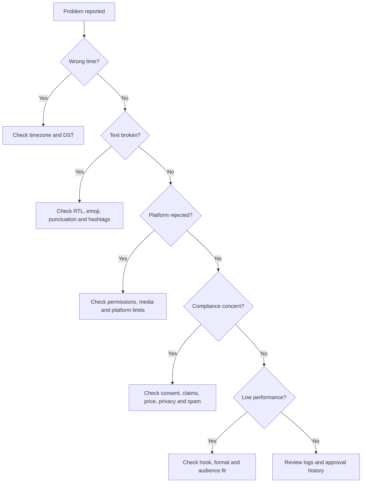

# Troubleshooting

Use this guide when schedules, captions, exports, approvals, or platform handoffs fail.

## Diagnostic flow



## Scheduling problems

| Symptom | Likely cause | Diagnostic check | Fix |
|---|---|---|---|
| Post appears one hour off | DST offset hardcoded | Inspect stored timestamp offset | Use `Asia/Jerusalem` with `zoneinfo` |
| Post lands on Saturday | Shabbat avoidance disabled | Check `avoid_shabbat` setting | Enable avoidance or add blackout window |
| Post lands on Yom Kippur | Holiday list missing | Inspect blackout dates | Add verified holiday dates before scheduling |
| Too many posts on one day | Platform balancing disabled | Count posts per date/platform | Use balanced strategy and cap per day |
| LinkedIn posts on Friday night | Generic global schedule used | Inspect recommended slots | Replace with Israeli workday windows |
| Schedule starts before today | Start date parsed incorrectly | Compare input date and local date | Use ISO input and validate timezone |
| Duplicate posts created | Retry not idempotent | Check local IDs and export file | Generate deterministic post IDs |
| Export order confusing | Sort missing | Check CSV/JSON order | Sort by `scheduled_at`, then platform |
| Owner approval missed | Status absent | Inspect approval field | Require `pending_owner_review` by default |
| Emergency pause ignored | Queue not reviewed | Check blackout/emergency flag | Hold all commercial posts until review |

## Hebrew and RTL problems

| Symptom | Likely cause | Fix |
|---|---|---|
| Phone number appears in wrong place | Mixed Hebrew and LTR digits | Test in app and isolate LTR segment |
| Price reads awkwardly | Inconsistent `₪` placement | Use one format per post, such as `₪250` |
| Hashtag splits | Spaces inside hashtag | Convert `#עסקים קטנים` to `#עסקיםקטנים` |
| Emoji appears before wrong word | Emoji placed inside RTL/LTR boundary | Move emoji to sentence end |
| English product name breaks line | Missing spacing around English | Add spaces around product name |
| Punctuation looks reversed | Mixed direction punctuation | Prefer simple sentence endings and preview |
| Caption too formal | Literary Hebrew used | Rewrite as clear spoken Hebrew |
| Caption too slangy | Excessive slang | Use professional Israeli tone |
| Hashtag block looks spammy | Too many generic tags | Keep 3-8 focused hashtags |
| Mobile view unreadable | Long paragraphs | Break every 1-2 sentences |

### RTL preview checklist

- Preview on iOS and Android if possible.
- Test caption with Hebrew, English, numbers, emoji, and phone.
- Check first line separately.
- Check hashtags separately.
- Check link preview separately.
- Check line breaks after publishing draft.

## Platform-specific failures

### Facebook

| Problem | Cause | Fix |
|---|---|---|
| Group post removed | Rule violation or repeated promo | Read rules; post helpful content; reduce CTA |
| Page post has no reach | Page-only organic reach weak | Add groups, local value, comments strategy |
| Link preview broken | Missing Open Graph metadata | Add title, description, image and reachable URL |
| Scheduled post fails | Token or Page role issue | Refresh token and verify Page access |
| Comments become hostile | Offer unclear or tone too salesy | Clarify terms and respond professionally |

### Instagram

| Problem | Cause | Fix |
|---|---|---|
| Reel rejected | Media format or rights issue | Use supported video and licensed audio |
| Caption truncated badly | Hook too long | Put strongest phrase in first 125 characters |
| Low watch time | Slow opening | Start with problem or visual change in first 2 seconds |
| Story CTA missing | Account or sticker limitation | Use visible text CTA and link where available |
| Hashtags ineffective | Too generic | Mix local, niche and service-specific tags |

### TikTok

| Problem | Cause | Fix |
|---|---|---|
| Upload processing forever | Platform processing or fetch issue | Check status endpoint and source URL |
| Video gets views but no leads | CTA absent or unclear | Add verbal and caption CTA |
| Comments low quality | Trend mismatch | Use educational or FAQ format |
| Caption rejected | Policy or encoding issue | Simplify caption and validate text |
| Brand looks inauthentic | Over-produced creative | Use direct, phone-recorded explanation |

### LinkedIn

| Problem | Cause | Fix |
|---|---|---|
| Low engagement | Generic thought-leadership language | Add specific observation and example |
| Negative comments about sales pitch | CTA too aggressive | Make CTA conversational |
| Post blocked | Organization permission missing | Confirm admin role and scopes |
| Confidentiality concern | Case study too identifiable | Remove names, dates, and unique details |
| Wrong language | Audience prefers English | Switch language per segment |

## Compliance failures

| Symptom | Risk | Fix |
|---|---|---|
| Customer asks to remove photo | Consent or expectation issue | Remove quickly and record request |
| Comment claims offer is misleading | Consumer-protection risk | Clarify price, dates and conditions |
| Lead complains about messages | Anti-spam risk | Check consent and unsubscribe process |
| Influencer post lacks disclosure | Hidden advertising risk | Add clear disclosure |
| Employee shared private data | Privacy/security risk | Remove, document, and escalate |
| Health claim challenged | Professional-regulation risk | Remove claim and review |
| Giveaway terms unclear | Consumer and platform risk | Publish rules and eligibility |
| Accessibility complaint | Service accessibility concern | Add captions, alt text or text summary |
| Competitor complaint | Defamation risk | Avoid claims about competitors |
| Platform account restricted | Policy enforcement | Stop automation and review content |

## Export failures

| Symptom | Cause | Fix |
|---|---|---|
| CSV opens with broken Hebrew | Encoding mismatch | Export UTF-8 with BOM when needed |
| Dates sort incorrectly | Hebrew display date used as data key | Store ISO date and display `DD/MM/YYYY` separately |
| JSON missing timezone | Naive datetime | Serialize timezone-aware ISO strings |
| Duplicate IDs | Non-deterministic ID generation | Hash platform + time + title |
| Spreadsheet wraps badly | Captions too long | Put caption in separate column and freeze key columns |

## CLI problems

| Command issue | Likely cause | Fix |
|---|---|---|
| `ModuleNotFoundError: click` | Dependencies not installed | Run `pip install -r requirements-dev.txt` |
| `Unknown platform` | Typo or unsupported platform | Use `facebook`, `instagram`, `tiktok`, `linkedin` |
| Empty export | Days set to zero or no platforms | Use `--days 7 --platform instagram` |
| Tests cannot import client | Running from wrong directory | Run from repository root |
| Async test fails | Missing pytest async plugin | Install `pytest-asyncio` |

## Recovery templates

### Correcting a wrong price

```text
עדכון ותיקון:
בפוסט הקודם הופיע מחיר לא נכון.

המחיר הנכון הוא ₪199 עד 30-06-2026, בהתאם לתנאי המבצע.
תודה למי שהסב את תשומת הלב.
```

### Pausing during sensitive event

```text
עקב האירועים, התוכן המתוכנן להיום לא יעלה.
עדכוני פעילות חיוניים יפורסמו כאן במידת הצורך.
```

### Removing customer image

```text
התמונה הוסרה לבקשת הלקוחה.
שמירה על פרטיות וכבוד הלקוחות קודמת לכל פרסום.
```

## Escalation triggers

Escalate before publishing when a post includes:

- Medical, legal, financial, insurance, tax or employment advice.
- Personal data, minors, sensitive images or private locations.
- Strong claims about results, guarantees, rankings or competitors.
- Direct marketing messages to a list.
- Customer-list upload to a platform.
- Discount, giveaway, lottery or bundle terms.
- Influencer or affiliate compensation.
- National tragedy, security event or public emergency.
- Complaints from customers or regulators.
- Unclear rights to music, footage, templates, fonts or images.
