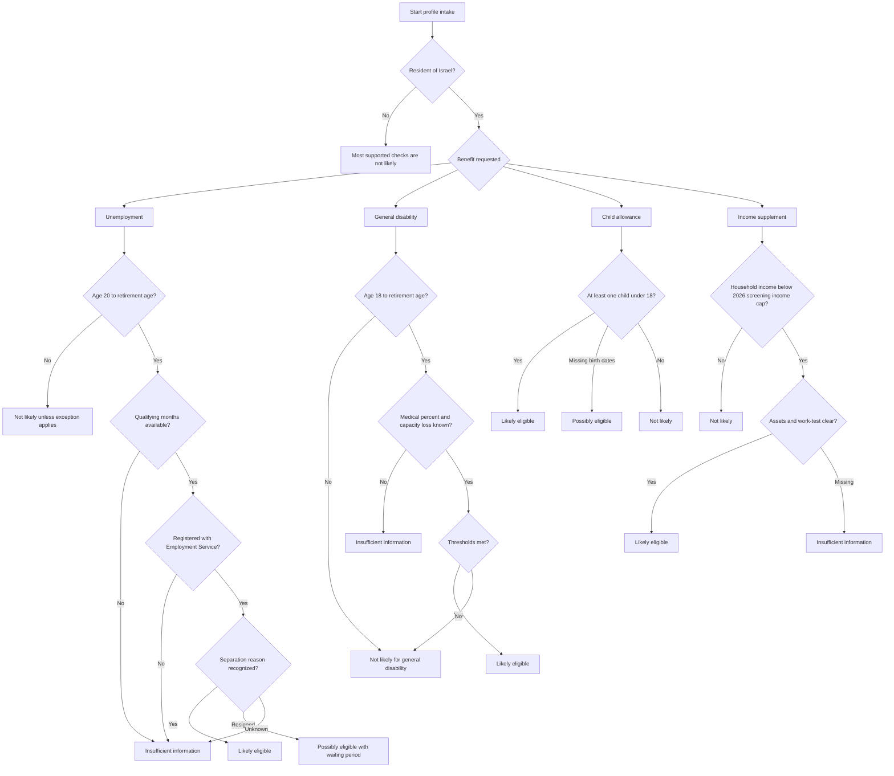

# Social Security Benefit Checker

Use this skill to perform an offline preliminary eligibility screen for common Israeli National Insurance benefits:

- unemployment benefit
- general disability allowance
- child allowance
- income supplement

The skill is designed for Israeli small businesses, freelancers, employees, household advisers, consumer support teams, and accountants who need a structured triage before submitting official forms. Treat every result as operational guidance, not as a legal decision or payment calculation.

## Core principles

Use imperative, evidence-based screening:

1. Collect the minimum facts needed for each benefit.
2. Separate "likely eligible", "possibly eligible", "not likely", and "insufficient information".
3. Produce reasons, missing information, documents, warnings, and next steps.
4. Avoid identity numbers, medical records, or bank files in prompts and local examples unless a secure storage layer is added.
5. Verify official rules and current amount tables before advising a claimant.

## Supported benefits

| Benefit | Primary audience | Key gate checks | Common blockers |
| --- | --- | --- | --- |
| Unemployment benefit | Laid-off employees, terminated employees, some business-closure cases | age, residency, qualifying months, Employment Service registration, termination reason | current self-employment, missing registration, voluntary resignation waiting period, insufficient qualifying period |
| General disability allowance | Residents with medical impairment and reduced earning capacity | age, residency, medical disability percent, work-capacity loss percent | missing medical committee data, earning capacity below threshold, retirement-age boundary |
| Child allowance | Parents or eligible guardians with children under 18 | residency, child count, age of child, registry status | child over 18, custody routing issue, missing birth date |
| Income supplement | Low-income households and some low-income workers | residency, household status, income, assets, work-test or exemption | assets above limit, unverified work-test exemption, household income above 2026 screening income cap |

## Minimum input schema

```json
{
  "age": 38,
  "resident": true,
  "employment_status": "unemployed",
  "monthly_income": 8000,
  "spouse_income": 0,
  "children_count": 2,
  "household_type": "single_parent",
  "qualifying_months": 14,
  "termination_reason": "laid_off",
  "registered_employment_service": true,
  "birth_dates": ["10/01/2017", "15/08/2020"],
  "medical_disability_percent": null,
  "work_capacity_loss_percent": null,
  "assets_exceed_limit": false,
  "vehicle_value_exceeds_limit": false,
  "receives_other_benefit": false
}
```

Prefer DD/MM/YYYY dates when working with Israeli users. ISO dates are accepted by the Python helper.

## Decision tree



## Web-validated 2026 constants

Use these constants only for preliminary screening as of 02/06/2026. Recheck official pages before production use or case advice.

| Area | Current screening value | Use carefully |
| --- | --- | --- |
| VAT context | 18% from 01/01/2025 | Business-context verification only; not part of benefit eligibility. |
| Child allowance | ₪173 for the first and fifth-or-later child; ₪219 for the second through fourth child | Birth order and subsistence increments can change the official amount. |
| General disability | full degree amount ₪4,711; partial degree amounts ₪2,718, ₪2,894, ₪3,211 | Committee decisions and additions determine final payment. |
| Income support | work-income caps vary by age and household type; for age 25 to 54, single parent with two or more children uses ₪9,865 | Exact amount requires the official calculator. |
| Unemployment | daily ceiling ₪550.76 for the first 125 payment days and ₪367.17 afterward | Actual monthly payment depends on reporting days and deductions. |

## Concrete examples

### 1. Laid-off employee

Input:

```json
{
  "age": 44,
  "resident": true,
  "employment_status": "unemployed",
  "monthly_income": 10500,
  "qualifying_months": 16,
  "termination_reason": "laid_off",
  "registered_employment_service": true,
  "children_count": 1,
  "birth_dates": ["22/03/2016"]
}
```

Expected interpretation:

- unemployment benefit: likely eligible, subject to official calculation and entitlement days
- child allowance: likely eligible if the child is registered and under 18
- income supplement: not likely if the prior wage reflects current household income, retest after income drops
- general disability: insufficient information unless medical facts exist

### 2. Freelancer with low current income

Input:

```json
{
  "age": 51,
  "resident": true,
  "employment_status": "self_employed",
  "monthly_income": 1800,
  "spouse_income": 0,
  "children_count": 0,
  "household_type": "single",
  "registered_employment_service": true,
  "assets_exceed_limit": false
}
```

Expected interpretation:

- unemployment benefit: not likely unless a recognized business-closure pathway applies
- income supplement: possibly or likely eligible depending on assets, work-test status, and current official thresholds
- child allowance: not likely
- general disability: insufficient information unless medical facts exist

### 3. Parent checking child allowance

Input:

```json
{
  "age": 34,
  "resident": true,
  "children_count": 3,
  "birth_dates": ["01/02/2013", "14/06/2018", "27/11/2022"]
}
```

Expected interpretation:

- child allowance: likely eligible
- next action: verify registry status and payment account
- warning: separated parents, guardianship, foster care, or institutional care may change who receives the payment

### 4. Disability claim intake

Input:

```json
{
  "age": 49,
  "resident": true,
  "employment_status": "not_working",
  "monthly_income": 0,
  "medical_disability_percent": 65,
  "work_capacity_loss_percent": 75
}
```

Expected interpretation:

- general disability: likely eligible in a preliminary screen
- next action: prepare medical summaries, specialist reports, test results, income documents, and functional limitation evidence
- warning: only official medical and capacity determinations control entitlement

## Edge cases

### Voluntary resignation

Mark unemployment as "possibly eligible" when resignation is voluntary. Add a warning about a waiting period. Treat justified resignation separately when documentation supports the reason, such as material worsening of working conditions, health reasons, or relocation circumstances recognized by the official process.

### Unpaid leave

Check whether unpaid leave is employer-initiated, long enough, and recognized under current rules. Require Employment Service registration unless a current official exemption applies.

### Mixed employee and self-employed income

Screen unemployment only for the salaried component. Screen income supplement against the full household income picture. Request accountant confirmation for current self-employed profit, advance tax payments, and National Insurance advances.

### Business closure

A freelancer or controlling shareholder should not be treated like a regular employee. Use a business-closure pathway only when the person has stopped activity, has documentation, and the current official rules support the claim.

### Retirement-age boundary

General disability allowance normally stops at retirement age. Use a separate old-age, nursing, mobility, or special-services workflow when the profile is outside the supported age range.

### Child close to age 18

Use the birth date, not only child count. Flag the case when the 18th birthday is close to the claim or payment date.

### Separated parents

Do not assume the parent entering the data receives child allowance. Require custody, guardianship, or payment-routing verification.

### Income supplement and vehicle ownership

Flag vehicle value or ownership as a possible blocker. Apply official exceptions only after reviewing the current instructions.

## Anti-patterns

Avoid these practices:

- Treating the output as an official decision.
- Estimating exact benefit amounts from old tables.
- Ignoring Employment Service registration dates.
- Mixing business revenue with taxable self-employed profit.
- Asking for identity numbers or medical files in unsecured prompts.
- Classifying every low-income person as eligible for income supplement without asset and work-test review.
- Assuming child allowance payment routing in separation or guardianship cases.
- Using stale emergency rules after the emergency period ends.

## Troubleshooting

Use `references/troubleshooting.md` for detailed failures. Common quick checks:

| Symptom | Likely cause | Correction |
| --- | --- | --- |
| Result is `insufficient_information` | Required field is missing | Add the exact field listed under `missing_info` |
| Unemployment result is not likely for a freelancer | Current business activity blocks the regular pathway | Add `business_closed: true` only when documentation supports closure |
| Child allowance result is only possible | Birth dates are missing | Add `birth_dates` in DD/MM/YYYY or ISO format |
| Income supplement result conflicts with expectation | Household income, assets, or work-test details are incomplete | Review spouse income, asset flags, vehicle flag, and Employment Service status |
| Tests fail after renaming files | Hyphenated module imports remain | Import `social_security_benefit_checker` or `scripts/social_security_benefit_checker_client.py` |

## Production checklist

Before using the skill in a live workflow:

1. Verify current National Insurance amount tables and eligibility pages.
2. Verify Employment Service registration and work-test instructions.
3. Record the rule version, profile timestamp, and official source date.
4. Add secure handling for identity numbers, medical files, bank documents, and claim forms.
5. Keep source documents outside model prompts unless redacted.
6. Add human review before telling a person to submit or not submit a claim.
7. Log every missing-data item separately from negative eligibility reasons.
8. Test edge cases for age boundary, child age, voluntary resignation, income drop, and assets.
9. Add Hebrew review for any user-facing wording.
10. Retain only the minimum data required for the operational purpose.

## File index

| File | Purpose |
| --- | --- |
| `README.md` | installation, quick start, file index |
| `SKILL.md` | English operating guide |
| `SKILL_HE.md` | Hebrew operating guide |
| `references/api-reference.md` | official source references, local interface examples, error tables |
| `references/workflow-guide.md` | end-to-end workflows |
| `references/troubleshooting.md` | detailed operational troubleshooting |
| `references/test-scenarios.md` | more than 20 concrete test scenarios |
| `references/migration-checklist.md` | upgrade guidance |
| `references/branding-audit.md` | neutrality audit |
| `references/hebrew-qa-log.md` | Hebrew quality review log |
| `scripts/social_security_benefit_checker_client.py` | typed sync and async helper |
| `scripts/social-security-benefit-checker-cli.py` | script wrapper for the Typer CLI |
| `social_security_benefit_checker/` | installable Python package |
