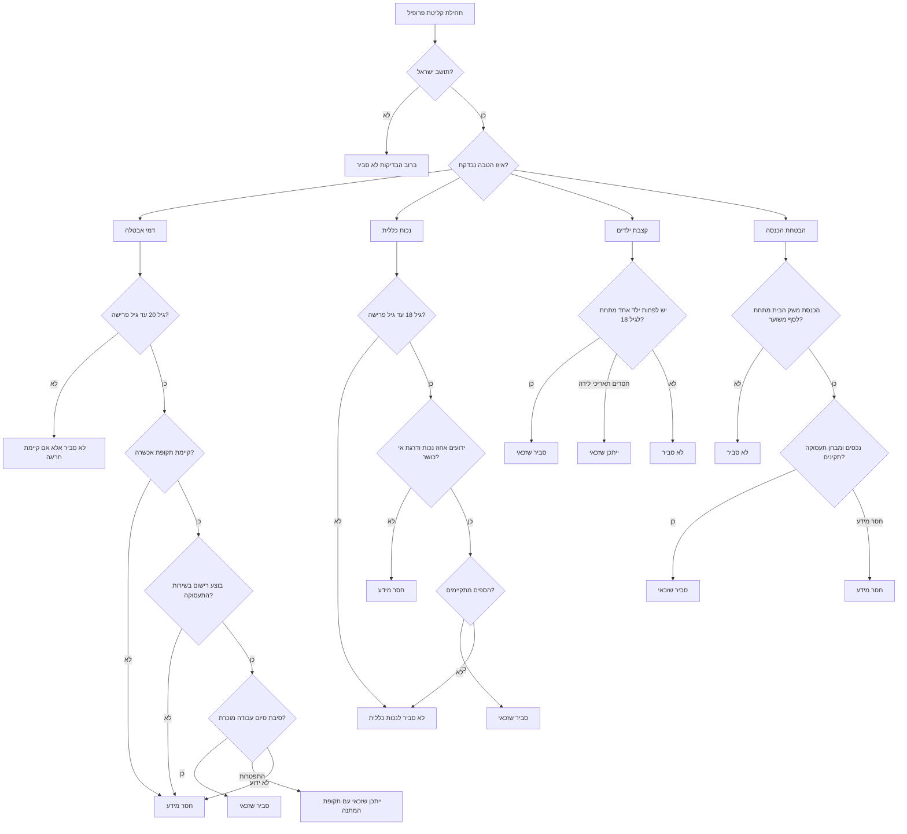

# בודק זכאות לקצבאות והטבות ביטוח לאומי

השתמש בכלי זה לבדיקת זכאות ראשונית ולא מקוונת להטבות נפוצות של ביטוח לאומי בישראל:

- דמי אבטלה
- קצבת נכות כללית
- קצבת ילדים
- הבטחת הכנסה

הכלי מתאים לעסקים קטנים, עצמאים, שכירים, משקי בית, יועצי שירות, מנהלי חשבונות ורואי חשבון שצריכים מיון ראשוני לפני הגשת טפסים רשמיים. התייחס לכל תוצאה כהכוונה תפעולית בלבד, ולא כהחלטה משפטית או כחישוב תשלום מחייב.

## עקרונות עבודה

פעל לפי מיון מבוסס ראיות:

1. אסוף רק את הנתונים המינימליים הדרושים לכל הטבה.
2. הפרד בין "סביר שזכאי", "ייתכן שזכאי", "לא סביר", ו"חסר מידע".
3. הצג נימוקים, מידע חסר, מסמכים, אזהרות וצעדים הבאים.
4. אל תכניס מספרי זהות, תיקים רפואיים או פרטי בנק לדוגמאות מקומיות או להנחיות לא מאובטחות.
5. בדוק את הכללים הרשמיים ואת טבלאות הסכומים העדכניות לפני מתן הנחיה לאדם מגיש תביעה.

## הטבות נתמכות

| הטבה | קהל עיקרי | בדיקות סף | חסמים נפוצים |
| --- | --- | --- | --- |
| דמי אבטלה | שכירים שפוטרו, עובדים שסיימו חוזה, חלק ממקרי סגירת עסק | גיל, תושבות, תקופת אכשרה, רישום בשירות התעסוקה, סיבת סיום עבודה | פעילות עצמאית נמשכת, העדר רישום, תקופת המתנה לאחר התפטרות, תקופת אכשרה קצרה |
| קצבת נכות כללית | תושבים עם נכות רפואית ופגיעה בכושר השתכרות | גיל, תושבות, אחוז נכות רפואית, דרגת אי כושר | מידע רפואי חסר, אי כושר נמוך מהסף, גיל פרישה |
| קצבת ילדים | הורים או אפוטרופוסים לילדים עד גיל 18 | תושבות, מספר ילדים, גיל הילד, רישום במרשם האוכלוסין | ילד מעל גיל 18, מחלוקת משמורת, העדר תאריך לידה |
| הבטחת הכנסה | משקי בית בעלי הכנסה נמוכה וחלק מהעובדים בעלי שכר נמוך | תושבות, מצב משפחתי, הכנסות, נכסים, מבחן תעסוקה או פטור | נכסים מעל הסף, פטור לא מאומת, הכנסת משק בית גבוהה מהסף המשוער |

## מבנה נתונים מינימלי

```json
{
  "age": 38,
  "resident": true,
  "employment_status": "unemployed",
  "monthly_income": 8000,
  "spouse_income": 0,
  "children_count": 2,
  "household_type": "single_parent",
  "qualifying_months": 14,
  "termination_reason": "laid_off",
  "registered_employment_service": true,
  "birth_dates": ["10/01/2017", "15/08/2020"],
  "medical_disability_percent": null,
  "work_capacity_loss_percent": null,
  "assets_exceed_limit": false,
  "vehicle_value_exceeds_limit": false,
  "receives_other_benefit": false
}
```

הצג תאריכים בפורמט DD/MM/YYYY למשתמשים בישראל. הצג סכומים בשקלים חדשים, לדוגמה ₪4,711.

## עץ החלטה



## קבועים מאומתים לשנת 2026

השתמש בקבועים האלה לסינון ראשוני בלבד נכון ל-02/06/2026. בדוק מחדש את הדפים הרשמיים לפני שימוש בייצור או לפני מתן הנחיה למבוטח.

| תחום | ערך סינון נוכחי | שימוש זהיר |
| --- | --- | --- |
| מע"מ בהקשר עסקי | 18% החל מ-01/01/2025 | אימות רק להקשר עסקי; לא חלק מחישוב זכאות לקצבאות. |
| קצבת ילדים | ₪173 לילד הראשון ומהילד החמישי ואילך; ₪219 לילד השני עד הרביעי | סדר לידה ותוספות קיום עשויים לשנות את הסכום הרשמי. |
| נכות כללית | סכום מלא ₪4,711; סכומים חלקיים ₪2,718, ₪2,894, ₪3,211 | החלטת ועדה ותוספות קובעות את התשלום הסופי. |
| הבטחת הכנסה | תקרות הכנסת עבודה משתנות לפי גיל והרכב משפחתי; בגיל 25 עד 54, הורה עצמאי עם שני ילדים או יותר משתמש ב-₪9,865 | סכום מדויק מחייב שימוש במחשבון הרשמי. |
| דמי אבטלה | תקרה יומית ₪550.76 ל-125 ימי התשלום הראשונים ו-₪367.17 לאחר מכן | התשלום החודשי תלוי בימי התייצבות, דיווחים וניכויים. |

## דוגמאות מעשיות

### 1. שכיר שפוטר

נתונים:

```json
{
  "age": 44,
  "resident": true,
  "employment_status": "unemployed",
  "monthly_income": 10500,
  "qualifying_months": 16,
  "termination_reason": "laid_off",
  "registered_employment_service": true,
  "children_count": 1,
  "birth_dates": ["22/03/2016"]
}
```

פענוח צפוי:

- דמי אבטלה: סביר שזכאי, בכפוף לחישוב רשמי ולמספר ימי זכאות.
- קצבת ילדים: סביר שזכאי אם הילד רשום ומתחת לגיל 18.
- הבטחת הכנסה: לא סביר אם השכר הקודם עדיין משקף הכנסה שוטפת של משק הבית; בדוק מחדש לאחר ירידה בהכנסה.
- נכות כללית: חסר מידע כל עוד אין נתונים רפואיים.

### 2. עצמאי עם הכנסה נמוכה

נתונים:

```json
{
  "age": 51,
  "resident": true,
  "employment_status": "self_employed",
  "monthly_income": 1800,
  "spouse_income": 0,
  "children_count": 0,
  "household_type": "single",
  "registered_employment_service": true,
  "assets_exceed_limit": false
}
```

פענוח צפוי:

- דמי אבטלה: לא סביר, אלא אם קיימת סגירת עסק מוכרת לפי הכללים העדכניים.
- הבטחת הכנסה: ייתכן או סביר שזכאי, בהתאם לנכסים, מבחן תעסוקה וספים רשמיים.
- קצבת ילדים: לא סביר.
- נכות כללית: חסר מידע כל עוד אין נתונים רפואיים.

### 3. הורה שבודק קצבת ילדים

נתונים:

```json
{
  "age": 34,
  "resident": true,
  "children_count": 3,
  "birth_dates": ["01/02/2013", "14/06/2018", "27/11/2022"]
}
```

פענוח צפוי:

- קצבת ילדים: סביר שזכאי.
- פעולה נדרשת: ודא רישום במרשם האוכלוסין וחשבון בנק לתשלום.
- אזהרה: פרידה, אפוטרופסות, משפחת אומנה או שהות במסגרת עשויות לשנות את מקבל התשלום.

### 4. קליטת תביעת נכות כללית

נתונים:

```json
{
  "age": 49,
  "resident": true,
  "employment_status": "not_working",
  "monthly_income": 0,
  "medical_disability_percent": 65,
  "work_capacity_loss_percent": 75
}
```

פענוח צפוי:

- נכות כללית: סביר שזכאי בבדיקה ראשונית.
- פעולה נדרשת: אסוף סיכומים רפואיים, חוות דעת מומחים, תוצאות בדיקות, מסמכי הכנסה ותיעוד תפקודי.
- אזהרה: רק החלטות רשמיות של ועדה רפואית ושל דרגת אי כושר קובעות זכאות בפועל.

## מצבי קצה

### התפטרות מרצון

סמן דמי אבטלה כ"ייתכן שזכאי" כאשר סיום העבודה הוא התפטרות. הוסף אזהרה על תקופת המתנה. סווג התפטרות מוצדקת בנפרד כאשר יש מסמכים תומכים, כגון הרעה מוחשית בתנאי העבודה, סיבה רפואית או נסיבות מעבר דירה המוכרות בהליך הרשמי.

### חל"ת

בדוק אם החופשה ללא תשלום נכפתה על ידי המעסיק, עומדת במשך המינימלי, ומוכרת לפי ההוראות העדכניות. דרוש רישום בשירות התעסוקה אלא אם קיים פטור רשמי עדכני.

### שילוב שכיר ועצמאי

בדוק דמי אבטלה רק ביחס לרכיב השכיר. בדוק הבטחת הכנסה מול כלל הכנסות משק הבית. דרוש אישור רואה חשבון או מנהל חשבונות לגבי רווח עצמאי שוטף, מקדמות מס ומקדמות ביטוח לאומי.

### סגירת עסק

אל תסווג עצמאי או בעל שליטה כשכיר רגיל. השתמש במסלול סגירת עסק רק כאשר הפעילות הופסקה, קיימים מסמכים, והכללים הרשמיים העדכניים תומכים בתביעה.

### גיל פרישה

קצבת נכות כללית מיועדת בדרך כלל עד גיל פרישה. עבור פרופיל מחוץ לטווח הגיל, עבור לתהליך נפרד של קצבת אזרח ותיק, סיעוד, ניידות או שירותים מיוחדים.

### ילד סמוך לגיל 18

בדוק תאריך לידה ולא רק מספר ילדים. סמן מקרה שבו יום ההולדת ה-18 קרוב למועד התביעה או התשלום.

### הורים פרודים

אל תניח שההורה שמסר את הנתונים הוא מקבל קצבת הילדים. דרוש אימות משמורת, אפוטרופסות או ניתוב תשלום.

### הבטחת הכנסה ורכב

סמן בעלות על רכב או ערך רכב כחסם אפשרי. החל חריגים רשמיים רק לאחר בדיקת ההוראות העדכניות.

## פעולות שגויות שיש להימנע מהן

- הצגת התוצאה כהחלטה רשמית.
- חישוב סכום מדויק מטבלאות ישנות.
- התעלמות ממועד הרישום בשירות התעסוקה.
- ערבוב מחזור עסקי עם רווח חייב של עצמאי.
- בקשת מספרי זהות או מסמכים רפואיים בערוץ לא מאובטח.
- סיווג כל אדם בעל הכנסה נמוכה כזכאי להבטחת הכנסה ללא בדיקת נכסים ומבחן תעסוקה.
- הנחת ניתוב תשלום קצבת ילדים במקרי פרידה או אפוטרופסות.
- שימוש בהוראות חירום לאחר סיום תוקפן.

## פתרון תקלות

עיין בקובץ `references/troubleshooting.md` לפירוט מלא. בדיקות מהירות:

| תופעה | סיבה סבירה | תיקון |
| --- | --- | --- |
| התוצאה היא `insufficient_information` | שדה חובה חסר | הוסף את השדה המדויק שמופיע תחת `missing_info` |
| עצמאי מקבל תוצאה לא סבירה לדמי אבטלה | פעילות עסקית שוטפת חוסמת את המסלול הרגיל | הוסף `business_closed: true` רק כאשר יש מסמכי סגירה |
| קצבת ילדים מסומנת כייתכן שזכאי | חסרים תאריכי לידה | הוסף `birth_dates` בפורמט DD/MM/YYYY |
| הבטחת הכנסה אינה תואמת לציפייה | הכנסות משק בית, נכסים או מבחן תעסוקה לא הוזנו במלואם | בדוק הכנסת בן או בת זוג, נכסים, רכב ורישום בשירות התעסוקה |
| בדיקות נכשלות לאחר שינוי שמות קבצים | עדיין קיימת הפניה לשם קובץ שאינו ניתן לייבוא | השתמש בחבילה `social_security_benefit_checker` או בקובץ `scripts/social_security_benefit_checker_client.py` |

## רשימת בדיקה לפני שימוש תפעולי

1. אמת את טבלאות הסכומים ואת דפי הזכאות העדכניים של ביטוח לאומי.
2. אמת הוראות רישום ומבחן תעסוקה מול שירות התעסוקה.
3. שמור גרסת כללים, מועד פרופיל ותאריך מקור רשמי.
4. הוסף מנגנון מאובטח למספרי זהות, תיקים רפואיים, פרטי בנק וטפסי תביעה.
5. שמור מסמכי מקור מחוץ להנחיות לא מאובטחות, אלא אם עברו השחרה.
6. הוסף בדיקה אנושית לפני המלצה להגיש או לא להגיש תביעה.
7. תעד מידע חסר בנפרד מנימוקי אי זכאות.
8. בדוק מצבי קצה של גיל, גיל ילד, התפטרות, ירידת הכנסה ונכסים.
9. בצע בקרת עברית לכל נוסח שמוצג למשתמש.
10. שמור רק את המידע המזערי הנדרש למטרה התפעולית.

## מפתח קבצים

| קובץ | שימוש |
| --- | --- |
| `README.md` | התקנה, התחלה מהירה ומפתח קבצים |
| `SKILL.md` | מדריך הפעלה באנגלית |
| `SKILL_HE.md` | מדריך הפעלה בעברית |
| `references/api-reference.md` | מקורות רשמיים, דוגמאות ממשק מקומי וטבלאות שגיאה |
| `references/workflow-guide.md` | תהליכי עבודה מלאים |
| `references/troubleshooting.md` | פתרון תקלות תפעולי |
| `references/test-scenarios.md` | יותר מ-20 תרחישי בדיקה |
| `references/migration-checklist.md` | הנחיות שדרוג |
| `references/branding-audit.md` | ביקורת ניטרליות |
| `references/hebrew-qa-log.md` | יומן בקרת עברית |
| `scripts/social_security_benefit_checker_client.py` | מסייע פייתון מסונכרן וא-מסונכרן |
| `scripts/social-security-benefit-checker-cli.py` | מעטפת להרצת שורת הפקודה |
| `social_security_benefit_checker/` | חבילת פייתון להתקנה |
