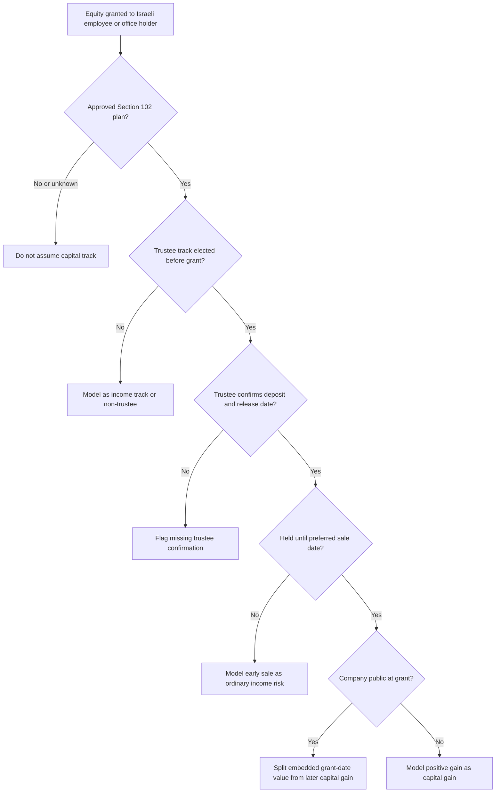

# Stock Options and Equity Tax Advisor

Use this skill to model Israeli tax outcomes for employee stock options, restricted stock units, employee share purchase plan shares, and similar equity compensation. Treat the output as a planning estimate. Confirm final reporting, withholding, and treaty positions with a licensed Israeli tax adviser or payroll professional.

## Operating principles

Act in a neutral advisory voice. Ask for facts before computing. Prefer conservative assumptions when documents are missing. Keep every amount in Israeli shekels unless an explicit foreign-currency input and exchange rate are supplied. Record assumptions and warnings in the answer.

## Minimum intake

Collect these inputs before calculating:

| Field | Why it matters |
| --- | --- |
| Instrument | Options, RSUs, ESPP shares, restricted shares, or ordinary shares have different taxable events. |
| Tax track | Section 102 capital gains track, Section 102 income track, Section 102 non-trustee, Section 3(i), non-employee, or unknown. |
| Trustee status | Preferred Section 102 treatment depends on trustee deposit, plan approval, and release timing. |
| Grant date and deposit date | These dates drive the preferred holding period. |
| Vest, exercise, purchase, and sale dates | Tax can be triggered at different points. |
| Quantity, exercise price, sale price, and fair market value | Needed for spread and gain calculations. |
| Public or private status at grant | Public-company grants may require an ordinary-income component even on a capital track. |
| Other annual income | Needed for marginal income tax, National Insurance, health tax, and surtax estimates. |
| Controlling shareholder status | A holder of 10 percent or more may face a higher capital gains rate. |

## Section 102 capital gains track decision tree

## Calculation model

The helper applies these planning rules:

1. Gross proceeds equal quantity times sale price times the exchange rate to ILS.
2. Cost basis equals quantity times exercise or purchase price times the exchange rate to ILS.
3. Positive total gain equals proceeds minus basis; losses do not create negative tax in the local estimate.
4. Section 102 capital gains track after the holding period generally models the gain as capital gain unless a public-company grant-date split is supplied.
5. Early Section 102 capital-track release before the preferred date is modeled conservatively as employment income.
6. Section 102 income track splits employment income at exercise or release from later capital appreciation.
7. Section 3(i), non-trustee, and unknown tracks are modeled conservatively as ordinary income unless ESPP purchase FMV supports a discount and later-appreciation split.
8. Capital gains tax is modeled at 25 percent, or 30 percent for controlling shareholders.
9. Ordinary-income components are run through marginal Israeli income tax brackets and National Insurance and health contributions using configurable constants.
10. Surtax is modeled when taxable income crosses the configured threshold.

## Web-validated 2026 constant set

Use the packaged constants only for planning. Keep them configurable and refresh them before production use. The 2026 default set assumes:

| Constant | Default | Planning note |
| --- | ---: | --- |
| Israeli VAT rate | 18 percent | Included only for small-business context; equity calculations do not apply VAT. |
| Ordinary capital gains rate | 25 percent | Applied before surtax. |
| Material or controlling shareholder capital rate | 30 percent | Use when 10 percent or more holder status applies; verify related-party holdings. |
| Surtax threshold | ₪721,560 annual taxable income | General additional tax is 3 percent above the threshold. |
| Additional capital-income surtax | 2 percent | Applied to capital-source income above the surtax threshold from 2025 through the package default period. |
| Employee National Insurance plus health, reduced band | 4.27 percent up to ₪7,703 per month | Employee-side estimate only; employer-side charges are excluded. |
| Employee National Insurance plus health, full band | 12.17 percent up to ₪51,910 per month | Cap the employee-side estimate at the maximum monthly base. |
| Earned-income tax brackets | 10, 14, 20, 31, 35, 47 percent plus surtax | Annual bracket edges are stored in `TaxConstants`. |

## Concrete examples

### Private-company options on the Section 102 capital gains track

Facts: 50,000 options, exercise price ₪1, sale price ₪10, grant date 15/03/2024, sale date 02/01/2027, approved trustee track, other annual income ₪360,000.

Computation: proceeds ₪500,000, basis ₪50,000, gain ₪450,000. The conservative preferred sale date is 31/12/2026 when the grant-year-end anchor is used. The sale occurs after that date, so the model treats the ₪450,000 as capital gain and applies a 25 percent capital gains tax estimate of ₪112,500 before surtax checks.

### Early release before the preferred date

Use the same facts, but sell on 01/08/2025. The sale is before 31/12/2026. Model the positive spread as employment income, apply marginal income tax and National Insurance, and flag early-sale risk.

### Public-company RSU

Facts: 1,000 RSUs, sale price ₪65, grant-date FMV ₪40, public at grant. The model treats ₪40,000 as employment income and ₪25,000 as capital gain when the capital track and trustee conditions are documented.

### ESPP discount

Facts: 300 shares purchased at ₪80 when FMV was ₪100 and sold at ₪120. The model treats the ₪6,000 purchase discount as employment income and the later ₪6,000 appreciation as capital gain under the simplified non-102 ESPP split.

## Edge cases

- Missing trustee confirmation: show a warning and avoid a definitive Section 102 conclusion.
- Unknown track: calculate provisionally using a conservative ordinary-income treatment.
- Foreign broker statement: convert every sale, exercise, and purchase value using the date-specific ILS rate supplied by the user.
- Underwater options: show zero taxable gain in the sale model; do not invent a loss offset.
- Same-day exercise and sale: income-track or non-trustee treatment usually dominates unless trustee documents support capital-track release.
- Private-company secondary sale: ask for share class, transfer restrictions, trustee release, withholding letter, and valuation support.
- Relocation: ask for Israeli tax residency periods, vesting calendar, workday allocation, and treaty advice.
- Controlling shareholder: apply the higher capital gains rate and recommend professional review.

## Troubleshooting

- Result shows full employment income on a capital-track grant: check sale date, preferred sale date, trustee approval, and the holding-period anchor.
- Result asks for fair market value at exercise: income-track options require the exercise or release FMV to split income from later appreciation.
- Result asks for purchase FMV: ESPP discount analysis needs the fair market value at purchase.
- Result has no National Insurance increment: other income may already exceed the annual contribution cap.
- Result appears too low: check foreign-currency exchange rates, grant public status, surtax, and controlling shareholder status.

## Anti-patterns

- Treating every Section 102 grant as capital-track eligible without trustee confirmation.
- Using sale-date exchange rates for exercise-date values when exact date rates are available.
- Ignoring public-company grant-date value.
- Mixing gross proceeds with net broker cash after withholding.
- Reporting a single blended rate without showing employment, capital, surtax, and social contribution components.
- Omitting the earliest preferred sale date from client-facing advice.

## Production checklist

- Confirm the plan track in grant documents and trustee records.
- Confirm the deposit date and release date with the trustee.
- Confirm all dates in DD/MM/YYYY format for Israeli-facing files.
- Reconcile broker statements to trustee statements.
- Split employment income, capital gain, National Insurance, health tax, surtax, and withholding.
- Store assumptions, warning flags, and versioned tax constants.
- Review final advice before filing or payroll reporting.

## Disclaimer / הבהרה

This skill is a preparation and automation aid only. It does not constitute tax, legal, financial, or other professional advice, and its output must be reviewed by a licensed professional (רו"ח / עו"ד / יועץ מס) before any filing, payment, or contractual use.

כלי זה מהווה שכבת הכנה ואוטומציה בלבד. אין בו ייעוץ מס, ייעוץ משפטי או ייעוץ מקצועי אחר, ויש לאמת כל פלט מול בעל מקצוע מורשה לפני הגשה, תשלום או שימוש חוזי.
