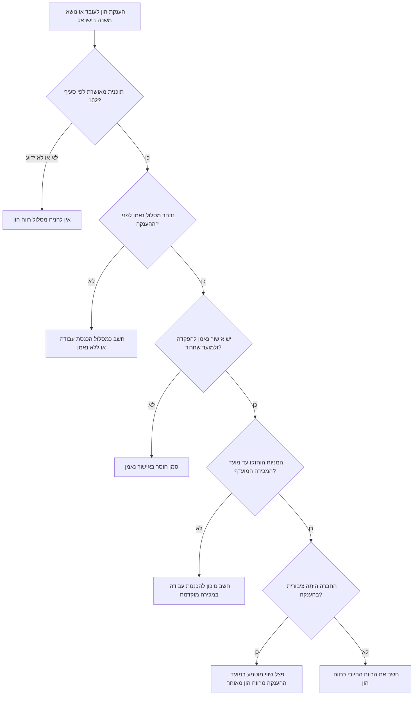

# יועץ מס לאופציות ומניות לעובדים

השתמש במיומנות זו כדי לאמוד השלכות מס בישראל על אופציות לעובדים, יחידות מניה חסומות, תוכניות רכישת מניות לעובדים ומכשירי הון דומים. התוצאה היא אומדן לתכנון בלבד. אשר דיווח, ניכוי במקור, ביטוח לאומי, מס בריאות ואמנות מס עם בעל מקצוע מוסמך בישראל.

## עקרונות עבודה

פעל בניסוח ניטרלי ומעשי. אסוף עובדות לפני חישוב. כאשר חסרים מסמכים, בחר הנחה שמרנית וסמן אותה. הצג סכומים בשקלים חדשים אלא אם נמסרו מטבע זר ושער המרה לשקל. שמור פירוט הנחות ואזהרות לצד התוצאה.

## נתוני חובה

| נתון | שימוש |
| --- | --- |
| סוג המכשיר | אופציות, יחידות מניה חסומות, מניות בתוכנית רכישה או מניות רגילות יוצרות אירועי מס שונים. |
| מסלול מס | סעיף 102 במסלול רווח הון, סעיף 102 במסלול הכנסת עבודה, סעיף 102 ללא נאמן, סעיף 3(ט), נותן שירותים או לא ידוע. |
| סטטוס נאמן | הטבת מס לפי סעיף 102 תלויה בהפקדה לנאמן, באישור התוכנית ובעיתוי השחרור. |
| תאריך הענקה ותאריך הפקדה | מועדי הבסיס לתקופת החסימה המועדפת. |
| מועדי הבשלה, מימוש, רכישה ומכירה | קובעים את אירוע המס ואת שיעור המס. |
| כמות, מחיר מימוש, מחיר מכירה ושווי שוק הוגן | דרושים לחישוב מרווח ורווח. |
| חברה ציבורית או פרטית במועד ההענקה | בחברה ציבורית עשוי להידרש פיצול בין הכנסת עבודה לרווח הון. |
| הכנסה שנתית אחרת | דרושה לחישוב מס שולי, ביטוח לאומי, מס בריאות ומס יסף. |
| בעל מניות מהותי | החזקה של 10% ומעלה עשויה להביא לשיעור מס רווח הון גבוה יותר. |

## עץ החלטה למסלול רווח הון לפי סעיף 102

## מודל החישוב

1. תקבולי מכירה הם כמות כפול מחיר מכירה כפול שער המרה לשקל.
2. עלות בסיס היא כמות כפול מחיר מימוש או רכישה כפול שער המרה לשקל.
3. רווח חיובי הוא תקבולים פחות עלות בסיס; אין ליצור הפסד מס שלילי באומדן המקומי.
4. במסלול רווח הון לפי סעיף 102, לאחר תקופת החסימה, הרווח מסווג כרווח הון אלא אם נמסר שווי במועד הענקה בחברה ציבורית.
5. שחרור מוקדם לפני המועד המועדף מסווג שמרנית כהכנסת עבודה.
6. במסלול הכנסת עבודה לפי סעיף 102, פצל הכנסה במימוש או בשחרור מעליית ערך מאוחרת.
7. סעיף 3(ט), מסלול ללא נאמן ומסלול לא ידוע מחושבים שמרנית כהכנסת עבודה, אלא אם בתוכנית רכישת מניות נמסר שווי רכישה המאפשר פיצול בין הנחה לעליית ערך מאוחרת.
8. מס רווח הון מחושב בשיעור 25%, או 30% לבעל מניות מהותי.
9. רכיבי הכנסת עבודה עוברים דרך מדרגות מס הכנסה, ביטוח לאומי ומס בריאות לפי קבועים ניתנים לעדכון.
10. מס יסף מחושב כאשר ההכנסה החייבת עוברת את הסף שנקבע בקבועים.

## סט קבועים מאומת לשנת 2026

השתמש בקבועים בחבילה כאומדן תכנוני בלבד. שמור אותם ניתנים לעדכון ורענן אותם לפני שימוש בתיק אמיתי. סט ברירת המחדל לשנת 2026 מניח:

| קבוע | ברירת מחדל | הערת עבודה |
| --- | ---: | --- |
| שיעור מע״מ בישראל | 18% | מיועד להקשר עסקי כללי בלבד; חישובי תגמול הוני אינם כוללים מע״מ. |
| שיעור מס רווח הון רגיל | 25% | לפני בדיקת מס יסף. |
| שיעור מס רווח הון לבעל מניות מהותי | 30% | החל כאשר קיימת החזקה של 10% או יותר; בדוק החזקות קרובים וצדדים קשורים. |
| סף מס יסף | ₪721,560 הכנסה חייבת שנתית | מס נוסף כללי בשיעור 3% מעל הסף. |
| מס יסף נוסף על הכנסה הונית | 2% | חל על הכנסה ממקורות הוניים מעל סף מס היסף בתקופת ברירת המחדל של החבילה. |
| ביטוח לאומי ומס בריאות לעובד, מדרגה מופחתת | 4.27% עד ₪7,703 לחודש | אומדן חלק העובד בלבד; חיובי מעסיק אינם נכללים. |
| ביטוח לאומי ומס בריאות לעובד, מדרגה מלאה | 12.17% עד ₪51,910 לחודש | חשב עד תקרת ההכנסה החודשית החייבת. |
| מדרגות מס על הכנסה מיגיעה אישית | 10%, 14%, 20%, 31%, 35%, 47% בתוספת מס יסף | גבולות שנתיים שמורים ב-`TaxConstants`. |

## דוגמאות

### אופציות בחברה פרטית במסלול רווח הון לפי סעיף 102

נתונים: 50,000 אופציות, מחיר מימוש ₪1, מחיר מכירה ₪10, תאריך הענקה 15/03/2024, תאריך מכירה 02/01/2027, מסלול נאמן מאושר, הכנסה שנתית אחרת ₪360,000.

חישוב: תקבולים ₪500,000, עלות בסיס ₪50,000, רווח ₪450,000. כאשר משתמשים בעוגן שמרני של סוף שנת ההענקה, מועד המכירה המועדף הוא 31/12/2026. המכירה לאחר מועד זה, לכן המודל מסווג את ₪450,000 כרווח הון ומחשב אומדן מס רווח הון בשיעור 25%, כלומר ₪112,500 לפני בדיקת מס יסף.

### מכירה מוקדמת לפני המועד המועדף

השתמש באותם נתונים, אך מכור ביום 01/08/2025. המכירה לפני 31/12/2026. חשב את המרווח החיובי כהכנסת עבודה, החל מדרגות מס, ביטוח לאומי ומס בריאות, וסמן סיכון מכירה מוקדמת.

### יחידות מניה חסומות בחברה ציבורית

נתונים: 1,000 יחידות, מחיר מכירה ₪65, שווי שוק הוגן במועד ההענקה ₪40, החברה ציבורית בהענקה. המודל מסווג ₪40,000 כהכנסת עבודה ו-₪25,000 כרווח הון כאשר מסלול הנאמן ותנאי סעיף 102 מתועדים.

### תוכנית רכישת מניות לעובדים

נתונים: 300 מניות נרכשו במחיר ₪80 כאשר שווי השוק ההוגן היה ₪100, ונמכרו במחיר ₪120. המודל מסווג את ההנחה בסך ₪6,000 כהכנסת עבודה ואת עליית הערך המאוחרת בסך ₪6,000 כרווח הון באומדן הפשוט.

## מקרים חריגים

- חסר אישור נאמן: הצג אזהרה והימנע מקביעה ודאית של מסלול סעיף 102.
- מסלול לא ידוע: חשב זמנית לפי טיפול שמרני כהכנסת עבודה.
- דוח ברוקר זר: המר כל מחיר ותשלום לפי שער שקל מתאים למועד העסקה.
- אופציות מחוץ לכסף: הצג רווח חייב אפס במודל המכירה ואל תיצור קיזוז הפסד ללא בדיקה.
- מימוש ומכירה באותו יום: טיפול כהכנסת עבודה בדרך כלל גובר אם אין אישור נאמן לשחרור מועדף.
- מכירה שניונית בחברה פרטית: דרוש סוג מניה, מגבלות עבירות, אישור נאמן, אישור ניכוי ושווי תומך.
- מעבר תושבות: דרוש תקופות תושבות ישראלית, לוח הבשלה, ייחוס ימי עבודה וייעוץ אמנת מס.
- בעל מניות מהותי: החל שיעור מס גבוה יותר ובצע בדיקה מקצועית.

## פתרון תקלות

- כל הרווח מופיע כהכנסת עבודה: בדוק תאריך מכירה, מועד מכירה מועדף, אישור נאמן ועוגן תקופת החסימה.
- נדרש שווי שוק הוגן במימוש: במסלול הכנסת עבודה צריך שווי במימוש או בשחרור כדי לפצל בין הכנסה לעליית ערך מאוחרת.
- נדרש שווי ברכישה: ניתוח תוכנית רכישת מניות צריך שווי שוק הוגן במועד הרכישה.
- אין תוספת ביטוח לאומי: ייתכן שהכנסה אחרת כבר עברה את התקרה השנתית.
- האומדן נראה נמוך מדי: בדוק שערי מטבע, סטטוס חברה ציבורית, מס יסף ובעל מניות מהותי.

## דפוסים שיש להימנע מהם

- הנחת זכאות למסלול רווח הון לפי סעיף 102 ללא אישור נאמן.
- שימוש בשער מכירה לערכים שמועד החיוב שלהם הוא מימוש או רכישה.
- התעלמות משווי במועד ההענקה בחברה ציבורית.
- ערבוב תקבולים ברוטו עם מזומן נטו לאחר ניכוי במקור.
- הצגת שיעור מס ממוצע ללא פירוט הכנסת עבודה, רווח הון, ביטוח לאומי, מס בריאות ומס יסף.
- השמטת מועד המכירה המועדף מהייעוץ.

## רשימת בדיקה לפני שימוש מקצועי

- אשר את מסלול התוכנית במסמכי ההענקה וברישומי הנאמן.
- אשר תאריך הפקדה ותאריך שחרור מול הנאמן.
- שמור תאריכים בקבצים ישראליים בפורמט DD/MM/YYYY.
- התאם דוחות ברוקר לדוחות נאמן.
- הפרד הכנסת עבודה, רווח הון, ביטוח לאומי, מס בריאות, מס יסף וניכוי במקור.
- שמור הנחות, אזהרות וגרסת קבועי מס.
- בצע בדיקה מקצועית לפני דיווח או הפקת תלוש.
