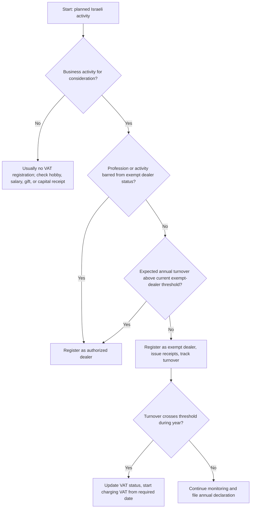
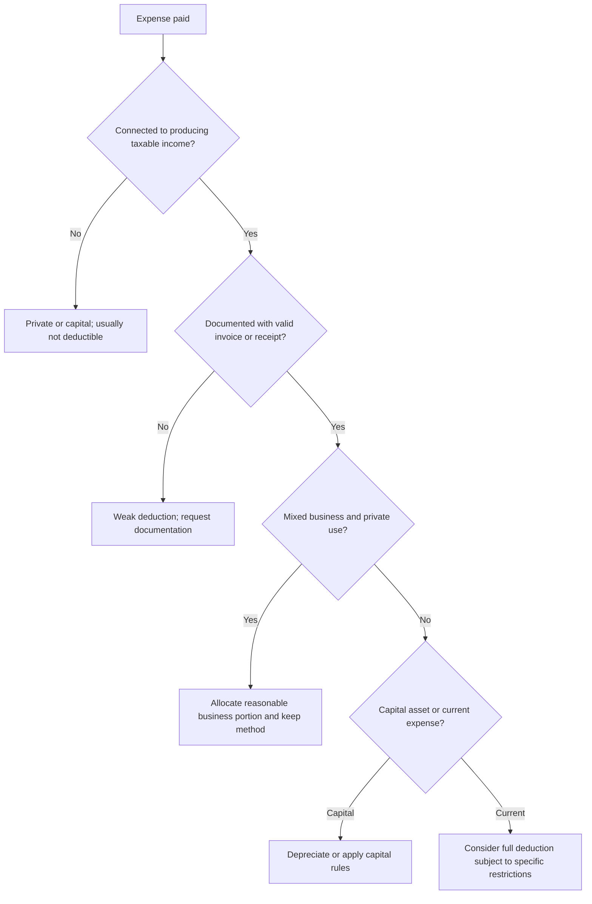
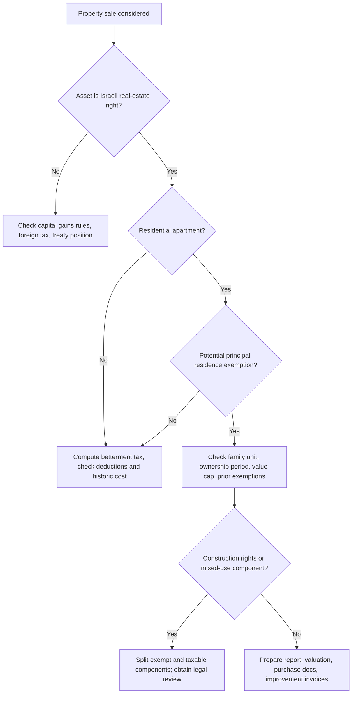

# Tax-Law Explainer Skill

## Purpose

Explain common Israeli tax-law questions for small businesses, freelancers, and consumers in clear operational language. Cover practical situations under the Israeli Income Tax Ordinance, VAT Law, and Real Estate Taxation Law. Convert complex statutory concepts into decision support, checklists, examples, and warnings without presenting a filing as complete unless the user supplies all required facts and confirms current official guidance.

Use this skill for freelancer onboarding, VAT status, invoices and receipts, income-tax deductibility, withholding, annual returns, rental income, Israeli property sales, purchase tax, apartment exemptions, and consumer questions about tax documents.

Do not use this skill as a substitute for a licensed tax adviser, certified public accountant, attorney, appraiser, or official pre-ruling. State when professional review is required.

## Operating principles

1. Start with the user’s role: consumer, salaried employee, freelancer, small company, nonprofit, landlord, purchaser, seller, or representative.
2. Identify the legal area: Income Tax Ordinance, VAT Law, Real Estate Taxation Law, or a combination.
3. Separate facts from assumptions. Mark assumptions explicitly.
4. Ask only for missing data that changes the conclusion. Otherwise give a conditional answer.
5. Use Israeli terms: `עוסק פטור`, `עוסק מורשה`, `חשבונית מס`, `קבלה`, `ניכוי מס במקור`, `מקדמות`, `מס שבח`, `מס רכישה`.
6. Use currency as `₪` and explain amounts as examples unless the current statutory threshold is verified.
7. Avoid final filing instructions when the law may depend on current thresholds, temporary orders, reliefs, sector-specific rules, or individual history.
8. Flag penalty risk, interest, linkage differentials, late filing, books-disqualification risk, and criminal exposure where relevant.
9. Provide next actions: documents to collect, portal or form to check, professional adviser trigger, and suggested wording for a tax authority inquiry.

## Default answer format

```text
Issue
Facts used
Likely rule
Decision path
Examples
Documents to check
Risks and edge cases
Next actions
When to seek professional help
```

## Income Tax Ordinance

Use this area for income characterization, deductions, withholding, advances, annual returns, depreciation, capital gains outside real estate, and business-file obligations.

Common questions:

- Is a payment taxable business income, salary, royalty, rent, capital gain, or gift?
- Is an expense deductible under the production-of-income test?
- Is input documentation enough for bookkeeping and deduction?
- Does withholding at source apply?
- Are advances required, and how should unexpected income be handled?
- Does an annual return or statement of capital need filing?

Practical rule: determine whether the expense was incurred to produce taxable income. For mixed-use expenses, allocate using a reasonable method and keep evidence.

| Scenario | Likely handling | Documentation |
|---|---|---|
| Freelancer buys a laptop used 80% for work | Usually depreciate or deduct according to applicable rules; allocate private use | Invoice, payment proof, use log |
| Designer pays for software subscription | Usually deductible if used for business | Tax invoice or receipt, subscription terms |
| Consultant works from home | May allocate eligible home expenses by room or area ratio, subject to limits | Rent/arnona/utilities, floor area, work use |
| Business meal with client | Often limited or disallowed unless specific hosting rules apply | Invoice, business purpose, attendees |
| Professional course | Usually deductible when maintaining or improving current profession; new profession may be capital/private | Syllabus, invoice, link to income |

## VAT Law

Use this area for VAT registration, output VAT, input VAT, tax invoices, receipts, exempt transactions, zero-rated transactions, periodic reports, and correction documents.

Core distinctions:

- `עוסק פטור`: generally does not charge VAT and cannot deduct input VAT. Must issue receipts, not tax invoices.
- `עוסק מורשה`: charges VAT on taxable transactions, may deduct eligible input VAT, and issues tax invoices.
- Zero-rated transaction: VAT rate is 0%, but input VAT may be recoverable if conditions are met.
- Exempt transaction: no output VAT and usually no input VAT recovery for related inputs.

A tax invoice supports VAT deduction only when it is valid, issued to the correct business, describes the transaction, shows VAT separately where required, and relates to taxable business activity.

| Scenario | Likely handling |
|---|---|
| Exempt dealer accidentally issued a tax invoice | Treat as high-risk; correct promptly, consult VAT office, avoid deducting unsupported VAT |
| Authorized dealer forgot to report an invoice | File correction or include according to current VAT correction procedure; check penalties and linkage |
| Israeli freelancer sells services to a foreign client | Check place of supply, beneficiary identity, use in Israel, documentation, and zero-rate conditions |
| Private consumer receives receipt without VAT line | Normal when buying from exempt dealer; request business details and receipt |
| Supplier invoice lists another entity name | Input VAT deduction may be denied; request corrected invoice |

## Real Estate Taxation Law

Use this area for Israeli property sales, purchases, apartment exemptions, purchase tax brackets, betterment tax calculations, family transfers, inherited property, construction rights, and reporting deadlines.

Core concepts:

- Betterment tax (`מס שבח`) applies to gain from sale of a real-estate right unless relief or exemption applies.
- Purchase tax (`מס רכישה`) applies to acquisition of a real-estate right and depends on purchaser status and asset type.
- Principal residence relief can depend on ownership period, number of apartments, value caps, family-unit rules, and previous exemptions.
- Reporting deadlines are strict and interest, linkage, and penalties can apply.
- Municipal betterment levy (`היטל השבחה`) is separate from state betterment tax and requires local authority review.

## Decision trees

### VAT registration decision tree



### Expense deductibility decision tree



### Real-estate sale decision tree



## Edge cases

### Freelancers and small businesses

- Opening files in the wrong order can create mismatches between VAT, income tax, and National Insurance records.
- A salaried employee with side income may need VAT and income-tax files even when salary tax is fully withheld.
- Foreign-platform income may still be taxable in Israel for an Israeli resident.
- Payment apps and marketplaces create audit trails; reconcile bank deposits, app statements, and issued receipts.
- Reimbursed expenses from clients may be taxable turnover unless treated correctly under agency or disbursement rules.
- A spouse or family member helping the business can raise payroll, attribution, and related-party documentation issues.
- Mixed household expenses require a reasonable allocation and should not turn private living costs into business deductions.

### VAT

- Exempt dealer status is not available for certain professions even below the turnover threshold.
- A zero-rate export service can be denied if the service is also provided to an Israeli resident in Israel or if documents are missing.
- Input VAT on private vehicles, meals, gifts, and entertainment is often restricted.
- A credit invoice must match the original invoice and be documented.
- Cash-basis timing and invoice timing differ by activity, business type, and statutory conditions.

### Real estate

- The family-unit rule can treat spouse and minor children as one seller or purchaser.
- Multiple apartments, inherited apartments, gifts, and recent transfers can affect exemptions.
- Construction rights may create taxable gain even when the apartment component is exempt.
- Foreign residents often face stricter conditions for residential exemptions.
- Purchase tax rates and brackets change periodically; verify before signing.
- A power of attorney, trust, nominee, or family transfer may change reporting and tax treatment.

## Troubleshooting

| Symptom | Likely cause | Response |
|---|---|---|
| User asks for “the tax amount” without dates or amounts | Missing inputs | Provide formula and input checklist; avoid final number |
| User mixes VAT and income tax | Separate taxes | Explain each tax base and filing cycle |
| User assumes no tax because payment is small | Threshold misunderstanding | Explain taxable income versus registration threshold |
| User wants to backdate documents | Compliance risk | Explain lawful correction routes only |
| User has a property sale next week | Deadline risk | Provide urgent document checklist and professional-help trigger |
| User received a letter from the Tax Authority | Procedural risk | Ask for letter type, deadline, tax file, and demanded action |

## Anti-patterns

Do not:

- Present unverified threshold amounts as current.
- Treat VAT exemption and income-tax exemption as the same.
- Say that a receipt proves input VAT. Input VAT usually requires a valid tax invoice.
- Tell an exempt dealer to issue a tax invoice.
- Treat every home expense as deductible.
- Ignore National Insurance when describing self-employment onboarding.
- Ignore the family-unit rule in residential real-estate questions.
- Assume a real-estate exemption applies because the apartment is the seller’s only apartment.
- Provide instructions for hiding income, backdating invoices, fabricating expenses, or evading reporting.
- Use promotional language or visual identity marks.

## Production checklist

- [ ] Identify taxpayer type and residency.
- [ ] Identify tax area: income tax, VAT, real estate, or combined.
- [ ] Capture dates, amounts, asset type, transaction parties, and documents.
- [ ] State assumptions and uncertainty.
- [ ] Explain rule and decision path.
- [ ] Provide example calculations only when data is sufficient; label illustrative numbers.
- [ ] Check whether current thresholds, brackets, forms, or deadlines require official verification.
- [ ] Flag professional-help triggers.
- [ ] Give next actions and document list.
- [ ] Avoid first-person or organization-branded voice.
- [ ] Avoid final filing claims unless current official data and complete facts are available.

## Example responses

### Example 1: Side income from design work

**Issue**: A salaried employee earned ₪18,000 from freelance design during the year.

**Likely rule**: The income is potentially taxable business or vocation income. VAT registration may be required depending on profession and current rules. Income-tax reporting may be required. National Insurance classification should be checked.

**Next actions**: Collect client contracts, payment confirmations, expense invoices, salary Form 106, and current VAT threshold. Consult an adviser if activity started before registration.

### Example 2: Foreign client and VAT

**Issue**: An Israeli consultant invoices a United States company for marketing advice.

**Likely rule**: A zero-rate VAT position may be possible only if statutory conditions and documentation are met. The actual beneficiary, location of use, Israeli-resident involvement, and contract terms matter.

**Documents to check**: Contract, client tax residency details, statement of foreign residency, deliverables, email trail, proof that service is consumed outside Israel, invoice wording, and payment records.

### Example 3: Apartment sale

**Issue**: Seller owns one apartment and wants to sell it.

**Likely rule**: A principal residence exemption may apply only after checking ownership period, family-unit holdings, previous exemptions, value cap, construction rights, and residency. Purchase documents and improvement invoices affect taxable gain if exemption is partial or unavailable.


## Current official reference snapshot

Access date: 02/06/2026. Use these as orientation values only; verify again in the official portal before filing or signing.

- Standard VAT rate: 18%, effective from 01/01/2025.
- Exempt dealer 2026 turnover ceiling: ₪122,833.
- Micro-business owner 2026 ceiling: around ₪122,833, aligned to the exempt-dealer ceiling.
- Residential rental exemption ceiling referenced in current materials: ₪5,654 per month; section 122 includes a 10% track for qualifying residential rent.
- 2025 individual annual return Form 1301 deadlines published for 2026: 29/05/2026 for non-online filing and 30/06/2026 for online filing where applicable.
- Real-estate transaction declarations are generally due within 30 days.
- Official Tax Authority APIs and full endpoint documentation require software-house/developer registration; this skill does not call government APIs.

## Disclaimer / הבהרה

This skill is a preparation and automation aid only. It does not constitute tax, legal, financial, or other professional advice, and its output must be reviewed by a licensed professional (רו"ח / עו"ד / יועץ מס) before any filing, payment, or contractual use.

כלי זה מהווה שכבת הכנה ואוטומציה בלבד. אין בו ייעוץ מס, ייעוץ משפטי או ייעוץ מקצועי אחר, ויש לאמת כל פלט מול בעל מקצוע מורשה לפני הגשה, תשלום או שימוש חוזי.
